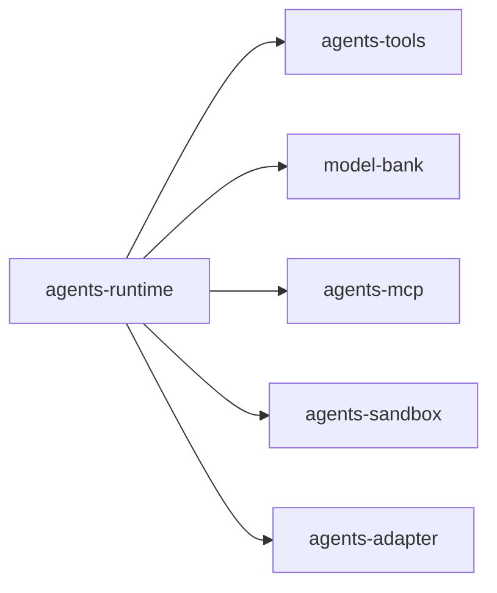

# Agent核心

## 子域定位

`Agent核心` 聚合 Runtime、Model、Tools、MCP、Sandbox、Adapter 等核心模块，负责 Agent 执行链路中的模型路由、工具调用、安全隔离与协议收敛。

## 模块清单

| 模块             | 深度文档                                      | API 文档                               |
| ---------------- | --------------------------------------------- | -------------------------------------- |
| `agents-adapter` | [@moryflow/agents-adapter](agents-adapter.md) | [API](../../api/agents-adapter-api.md) |
| `agents-mcp`     | [@moryflow/agents-mcp](agents-mcp.md)         | [API](../../api/agents-mcp-api.md)     |
| `agents-runtime` | [@moryflow/agents-runtime](agents-runtime.md) | [API](../../api/agents-runtime-api.md) |
| `agents-sandbox` | [@moryflow/agents-sandbox](agents-sandbox.md) | [API](../../api/agents-sandbox-api.md) |
| `agents-tools`   | [@moryflow/agents-tools](agents-tools.md)     | [API](../../api/agents-tools-api.md)   |
| `model-bank`     | [@moryflow/model-bank](model-bank.md)         | [API](../../api/model-bank-api.md)     |

## 能力关系图

## Section sources

- [packages/agents-runtime](file:///Users/zhangbaolin/code/me/moryflow/packages/agents-runtime)
- [packages/agents-tools](file:///Users/zhangbaolin/code/me/moryflow/packages/agents-tools)
- [packages/agents-mcp](file:///Users/zhangbaolin/code/me/moryflow/packages/agents-mcp)
- [packages/agents-sandbox](file:///Users/zhangbaolin/code/me/moryflow/packages/agents-sandbox)
- [packages/agents-adapter](file:///Users/zhangbaolin/code/me/moryflow/packages/agents-adapter)

## 最佳实践

- 保持 `runtime -> model/tool/sandbox/mcp` 的单向依赖叙事。
- 子模块对外导出统一通过入口收口，减少调用方耦合。

## 性能优化

- 优先关注工具调用链路与模型调用链路的缓存与超时策略。
- 以模块边界做观测打点，降低故障定位成本。

## 错误处理与调试

| 症状         | 排查入口                          |
| ------------ | --------------------------------- |
| 工具调用失败 | `agents-tools` 与权限配置         |
| 模型选择异常 | `model-bank` + `agents-runtime`   |
| 沙盒执行失败 | `agents-sandbox` 执行器与环境注入 |

## 相关文档

- [AI系统总览](../_index.md)
- [Wiki 首页](../../index.md)

---

_由 [Mini-Wiki v3.0.6](https://github.com/trsoliu/mini-wiki) 自动生成 | 2026-03-02_
