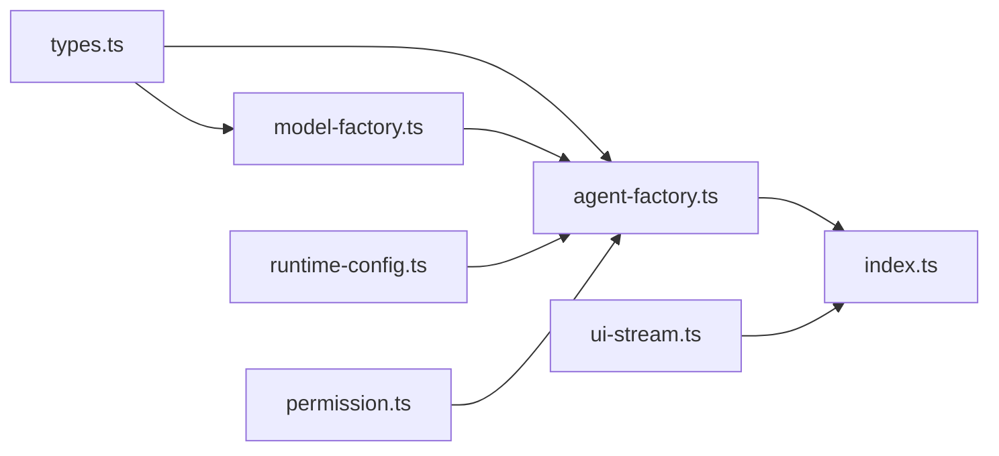
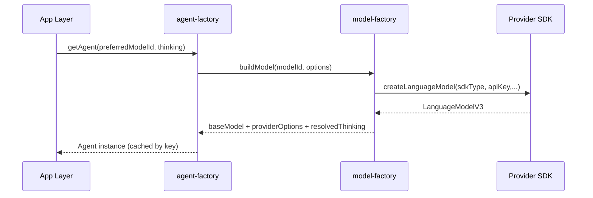
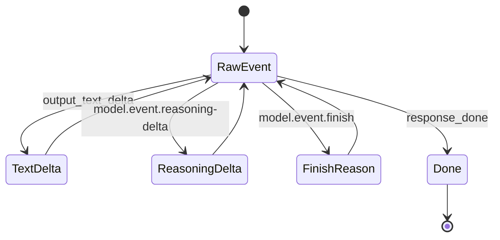

# `@moryflow/agents-runtime` 深度文档

## 1. 模块概述

`@moryflow/agents-runtime` 是仓库中的 Agent 核心运行时抽象层，负责将“模型配置、Agent 实例、工具权限、流式协议、运行时配置”整合成统一的可复用能力。

它的定位不是简单工具库，而是**多端一致性边界**：PC/Web/Mobile 在接入 LLM、工具调用和 UI 流事件时，尽量复用这里的语义，而不是在应用层重复发明协议。

该模块对外导出集中在 `src/index.ts`，内部由以下子能力组成：

- `model-factory`：从设置解析可用 provider/model，并构建 AI SDK 模型。
- `agent-factory`：根据模型 + 工具集合创建并缓存 Agent。
- `runtime-config`：解析 JSONC 运行时配置，控制 mode/permission/hooks 等。
- `ui-stream`：将 RunStreamEvent 映射成 `UIMessageChunk`。
- `permission`：按规则评估工具调用目标并执行 allow/deny/ask。

**Section sources**

- [index.ts#L10-L163](../../../../packages/agents-runtime/src/index.ts#L10-L163)
- [packages/agents-runtime/CLAUDE.md](../../../../packages/agents-runtime/CLAUDE.md)

## 2. 核心价值

| 价值               | 实现点                                 | 业务收益                     |
| ------------------ | -------------------------------------- | ---------------------------- |
| 模型接入统一       | `createModelFactory`                   | 新 provider 接入不污染应用层 |
| Agent 生命周期统一 | `createAgentFactory`                   | 多端行为一致，缓存策略可控   |
| 流协议统一         | `createRunModelStreamNormalizer`       | UI 层减少 provider 特判      |
| 权限收口           | `evaluatePermissionDecision` + wrapper | 风险操作可审计、可解释       |
| 配置收口           | `parseRuntimeConfig`                   | runtime 行为可配置且可测试   |

**Section sources**

- [model-factory.ts#L322-L566](../../../../packages/agents-runtime/src/model-factory.ts#L322-L566)
- [agent-factory.ts#L60-L127](../../../../packages/agents-runtime/src/agent-factory.ts#L60-L127)
- [ui-stream.ts#L348-L453](../../../../packages/agents-runtime/src/ui-stream.ts#L348-L453)
- [permission.ts#L302-L423](../../../../packages/agents-runtime/src/permission.ts#L302-L423)

## 3. 架构定位图

```mermaid
flowchart TB
  subgraph Apps[应用层 apps/*]
    PC[PC / Web / Mobile]
  end

  subgraph Runtime[@moryflow/agents-runtime]
    MF[model-factory]
    AF[agent-factory]
    RC[runtime-config]
    US[ui-stream]
    PM[permission]
  end

  subgraph Deps[依赖层]
    Core[@openai/agents-core]
    AI[AI SDK providers]
    MB[@moryflow/model-bank]
    API[@moryflow/api]
  end

  PC --> RC
  PC --> AF
  AF --> MF
  AF --> PM
  AF --> Core
  MF --> MB
  MF --> AI
  MF --> API
  PC --> US
```

**Diagram sources**

- [package.json dependencies](../../../../packages/agents-runtime/package.json)
- [index.ts exports](../../../../packages/agents-runtime/src/index.ts)

## 4. 目录结构与职责

| 文件                    | 角色                                      |
| ----------------------- | ----------------------------------------- |
| `src/index.ts`          | 对外导出聚合                              |
| `src/model-factory.ts`  | provider/model 解析与模型构建             |
| `src/agent-factory.ts`  | Agent 构建与缓存复用                      |
| `src/runtime-config.ts` | JSONC 运行时配置解析与合并                |
| `src/ui-stream.ts`      | tool/model 流事件归一化                   |
| `src/permission.ts`     | 权限目标解析、规则匹配、包装器            |
| `src/types.ts`          | AgentContext、Provider 配置、思考档案类型 |
| `src/prompt.ts`         | 系统提示词模板                            |



**Section sources**

- [src/](../../../../packages/agents-runtime/src)

## 5. 核心工作流

### 5.1 模型与 Agent 构建流



### 5.2 流式事件归一流



**Diagram sources**

- [agent-factory.ts#L60-L127](../../../../packages/agents-runtime/src/agent-factory.ts#L60-L127)
- [model-factory.ts#L322-L566](../../../../packages/agents-runtime/src/model-factory.ts#L322-L566)
- [ui-stream.ts#L389-L453](../../../../packages/agents-runtime/src/ui-stream.ts#L389-L453)

## 6. 核心类/接口关系（classDiagram）

```mermaid
classDiagram
class ModelFactory {
  +defaultModelId : string
  +providers : RuntimeProviderEntry[]
  +buildModel(modelId, options) BuildModelResult
  +buildRawModel(modelId) {modelId, model}
  +getAvailableModels() Array
}

class AgentFactory {
  +getAgent(preferredModelId, options) {agent, modelId}
  +invalidate() void
}

class RuntimeConfigParseResult {
  +config : AgentRuntimeConfig
  +errors : string[]
}

class AgentContext {
  +mode : AgentAccessMode
  +vaultRoot : string
  +chatId : string
  +userId : string
  +buildModel : ModelBuilder
}

ModelFactory --> AgentFactory : provides model
AgentContext --> AgentFactory : run context
RuntimeConfigParseResult --> AgentFactory : behavior input
```

**Diagram sources**

- [types.ts#L44-L85](../../../../packages/agents-runtime/src/types.ts#L44-L85)
- [agent-factory.ts#L17-L33](../../../../packages/agents-runtime/src/agent-factory.ts#L17-L33)
- [runtime-config.ts#L21-L33](../../../../packages/agents-runtime/src/runtime-config.ts#L21-L33)

## 7. Public API 概览

| API                              | 职责                             | 入口                |
| -------------------------------- | -------------------------------- | ------------------- |
| `createModelFactory`             | 构建模型选择与 provider 路由能力 | `model-factory.ts`  |
| `createAgentFactory`             | 生成并缓存 Agent 实例            | `agent-factory.ts`  |
| `parseRuntimeConfig`             | 解析 JSONC runtime 配置          | `runtime-config.ts` |
| `mapRunToolEventToChunk`         | tool 事件映射为 UI chunk         | `ui-stream.ts`      |
| `createRunModelStreamNormalizer` | raw model 事件统一归一           | `ui-stream.ts`      |
| `evaluatePermissionDecision`     | 权限规则求值                     | `permission.ts`     |

**Section sources**

- [index.ts](../../../../packages/agents-runtime/src/index.ts)

## 8. 关键 API 深入与示例

### 8.1 `createModelFactory`

用于把用户设置（providers/customProviders/defaultModel）转换成可调用模型。

```ts
import { createModelFactory } from '@moryflow/agents-runtime';

const modelFactory = createModelFactory({
  settings,
  providerRegistry,
  toApiModelId: (providerId, modelId) => modelId,
});

const { modelId, baseModel, providerOptions } = modelFactory.buildModel(undefined, {
  thinking: { mode: 'level', level: 'high' },
});

console.log(modelId, providerOptions);
```

### 8.2 `createAgentFactory`

`createAgentFactory` 负责合并工具、模型与指令，并按 `modelId + thinking profile` 进行缓存。

```ts
import { createAgentFactory } from '@moryflow/agents-runtime';

const agentFactory = createAgentFactory({
  getModelFactory: () => modelFactory,
  baseTools: [],
  getMcpTools: () => [],
});

const { agent, modelId } = agentFactory.getAgent();
console.log('agent ready:', modelId, Boolean(agent));
```

### 8.3 `parseRuntimeConfig` + `mergeRuntimeConfig`

```ts
import { parseRuntimeConfig, mergeRuntimeConfig } from '@moryflow/agents-runtime';

const parsed = parseRuntimeConfig(`{
  agents: {
    runtime: {
      mode: { default: 'ask' },
      tools: { external: { enabled: true } }
    }
  }
}`);

const finalConfig = mergeRuntimeConfig({ mode: { default: 'ask' } }, parsed.config);
console.log(finalConfig.mode?.default); // ask
```

### 8.4 `mapRunToolEventToChunk` / `createRunModelStreamNormalizer`

```ts
import { createRunModelStreamNormalizer, mapRunToolEventToChunk } from '@moryflow/agents-runtime';

const normalizer = createRunModelStreamNormalizer();
const normalized = normalizer.consume({ type: 'output_text_delta', delta: 'Hello' });

const toolChunk = mapRunToolEventToChunk({
  type: 'run_item_stream_event',
  name: 'tool_called',
  item: { type: 'tool_call_item', rawItem: { callId: 'c1', name: 'read', arguments: '{}' } },
});

console.log(normalized.kind, toolChunk?.type);
```

**Section sources**

- [model-factory.ts#L322-L566](../../../../packages/agents-runtime/src/model-factory.ts#L322-L566)
- [agent-factory.ts#L60-L127](../../../../packages/agents-runtime/src/agent-factory.ts#L60-L127)
- [runtime-config.ts#L148-L176](../../../../packages/agents-runtime/src/runtime-config.ts#L148-L176)
- [ui-stream.ts#L348-L453](../../../../packages/agents-runtime/src/ui-stream.ts#L348-L453)

## 9. 类型协议要点

| 类型                   | 关键字段                        | 说明                       |
| ---------------------- | ------------------------------- | -------------------------- |
| `AgentContext`         | `mode`, `vaultRoot`, `chatId`   | 工具权限与会话上下文事实源 |
| `ThinkingSelection`    | `mode`, `level`                 | 请求级思考模式输入         |
| `ModelThinkingProfile` | `supportsThinking`, `levels`    | 模型级思考能力合同         |
| `PermissionRule`       | `domain`, `pattern`, `decision` | 工具权限规则单元           |

**Section sources**

- [types.ts](../../../../packages/agents-runtime/src/types.ts)
- [permission.ts](../../../../packages/agents-runtime/src/permission.ts)

## 10. 最佳实践

1. **永远通过 `createModelFactory` 构建模型**，不要在应用层直接 new provider SDK。
2. **Agent 实例复用**：使用 `getAgent()` 的缓存语义，避免每轮对话重复创建。
3. **配置解析前置**：启动阶段即解析 runtime config，运行期只消费结构化对象。
4. **流式语义统一**：UI 层只消费统一 chunk，不要直接解析底层 raw event。
5. **权限规则先行**：新增工具前先定义 `PermissionDomain` 与 target 解析。

**Section sources**

- [agent-factory.ts](../../../../packages/agents-runtime/src/agent-factory.ts)
- [runtime-config.ts](../../../../packages/agents-runtime/src/runtime-config.ts)
- [ui-stream.ts](../../../../packages/agents-runtime/src/ui-stream.ts)

## 11. 性能优化

| 场景               | 优化建议                                           |
| ------------------ | -------------------------------------------------- |
| 高频对话创建 Agent | 使用缓存 key（model + thinking profile）复用 Agent |
| 多 provider 切换   | 启动时完成 provider 解析，减少请求时分支判断       |
| 流式 UI 渲染       | 使用 normalizer 过滤非关键事件，降低前端渲染抖动   |
| 权限匹配           | 规则按 domain 分组，减少无关规则匹配次数           |

可进一步在应用层记录“构建耗时、流事件吞吐、工具拒绝率”作为运行时诊断指标。

**Section sources**

- [agent-factory.ts#L88-L121](../../../../packages/agents-runtime/src/agent-factory.ts#L88-L121)
- [ui-stream.ts#L389-L453](../../../../packages/agents-runtime/src/ui-stream.ts#L389-L453)

## 12. 错误处理与调试

### 常见错误

| 错误文本                      | 根因                          | 处理方式                         |
| ----------------------------- | ----------------------------- | -------------------------------- |
| `尚未配置默认模型`            | 未配置 provider/default model | 补齐设置并重新初始化             |
| `未找到服务商 xxx`            | providerId 未启用或未注册     | 检查 settings + providerRegistry |
| `模型标识格式无效`            | modelId 非 `provider/model`   | 修正模型 ID 格式                 |
| `Permission denied by policy` | 命中 deny/ask 规则            | 调整规则或交互确认               |

### 调试建议

1. 先确认 `parseRuntimeConfig` 输出与预期一致。
2. 再检查 `buildModel()` 的 `modelId/providerOptions`。
3. 最后定位 `ui-stream` 是否正确拿到 `response_done/finishReason`。

**Section sources**

- [model-factory.ts](../../../../packages/agents-runtime/src/model-factory.ts)
- [permission.ts#L62-L88](../../../../packages/agents-runtime/src/permission.ts#L62-L88)
- [ui-stream.ts#L389-L453](../../../../packages/agents-runtime/src/ui-stream.ts#L389-L453)

## 13. 设计决策与权衡

| 决策                             | 动机                       | 影响                       |
| -------------------------------- | -------------------------- | -------------------------- |
| thinking 通过合同与 profile 收口 | 避免 provider 分散逻辑     | 统一降级与可见参数策略     |
| membership 模型独立分支          | 保障 token/apiUrl 边界清晰 | 分支复杂度上升，但语义明确 |
| 权限模式统一为 `ask/full_access` | 收敛命名、减少歧义         | 需要同步配置与审计事件     |
| raw event 只认 canonical 事件    | 降低 UI 解析耦合           | 非关键事件只能用于观测     |

**Section sources**

- [packages/agents-runtime/CLAUDE.md 近期变更](../../../../packages/agents-runtime/CLAUDE.md)

## 14. 依赖关系图

```mermaid
flowchart LR
  Runtime[@moryflow/agents-runtime]
  Core[@openai/agents-core]
  Ext[@openai/agents-extensions]
  MB[@moryflow/model-bank]
  API[@moryflow/api]
  Adapter[@moryflow/agents-adapter]
  AISDK[ai + provider adapters]

  Runtime --> Core
  Runtime --> Ext
  Runtime --> MB
  Runtime --> API
  Runtime --> Adapter
  Runtime --> AISDK
```

**Diagram sources**

- [packages/agents-runtime/package.json](../../../../packages/agents-runtime/package.json)

## 15. 相关文档

- [Agent核心总览](./_index.md)
- [AI系统总览](../_index.md)
- [API 参考：agents-runtime](../../api/agents-runtime-api.md)
- [系统架构](../../architecture.md)
- [文档关系图](../../doc-map.md)

---

_由 [Mini-Wiki v3.0.6](https://github.com/trsoliu/mini-wiki) 自动生成 | 2026-03-02_
