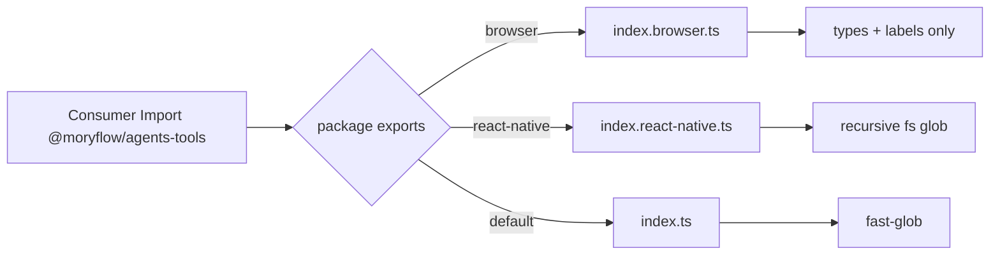
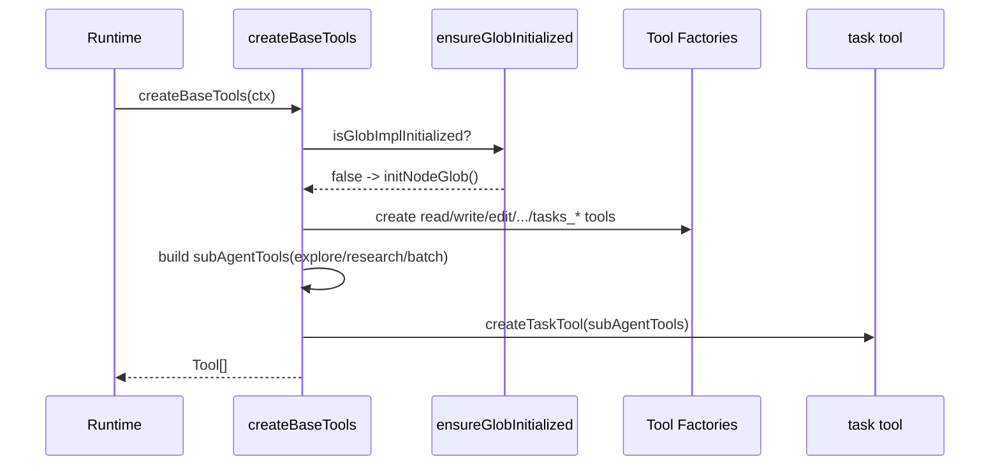
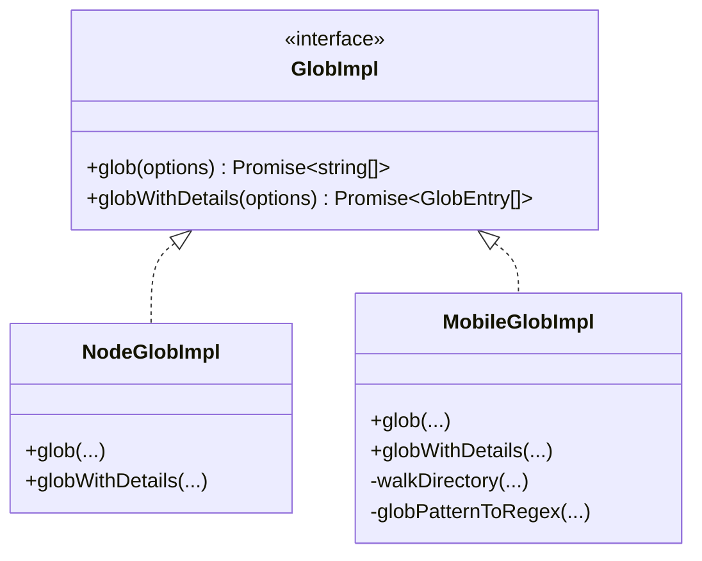
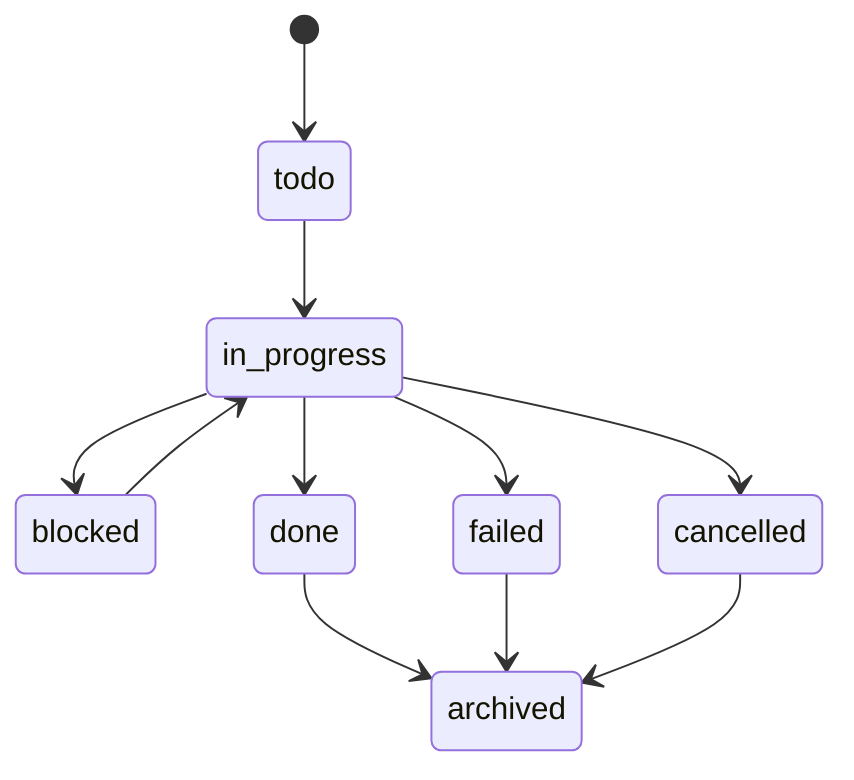

# `@moryflow/agents-tools` 深度文档

## 1. 模块概述

`@moryflow/agents-tools` 是 Agent Runtime 的工具协议层，负责把文件操作、搜索、网络访问、任务编排、图片生成与平台能力统一成可注册的 OpenAI Agent Tool 集合。

与 `@moryflow/agents-runtime` 的分层关系：

- `agents-runtime` 负责模型/会话/流式协议与权限边界。
- `agents-tools` 负责可执行能力（tool）定义与参数合同。
- 运行时通过 `createBaseTools` / `createMobileTools` 注入具体平台能力。

当前快照（2026-03-02）统计：

| 指标                        |  数值 |
| --------------------------- | ----: |
| 源码文件（`src/**/*.ts`）   |    28 |
| 测试文件（`test/**/*.ts`）  |     2 |
| 源码行数                    | 2,849 |
| 测试行数                    |   250 |
| 唯一工具名                  |    25 |
| tasks 工具数量（`tasks_*`） |    11 |

**Section sources**

- [packages/agents-tools/CLAUDE.md](file:///Users/zhangbaolin/code/me/moryflow/packages/agents-tools/CLAUDE.md)
- [packages/agents-tools/package.json](file:///Users/zhangbaolin/code/me/moryflow/packages/agents-tools/package.json)
- [packages/agents-tools/src/index.ts](file:///Users/zhangbaolin/code/me/moryflow/packages/agents-tools/src/index.ts)

## 2. 架构定位与核心职责

| 维度         | 角色                                                             |
| ------------ | ---------------------------------------------------------------- |
| 工具协议层   | `tool({ name, description, parameters, execute })` 定义统一合同  |
| 平台适配层   | 通过 `PlatformCapabilities` 注入 `fs/path/fetch/auth/shell` 能力 |
| 路径安全层   | 所有文件路径通过 `VaultUtils` 解析，禁止越界                     |
| 并发一致性层 | `write` / `applyWriteOperation` 通过 `sha256` 做乐观锁           |
| 任务治理层   | `TasksStore` 抽象 + `tasks_*` 操作 + `task` 子代理               |

```mermaid
flowchart TB
  subgraph Runtime[@moryflow/agents-runtime]
    Factory[Agent Factory]
    Context[AgentContext]
  end

  subgraph Tools[@moryflow/agents-tools]
    CreateTools[createBaseTools / createMobileTools]
    FileTools[file/*]
    SearchTools[search/* + glob/*]
    WebTools[web/*]
    TaskTools[task/*]
    PlatformTools[platform/* + image/*]
  end

  subgraph Adapter[@moryflow/agents-adapter]
    Cap[PlatformCapabilities]
    Crypto[CryptoUtils]
  end

  subgraph Storage[Host Implementations]
    Vault[VaultUtils]
    TaskStore[TasksStore impl]
  end

  Factory --> CreateTools
  Context --> TaskTools
  CreateTools --> FileTools
  CreateTools --> SearchTools
  CreateTools --> WebTools
  CreateTools --> TaskTools
  CreateTools --> PlatformTools
  FileTools --> Vault
  SearchTools --> Cap
  WebTools --> Cap
  TaskTools --> TaskStore
  CreateTools --> Cap
  CreateTools --> Crypto
```

**Diagram sources**

- [src/create-tools.ts](file:///Users/zhangbaolin/code/me/moryflow/packages/agents-tools/src/create-tools.ts)
- [src/create-tools-mobile.ts](file:///Users/zhangbaolin/code/me/moryflow/packages/agents-tools/src/create-tools-mobile.ts)

## 3. 包入口与多端导出策略

`package.json` 使用条件导出，核心目标是“同一包名，多端最小依赖面”：

| 入口条件              | 文件                               | 设计目标                                      |
| --------------------- | ---------------------------------- | --------------------------------------------- |
| 默认（Node/Electron） | `dist/index.{js,mjs}`              | 含 Node glob（fast-glob）与可选 bash          |
| `react-native`        | `dist/index.react-native.{js,mjs}` | 不引入 Node 依赖，移动端手动 init glob        |
| `browser`             | `dist/index.browser.{js,mjs}`      | 仅导出类型与 tasks labels，避免打包 fast-glob |

```ts
// src/index.browser.ts（摘要）
export { TASK_STATUS_LABELS, TASK_PRIORITY_LABELS } from './task/task-labels';
export type { TasksStore, TaskRecord, TaskStatus, TaskPriority } from './task/tasks-store';
```



**Section sources**

- [packages/agents-tools/package.json#L1-L27](file:///Users/zhangbaolin/code/me/moryflow/packages/agents-tools/package.json#L1-L27)
- [src/index.ts](file:///Users/zhangbaolin/code/me/moryflow/packages/agents-tools/src/index.ts)
- [src/index.react-native.ts](file:///Users/zhangbaolin/code/me/moryflow/packages/agents-tools/src/index.react-native.ts)
- [src/index.browser.ts](file:///Users/zhangbaolin/code/me/moryflow/packages/agents-tools/src/index.browser.ts)

## 4. 目录结构与职责

| 目录           | 文件数 | 代码行数 | 职责                           |
| -------------- | -----: | -------: | ------------------------------ |
| `src/file`     |      6 |      482 | read/write/edit/delete/move/ls |
| `src/search`   |      3 |      243 | glob/grep/search_in_file       |
| `src/web`      |      2 |      302 | web_fetch/web_search           |
| `src/task`     |      4 |      734 | tasks\_\* + task + schema      |
| `src/glob`     |      5 |      329 | Node/Mobile glob 抽象          |
| `src/platform` |      1 |      103 | bash（非沙盒）                 |
| `src/image`    |      1 |      124 | generate_image                 |

关键聚合文件：

- `src/create-tools.ts`：桌面/Node 默认工具集，支持 `task` 子代理。
- `src/create-tools-mobile.ts`：移动端工具集，不包含 `bash` 和 `task` 子代理。
- `src/shared.ts`：统一 summary schema、路径归一化、预览截断常量。

**Section sources**

- [packages/agents-tools/src](file:///Users/zhangbaolin/code/me/moryflow/packages/agents-tools/src)
- [src/shared.ts](file:///Users/zhangbaolin/code/me/moryflow/packages/agents-tools/src/shared.ts)

## 5. 工具装配流水线

### 5.1 工具集合形态

| 构造函数                       | 包含工具                                         | 用途                    |
| ------------------------------ | ------------------------------------------------ | ----------------------- |
| `createBaseToolsWithoutTask`   | 文件 + 搜索 + Web + 图片 + `tasks_*` + 可选 bash | 不启用子代理场景        |
| `createBaseTools`              | 上述全部 + `task`                                | 需要多步委托执行的场景  |
| `createMobileToolsWithoutTask` | 文件 + 搜索 + Web + 图片 + `tasks_*`             | React Native            |
| `createMobileTools`            | `createMobileToolsWithoutTask` 别名              | 当前移动端不支持 `task` |

### 5.2 启动流程



### 5.3 工具总表（25）

| 分类 | 工具                                                                                                                                                                                                         |
| ---- | ------------------------------------------------------------------------------------------------------------------------------------------------------------------------------------------------------------ |
| 文件 | `read`, `write`, `edit`, `delete`, `move`, `ls`                                                                                                                                                              |
| 搜索 | `glob`, `grep`, `search_in_file`                                                                                                                                                                             |
| 网络 | `web_fetch`, `web_search`                                                                                                                                                                                    |
| 任务 | `tasks_list`, `tasks_get`, `tasks_create`, `tasks_update`, `tasks_set_status`, `tasks_add_dependency`, `tasks_remove_dependency`, `tasks_add_note`, `tasks_add_files`, `tasks_delete`, `tasks_graph`, `task` |
| 平台 | `bash`（可选）                                                                                                                                                                                               |
| 图像 | `generate_image`                                                                                                                                                                                             |

```ts
import { createBaseTools } from '@moryflow/agents-tools';

const tools = createBaseTools({
  capabilities,
  crypto,
  vaultUtils,
  tasksStore,
  enableBash: true,
  webSearchApiKey,
});
```

**Section sources**

- [src/create-tools.ts#L1-L171](file:///Users/zhangbaolin/code/me/moryflow/packages/agents-tools/src/create-tools.ts#L1-L171)
- [src/create-tools-mobile.ts#L1-L93](file:///Users/zhangbaolin/code/me/moryflow/packages/agents-tools/src/create-tools-mobile.ts#L1-L93)

## 6. 文件工具族（read/write/edit/delete/move/ls）

### 6.1 `read`：分段读取与二进制识别

`read` 使用 `VaultUtils.readFile` 返回 `relative/absolute/content/stats/sha256`，并在工具层执行：

1. 扩展名命中 `BINARY_EXTENSIONS`。
2. 文件大小超过 `LARGE_FILE_THRESHOLD`（`MAX_PREVIEW_LENGTH * 8`）。
3. 内容包含 ``。

满足任一条件即返回 `binary: true`，避免错误解析。

### 6.2 `write`：乐观锁覆盖

- 新文件：不需要 `base_sha`。
- 覆盖文件：必须提供 `base_sha`，且与最新 `sha256` 一致。
- `create_directories=true` 时自动递归创建父目录。

```ts
const file = await read({ path: 'notes/todo.md' });
await write({
  path: 'notes/todo.md',
  content: file.content + '
- [ ] review',
  base_sha: file.sha256,
});
```

### 6.3 `edit`：定位第 N 次出现

`edit` 使用 `old_text/new_text/occurrence` 进行替换，失败场景会明确报错“未找到第 N 次出现的 old_text”。写入后返回 unified diff。

```ts
await edit({
  path: 'plans/roadmap.md',
  old_text: 'Q1 Milestone',
  new_text: 'Q1 Release Milestone',
  occurrence: 1,
});
```

### 6.4 `delete` / `move` / `ls`

| 工具     | 关键保护                                                             |
| -------- | -------------------------------------------------------------------- |
| `delete` | 必须 `confirm: true`                                                 |
| `move`   | 通过 `VaultUtils.resolvePath` + `normalizeRelativePath` 返回规范路径 |
| `ls`     | 默认忽略隐藏文件；返回 `type/size/mtime`                             |

**Section sources**

- [src/file/read-tool.ts](file:///Users/zhangbaolin/code/me/moryflow/packages/agents-tools/src/file/read-tool.ts)
- [src/file/write-tool.ts](file:///Users/zhangbaolin/code/me/moryflow/packages/agents-tools/src/file/write-tool.ts)
- [src/file/edit-tool.ts](file:///Users/zhangbaolin/code/me/moryflow/packages/agents-tools/src/file/edit-tool.ts)
- [src/file/delete-tool.ts](file:///Users/zhangbaolin/code/me/moryflow/packages/agents-tools/src/file/delete-tool.ts)
- [src/file/move-tool.ts](file:///Users/zhangbaolin/code/me/moryflow/packages/agents-tools/src/file/move-tool.ts)
- [src/file/ls-tool.ts](file:///Users/zhangbaolin/code/me/moryflow/packages/agents-tools/src/file/ls-tool.ts)

## 7. 搜索工具与 Glob 抽象层

`glob` / `grep` 不直接依赖平台文件系统实现，而是通过 `GlobImpl` 进行策略注入：

- Node：`fast-glob` 高性能匹配。
- Mobile：递归 `readdir + stat`，并把 glob pattern 转正则。



`grep` 关键行为：

- 默认 `glob=['**/*.md']`。
- `limit` 最大 500。
- 按行扫描，返回 `path + line + preview`。

```ts
import { initMobileGlob, createMobileTools } from '@moryflow/agents-tools';

initMobileGlob(capabilities);
const tools = createMobileTools({ capabilities, crypto, vaultUtils, tasksStore });
```

**Section sources**

- [src/search/glob-tool.ts](file:///Users/zhangbaolin/code/me/moryflow/packages/agents-tools/src/search/glob-tool.ts)
- [src/search/grep-tool.ts](file:///Users/zhangbaolin/code/me/moryflow/packages/agents-tools/src/search/grep-tool.ts)
- [src/search/search-in-file-tool.ts](file:///Users/zhangbaolin/code/me/moryflow/packages/agents-tools/src/search/search-in-file-tool.ts)
- [src/glob/glob-interface.ts](file:///Users/zhangbaolin/code/me/moryflow/packages/agents-tools/src/glob/glob-interface.ts)
- [src/glob/glob-node.ts](file:///Users/zhangbaolin/code/me/moryflow/packages/agents-tools/src/glob/glob-node.ts)
- [src/glob/glob-mobile.ts](file:///Users/zhangbaolin/code/me/moryflow/packages/agents-tools/src/glob/glob-mobile.ts)

## 8. Web 工具：抓取与搜索

### 8.1 `web_fetch` 安全边界

- 只允许 `http/https`，并自动把 `http://` 升级到 `https://`。
- 阻断域名：`localhost`、`metadata.google.internal`、`169.254.169.254`。
- 阻断内网/IP 段：`127.*`、`10.*`、`172.16-31.*`、`192.168.*`、`::1`、`fc00:*`、`fe80:*`。
- 内容长度上限：100KB。

### 8.2 `web_search` 查询机制

- 使用 DuckDuckGo HTML 结果页。
- 正则提取 `title/url/snippet`，最多 10 条。
- 支持 `allowed_domains` 与 `blocked_domains` 后过滤。

```ts
const result = await web_fetch({
  url: 'http://developer.mozilla.org/en-US/docs/Web/JavaScript',
  prompt: '提取 fetch API 的关键参数和返回值',
});

const search = await web_search({
  query: 'site:docs.anthropic.com tool use best practices',
  allowed_domains: ['docs.anthropic.com'],
});
```

**Section sources**

- [src/web/web-fetch-tool.ts](file:///Users/zhangbaolin/code/me/moryflow/packages/agents-tools/src/web/web-fetch-tool.ts)
- [src/web/web-search-tool.ts](file:///Users/zhangbaolin/code/me/moryflow/packages/agents-tools/src/web/web-search-tool.ts)

## 9. Tasks 工具系统（`tasks_*` + `task`）

### 9.1 Tasks Store 合同

`TasksStore` 由调用方注入实现，`agents-tools` 仅定义接口与 SQLite migration 基线：

- 实体：`tasks`, `task_dependencies`, `task_notes`, `task_files`, `task_events`。
- 关键约束：`status`、`priority` CHECK，依赖关系外键级联删除。
- chatId 显式入参，避免会话串读。

### 9.2 `tasks_*` 工具族

| 工具                                               | 作用                                |
| -------------------------------------------------- | ----------------------------------- |
| `tasks_list` / `tasks_get`                         | 查询任务与详情                      |
| `tasks_create` / `tasks_update`                    | 创建与更新（含 optimistic version） |
| `tasks_set_status`                                 | 状态迁移与审计字段更新              |
| `tasks_add_dependency` / `tasks_remove_dependency` | 依赖维护                            |
| `tasks_add_note` / `tasks_add_files`               | 备注与关联文件                      |
| `tasks_delete`                                     | 删除（必须 confirm=true）           |
| `tasks_graph`                                      | 依赖图（Mermaid + 文本）            |

`tasks_graph` 会把真实 task id 映射为安全节点 ID（`t1/t2/...`），并清洗 label 特殊字符，防止 Mermaid 解析失败。



### 9.3 `task` 子代理工具

`task` 支持三种子代理类型：

- `explore`：本地文件探索。
- `research`：本地 + 网络研究。
- `batch`：批量处理。

执行前会通过 `normalizeToolSchemasForInterop` 归一 schema，提升 Gemini 等模型兼容性。

```ts
await task({
  type: 'research',
  summary: '整理 SDK 限制',
  prompt: '对比 OpenAI/Anthropic tool schema 限制并给出结论',
});
```

**Section sources**

- [src/task/tasks-store.ts](file:///Users/zhangbaolin/code/me/moryflow/packages/agents-tools/src/task/tasks-store.ts)
- [src/task/tasks-tools.ts](file:///Users/zhangbaolin/code/me/moryflow/packages/agents-tools/src/task/tasks-tools.ts)
- [src/task/task-tool.ts](file:///Users/zhangbaolin/code/me/moryflow/packages/agents-tools/src/task/task-tool.ts)

## 10. 平台特定能力：`bash` / `generate_image`

### 10.1 `bash`

- 仅当 `enableBash=true` 且 `capabilities.optional.executeShell` 存在时注册。
- 运行目录必须在 Vault 内；超时默认 120s，最大 600s。
- 当前代码注释明确：PC 正式链路主要使用沙盒版本，本实现保留为备选。

### 10.2 `generate_image`

- 调用 `POST /v1/images/generations`。
- model 固定 `z-image-turbo`。
- 数量 `n` 最大 10，尺寸支持 `1024x1024/1536x1024/1024x1536`。
- 针对 401/402 进行用户可读错误映射。

```ts
const image = await generate_image({
  prompt: 'A monochrome product poster, high contrast typography',
  n: 1,
  size: '1024x1024',
});
```

**Section sources**

- [src/platform/bash-tool.ts](file:///Users/zhangbaolin/code/me/moryflow/packages/agents-tools/src/platform/bash-tool.ts)
- [src/image/generate-image-tool.ts](file:///Users/zhangbaolin/code/me/moryflow/packages/agents-tools/src/image/generate-image-tool.ts)

## 11. 测试覆盖与质量保障

当前 `packages/agents-tools/test` 含 2 份单测：

| 测试文件                          | 覆盖目标                                                                   |
| --------------------------------- | -------------------------------------------------------------------------- |
| `tasks-tools.spec.ts`             | chatId 透传、`tasks_graph` 安全输出、`tasks_delete` confirm、schema 归一化 |
| `normalize-relative-path.spec.ts` | Vault 内/外路径归一化语义                                                  |

重点质量策略：

1. 任务相关工具优先验证“协议稳定性”而非 UI。
2. 对跨模型兼容点（zod schema -> function schema）有回归保护。
3. 对 Mermaid 输出做注入字符清洗测试。

**Section sources**

- [test/tasks-tools.spec.ts](file:///Users/zhangbaolin/code/me/moryflow/packages/agents-tools/test/tasks-tools.spec.ts)
- [test/normalize-relative-path.spec.ts](file:///Users/zhangbaolin/code/me/moryflow/packages/agents-tools/test/normalize-relative-path.spec.ts)

## 12. 设计决策与权衡

| 决策                                      | 动机                            | 代价                                        |
| ----------------------------------------- | ------------------------------- | ------------------------------------------- |
| `TasksStore` 仅定义接口，不在包内绑定实现 | 保持跨端（PC/Mobile）可替换存储 | 需要调用方自行实现 migration 与事务         |
| `glob` 抽象为接口                         | 统一 Node 与 RN 能力差异        | Mobile 递归实现在大目录下性能弱于 fast-glob |
| `write` 强制 `base_sha` 覆盖校验          | 避免并发误覆盖                  | 调用前必须多一次 `read`                     |
| `web_fetch` 内置 SSRF 防护                | 默认安全，降低误用成本          | 某些内网合法场景无法直接抓取                |
| Browser 入口只导出类型                    | 避免前端误打包 Node 依赖        | Browser 端不能直接创建完整工具集            |

**Section sources**

- [src/create-tools.ts](file:///Users/zhangbaolin/code/me/moryflow/packages/agents-tools/src/create-tools.ts)
- [src/glob/glob-interface.ts](file:///Users/zhangbaolin/code/me/moryflow/packages/agents-tools/src/glob/glob-interface.ts)
- [src/web/web-fetch-tool.ts](file:///Users/zhangbaolin/code/me/moryflow/packages/agents-tools/src/web/web-fetch-tool.ts)

## 13. 集成模式（Desktop / Mobile / Browser）

### 13.1 Desktop（推荐）

- 使用 `createBaseTools`。
- 按需开启 `enableBash`。
- 提供 `task` 子代理能力。

### 13.2 Mobile

- 使用 `createMobileTools`。
- 自动或手动 `initMobileGlob`。
- 不包含 `bash` 与 `task` 子代理。

### 13.3 Browser

- 从 `index.browser` 仅导入 tasks 类型与展示 labels。
- 适用于渲染层，不适用于直接执行文件/系统工具。

**Section sources**

- [src/index.ts](file:///Users/zhangbaolin/code/me/moryflow/packages/agents-tools/src/index.ts)
- [src/index.react-native.ts](file:///Users/zhangbaolin/code/me/moryflow/packages/agents-tools/src/index.react-native.ts)
- [src/index.browser.ts](file:///Users/zhangbaolin/code/me/moryflow/packages/agents-tools/src/index.browser.ts)

## 14. 最佳实践

1. 执行写入前统一走 `read -> write(base_sha)`，避免并发覆盖。
2. 在移动端启动阶段显式检查 `isGlobImplInitialized()`，防止首个 `glob` 调用抛错。
3. `web_fetch` 输入 URL 前先做产品侧白名单限制，减少模型自由抓取风险。
4. `tasks_set_status` 与 `tasks_update` 一律携带 `expectedVersion`，防止脏写。
5. 子代理场景优先使用 `task(type='explore'|'research'|'batch')`，避免主代理上下文被巨量 IO 淹没。

## 15. 性能优化

- Node 端优先使用 `glob` 缩小候选文件，再使用 `grep`，避免全仓逐文件读取。
- `read` 默认分段输出（`offset/limit`），长文件阅读采用分页策略。
- `web_fetch` 100KB 截断可显著降低大网页 token 消耗。
- 对 `tasks_graph` 大图场景可先按状态过滤 `tasks_list`，再细化依赖查询。
- 将 `createBaseTools` 构建结果缓存到会话级，减少重复实例化成本。

## 16. 错误处理与调试

| 场景            | 典型错误                                   | 排查建议                                          |
| --------------- | ------------------------------------------ | ------------------------------------------------- |
| 覆盖写失败      | `sha256 不匹配`                            | 重新 `read` 获取最新 `sha256` 后重试              |
| 删除失败        | `confirm_required` 或 `confirm: true` 缺失 | 显式传入确认参数                                  |
| Mobile 搜索失败 | `Glob 实现未初始化`                        | 调用 `initMobileGlob(capabilities)`               |
| web_fetch 被拒  | `URL 不被允许访问`                         | 检查是否命中私网/IP 黑名单                        |
| 子代理不可用    | `未配置子代理工具集`/`无法获取模型配置`    | 检查 `createTaskTool` 参数与 runtime `buildModel` |

建议调试顺序：

1. 先核对工具输入 schema（是否字段缺失/类型错误）。
2. 再核对平台能力注入（`fs/fetch/auth/optional.executeShell`）。
3. 最后核对存储实现（`TasksStore` 是否满足 chatId 隔离与事务语义）。

## 17. 相关文档

- [Agent核心总览](./_index.md)
- [agents-tools API 参考](../../api/agents-tools-api.md)
- [agents-runtime 深度文档](./agents-runtime.md)
- [model-bank 深度文档](./model-bank.md)
- [agents-runtime API 参考](../../api/agents-runtime-api.md)
- [文档关系图](../../doc-map.md)

---

_由 [Mini-Wiki v3.0.6](https://github.com/trsoliu/mini-wiki) 自动生成 | 2026-03-02_
