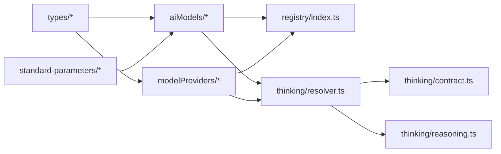
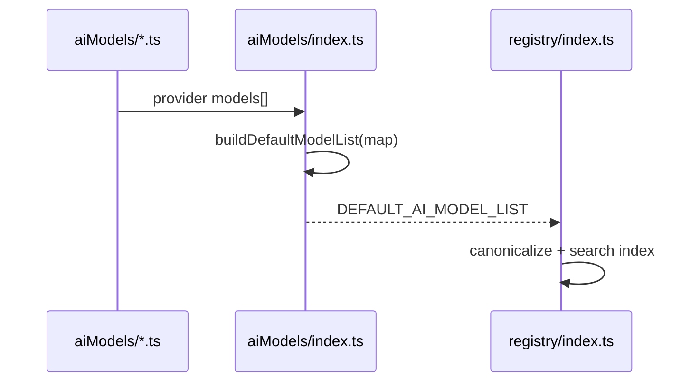
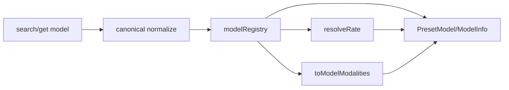
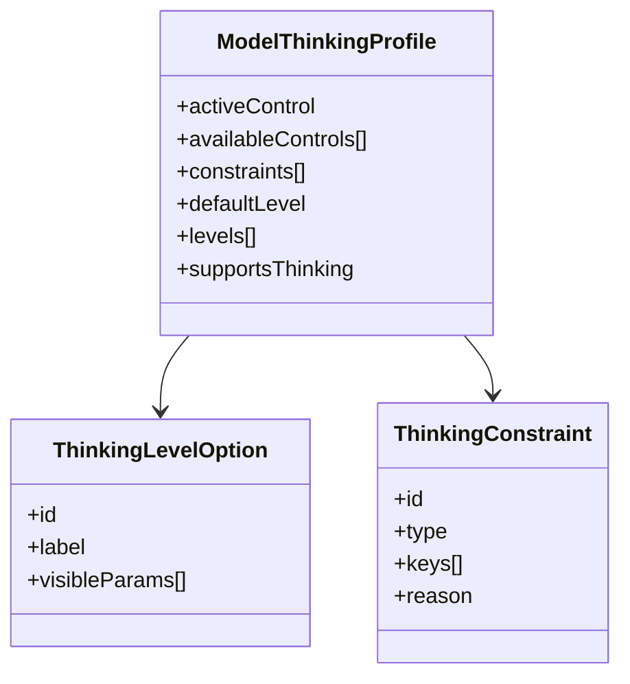
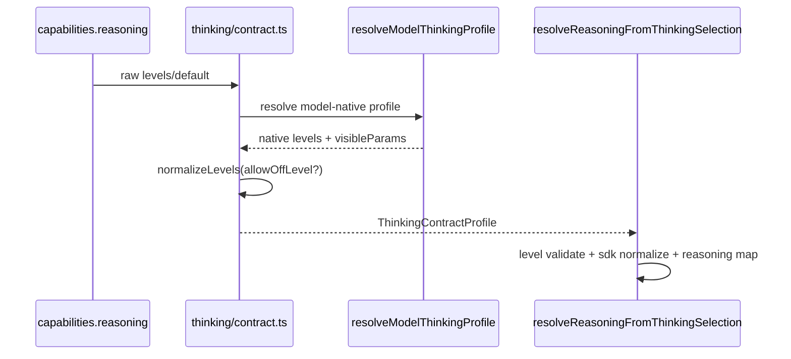
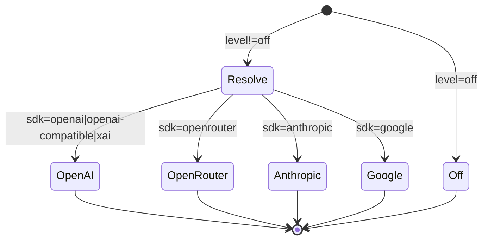

# `@moryflow/model-bank` 深度文档

## 1. 模块概述

`@moryflow/model-bank` 是仓库中的模型与 Provider 元数据单一事实源，负责把“模型清单、Provider 能力、thinking 控制、reasoning 映射、标准参数 schema、检索 API”收敛为可复用的 runtime 合同。

该模块并非仅提供静态 JSON，而是提供了完整的**运行时转换层**：

- 把 provider/model 原始卡片统一成 `provider/modelId` canonical registry。
- 把 cloud capabilities 与 model-native thinking 规则合并成一致 profile。
- 把 thinking level 选择映射成各 SDK 可执行的 reasoning payload。
- 把 image/video 参数 schema 统一成可验证、可默认值提取的元数据协议。

当前快照（2026-03-02）统计：

| 指标                            | 数值   |
| ------------------------------- | ------ |
| 源码文件数（`src/**/*.ts`）     | 77     |
| 代码行数（含测试）              | 20,243 |
| Provider 数                     | 26     |
| 模型总数                        | 652    |
| Chat 模型数                     | 583    |
| 含 reasoning 能力的 Chat 模型数 | 295    |

**Section sources**

- [packages/model-bank/CLAUDE.md](file:///Users/zhangbaolin/code/me/moryflow/packages/model-bank/CLAUDE.md)
- [packages/model-bank/src/index.ts#L1-L6](file:///Users/zhangbaolin/code/me/moryflow/packages/model-bank/src/index.ts#L1-L6)
- [packages/model-bank/package.json#L1-L86](file:///Users/zhangbaolin/code/me/moryflow/packages/model-bank/package.json#L1-L86)

## 2. 核心价值

| 价值               | 实现点                                                                | 业务收益                                                            |
| ------------------ | --------------------------------------------------------------------- | ------------------------------------------------------------------- |
| 模型注册单源       | `aiModels/*` + `modelProviders/*` + `registry/index.ts`               | 避免应用层维护多份模型映射                                          |
| Provider 适配收敛  | `resolveProviderSdkType` / `resolveRuntimeChatSdkType`                | 各端 SDK 选择一致，减少隐式 fallback                                |
| Thinking 合同收敛  | `thinking/rules.ts` + `thinking/resolver.ts` + `thinking/contract.ts` | UI/Server/Runtime 对 thinking 行为语义一致                          |
| Runtime 参数桥接   | `thinking/reasoning.ts`                                               | 同一 thinking level 可稳定映射到 OpenAI/OpenRouter/Anthropic/Google |
| 参数 schema 标准化 | `standard-parameters/*`                                               | 图像/视频参数可验证、可默认值填充、可类型推断                       |
| 历史兼容收口       | canonical id + mapping API                                            | 避免 provider 内部模型 ID 多段切分错误                              |

**Section sources**

- [registry/index.ts#L1-L444](file:///Users/zhangbaolin/code/me/moryflow/packages/model-bank/src/registry/index.ts#L1-L444)
- [thinking/resolver.ts#L1-L544](file:///Users/zhangbaolin/code/me/moryflow/packages/model-bank/src/thinking/resolver.ts#L1-L544)
- [thinking/contract.ts#L1-L582](file:///Users/zhangbaolin/code/me/moryflow/packages/model-bank/src/thinking/contract.ts#L1-L582)

## 3. 架构定位图

```mermaid
flowchart TB
  subgraph Consumers[消费层]
    PC[apps/moryflow/pc]
    Server[apps/*/server]
    Runtime[@moryflow/agents-runtime]
  end

  subgraph MB[@moryflow/model-bank]
    AIM[aiModels/*]
    MP[modelProviders/*]
    REG[registry/*]
    THINK[thinking/*]
    PARAM[standard-parameters/*]
    TYPES[types/*]
  end

  PC --> REG
  PC --> THINK
  Server --> THINK
  Runtime --> REG
  Runtime --> THINK
  Runtime --> PARAM

  AIM --> REG
  MP --> REG
  TYPES --> AIM
  TYPES --> MP
  THINK --> AIM
  THINK --> MP
  THINK --> REG
```

**Diagram sources**

- [src/index.ts](file:///Users/zhangbaolin/code/me/moryflow/packages/model-bank/src/index.ts)
- [registry/index.ts](file:///Users/zhangbaolin/code/me/moryflow/packages/model-bank/src/registry/index.ts)
- [thinking/index.ts](file:///Users/zhangbaolin/code/me/moryflow/packages/model-bank/src/thinking/index.ts)

## 4. 目录结构与职责

| 路径                      | 文件数 | 角色                                                   |
| ------------------------- | -----: | ------------------------------------------------------ |
| `src/aiModels`            |     27 | provider 维度模型卡片清单（价格、能力、thinking 控制） |
| `src/modelProviders`      |     27 | provider 卡片（展示名、URL、SDK 类型、浏览器请求策略） |
| `src/registry`            |      3 | canonical registry、搜索、id 映射、provider 查询       |
| `src/thinking`            |     10 | thinking 规则、profile 解析、contract、reasoning 映射  |
| `src/standard-parameters` |      4 | image/video 参数 schema 与默认值提取                   |
| `src/types`               |      3 | 模型/Provider 基础类型定义与 Zod schema                |
| `src/const`               |      1 | provider 常量枚举                                      |



**Section sources**

- [packages/model-bank/src](file:///Users/zhangbaolin/code/me/moryflow/packages/model-bank/src)
- [standard-parameters/index.ts#L1-L265](file:///Users/zhangbaolin/code/me/moryflow/packages/model-bank/src/standard-parameters/index.ts#L1-L265)
- [standard-parameters/video.ts#L1-L156](file:///Users/zhangbaolin/code/me/moryflow/packages/model-bank/src/standard-parameters/video.ts#L1-L156)

## 5. 数据模型与类型系统

### 5.1 核心实体

| 实体                      | 关键字段                                                 |
| ------------------------- | -------------------------------------------------------- |
| `AiFullModelCard`         | `id`, `type`, `abilities`, `pricing`, `settings`         |
| `ModelProviderCard`       | `id`, `name`, `chatModels`, `settings`                   |
| `PresetModel`             | `category`, `modalities`, `limits`, `capabilities`       |
| `ModelThinkingProfile`    | `activeControl`, `levels`, `constraints`, `defaultLevel` |
| `ThinkingReasoningConfig` | `enabled`, `effort?`, `maxTokens?`, `includeThoughts?`   |

### 5.2 ExtendParams 控制键

thinking 规则依赖 `ExtendParamsType`，例如：

- `reasoningBudgetToken`
- `enableReasoning`
- `reasoningEffort`
- `gpt5_2ReasoningEffort`
- `thinkingBudget`
- `thinkingLevel/2/3`

这些键会参与：

1. active control 选择（优先级）
2. level 列表生成（如 `off/low/medium/high`）
3. visible params 组装（如 `thinkingBudget=8192`）
4. reasoning runtime 配置构建

**Section sources**

- [types/aiModel.ts#L1-L451](file:///Users/zhangbaolin/code/me/moryflow/packages/model-bank/src/types/aiModel.ts#L1-L451)
- [types/llm.ts#L1-L54](file:///Users/zhangbaolin/code/me/moryflow/packages/model-bank/src/types/llm.ts#L1-L54)
- [thinking/types.ts#L1-L68](file:///Users/zhangbaolin/code/me/moryflow/packages/model-bank/src/thinking/types.ts#L1-L68)

## 6. 模型清单聚合与标准化流程

`DEFAULT_AI_MODEL_LIST` 通过遍历 provider 模型 map 构建：

1. 逐 provider 读取内置模型数组。
2. 统一补齐 `abilities`（缺省 `{}`）。
3. 统一补齐 `enabled`（缺省 `false`）。
4. 注入 `providerId` 与 `source='builtin'`。
5. 产出给 registry / runtime / UI 的统一模型列表。



### 6.1 Provider 分布（Top 10）

| Provider     | 模型数 |
| ------------ | -----: |
| `qwen`       |    100 |
| `zenmux`     |     72 |
| `openai`     |     64 |
| `ollama`     |     52 |
| `github`     |     44 |
| `volcengine` |     33 |
| `zhipu`      |     29 |
| `google`     |     26 |
| `nvidia`     |     24 |
| `azure`      |     22 |

### 6.2 模型类型分布

| 类型        | 数量 |
| ----------- | ---: |
| `chat`      |  583 |
| `image`     |   56 |
| `embedding` |    2 |
| `tts`       |    3 |
| `stt`       |    3 |
| `realtime`  |    5 |

**Section sources**

- [aiModels/index.ts#L1-L89](file:///Users/zhangbaolin/code/me/moryflow/packages/model-bank/src/aiModels/index.ts#L1-L89)
- [aiModels/openrouter.ts#L1-L454](file:///Users/zhangbaolin/code/me/moryflow/packages/model-bank/src/aiModels/openrouter.ts#L1-L454)
- [aiModels/openai.ts#L1-L1236](file:///Users/zhangbaolin/code/me/moryflow/packages/model-bank/src/aiModels/openai.ts#L1-L1236)

## 7. Registry canonical ID 与检索流程

registry 采用 `provider/modelId` 作为唯一键，避免裸 `modelId` 冲突。

### 7.1 Canonical 规则

- 构建：`buildProviderModelRef(providerId, modelId)`
- 解析：`parseProviderModelRef(value)`
- 查询：`getModelById` 仅接收 canonical id
- 兼容：`toApiModelId` 保留 provider 内多段模型 ID（如 `minimax/minimax-m2.1`）

### 7.2 查询链路



### 7.3 检索能力

| API                     | 行为                                                               |
| ----------------------- | ------------------------------------------------------------------ |
| `searchModels`          | provider/mode/deprecated 过滤 + query 打分（exact/prefix/include） |
| `getProviders`          | 返回 provider 聚合统计                                             |
| `getModelContextWindow` | 模型不存在时 fallback 默认上下文                                   |
| `getSyncMeta`           | 返回 source/modelCount/providerCount/syncedAt                      |

**Section sources**

- [registry/index.ts#L27-L438](file:///Users/zhangbaolin/code/me/moryflow/packages/model-bank/src/registry/index.ts#L27-L438)
- [registry/index.test.ts#L1-L83](file:///Users/zhangbaolin/code/me/moryflow/packages/model-bank/src/registry/index.test.ts#L1-L83)

## 8. Thinking 规则中心

thinking 子域分三层：

1. `rules.ts`：控制优先级、level 标签、visible param 映射。
2. `resolver.ts`：按 model/provider/sdk 解析 `ModelThinkingProfile`。
3. `contract.ts`：把 cloud capabilities + model-native 规则合并成可执行 contract。

### 8.1 控制优先级

默认优先级从高到低（部分）：

1. `gpt5_2ProReasoningEffort`
2. `gpt5_2ReasoningEffort`
3. `gpt5_1ReasoningEffort`
4. `gpt5ReasoningEffort`
5. `reasoningEffort`
6. `effort`
7. `thinkingLevel3`
8. `thinkingLevel2`
9. `thinkingLevel`
10. `thinking / thinkingBudget / reasoningBudgetToken / enableReasoning`

### 8.2 约束类型

| 约束 ID                      | 类型                 | 含义                              |
| ---------------------------- | -------------------- | --------------------------------- |
| `reasoning-effort-vs-budget` | `one-of`             | effort 与 budget 不能同时下发     |
| `thinking-level-vs-budget`   | `mutually-exclusive` | thinking level 与 budget 语义互斥 |



**Section sources**

- [thinking/rules.ts#L1-L242](file:///Users/zhangbaolin/code/me/moryflow/packages/model-bank/src/thinking/rules.ts#L1-L242)
- [thinking/resolver.ts#L1-L544](file:///Users/zhangbaolin/code/me/moryflow/packages/model-bank/src/thinking/resolver.ts#L1-L544)
- [thinking/resolver.test.ts#L1-L210](file:///Users/zhangbaolin/code/me/moryflow/packages/model-bank/src/thinking/resolver.test.ts#L1-L210)

## 9. Contract 合并与 fail-closed 机制

`buildThinkingProfileFromCapabilities` 会把 cloud 下发配置与 model-native profile 融合，关键原则：

- cloud 仅下发 level id 时，回填 native visible params。
- mandatory reasoning 模型（`reasoningRequired=true`）禁用 `off`。
- 当数据异常且不允许 off 时，采用 fail-closed：保留 non-off native levels，不回退 off-only。



### 9.1 结构化错误

| 错误码                   | 触发场景                                      |
| ------------------------ | --------------------------------------------- |
| `THINKING_LEVEL_INVALID` | 选择了不存在等级，或 mandatory 模型选了 `off` |
| `THINKING_NOT_SUPPORTED` | 模型/Provider 不支持 thinking                 |

**Section sources**

- [thinking/contract.ts#L1-L582](file:///Users/zhangbaolin/code/me/moryflow/packages/model-bank/src/thinking/contract.ts#L1-L582)
- [thinking/contract.test.ts#L1-L205](file:///Users/zhangbaolin/code/me/moryflow/packages/model-bank/src/thinking/contract.test.ts#L1-L205)
- [thinking/contract.mandatory-fallback.test.ts#L1-L64](file:///Users/zhangbaolin/code/me/moryflow/packages/model-bank/src/thinking/contract.mandatory-fallback.test.ts#L1-L64)

## 10. Reasoning runtime 映射

`thinking/reasoning.ts` 负责把 visible params 映射到不同 SDK 的 runtime payload。

### 10.1 SDK 映射策略

| SDK                            | 输出策略                                                      |
| ------------------------------ | ------------------------------------------------------------- |
| `openai/openai-compatible/xai` | 输出 `effort`                                                 |
| `openrouter`                   | 输出 `extraBody.reasoning`（`max_tokens` 与 `effort` one-of） |
| `anthropic`                    | 输出 `thinking.budgetTokens`                                  |
| `google`                       | 输出 `thinkingConfig.includeThoughts/thinkingBudget`          |

### 10.2 OpenRouter one-of 约束

当同时提供 `effort` 与 `maxTokens` 时，最终 payload 会优先使用 `max_tokens`，防止违反 OpenRouter one-of 语义。



**Section sources**

- [thinking/reasoning.ts#L1-L346](file:///Users/zhangbaolin/code/me/moryflow/packages/model-bank/src/thinking/reasoning.ts#L1-L346)
- [thinking/reasoning.test.ts#L1-L127](file:///Users/zhangbaolin/code/me/moryflow/packages/model-bank/src/thinking/reasoning.test.ts#L1-L127)

## 11. 标准参数 Schema 子系统

`standard-parameters` 提供 image/video 参数 schema 的统一元描述：

- 支持 Zod 校验：`validateModelParamsSchema` / `validateVideoModelParamsSchema`
- 支持默认值提取：`extractDefaultValues` / `extractVideoDefaultValues`
- 支持运行时类型推断：`RuntimeImageGenParams` / `RuntimeVideoGenParams`

### 11.1 关键常量

| 常量                       | 值                 |
| -------------------------- | ------------------ |
| `MAX_SEED`                 | `2^31-1`           |
| `MAX_VIDEO_SEED`           | `2^32-1`           |
| `PRESET_ASPECT_RATIOS`     | 图像常用宽高比列表 |
| `PRESET_VIDEO_RESOLUTIONS` | `480p/720p/1080p`  |

### 11.2 支持参数示例

- 图像：`prompt`, `imageUrl(s)`, `width/height`, `aspectRatio`, `steps`, `seed`, `quality`
- 视频：`prompt`, `imageUrl/endImageUrl`, `aspectRatio`, `resolution`, `duration`, `generateAudio`, `cameraFixed`

**Section sources**

- [standard-parameters/index.ts#L1-L265](file:///Users/zhangbaolin/code/me/moryflow/packages/model-bank/src/standard-parameters/index.ts#L1-L265)
- [standard-parameters/video.ts#L1-L156](file:///Users/zhangbaolin/code/me/moryflow/packages/model-bank/src/standard-parameters/video.ts#L1-L156)
- [standard-parameters/index.test.ts#L1-L209](file:///Users/zhangbaolin/code/me/moryflow/packages/model-bank/src/standard-parameters/index.test.ts#L1-L209)
- [standard-parameters/video.test.ts#L1-L185](file:///Users/zhangbaolin/code/me/moryflow/packages/model-bank/src/standard-parameters/video.test.ts#L1-L185)

## 12. Public API 概览

| 分组              | API                                                                                                                |
| ----------------- | ------------------------------------------------------------------------------------------------------------------ |
| 聚合导出          | `DEFAULT_AI_MODEL_LIST`, `ModelProvider`, `buildProviderModelRef`, `parseProviderModelRef`                         |
| Registry 查询     | `getSortedProviders`, `getProviderById`, `searchModels`, `getModelById`, `getAllModels`                            |
| Thinking 解析     | `resolveModelThinkingProfile`, `resolveModelThinkingProfileById`, `getThinkingVisibleParamsByLevel`                |
| Contract          | `buildThinkingProfileFromCapabilities`, `buildThinkingProfileFromRaw`, `resolveReasoningFromThinkingSelection`     |
| Reasoning runtime | `resolveReasoningConfigFromThinkingLevel`, `buildLanguageModelReasoningSettings`                                   |
| 参数 schema       | `validateModelParamsSchema`, `extractDefaultValues`, `validateVideoModelParamsSchema`, `extractVideoDefaultValues` |

**Section sources**

- [src/index.ts#L1-L6](file:///Users/zhangbaolin/code/me/moryflow/packages/model-bank/src/index.ts#L1-L6)
- [registry/index.ts#L27-L438](file:///Users/zhangbaolin/code/me/moryflow/packages/model-bank/src/registry/index.ts#L27-L438)
- [thinking/index.ts#L1-L12](file:///Users/zhangbaolin/code/me/moryflow/packages/model-bank/src/thinking/index.ts#L1-L12)

## 13. 关键场景与代码示例

### 13.1 构建与解析 canonical model id

```ts
import { buildProviderModelRef, parseProviderModelRef } from '@moryflow/model-bank/registry';

const ref = buildProviderModelRef('openai', 'gpt-5.2');
// openai/gpt-5.2

const parsed = parseProviderModelRef(ref);
// { providerId: 'openai', modelId: 'gpt-5.2' }
```

### 13.2 搜索模型

```ts
import { searchModels } from '@moryflow/model-bank/registry';

const results = searchModels({
  query: 'gpt-5',
  provider: 'openai',
  mode: 'chat',
  limit: 10,
});

console.log(results.map((m) => `${m.provider}/${m.id}`));
```

### 13.3 Provider 内部 ID 与 API ID 映射

```ts
import { normalizeModelId, toApiModelId } from '@moryflow/model-bank/registry';

const standardModelId = normalizeModelId('openrouter', 'minimax/minimax-m2.1');
const apiModelId = toApiModelId('openrouter', standardModelId);

console.log({ standardModelId, apiModelId });
```

### 13.4 解析模型 thinking profile

```ts
import { resolveModelThinkingProfileById } from '@moryflow/model-bank/thinking';

const profile = resolveModelThinkingProfileById({
  providerId: 'openai',
  modelId: 'gpt-5.2',
});

console.log(
  profile.activeControl,
  profile.levels.map((l) => l.id)
);
```

### 13.5 从 capabilities 构建合同并解析 reasoning

```ts
import {
  buildThinkingProfileFromCapabilities,
  resolveReasoningFromThinkingSelection,
} from '@moryflow/model-bank/thinking';

const capabilitiesJson = {
  reasoning: {
    defaultLevel: 'medium',
    levels: ['off', 'medium', 'high'],
  },
};

const profile = buildThinkingProfileFromCapabilities({
  providerId: 'openrouter',
  modelId: 'openai/gpt-5.2-20251211',
  capabilitiesJson,
});

const reasoning = resolveReasoningFromThinkingSelection({
  providerId: 'openrouter',
  modelId: 'openai/gpt-5.2-20251211',
  capabilitiesJson,
  thinking: { mode: 'level', level: profile.defaultLevel },
});

console.log(reasoning);
```

### 13.6 映射到语言模型 settings

```ts
import { buildLanguageModelReasoningSettings } from '@moryflow/model-bank/thinking';

const settings = buildLanguageModelReasoningSettings({
  sdkType: 'openrouter',
  reasoning: {
    enabled: true,
    maxTokens: 8192,
  },
});

console.log(settings);
```

### 13.7 图像参数 schema 校验与默认值提取

```ts
import { validateModelParamsSchema, extractDefaultValues } from '@moryflow/model-bank';

const schema = validateModelParamsSchema({
  prompt: { default: '' },
  size: { default: '1024x1024', enum: ['1024x1024', '1536x1024'] },
  imageUrls: { default: [] },
});

const defaults = extractDefaultValues(schema);
console.log(defaults);
```

### 13.8 mandatory reasoning 模型防御式处理

```ts
import {
  resolveReasoningFromThinkingSelection,
  ThinkingContractError,
} from '@moryflow/model-bank/thinking';

try {
  resolveReasoningFromThinkingSelection({
    modelId: 'minimax/minimax-m2.5-20260211',
    providerId: 'openrouter',
    capabilitiesJson: { reasoning: { levels: ['high'] } },
    thinking: { mode: 'off' },
  });
} catch (error) {
  if (error instanceof ThinkingContractError) {
    console.error(error.code, error.message);
  }
}
```

**Section sources**

- [registry/index.ts#L27-L438](file:///Users/zhangbaolin/code/me/moryflow/packages/model-bank/src/registry/index.ts#L27-L438)
- [thinking/contract.ts#L503-L582](file:///Users/zhangbaolin/code/me/moryflow/packages/model-bank/src/thinking/contract.ts#L503-L582)
- [thinking/reasoning.ts#L274-L346](file:///Users/zhangbaolin/code/me/moryflow/packages/model-bank/src/thinking/reasoning.ts#L274-L346)

## 14. 设计决策与权衡

| 决策                                         | 动机                                 | 影响                          |
| -------------------------------------------- | ------------------------------------ | ----------------------------- |
| canonical id 统一为 `provider/modelId`       | 避免裸模型 ID 冲突与跨 provider 歧义 | 调用方必须统一传 canonical id |
| Provider SDK 显式映射                        | 避免隐式 fallback 行为漂移           | 新 provider 必须显式补映射    |
| thinking 规则分层（rules/resolver/contract） | 规则定义、模型解析、云端融合职责解耦 | 更易测试与定位问题            |
| mandatory reasoning fail-closed              | 防止异常配置导致安全降级为 off       | 更严格但更可控                |
| 参数 schema 走 Zod 元数据                    | 同时支持校验+类型推断+默认值提取     | 约束更强，升级需同步 schema   |

**Section sources**

- [packages/model-bank/CLAUDE.md](file:///Users/zhangbaolin/code/me/moryflow/packages/model-bank/CLAUDE.md)
- [thinking/contract.mandatory-fallback.test.ts#L1-L64](file:///Users/zhangbaolin/code/me/moryflow/packages/model-bank/src/thinking/contract.mandatory-fallback.test.ts#L1-L64)

## 15. 测试覆盖与质量闭环

当前关键测试集：

| 测试文件                                       | 覆盖重点                                                                |
| ---------------------------------------------- | ----------------------------------------------------------------------- |
| `registry/index.test.ts`                       | canonical id 查询、openrouter 多段 model id、不截断保障                 |
| `thinking/resolver.test.ts`                    | profile 解析、prefixed model id、mandatory reasoning、provider sdk 映射 |
| `thinking/contract.test.ts`                    | cloud+native 融合、错误码、off level 约束                               |
| `thinking/contract.mandatory-fallback.test.ts` | mandatory fallback fail-closed 回归                                     |
| `thinking/reasoning.test.ts`                   | sdk 映射、openrouter one-of、google/anthropic payload                   |
| `standard-parameters/*.test.ts`                | schema 校验、默认值提取、类型语义                                       |
| `exports.test.ts`                              | package exports 与 aiModels 子模块导出完整性                            |

建议每次改动至少跑：

```bash
pnpm --filter @moryflow/model-bank typecheck
pnpm --filter @moryflow/model-bank test:unit
```

**Section sources**

- [packages/model-bank/src/registry/index.test.ts](file:///Users/zhangbaolin/code/me/moryflow/packages/model-bank/src/registry/index.test.ts)
- [packages/model-bank/src/thinking](file:///Users/zhangbaolin/code/me/moryflow/packages/model-bank/src/thinking)
- [packages/model-bank/src/standard-parameters](file:///Users/zhangbaolin/code/me/moryflow/packages/model-bank/src/standard-parameters)
- [packages/model-bank/src/exports.test.ts](file:///Users/zhangbaolin/code/me/moryflow/packages/model-bank/src/exports.test.ts)

## 16. 性能优化建议

| 场景                    | 建议                                                                  |
| ----------------------- | --------------------------------------------------------------------- |
| 高频模型搜索            | 在应用层缓存 `getAllModels()` 或 provider 维度切片，避免重复排序/打分 |
| 高频 thinking 渲染      | 基于 `modelId+providerId+sdkType` 缓存 `ModelThinkingProfile`         |
| capabilities 频繁解析   | 复用解析后的 `ThinkingContractProfile`，避免重复 merge                |
| 图像/视频参数 UI 初始化 | 只在 schema 变化时调用 `extractDefaultValues`                         |
| 大量模型列表渲染        | 先按 provider 预分组，懒加载详情字段（描述、价格）                    |

## 17. 错误处理与调试

| 问题                            | 现象                         | 排查入口                                                               |
| ------------------------------- | ---------------------------- | ---------------------------------------------------------------------- |
| 模型找不到                      | `getModelById` 返回 `null`   | 检查是否传 canonical id（`provider/modelId`）                          |
| OpenRouter 模型 ID 异常         | `toApiModelId` 返回被截断 ID | 检查 provider 内 ID 是否误按 canonical 再切分                          |
| thinking level 无效             | 抛 `THINKING_LEVEL_INVALID`  | 对照 `profile.levels` 与 capabilities.levels                           |
| mandatory 模型误允许 off        | 运行时出现 off 选项          | 检查 `reasoningRequired` 与 contract fallback 逻辑                     |
| reasoning payload 与 SDK 不匹配 | provider 请求报参数错误      | 检查 `resolveProviderSdkType` 与 `buildLanguageModelReasoningSettings` |

调试步骤建议：

1. 打印 `resolveModelThinkingProfile` 结果（`activeControl/defaultLevel/levels`）。
2. 打印 `buildThinkingProfileFromCapabilities` 合并结果。
3. 打印 `resolveReasoningFromThinkingSelection` 与最终 SDK settings。
4. 对照对应测试文件回归。

## 18. 依赖关系图

```mermaid
flowchart TB
  MB[@moryflow/model-bank]
  AI[DEFAULT_AI_MODEL_LIST]
  Provider[DEFAULT_MODEL_PROVIDER_LIST]
  Registry[registry APIs]
  Thinking[thinking APIs]
  Param[standard-parameters]
  Runtime[@moryflow/agents-runtime]
  Apps[apps/*]

  MB --> AI
  MB --> Provider
  MB --> Registry
  MB --> Thinking
  MB --> Param

  Registry --> Runtime
  Thinking --> Runtime
  Registry --> Apps
  Thinking --> Apps
  Param --> Apps
```

**Diagram sources**

- [packages/model-bank/src/index.ts](file:///Users/zhangbaolin/code/me/moryflow/packages/model-bank/src/index.ts)
- [packages/agents-runtime/src/model-factory.ts](file:///Users/zhangbaolin/code/me/moryflow/packages/agents-runtime/src/model-factory.ts)

## 19. 相关文档

- [Agent核心总览](./_index.md)
- [agents-runtime 深度文档](./agents-runtime.md)
- [model-bank API 参考](../../api/model-bank-api.md)
- [agents-runtime API 参考](../../api/agents-runtime-api.md)
- [系统架构总览](../../architecture.md)

---

_由 [Mini-Wiki v3.0.6](https://github.com/trsoliu/mini-wiki) 自动生成 | 2026-03-02_
