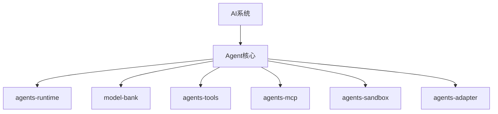

# AI系统

## 领域概述

AI系统覆盖 Agent Runtime 与周边能力模块，当前已完成 Runtime、Model、Tools、MCP、Sandbox、Adapter 全量文档化。

## 子领域导航

| 模块             | 深度文档                                                | API                                 | 说明                                                            |
| ---------------- | ------------------------------------------------------- | ----------------------------------- | --------------------------------------------------------------- |
| `agents-adapter` | [@moryflow/agents-adapter](Agent核心/agents-adapter.md) | [API](../api/agents-adapter-api.md) | 统一多模型 SDK 适配层，提供 provider 级别的调用桥接与参数收敛。 |
| `agents-mcp`     | [@moryflow/agents-mcp](Agent核心/agents-mcp.md)         | [API](../api/agents-mcp-api.md)     | MCP 客户端与工具桥接层，负责会话连接、工具发现与调用封装。      |
| `agents-runtime` | [@moryflow/agents-runtime](Agent核心/agents-runtime.md) | [API](../api/agents-runtime-api.md) | Agent 运行时核心能力。                                          |
| `agents-sandbox` | [@moryflow/agents-sandbox](Agent核心/agents-sandbox.md) | [API](../api/agents-sandbox-api.md) | Agent 沙盒执行能力，隔离命令执行、文件系统访问与安全边界。      |
| `agents-tools`   | [@moryflow/agents-tools](Agent核心/agents-tools.md)     | [API](../api/agents-tools-api.md)   | 跨平台工具装配与任务工具体系。                                  |
| `model-bank`     | [@moryflow/model-bank](Agent核心/model-bank.md)         | [API](../api/model-bank-api.md)     | 模型注册与 thinking 合同。                                      |

## 领域结构图

## Section sources

**Section sources**

- [packages/agents-runtime](../../../packages/agents-runtime)
- [packages/model-bank](../../../packages/model-bank)
- [packages/agents-tools](../../../packages/agents-tools)
- [packages/agents-mcp](../../../packages/agents-mcp)
- [packages/agents-sandbox](../../../packages/agents-sandbox)
- [packages/agents-adapter](../../../packages/agents-adapter)

## 最佳实践

- 统一术语：model registry、tooling、sandbox、mcp、adapter。
- 运行时链路变更必须同步更新 AI 域索引与 Agent核心索引。

## 性能优化

- 优先优化 runtime 与 tools 的热路径；MCP/Sandbox 关注连接与执行延迟。

## 错误处理与调试

| 问题         | 处理                             |
| ------------ | -------------------------------- |
| 模型调用异常 | 对照 model-bank + runtime 文档   |
| 工具执行异常 | 对照 agents-tools + sandbox 文档 |
| MCP 会话异常 | 对照 agents-mcp 文档与连接配置   |

## 相关文档

- [Agent核心索引](./Agent核心/_index.md)
- [Wiki 首页](../index.md)

---

_由 [Mini-Wiki v3.0.6](https://github.com/trsoliu/mini-wiki) 自动生成 | 2026-03-02_
