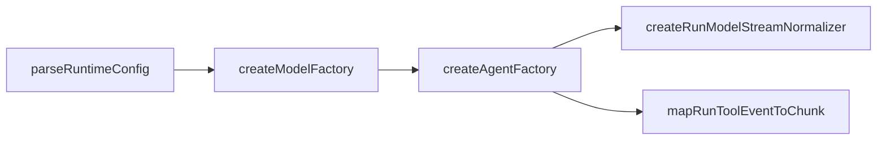

# `@moryflow/agents-runtime` API 参考

## 模块导入

```ts
import {
  createModelFactory,
  createAgentFactory,
  parseRuntimeConfig,
  mergeRuntimeConfig,
  mapRunToolEventToChunk,
  createRunModelStreamNormalizer,
} from '@moryflow/agents-runtime';
```

该模块通过 `src/index.ts` 统一导出核心能力，建议应用层只从包入口导入。

**Section sources**

- [index.ts#L10-L163](file:///Users/zhangbaolin/code/me/moryflow/packages/agents-runtime/src/index.ts#L10-L163)

## API 总览

| API                              | 签名摘要                                | 用途                       |
| -------------------------------- | --------------------------------------- | -------------------------- | -------------------- |
| `createModelFactory`             | `(options) => ModelFactory`             | 构建 provider/model 选择器 |
| `createAgentFactory`             | `(options) => AgentFactory`             | 创建并缓存 Agent           |
| `parseRuntimeConfig`             | `(content: string) => {config, errors}` | 解析 JSONC runtime 配置    |
| `mergeRuntimeConfig`             | `(base, overrides) => config`           | 合并运行时配置             |
| `mapRunToolEventToChunk`         | `(event) => UIMessageChunk              | null`                      | tool 事件转 UI chunk |
| `createRunModelStreamNormalizer` | `() => {consume}`                       | raw model 事件规范化       |



**Diagram sources**

- [index.ts](file:///Users/zhangbaolin/code/me/moryflow/packages/agents-runtime/src/index.ts)

## `createModelFactory`

### 签名

```ts
function createModelFactory(options: ModelFactoryOptions): ModelFactory;
```

### 参数

| 参数               | 类型                              | 必填                    | 说明                     |
| ------------------ | --------------------------------- | ----------------------- | ------------------------ | ------------ |
| `settings`         | `AgentSettings`                   | 是                      | 用户模型与 provider 配置 |
| `providerRegistry` | `Record<string, PresetProvider>`  | 是                      | 预设 provider 注册表     |
| `toApiModelId`     | `(providerId, modelId) => string` | 是                      | provider 内模型 ID 转换  |
| `membership`       | `MembershipConfig                 | () => MembershipConfig` | 否                       | 会员模型配置 |
| `customFetch`      | `fetch`                           | 否                      | 自定义请求实现           |

### 示例

```ts
const modelFactory = createModelFactory({
  settings,
  providerRegistry,
  toApiModelId: (_, modelId) => modelId,
});

const result = modelFactory.buildModel();
console.log(result.modelId, result.providerOptions);
```

**Section sources**

- [model-factory.ts#L292-L566](file:///Users/zhangbaolin/code/me/moryflow/packages/agents-runtime/src/model-factory.ts#L292-L566)

## `createAgentFactory`

### 签名

```ts
function createAgentFactory(options: AgentFactoryOptions): AgentFactory;
```

### 参数

| 参数               | 类型                         | 说明               |
| ------------------ | ---------------------------- | ------------------ |
| `getModelFactory`  | `() => ModelFactory`         | 延迟获取模型工厂   |
| `baseTools`        | `Tool<AgentContext>[]`       | 内置工具集合       |
| `getMcpTools`      | `() => Tool<AgentContext>[]` | MCP 工具集合       |
| `getInstructions`  | `() => string`               | 可选系统提示词覆盖 |
| `getModelSettings` | `() => ModelSettings`        | 可选模型参数覆盖   |

### 示例

```ts
const agentFactory = createAgentFactory({
  getModelFactory: () => modelFactory,
  baseTools,
  getMcpTools: () => mcpTools,
});

const { agent, modelId } = agentFactory.getAgent('openai/gpt-4.1-mini');
```

**Section sources**

- [agent-factory.ts#L17-L127](file:///Users/zhangbaolin/code/me/moryflow/packages/agents-runtime/src/agent-factory.ts#L17-L127)

## `parseRuntimeConfig` 与 `mergeRuntimeConfig`

### 签名

```ts
function parseRuntimeConfig(content: string): RuntimeConfigParseResult;
function mergeRuntimeConfig(
  base: AgentRuntimeConfig,
  overrides?: AgentRuntimeConfig
): AgentRuntimeConfig;
```

### 示例（错误处理）

```ts
const parsed = parseRuntimeConfig('{ invalid jsonc }');

if (parsed.errors.length > 0) {
  console.warn('runtime config parse warnings:', parsed.errors);
}

const merged = mergeRuntimeConfig({ mode: { default: 'ask' } }, parsed.config);
```

**Section sources**

- [runtime-config.ts#L148-L176](file:///Users/zhangbaolin/code/me/moryflow/packages/agents-runtime/src/runtime-config.ts#L148-L176)

## `mapRunToolEventToChunk` / `createRunModelStreamNormalizer`

### 签名

```ts
function mapRunToolEventToChunk(
  event: RunItemStreamEventLike,
  knownToolNames?: string[]
): UIMessageChunk | null;
function createRunModelStreamNormalizer(): { consume(data: unknown): ExtractedRunModelStreamEvent };
```

### 示例（基础 + 高级）

```ts
const normalizer = createRunModelStreamNormalizer();
const event = normalizer.consume({
  type: 'response_done',
  response: { usage: { total_tokens: 20 } },
});
console.log(event.isDone, event.usage?.totalTokens);
```

```ts
const chunk = mapRunToolEventToChunk(
  {
    type: 'run_item_stream_event',
    name: 'tool_output',
    item: { type: 'tool_call_output_item', rawItem: { callId: 't1', output: '{"ok":true}' } },
  },
  ['read', 'edit']
);

if (chunk?.type === 'tool-output-available') {
  console.log('tool output ready');
}
```

```mermaid
classDiagram
class ModelFactory {
  +buildModel(modelId, options) BuildModelResult
  +buildRawModel(modelId) {modelId, model}
}
class AgentFactory {
  +getAgent(preferredModelId, options) {agent, modelId}
  +invalidate() void
}
class RunModelStreamNormalizer {
  +consume(data) ExtractedRunModelStreamEvent
}
ModelFactory --> AgentFactory
AgentFactory --> RunModelStreamNormalizer
```

**Diagram sources**

- [model-factory.ts](file:///Users/zhangbaolin/code/me/moryflow/packages/agents-runtime/src/model-factory.ts)
- [agent-factory.ts](file:///Users/zhangbaolin/code/me/moryflow/packages/agents-runtime/src/agent-factory.ts)
- [ui-stream.ts](file:///Users/zhangbaolin/code/me/moryflow/packages/agents-runtime/src/ui-stream.ts)

## 最佳实践

1. 从包入口导入，避免跨文件深层导入导致升级破坏。
2. `createModelFactory` 与 `createAgentFactory` 保持单例化使用，减少重复初始化。
3. UI 层仅读取标准化后的 chunk，不直接依赖 provider 事件细节。

```ts
// 推荐：在 runtime bootstrap 阶段初始化一次
const modelFactory = createModelFactory(options);
const agentFactory = createAgentFactory({
  getModelFactory: () => modelFactory,
  baseTools,
  getMcpTools,
});
```

## 性能优化

| 场景           | 建议                                              |
| -------------- | ------------------------------------------------- |
| 重复构建模型   | 缓存 provider 解析结果，避免每次重新扫描 settings |
| 重复构建 Agent | 复用 `getAgent` 缓存，按 key 精确失效             |
| 流式渲染性能   | 只消费 canonical 事件，忽略非关键事件             |
| 配置读取成本   | JSONC 在启动时解析并缓存结构化配置                |

**Section sources**

- [ui-stream.ts#L348-L453](file:///Users/zhangbaolin/code/me/moryflow/packages/agents-runtime/src/ui-stream.ts#L348-L453)

## FAQ

### 如何判断模型是否降级了 thinking？

查看 `buildModel` 返回值中的 `resolvedThinkingLevel` 与 `thinkingDowngradedToOff`。

### 为什么 `mapRunToolEventToChunk` 返回 `null`？

常见原因是事件类型不匹配（不是 `tool_called` / `tool_output`）或 `item` 缺失必要字段。

### 如何统一权限拒绝输出？

通过 `wrapToolsWithPermission` 的 `buildDeniedOutput` 注入统一格式。

**Section sources**

- [model-factory.ts](file:///Users/zhangbaolin/code/me/moryflow/packages/agents-runtime/src/model-factory.ts)
- [ui-stream.ts](file:///Users/zhangbaolin/code/me/moryflow/packages/agents-runtime/src/ui-stream.ts)
- [permission.ts#L418-L423](file:///Users/zhangbaolin/code/me/moryflow/packages/agents-runtime/src/permission.ts#L418-L423)

## 相关文档

- [Agent Runtime 深度文档](../AI系统/Agent核心/agents-runtime.md)
- [Agent核心总览](../AI系统/Agent核心/_index.md)
- [系统架构](../architecture.md)
- [文档关系图](../doc-map.md)

---

_由 [Mini-Wiki v3.0.6](https://github.com/trsoliu/mini-wiki) 自动生成 | 2026-03-02_
