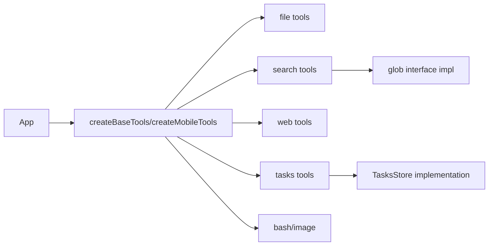
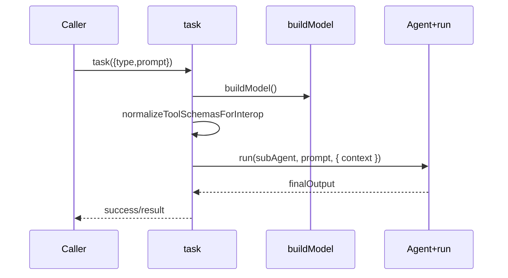
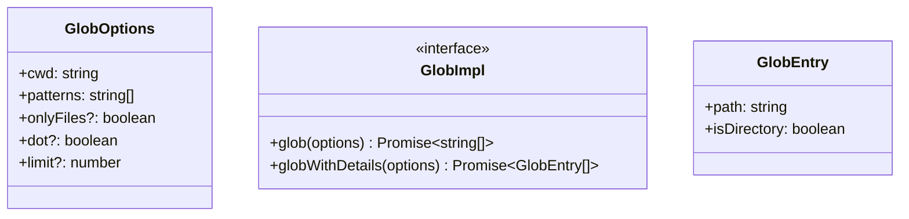

# `@moryflow/agents-tools` API 参考

## 模块导入

```ts
import {
  createBaseTools,
  createBaseToolsWithoutTask,
  createMobileTools,
  createReadTool,
  createWriteTool,
  applyWriteOperation,
  createGlobTool,
  createWebFetchTool,
  createTasksTools,
  createTaskTool,
  createGenerateImageTool,
  createBashTool,
} from '@moryflow/agents-tools';
```

该包 API 分为两层：

1. **装配层 API**：一键创建工具集（`createBaseTools*` / `createMobileTools*`）。
2. **原子工具工厂 API**：按需注册单个工具（`createReadTool`、`createTasksTools` 等）。

**Section sources**

- [src/index.ts#L1-L82](../../../packages/agents-tools/src/index.ts#L1-L82)
- [src/index.react-native.ts#L1-L77](../../../packages/agents-tools/src/index.react-native.ts#L1-L77)

## API 分层总览

| 层级   | 入口                                         | 主要导出                                                                                                    |
| ------ | -------------------------------------------- | ----------------------------------------------------------------------------------------------------------- |
| 装配层 | `create-tools.ts` / `create-tools-mobile.ts` | `createBaseTools`、`createMobileTools`                                                                      |
| 文件层 | `file/*`                                     | `createReadTool`、`createWriteTool`、`createEditTool`、`createDeleteTool`、`createMoveTool`、`createLsTool` |
| 搜索层 | `search/*` + `glob/*`                        | `createGlobTool`、`createGrepTool`、`createSearchInFileTool`、`initNodeGlob`、`initMobileGlob`              |
| 网络层 | `web/*`                                      | `createWebFetchTool`、`createWebSearchTool`                                                                 |
| 任务层 | `task/*`                                     | `createTasksTools`、`createTaskTool`、`TasksStore` 类型与 schema 常量                                       |
| 平台层 | `platform/*` + `image/*`                     | `createBashTool`、`createGenerateImageTool`                                                                 |
| 共享层 | `shared.ts`                                  | `toolSummarySchema`、`normalizeRelativePath`、`sliceLinesForReadTool`                                       |



**Diagram sources**

- [src/create-tools.ts](../../../packages/agents-tools/src/create-tools.ts)
- [src/create-tools-mobile.ts](../../../packages/agents-tools/src/create-tools-mobile.ts)

## 1) 工具集装配 API

## `createBaseToolsWithoutTask`

```ts
function createBaseToolsWithoutTask(ctx: ToolsContext): Tool<AgentContext>[];
```

### `ToolsContext`

| 字段               | 类型                   | 说明                                   |
| ------------------ | ---------------------- | -------------------------------------- |
| `capabilities`     | `PlatformCapabilities` | 文件/网络/路径/可选 shell 能力         |
| `crypto`           | `CryptoUtils`          | 计算 sha256                            |
| `vaultUtils`       | `VaultUtils`           | Vault 路径解析与读写辅助               |
| `tasksStore`       | `TasksStore`           | 任务存储实现                           |
| `enableBash?`      | `boolean`              | Node/Electron 下可选注册 bash          |
| `webSearchApiKey?` | `string`               | 搜索 API Key（当前 web_search 未使用） |

## `createBaseTools`

```ts
function createBaseTools(ctx: ToolsContext): Tool<AgentContext>[];
```

与 `createBaseToolsWithoutTask` 的区别：额外注册 `task` 子代理工具，并组装 `SubAgentToolsConfig`。

## `createMobileToolsWithoutTask` / `createMobileTools`

```ts
function createMobileToolsWithoutTask(ctx: ToolsContext): Tool<AgentContext>[];
const createMobileTools = createMobileToolsWithoutTask;
```

移动端特性：

- 自动 `ensureMobileGlobInitialized(capabilities)`。
- 不包含 `bash` 与 `task` 子代理工具。

```ts
const tools = createBaseTools({
  capabilities,
  crypto,
  vaultUtils,
  tasksStore,
  enableBash: false,
});
```

**Section sources**

- [src/create-tools.ts#L31-L171](../../../packages/agents-tools/src/create-tools.ts#L31-L171)
- [src/create-tools-mobile.ts#L31-L93](../../../packages/agents-tools/src/create-tools-mobile.ts#L31-L93)

## 2) 文件工具 API

## `createReadTool`

```ts
function createReadTool(capabilities: PlatformCapabilities, vaultUtils: VaultUtils): Tool;
```

关键参数：

| 参数     | 类型     | 默认              |
| -------- | -------- | ----------------- |
| `path`   | `string` | -                 |
| `offset` | `number` | `1`               |
| `limit`  | `number` | `MAX_LINES(2000)` |

返回字段包含：`content`, `sha256`, `totalLines`, `truncated`, `binary`。

## `createWriteTool`

```ts
function createWriteTool(
  capabilities: PlatformCapabilities,
  crypto: CryptoUtils,
  vaultUtils: VaultUtils
): Tool;
```

参数约束：

- 覆盖已有文件时 `base_sha` 必填。
- 新建文件可不传 `base_sha`。
- `create_directories` 默认 `false`。

## `applyWriteOperation` / `writeOperationSchema`

```ts
const writeOperationSchema = z.object({
  path: z.string(),
  baseSha: z.string().length(64),
  patch: z.string().optional(),
  content: z.string().optional(),
  mode: z.enum(['patch', 'replace']).default('patch'),
});
```

```ts
async function applyWriteOperation(
  input: WriteOperationInput,
  deps: { vaultUtils: VaultUtils; fs: PlatformCapabilities['fs']; crypto: CryptoUtils }
): Promise<{ path: string; sha256: string; size: number; preview: string; truncated: boolean }>;
```

## 其他文件工具

| API                | 签名                                         |
| ------------------ | -------------------------------------------- |
| `createEditTool`   | `(capabilities, crypto, vaultUtils) => Tool` |
| `createDeleteTool` | `(capabilities, vaultUtils) => Tool`         |
| `createMoveTool`   | `(capabilities, vaultUtils) => Tool`         |
| `createLsTool`     | `(capabilities, vaultUtils) => Tool`         |

```ts
const doc = await read({ path: 'notes/spec.md' });
const updated = await write({
  path: 'notes/spec.md',
  content: `${doc.content}

## Decision`,
  base_sha: doc.sha256,
});
```

**Section sources**

- [src/file/read-tool.ts](../../../packages/agents-tools/src/file/read-tool.ts)
- [src/file/write-tool.ts](../../../packages/agents-tools/src/file/write-tool.ts)
- [src/file/edit-tool.ts](../../../packages/agents-tools/src/file/edit-tool.ts)
- [src/file/delete-tool.ts](../../../packages/agents-tools/src/file/delete-tool.ts)
- [src/file/move-tool.ts](../../../packages/agents-tools/src/file/move-tool.ts)
- [src/file/ls-tool.ts](../../../packages/agents-tools/src/file/ls-tool.ts)

## 3) 搜索工具 API

## `createGlobTool`

```ts
function createGlobTool(capabilities: PlatformCapabilities, vaultUtils: VaultUtils): Tool;
```

参数：`pattern`, `max_results<=1000`, `include_directories`。

## `createGrepTool`

```ts
function createGrepTool(capabilities: PlatformCapabilities, vaultUtils: VaultUtils): Tool;
```

参数：`query`, `glob`, `limit<=500`, `case_sensitive`。

## `createSearchInFileTool`

```ts
function createSearchInFileTool(capabilities: PlatformCapabilities, vaultUtils: VaultUtils): Tool;
```

参数：`path`, `query`, `max_matches<=100`, `case_sensitive`。

```ts
const files = await glob({ pattern: 'packages/**/CLAUDE.md', max_results: 100 });
const hits = await grep({ query: 'trust proxy', glob: ['apps/**/*.ts'], limit: 50 });
const inFile = await search_in_file({ path: 'CLAUDE.md', query: '测试要求' });
```

**Section sources**

- [src/search/glob-tool.ts](../../../packages/agents-tools/src/search/glob-tool.ts)
- [src/search/grep-tool.ts](../../../packages/agents-tools/src/search/grep-tool.ts)
- [src/search/search-in-file-tool.ts](../../../packages/agents-tools/src/search/search-in-file-tool.ts)

## 4) Web 工具 API

## `createWebFetchTool`

```ts
function createWebFetchTool(capabilities: PlatformCapabilities): Tool;
```

参数：

| 字段     | 类型          | 说明         |
| -------- | ------------- | ------------ |
| `url`    | `string(url)` | 目标 URL     |
| `prompt` | `string`      | 提取目标描述 |

返回：`success`, `url`, `contentType`, `content`, `error?`。

## `createWebSearchTool`

```ts
function createWebSearchTool(capabilities: PlatformCapabilities, apiKey?: string): Tool;
```

参数：`query`, `allowed_domains?`, `blocked_domains?`。

```ts
const page = await web_fetch({
  url: 'https://docs.factory.ai/factory-docs-map.md',
  prompt: '提取自定义 droid 配置章节',
});

const results = await web_search({
  query: 'TanStack Start SSR redirect loop trust proxy',
  blocked_domains: ['pinterest.com'],
});
```

**Section sources**

- [src/web/web-fetch-tool.ts](../../../packages/agents-tools/src/web/web-fetch-tool.ts)
- [src/web/web-search-tool.ts](../../../packages/agents-tools/src/web/web-search-tool.ts)

## 5) Tasks API

## `createTasksTools`

```ts
function createTasksTools(store: TasksStore): Tool<AgentContext>[];
```

返回 11 个工具：

```ts
[
  'tasks_list',
  'tasks_get',
  'tasks_create',
  'tasks_update',
  'tasks_set_status',
  'tasks_add_dependency',
  'tasks_remove_dependency',
  'tasks_add_note',
  'tasks_add_files',
  'tasks_delete',
  'tasks_graph',
];
```

## `TasksStore` 接口

```ts
interface TasksStore {
  init(context: TasksStoreContext): Promise<void>;
  listTasks(chatId: string, query?: ListTasksQuery): Promise<TaskRecord[]>;
  getTask(chatId: string, taskId: string): Promise<TaskRecord | null>;
  createTask(chatId: string, input: CreateTaskInput): Promise<TaskRecord>;
  updateTask(chatId: string, taskId: string, input: UpdateTaskInput): Promise<TaskRecord>;
  setStatus(chatId: string, taskId: string, input: SetStatusInput): Promise<TaskRecord>;
  addDependency(chatId: string, taskId: string, dependsOn: string): Promise<void>;
  removeDependency(chatId: string, taskId: string, dependsOn: string): Promise<void>;
  listDependencies(chatId: string, taskId: string): Promise<TaskDependency[]>;
  addNote(chatId: string, taskId: string, input: AddNoteInput): Promise<TaskNote>;
  listNotes(chatId: string, taskId: string): Promise<TaskNote[]>;
  addFiles(chatId: string, taskId: string, input: AddFilesInput): Promise<void>;
  listFiles(chatId: string, taskId: string): Promise<TaskFile[]>;
  deleteTask(chatId: string, taskId: string, input: DeleteTaskInput): Promise<void>;
}
```

## `createTaskTool`

```ts
function createTaskTool(subAgentTools?: SubAgentToolsConfig): Tool<AgentContext>;

type SubAgentType = 'explore' | 'research' | 'batch';
```



**Section sources**

- [src/task/tasks-tools.ts](../../../packages/agents-tools/src/task/tasks-tools.ts)
- [src/task/tasks-store.ts](../../../packages/agents-tools/src/task/tasks-store.ts)
- [src/task/task-tool.ts](../../../packages/agents-tools/src/task/task-tool.ts)

## 6) 平台特定 API

## `createBashTool`

```ts
function createBashTool(capabilities: PlatformCapabilities, vaultUtils?: VaultUtils): Tool;
```

限制：

- 需要 `capabilities.optional.executeShell`。
- `cwd` 必须在 Vault 根目录内。
- `timeout`：1s~600s，默认 120s。

## `createGenerateImageTool`

```ts
function createGenerateImageTool(capabilities: PlatformCapabilities): Tool;
```

参数：`prompt`, `n<=10`, `size in ['1024x1024','1536x1024','1024x1536']`。

```ts
const imageTool = createGenerateImageTool(capabilities);
const result = await imageTool.invoke(
  context,
  JSON.stringify({
    prompt: 'A clean product hero illustration in grayscale',
    n: 1,
    size: '1024x1024',
  })
);
```

**Section sources**

- [src/platform/bash-tool.ts](../../../packages/agents-tools/src/platform/bash-tool.ts)
- [src/image/generate-image-tool.ts](../../../packages/agents-tools/src/image/generate-image-tool.ts)

## 7) Glob 抽象 API

| API                            | 说明                           |
| ------------------------------ | ------------------------------ |
| `setGlobImpl(impl)`            | 设置全局 glob 实现             |
| `getGlobImpl()`                | 获取当前实现（未初始化会抛错） |
| `isGlobImplInitialized()`      | 初始化状态检查                 |
| `initNodeGlob()`               | 注册 fast-glob 实现            |
| `initMobileGlob(capabilities)` | 注册移动端递归实现             |



**Section sources**

- [src/glob/index.ts](../../../packages/agents-tools/src/glob/index.ts)
- [src/glob/glob-interface.ts](../../../packages/agents-tools/src/glob/glob-interface.ts)
- [src/glob/glob-node.ts](../../../packages/agents-tools/src/glob/glob-node.ts)
- [src/glob/glob-mobile.ts](../../../packages/agents-tools/src/glob/glob-mobile.ts)

## 8) 共享常量与工具函数 API

`shared.ts` 对外暴露运行时公用约束：

| 常量/函数                       | 用途                    |
| ------------------------------- | ----------------------- |
| `toolSummarySchema`             | 工具执行摘要（1~80 字） |
| `MAX_PREVIEW_LENGTH`            | 预览长度上限（32KB）    |
| `BINARY_EXTENSIONS`             | 二进制扩展名白名单      |
| `LARGE_FILE_THRESHOLD`          | 大文件识别阈值          |
| `MAX_LINES` / `MAX_LINE_LENGTH` | read 分页与单行截断约束 |
| `trimPreview`                   | 预览截断                |
| `normalizeRelativePath`         | Vault 相对路径归一化    |
| `sliceLinesForReadTool`         | read 分段切片算法       |

```ts
const { content, offset, limit, truncated } = sliceLinesForReadTool(lines, 1, 200);
```

**Section sources**

- [src/shared.ts](../../../packages/agents-tools/src/shared.ts)

## 9) 端到端集成示例

### 9.1 Desktop Runtime

```ts
import { createBaseTools } from '@moryflow/agents-tools';

const tools = createBaseTools({
  capabilities,
  crypto,
  vaultUtils,
  tasksStore,
  enableBash: true,
});
```

### 9.2 React Native Runtime

```ts
import { createMobileTools, initMobileGlob } from '@moryflow/agents-tools';

initMobileGlob(capabilities);
const tools = createMobileTools({ capabilities, crypto, vaultUtils, tasksStore });
```

### 9.3 Browser Renderer

```ts
import type { TaskRecord, TaskStatus } from '@moryflow/agents-tools';
import { TASK_STATUS_LABELS } from '@moryflow/agents-tools';

function statusLabel(status: TaskStatus) {
  return TASK_STATUS_LABELS[status];
}
```

## 10) 最佳实践

1. 写入链路统一使用 `read -> write(base_sha)`，避免覆盖冲突。
2. 任务状态更新必须带 `expectedVersion`，并在 UI 侧处理冲突重载。
3. 大范围搜索先 `glob` 再 `grep`，避免无界读取。
4. 对公网抓取场景优先 `web_search` 缩小范围，再 `web_fetch` 精读。
5. 子代理场景明确区分 `explore/research/batch`，避免工具授权过宽。

## 11) 性能优化

- 将工具实例缓存到会话上下文，避免每轮创建。
- `read` 按行分页可显著降低长文件 token 开销。
- Node 端优先 `initNodeGlob`（默认已自动）以获得 fast-glob 性能。
- 任务面板渲染可按需调用 `tasks_graph`，避免每次都绘制全图。
- 对 web_fetch 超长页面依赖工具内 100KB 截断，必要时二次分段抓取。

## 12) 错误处理与调试

| 错误                                 | 可能原因                  | 解决方式                            |
| ------------------------------------ | ------------------------- | ----------------------------------- |
| `Glob 实现未初始化`                  | RN 环境未 init            | 调用 `initMobileGlob(capabilities)` |
| `覆盖已有文件必须提供 base_sha`      | write 漏传乐观锁          | 先 read 再 write                    |
| `文件已被修改（sha256 不匹配）`      | 并发写入                  | 刷新内容重试                        |
| `URL 不被允许访问`                   | 命中私网/metadata 黑名单  | 更换公网 URL                        |
| `子代理执行失败: 未配置子代理工具集` | createTaskTool 未注入工具 | 传入 `SubAgentToolsConfig`          |

## 13) 相关文档

- [agents-tools 深度文档](../AI系统/Agent核心/agents-tools.md)
- [Agent核心总览](../AI系统/Agent核心/_index.md)
- [agents-runtime API 参考](./agents-runtime-api.md)
- [model-bank API 参考](./model-bank-api.md)
- [文档关系图](../doc-map.md)

---

_由 [Mini-Wiki v3.0.6](https://github.com/trsoliu/mini-wiki) 自动生成 | 2026-03-02_
