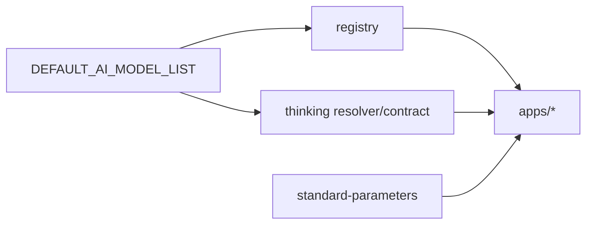
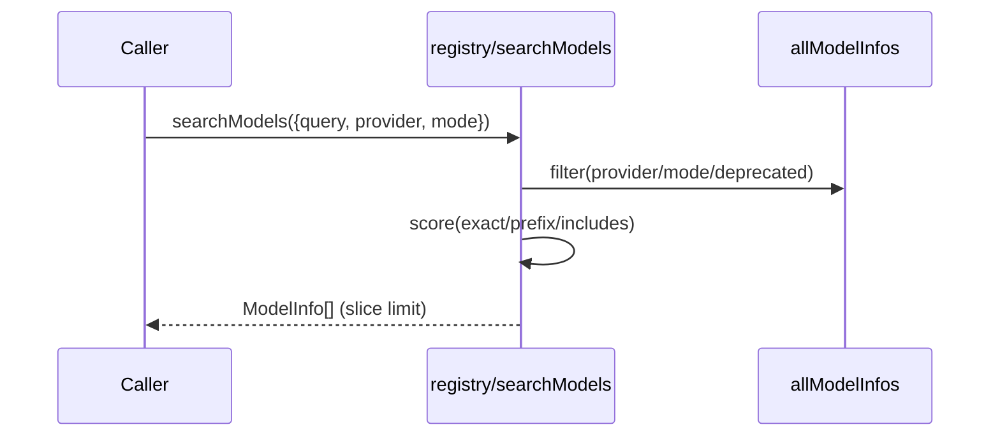
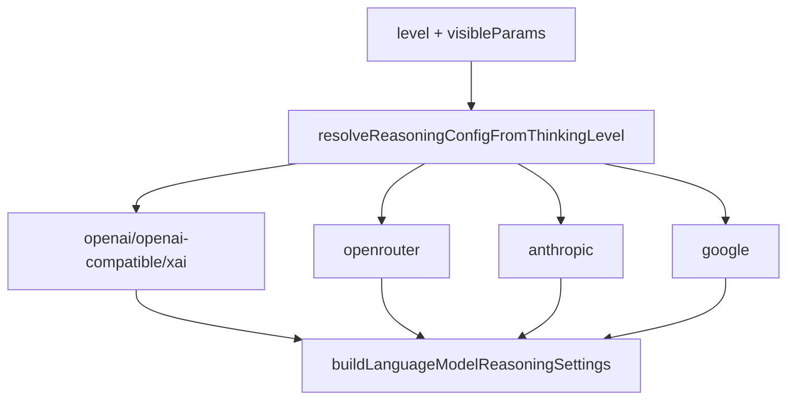

# `@moryflow/model-bank` API 参考

## 模块导入

```ts
import {
  DEFAULT_AI_MODEL_LIST,
  ModelProvider,
  buildProviderModelRef,
  parseProviderModelRef,
  searchModels,
  resolveModelThinkingProfileById,
  buildThinkingProfileFromCapabilities,
  resolveReasoningFromThinkingSelection,
  buildLanguageModelReasoningSettings,
  validateModelParamsSchema,
  extractDefaultValues,
} from '@moryflow/model-bank';
```

`@moryflow/model-bank` 通过包入口 `src/index.ts` 聚合导出 `aiModels / registry / thinking / standard-parameters / types`，建议业务层仅从包入口导入。

**Section sources**

- [src/index.ts#L1-L6](../../../packages/model-bank/src/index.ts#L1-L6)
- [src/thinking/index.ts#L1-L12](../../../packages/model-bank/src/thinking/index.ts#L1-L12)

## API 分层总览

| 层级   | 入口                              | 主要能力                                                    |
| ------ | --------------------------------- | ----------------------------------------------------------- |
| 数据层 | `aiModels/*` + `modelProviders/*` | 模型/Provider 卡片数据源                                    |
| 索引层 | `registry/index.ts`               | canonical id、搜索、映射、Provider 查询                     |
| 合同层 | `thinking/*`                      | thinking profile、capabilities 合并、reasoning payload 解析 |
| 参数层 | `standard-parameters/*`           | image/video 参数 schema 校验与默认值提取                    |



**Diagram sources**

- [src/aiModels/index.ts](../../../packages/model-bank/src/aiModels/index.ts)
- [src/registry/index.ts](../../../packages/model-bank/src/registry/index.ts)
- [src/thinking/contract.ts](../../../packages/model-bank/src/thinking/contract.ts)

## 1) 常量与数据导出

## `DEFAULT_AI_MODEL_LIST`

### 签名

```ts
const DEFAULT_AI_MODEL_LIST: DefaultAiModelListItem[];
```

### 说明

- 聚合 26 个 provider 的内置模型列表。
- 每项包含标准字段：`providerId / source / abilities / enabled / settings`。
- 作为 registry 与 thinking 解析的底层事实源。

**Section sources**

- [src/aiModels/index.ts#L31-L72](../../../packages/model-bank/src/aiModels/index.ts#L31-L72)

## `DEFAULT_MODEL_PROVIDER_LIST`

### 签名

```ts
const DEFAULT_MODEL_PROVIDER_LIST: ModelProviderCard[];
```

### 说明

- 聚合 provider 卡片（`id/name/chatModels/settings`）。
- registry 会基于此构建 `providerRegistry` 并推导 `sdkType`。

**Section sources**

- [src/modelProviders/index.ts#L61-L88](../../../packages/model-bank/src/modelProviders/index.ts#L61-L88)

## `ModelProvider` 枚举

### 签名

```ts
enum ModelProvider {
  OpenAI = 'openai',
  Anthropic = 'anthropic',
  Google = 'google',
  ...
}
```

### 说明

用于 provider ID 常量化，避免字符串散落。

**Section sources**

- [src/const/modelProvider.ts#L1-L28](../../../packages/model-bank/src/const/modelProvider.ts#L1-L28)

## 2) Registry API

Registry 以 `provider/modelId` canonical id 提供查询与检索。

## canonical id 工具

### `buildProviderModelRef`

```ts
function buildProviderModelRef(providerId: string, modelId: string): string;
```

构建 canonical id。

### `parseProviderModelRef`

```ts
function parseProviderModelRef(
  value: string | null | undefined
): { providerId: string; modelId: string } | null;
```

解析 canonical id，非法输入返回 `null`。

## Provider 查询

| API                      | 签名                                   |
| ------------------------ | -------------------------------------- |
| `getSortedProviders`     | `(): PresetProvider[]`                 |
| `getAllProviderIds`      | `(): string[]`                         |
| `getProviderById`        | `(id: string): PresetProvider \| null` |
| `getProviderModelApiIds` | `(providerId: string): string[]`       |

## Model 映射与查询

| API                       | 签名                                                         |
| ------------------------- | ------------------------------------------------------------ |
| `normalizeModelId`        | `(providerId: string, apiModelId: string): string`           |
| `toApiModelId`            | `(providerId: string, standardModelId: string): string`      |
| `getModelById`            | `(id: string): PresetModel \| null`                          |
| `getModelByProviderAndId` | `(providerId: string, modelId: string): PresetModel \| null` |
| `getAllModelIds`          | `(): string[]`                                               |
| `getModelsByCategory`     | `(category: string): string[]`                               |
| `getModelContextWindow`   | `(modelId?: string \| null): number`                         |
| `getModelCount`           | `(): number`                                                 |

## 搜索与元信息

| API            | 签名                                    |
| -------------- | --------------------------------------- |
| `searchModels` | `(options: SearchOptions): ModelInfo[]` |
| `getProviders` | `(): ProviderInfo[]`                    |
| `getAllModels` | `(): ModelInfo[]`                       |
| `getSyncMeta`  | `(): SyncMeta`                          |

### 示例

```ts
import {
  buildProviderModelRef,
  getModelById,
  searchModels,
  toApiModelId,
} from '@moryflow/model-bank/registry';

const canonical = buildProviderModelRef('openrouter', 'openai/gpt-5.2-20251211');
const model = getModelById(canonical);

const hits = searchModels({
  query: 'gpt-5',
  provider: 'openrouter',
  mode: 'chat',
  limit: 20,
});

const apiModelId = toApiModelId('openrouter', 'openai/gpt-5.2-20251211');
console.log(model?.name, hits.length, apiModelId);
```



**Section sources**

- [src/registry/index.ts#L27-L438](../../../packages/model-bank/src/registry/index.ts#L27-L438)
- [src/registry/types.ts#L1-L124](../../../packages/model-bank/src/registry/types.ts#L1-L124)

## 3) Thinking API

thinking API 分为规则、解析、合同、runtime 映射四部分。

## 3.1 Resolver

| API                               | 签名摘要                                                       |
| --------------------------------- | -------------------------------------------------------------- |
| `resolveProviderSdkType`          | `({providerId?, sdkType?}) => string \| undefined`             |
| `resolveRuntimeChatSdkType`       | `({providerId?, sdkType?}) => RuntimeChatSdkType \| undefined` |
| `resolveModelThinkingProfile`     | `(input) => ModelThinkingProfile`                              |
| `resolveModelThinkingProfileById` | `({modelId, providerId?, ...}) => ModelThinkingProfile`        |
| `listThinkingLevels`              | `(profile) => ThinkingLevelId[]`                               |
| `getThinkingVisibleParamsByLevel` | `(profile, levelId?) => ThinkingVisibleParam[]`                |

### 示例

```ts
import {
  getThinkingVisibleParamsByLevel,
  resolveModelThinkingProfileById,
} from '@moryflow/model-bank/thinking';

const profile = resolveModelThinkingProfileById({
  providerId: 'openai',
  modelId: 'gpt-5.2',
});

const params = getThinkingVisibleParamsByLevel(profile, profile.defaultLevel);
console.log(profile.activeControl, params);
```

## 3.2 Contract

| API                                     | 签名摘要                                                                           |
| --------------------------------------- | ---------------------------------------------------------------------------------- |
| `parseCapabilitiesJson`                 | `(capabilitiesJson: unknown) => Record<string, unknown> \| null`                   |
| `buildThinkingProfileFromRaw`           | `({rawProfile, supportsThinking, ...}) => ThinkingContractProfile`                 |
| `buildThinkingProfileFromCapabilities`  | `({capabilitiesJson, modelId?, providerId?, sdkType?}) => ThinkingContractProfile` |
| `resolveReasoningFromThinkingSelection` | `({thinking, capabilitiesJson, ...}) => ThinkingReasoningConfig \| undefined`      |

### `ThinkingContractError`

```ts
class ThinkingContractError extends Error {
  code: 'THINKING_NOT_SUPPORTED' | 'THINKING_LEVEL_INVALID';
  details?: unknown;
}
```

### 示例（错误处理）

```ts
import {
  resolveReasoningFromThinkingSelection,
  ThinkingContractError,
} from '@moryflow/model-bank/thinking';

try {
  const reasoning = resolveReasoningFromThinkingSelection({
    providerId: 'openrouter',
    modelId: 'openai/gpt-5.2-20251211',
    capabilitiesJson: { reasoning: { levels: ['off', 'high'], defaultLevel: 'high' } },
    thinking: { mode: 'level', level: 'high' },
  });

  console.log(reasoning);
} catch (error) {
  if (error instanceof ThinkingContractError) {
    console.error(error.code, error.details);
  }
}
```

## 3.3 Reasoning runtime 映射

| API                                       | 签名摘要                                                                          |
| ----------------------------------------- | --------------------------------------------------------------------------------- |
| `resolveReasoningConfigFromThinkingLevel` | `({levelId, sdkType?, visibleParams?}) => ThinkingReasoningConfig \| undefined`   |
| `supportsThinkingForSdkType`              | `(sdkType?) => boolean`                                                           |
| `buildOpenRouterReasoningExtraBody`       | `(reasoning) => Record<string, unknown>`                                          |
| `buildLanguageModelReasoningSettings`     | `({reasoning?, sdkType?}) => ThinkingLanguageModelReasoningSettings \| undefined` |

### 示例（映射到 SDK 设置）

```ts
import { buildLanguageModelReasoningSettings } from '@moryflow/model-bank/thinking';

const settings = buildLanguageModelReasoningSettings({
  sdkType: 'google',
  reasoning: {
    enabled: true,
    includeThoughts: true,
    maxTokens: 8192,
  },
});

console.log(settings);
```



**Section sources**

- [src/thinking/resolver.ts#L405-L547](../../../packages/model-bank/src/thinking/resolver.ts#L405-L547)
- [src/thinking/contract.ts#L66-L580](../../../packages/model-bank/src/thinking/contract.ts#L66-L580)
- [src/thinking/reasoning.ts#L161-L326](../../../packages/model-bank/src/thinking/reasoning.ts#L161-L326)
- [src/thinking/rules.ts#L1-L264](../../../packages/model-bank/src/thinking/rules.ts#L1-L264)
- [src/thinking/types.ts#L1-L78](../../../packages/model-bank/src/thinking/types.ts#L1-L78)

## 4) 标准参数 API（Image/Video）

## Image 参数

| API                         | 签名                                                         |
| --------------------------- | ------------------------------------------------------------ |
| `ModelParamsMetaSchema`     | `zod schema`                                                 |
| `validateModelParamsSchema` | `(paramsSchema: unknown) => ModelParamsOutputSchema`         |
| `extractDefaultValues`      | `(paramsSchema: ModelParamsSchema) => RuntimeImageGenParams` |

## Video 参数

| API                              | 签名                                                              |
| -------------------------------- | ----------------------------------------------------------------- |
| `VideoModelParamsMetaSchema`     | `zod schema`                                                      |
| `validateVideoModelParamsSchema` | `(paramsSchema: unknown) => VideoModelParamsOutputSchema`         |
| `extractVideoDefaultValues`      | `(paramsSchema: VideoModelParamsSchema) => RuntimeVideoGenParams` |

### 示例

```ts
import {
  extractDefaultValues,
  extractVideoDefaultValues,
  validateModelParamsSchema,
  validateVideoModelParamsSchema,
} from '@moryflow/model-bank';

const imageSchema = validateModelParamsSchema({
  prompt: { default: '' },
  aspectRatio: { default: '1:1', enum: ['1:1', '16:9'] },
});

const videoSchema = validateVideoModelParamsSchema({
  prompt: { default: '' },
  resolution: { default: '720p', enum: ['480p', '720p', '1080p'] },
});

console.log(extractDefaultValues(imageSchema));
console.log(extractVideoDefaultValues(videoSchema));
```

**Section sources**

- [src/standard-parameters/index.ts#L55-L265](../../../packages/model-bank/src/standard-parameters/index.ts#L55-L265)
- [src/standard-parameters/video.ts#L14-L144](../../../packages/model-bank/src/standard-parameters/video.ts#L14-L144)

## 5) 关键类型速查

| 类型                      | 位置                           | 用途                            |
| ------------------------- | ------------------------------ | ------------------------------- |
| `PresetModel`             | `registry/types.ts`            | canonical registry 输出模型定义 |
| `PresetProvider`          | `registry/types.ts`            | provider 元信息                 |
| `ModelInfo`               | `registry/types.ts`            | 搜索结果展示模型信息            |
| `ModelThinkingProfile`    | `thinking/types.ts`            | model-native thinking profile   |
| `ThinkingContractProfile` | `thinking/contract.ts`         | cloud+native 合并后合同         |
| `ThinkingReasoningConfig` | `thinking/reasoning.ts`        | runtime reasoning 参数          |
| `RuntimeImageGenParams`   | `standard-parameters/index.ts` | 图像模型参数默认值结构          |
| `RuntimeVideoGenParams`   | `standard-parameters/video.ts` | 视频模型参数默认值结构          |

**Section sources**

- [src/registry/types.ts#L1-L124](../../../packages/model-bank/src/registry/types.ts#L1-L124)
- [src/thinking/types.ts#L1-L78](../../../packages/model-bank/src/thinking/types.ts#L1-L78)
- [src/thinking/contract.ts#L29-L61](../../../packages/model-bank/src/thinking/contract.ts#L29-L61)

## 最佳实践

1. 全程使用 canonical id：`provider/modelId`。
2. provider sdkType 一律走 `resolveProviderSdkType`，避免硬编码。
3. thinking 先拿 profile，再下发 reasoning，不直接拼 payload。
4. 图像/视频参数先 `validate*` 再 `extract*`。

```ts
const profile = resolveModelThinkingProfileById({ providerId, modelId });
const selected = profile.defaultLevel;
const visible = getThinkingVisibleParamsByLevel(profile, selected);
```

## FAQ

### Q1: 为什么 `getModelById('gpt-5')` 返回 `null`？

因为 registry 只接受 canonical id，请改为 `openai/gpt-5`（示意）。

### Q2: 为什么 `resolveReasoningFromThinkingSelection` 抛错？

通常是：

- 选择了合同中不存在的 level（`THINKING_LEVEL_INVALID`）
- 模型/Provider 不支持 reasoning（`THINKING_NOT_SUPPORTED`）

### Q3: OpenRouter 里 effort 与 max_tokens 可以同时传吗？

不能。`buildOpenRouterReasoningExtraBody` 会按 one-of 规则优先保留 `max_tokens`。

## 相关文档

- [model-bank 深度文档](../AI系统/Agent核心/model-bank.md)
- [Agent核心总览](../AI系统/Agent核心/_index.md)
- [agents-runtime API 参考](./agents-runtime-api.md)
- [系统架构](../architecture.md)

---

_由 [Mini-Wiki v3.0.6](https://github.com/trsoliu/mini-wiki) 自动生成 | 2026-03-02_
