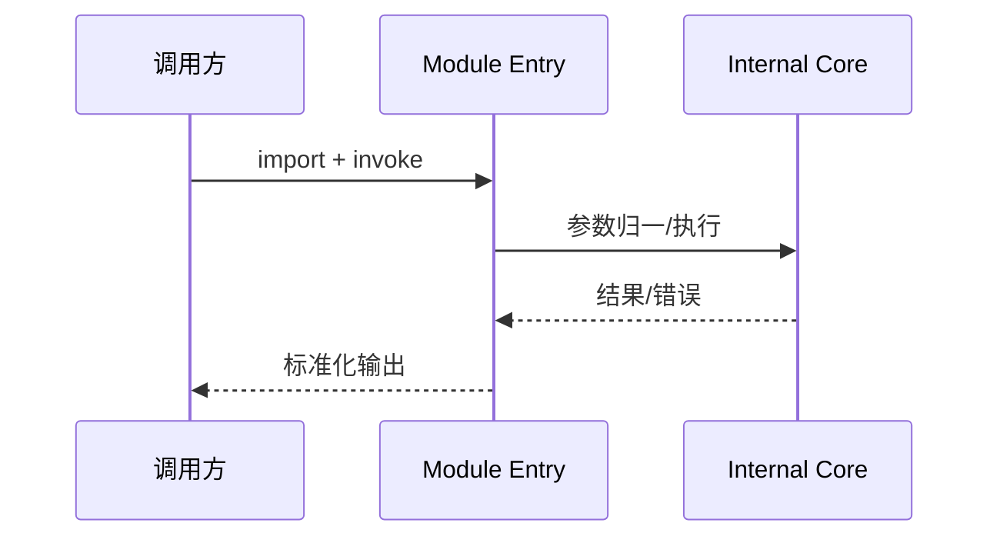

# `@moryflow/tiptap` API 参考

## 模块导入

```ts
import * as ModuleApi from '@moryflow/tiptap';
```

## 导出概览

| 导出                                                                           | 说明     |
| ------------------------------------------------------------------------------ | -------- |
| `export * from './hooks';`                                                     | 核心导出 |
| `export * from './utils';`                                                     | 核心导出 |
| `export * from './extensions/node-background-extension';`                      | 核心导出 |
| `export * from './extensions/node-alignment-extension';`                       | 核心导出 |
| `export * from './extensions/ui-state-extension';`                             | 核心导出 |
| `export * from './nodes/horizontal-rule-node/horizontal-rule-node-extension';` | 核心导出 |

## API 调用流程



**Diagram sources**

- [packages/tiptap/src/index.ts](../../../packages/tiptap/src/index.ts)
- [packages/tiptap/package.json](../../../packages/tiptap/package.json)
- [packages/tiptap/CLAUDE.md](../../../packages/tiptap/CLAUDE.md)

## 常见调用示例

```ts
import * as ModuleApi from '@moryflow/tiptap';

export function listModuleApis() {
  return Object.keys(ModuleApi);
}
```

```ts
import * as ModuleApi from '@moryflow/tiptap';

export async function safeInvoke(name: string, ...args: unknown[]) {
  const fn = (ModuleApi as Record<string, unknown>)[name];
  if (typeof fn !== 'function') return { ok: false, reason: 'not-function' };
  return { ok: true, result: await (fn as (...x: unknown[]) => unknown)(...args) };
}
```

## 类型与契约建议

- 对外 API 优先暴露稳定类型，避免泄露内部实现细节。
- 新增导出时同步维护入口文件与调用示例。
- 对可失败分支返回结构化错误，避免仅抛出非语义异常。

## Section sources

**Section sources**

- [packages/tiptap/src/index.ts](../../../packages/tiptap/src/index.ts)
- [packages/tiptap/package.json](../../../packages/tiptap/package.json)
- [packages/tiptap/CLAUDE.md](../../../packages/tiptap/CLAUDE.md)
- [packages/tiptap/tsconfig.json](../../../packages/tiptap/tsconfig.json)
- [packages/tiptap/styles/notion-editor.scss](../../../packages/tiptap/styles/notion-editor.scss)
- [packages/tiptap/src/ui/ai-types.ts](../../../packages/tiptap/src/ui/ai-types.ts)
- [packages/tiptap/src/types/tiptap-extensions.d.ts](../../../packages/tiptap/src/types/tiptap-extensions.d.ts)
- [packages/tiptap/src/types/turndown-plugin-gfm.d.ts](../../../packages/tiptap/src/types/turndown-plugin-gfm.d.ts)

## 最佳实践

1. 所有对外导出都应经过入口聚合与命名约束。
2. 调用方优先通过封装方法消费 API，避免散落直接调用。
3. 版本升级时先校验导出变更，再做批量迁移。

## 性能优化

- 减少热路径中的动态反射与重复序列化。
- 对可缓存结果建立短生命周期缓存，降低重复计算成本。
- 对高频导出添加最小可观测日志，便于定位瓶颈。

## 错误处理与调试

| 症状                    | 根因候选     | 处理建议                         |
| ----------------------- | ------------ | -------------------------------- |
| import 成功但函数不存在 | 导出名变更   | 对照入口 export 列表更新调用方   |
| 参数错误导致运行失败    | 调用签名漂移 | 为入口增加 schema 校验或类型收紧 |
| 行为与预期不一致        | 版本混用     | 锁定 workspace 版本并重建依赖    |

## 相关文档

- [模块深度文档](../编辑器/tiptap.md)
- [Wiki 首页](../index.md)

---

_由 [Mini-Wiki v3.0.6](https://github.com/trsoliu/mini-wiki) 自动生成 | 2026-03-02_
