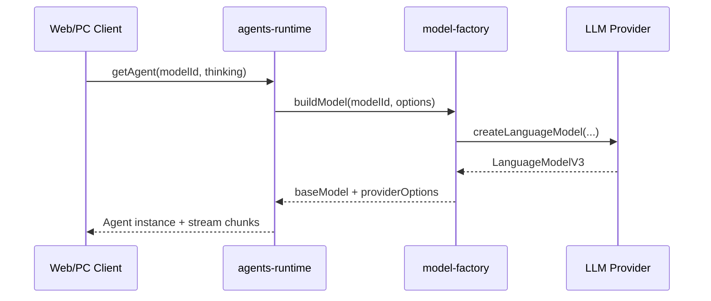

# 系统架构总览

## 执行摘要

Anyhunt Monorepo 以 **“多产品线 + 共享基础设施”** 为核心：`apps/*` 聚焦业务交付，`packages/*` 聚焦可复用能力，`tooling/*` 聚焦工程规范。该结构允许 Moryflow 与 Anyhunt Dev 独立演进，同时共享 UI、类型、Agent Runtime、模型映射等核心资产。

架构设计强调三件事：

1. **边界清晰**：业务语义在应用层，协议与公共逻辑在包层。
2. **事实源单一**：配置、类型、模型能力通过共享包集中管理。
3. **可验证性**：通过 Turbo pipeline 对 lint/typecheck/test 统一编排。

**Section sources**

- [CLAUDE.md](../../CLAUDE.md)
- [pnpm-workspace.yaml](../../pnpm-workspace.yaml)
- [turbo.json](../../turbo.json)

## 系统分层架构图

```mermaid
flowchart TB
  subgraph U[用户入口层]
    PC[apps/moryflow/pc]
    Web[apps/moryflow/server]
    Console[apps/anyhunt/console]
    Admin[apps/anyhunt/admin/www]
  end

  subgraph B[业务服务层]
    MServer[apps/moryflow/server]
    AServer[apps/anyhunt/server]
  end

  subgraph C[共享能力层 packages/*]
    Runtime[@moryflow/agents-runtime]
    ModelBank[@moryflow/model-bank]
    API[@moryflow/api]
    UI[@moryflow/ui]
    Types[@moryflow/types]
  end

  subgraph D[工程基础层]
    Turbo[Turborepo Task Graph]
    Workspace[pnpm workspace]
    Deploy[deploy/infra]
  end

  U --> B
  U --> C
  B --> C
  C --> D
```

**Diagram sources**

- [CLAUDE.md 项目结构](../../CLAUDE.md)
- [package.json](../../package.json)

## 技术栈与选型理由

| 层级          | 技术                                               | 选型理由                             |
| ------------- | -------------------------------------------------- | ------------------------------------ |
| Monorepo      | pnpm workspace + Turborepo                         | 依赖复用、任务缓存、跨包构建顺序可控 |
| Backend       | NestJS + Prisma + PostgreSQL + Redis               | 明确模块边界，数据访问层稳定         |
| Frontend      | React 19 + Vite + Tailwind v4 + shadcn/ui          | 快速迭代，组件规范化                 |
| Agent         | `@openai/agents-core` + `@moryflow/agents-runtime` | 将模型/工具/权限能力统一抽象         |
| Data Contract | Zod                                                | schema 驱动类型，减少重复定义        |

**Section sources**

- [CLAUDE.md 技术栈](../../CLAUDE.md)
- [packages/agents-runtime/package.json](../../packages/agents-runtime/package.json)

## 模块依赖关系图（抽象）

```mermaid
flowchart LR
  Apps[apps/*] --> API[@moryflow/api]
  Apps --> Runtime[@moryflow/agents-runtime]
  Apps --> UI[@moryflow/ui]
  Runtime --> ModelBank[@moryflow/model-bank]
  Runtime --> Adapter[@moryflow/agents-adapter]
  Runtime --> API
  UI --> Types[@moryflow/types]
```

**Diagram sources**

- [packages/agents-runtime/package.json](../../packages/agents-runtime/package.json)
- [package.json](../../package.json)

## 关键调用流：会话请求到模型响应



**Diagram sources**

- [agent-factory.ts#L60-L127](../../packages/agents-runtime/src/agent-factory.ts#L60-L127)
- [model-factory.ts#L322-L566](../../packages/agents-runtime/src/model-factory.ts#L322-L566)

## 工程流水线示例

下面片段说明根任务如何通过 Turbo 编排：

```json
{
  "scripts": {
    "lint": "turbo run lint",
    "typecheck": "turbo run typecheck",
    "test:unit": "turbo run test:unit"
  }
}
```

```json
{
  "tasks": {
    "typecheck": {
      "dependsOn": ["^build"],
      "cache": true
    }
  }
}
```

这意味着跨包校验不会在无构建产物时盲跑，能减少误报并提升流水线稳定性。

**Section sources**

- [package.json scripts](../../package.json)
- [turbo.json tasks](../../turbo.json)

## 设计原则与权衡

### 原则

- **去兼容包袱**：优先根因修复，不叠加历史兼容层。
- **统一状态与请求模式**：前端业务状态不新增 Context，统一 Zustand + Methods。
- **协议先行**：LLM provider、reasoning、权限规则都在共享层收口。

### 权衡

| 决策                | 收益                      | 代价                   |
| ------------------- | ------------------------- | ---------------------- |
| 共享运行时抽象      | 多端一致、回归成本低      | 抽象边界设计成本高     |
| Monorepo 统一流水线 | 规范一致，CI 可观察性更高 | 单次全量校验成本较大   |
| 严格协议化          | 减少隐式行为              | 需要更完整的文档与测试 |

**Section sources**

- [CLAUDE.md 协作总则](../../CLAUDE.md)
- [packages/agents-runtime/CLAUDE.md](../../packages/agents-runtime/CLAUDE.md)

## 可扩展路径

1. 在 `packages/*` 增加新能力包，并在根 pipeline 接入 `build/typecheck/test:unit`。
2. 在 `apps/*` 使用函数式 API + store/methods 分层对接能力包。
3. 在 `.mini-wiki` 追加领域文档并维护 `doc-map.md` 关系矩阵。

## 相关文档

- [Wiki 首页](./index.md)
- [快速开始](./getting-started.md)
- [文档关系图](./doc-map.md)
- [AI 系统域总览](./AI系统/_index.md)
- [agents-runtime 深度文档](./AI系统/Agent核心/agents-runtime.md)

---

_由 [Mini-Wiki v3.0.6](https://github.com/trsoliu/mini-wiki) 自动生成 | 2026-03-02_
