# 文档关系图（Doc Map）

## 文档网络总览

```mermaid
flowchart TB
  IDX[index.md] --> ARC[architecture.md]
  IDX --> GS[getting-started.md]
  IDX --> AI[AI系统/_index.md]
  IDX --> STORE[存储系统/_index.md]
  IDX --> EDITOR[编辑器/_index.md]
  IDX --> UI[组件库/_index.md]
  IDX --> CROSS[跨平台/_index.md]

  AI --> M1[agents-adapter.md]
  AI --> M2[agents-mcp.md]
  AI --> M3[agents-runtime.md]
  AI --> M4[agents-sandbox.md]
  AI --> M5[agents-tools.md]
  AI --> M12[model-bank.md]

  STORE --> M14[sync.md]
  EDITOR --> M15[tiptap.md]
  UI --> M9[embed.md]
  UI --> M10[embed-react.md]
  UI --> M11[i18n.md]
  UI --> M16[types.md]
  UI --> M17[ui.md]

  CROSS --> M6[anyhunt.md]
  CROSS --> M7[api.md]
  CROSS --> M8[config.md]
  CROSS --> M13[moryflow.md]

  M1 --> A1[agents-adapter-api.md]
  M2 --> A2[agents-mcp-api.md]
  M3 --> A3[agents-runtime-api.md]
  M4 --> A4[agents-sandbox-api.md]
  M5 --> A5[agents-tools-api.md]
  M6 --> A6[anyhunt-api.md]
  M7 --> A7[api-api.md]
  M8 --> A8[config-api.md]
  M9 --> A9[embed-api.md]
  M10 --> A10[embed-react-api.md]
  M11 --> A11[i18n-api.md]
  M12 --> A12[model-bank-api.md]
  M13 --> A13[moryflow-api.md]
  M14 --> A14[sync-api.md]
  M15 --> A15[tiptap-api.md]
  M16 --> A16[types-api.md]
  M17 --> A17[ui-api.md]
```

## 推荐阅读路径

| 角色           | 路径                                            | 目标                       |
| -------------- | ----------------------------------------------- | -------------------------- |
| 新同学         | `index -> getting-started -> architecture`      | 快速建立全局认知           |
| Agent 核心开发 | `AI系统/_index -> Agent核心/_index -> 模块文档` | 理解运行时/工具/沙盒链路   |
| 组件与前端开发 | `组件库/_index -> ui/types/embed`               | 建立共享组件与类型契约认知 |
| 跨平台开发     | `跨平台/_index -> api/config/moryflow/anyhunt`  | 理解应用层与基础设施边界   |

## 依赖矩阵（模块级）

| 模块             | 深度文档                             | API 文档                    |
| ---------------- | ------------------------------------ | --------------------------- |
| `agents-adapter` | `AI系统/Agent核心/agents-adapter.md` | `api/agents-adapter-api.md` |
| `agents-mcp`     | `AI系统/Agent核心/agents-mcp.md`     | `api/agents-mcp-api.md`     |
| `agents-runtime` | `AI系统/Agent核心/agents-runtime.md` | `api/agents-runtime-api.md` |
| `agents-sandbox` | `AI系统/Agent核心/agents-sandbox.md` | `api/agents-sandbox-api.md` |
| `agents-tools`   | `AI系统/Agent核心/agents-tools.md`   | `api/agents-tools-api.md`   |
| `anyhunt`        | `跨平台/anyhunt.md`                  | `api/anyhunt-api.md`        |
| `api`            | `跨平台/api.md`                      | `api/api-api.md`            |
| `config`         | `跨平台/config.md`                   | `api/config-api.md`         |
| `embed`          | `组件库/embed.md`                    | `api/embed-api.md`          |
| `embed-react`    | `组件库/embed-react.md`              | `api/embed-react-api.md`    |
| `i18n`           | `组件库/i18n.md`                     | `api/i18n-api.md`           |
| `model-bank`     | `AI系统/Agent核心/model-bank.md`     | `api/model-bank-api.md`     |
| `moryflow`       | `跨平台/moryflow.md`                 | `api/moryflow-api.md`       |
| `sync`           | `存储系统/sync.md`                   | `api/sync-api.md`           |
| `tiptap`         | `编辑器/tiptap.md`                   | `api/tiptap-api.md`         |
| `types`          | `组件库/types.md`                    | `api/types-api.md`          |
| `ui`             | `组件库/ui.md`                       | `api/ui-api.md`             |

## Section sources

**Section sources**

- [index.md](index.md)
- [AI系统/\_index.md](AI系统/_index.md)
- [跨平台/\_index.md](跨平台/_index.md)

## 最佳实践

- 新增模块文档后必须同步更新 doc-map 与根索引。
- 推荐按“领域索引 -> 模块深度 -> API”顺序阅读。

## 性能优化

- 关系图按领域分组，减少单图信息噪音。
- 仅在模块变更时更新对应边，避免全图频繁抖动。

## 错误处理与调试

| 问题               | 处理                                |
| ------------------ | ----------------------------------- |
| 模块未出现在关系图 | 检查 progress 与 index 是否同步更新 |
| API 关系缺失       | 补充模块到 API 文档映射表           |
| 图渲染失败         | 精简节点命名并重跑 Mermaid 检查     |

## 相关文档

- [Wiki 首页](./index.md)
- [系统架构](./architecture.md)

---

_由 [Mini-Wiki v3.0.6](https://github.com/trsoliu/mini-wiki) 自动生成 | 2026-03-02_
