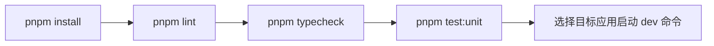

# 快速开始

## 1. 适用范围

本指南面向第一次接触该仓库的开发者与 AI 代理，目标是在最短路径下完成：

1. 依赖安装
2. 基础校验
3. 定向开发命令运行
4. Wiki 生成与质量检查

如果你只维护单个包（如 `@moryflow/agents-runtime`），也建议先跑完整的 `lint/typecheck/test:unit`，确保跨包契约不被破坏。

**Section sources**

- [package.json](../../package.json)
- [CLAUDE.md 测试要求](../../CLAUDE.md)

## 2. 前置条件

| 条件    | 要求                                            |
| ------- | ----------------------------------------------- |
| Node.js | `>=20`                                          |
| pnpm    | `9.12.2`                                        |
| Git     | 可读取仓库并执行本地校验                        |
| 系统    | macOS / Linux / Windows（仓库已声明多架构支持） |

```bash
node --version
pnpm --version
git --version
```

如 pnpm 版本不一致，请先对齐到仓库约束版本。

**Section sources**

- [package.json engines](../../package.json)

## 3. 安装与初始化

```bash
# 在仓库根目录
pnpm install
```

首次安装后，仓库会执行 `postinstall -> build:packages`，用于准备共享包构建产物。

```bash
# 如需手动触发共享包构建
pnpm build:packages
```

**Section sources**

- [package.json scripts.postinstall](../../package.json)

## 4. 最小验证流程



推荐顺序：

```bash
pnpm lint
pnpm typecheck
pnpm test:unit
```

对于仅文档改动，可以先运行 Wiki 质量检查；但在提交前依然建议至少执行一次全局类型检查。

**Diagram sources**

- [package.json scripts](../../package.json)

## 5. 常用定向开发命令

| 场景            | 命令                   |
| --------------- | ---------------------- |
| Anyhunt Server  | `pnpm dev:anyhunt`     |
| Anyhunt Console | `pnpm dev:console`     |
| Anyhunt Admin   | `pnpm dev:admin`       |
| Moryflow PC     | `pnpm dev:moryflow:pc` |

```bash
# 示例：启动 console + admin（两个终端分别执行）
pnpm dev:console
pnpm dev:admin
```

```bash
# 仅验证 agents-runtime 包单元测试
pnpm --filter @moryflow/agents-runtime test:unit
```

**Section sources**

- [package.json scripts](../../package.json)
- [packages/agents-runtime/package.json](../../packages/agents-runtime/package.json)

## 6. Wiki 生成与增量更新

当前仓库使用 `.mini-wiki/` 目录存放生成文档，建议流程：

1. 初始化 `.mini-wiki`（首次）
2. 更新结构缓存
3. 按业务域渐进生成文档
4. 运行质量检查

```bash
# 质量检查（来自 mini-wiki skill）
python3 ~/.factory/skills/mini-wiki/scripts/check_quality.py \
  .mini-wiki --verbose
```

**Section sources**

- `~/.factory/skills/mini-wiki/scripts/check_quality.py`
- [`.mini-wiki/config.yaml`](../config.yaml)

## 7. 常见问题

### Q1: 为什么 `typecheck` 很慢？

因为 Turbo 会解析依赖关系并确保上游构建先满足。首次运行慢是预期行为，后续缓存会改善。

### Q2: 为什么某些包不能单独运行？

共享包（尤其 agents 相关）依赖 `build:packages` 产物；若 dist 缺失，先执行 `pnpm build:packages`。

### Q3: 文档质量检查报 `basic` 怎么办？

优先补齐：章节结构、Mermaid 图表、代码示例、源码追溯与交叉链接。

**Section sources**

- [turbo.json](../../turbo.json)
- `~/.factory/skills/mini-wiki/scripts/check_quality.py`

## 8. 相关文档

- [Wiki 首页](./index.md)
- [系统架构](./architecture.md)
- [文档关系图](./doc-map.md)
- [AI 系统域](./AI系统/_index.md)

---

_由 [Mini-Wiki v3.0.6](https://github.com/trsoliu/mini-wiki) 自动生成 | 2026-03-02_
