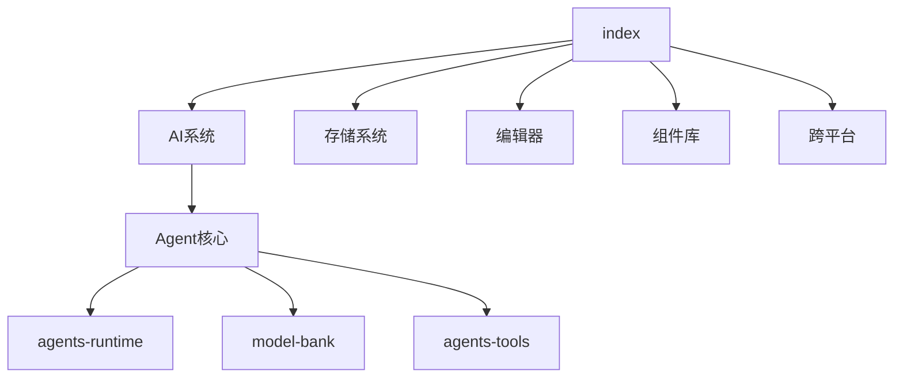

# Anyhunt / Moryflow Monorepo Wiki

> Progressive Mini-Wiki for all core modules (17/17) with domain hierarchy and API references.

## 项目概览

本 Wiki 已完成全部模块覆盖，包含架构总览、领域索引、模块深度文档与 API 参考，支持按领域与模块双路径导航。

## 领域导航

| 领域     | 索引文档                                  | 模块数 |
| -------- | ----------------------------------------- | ------ |
| AI系统   | [AI系统/\_index.md](AI系统/_index.md)     | 6      |
| 存储系统 | [存储系统/\_index.md](存储系统/_index.md) | 1      |
| 编辑器   | [编辑器/\_index.md](编辑器/_index.md)     | 1      |
| 组件库   | [组件库/\_index.md](组件库/_index.md)     | 5      |
| 跨平台   | [跨平台/\_index.md](跨平台/_index.md)     | 4      |

## 模块总览（17/17）

| 模块             | 领域     | 深度文档                                                       | API                              |
| ---------------- | -------- | -------------------------------------------------------------- | -------------------------------- |
| `agents-adapter` | AI系统   | [@moryflow/agents-adapter](AI系统/Agent核心/agents-adapter.md) | [API](api/agents-adapter-api.md) |
| `agents-mcp`     | AI系统   | [@moryflow/agents-mcp](AI系统/Agent核心/agents-mcp.md)         | [API](api/agents-mcp-api.md)     |
| `agents-runtime` | AI系统   | [@moryflow/agents-runtime](AI系统/Agent核心/agents-runtime.md) | [API](api/agents-runtime-api.md) |
| `agents-sandbox` | AI系统   | [@moryflow/agents-sandbox](AI系统/Agent核心/agents-sandbox.md) | [API](api/agents-sandbox-api.md) |
| `agents-tools`   | AI系统   | [@moryflow/agents-tools](AI系统/Agent核心/agents-tools.md)     | [API](api/agents-tools-api.md)   |
| `anyhunt`        | 跨平台   | [apps/anyhunt](跨平台/anyhunt.md)                              | [API](api/anyhunt-api.md)        |
| `api`            | 跨平台   | [@moryflow/api](跨平台/api.md)                                 | [API](api/api-api.md)            |
| `config`         | 跨平台   | [@moryflow/config](跨平台/config.md)                           | [API](api/config-api.md)         |
| `embed`          | 组件库   | [@moryflow/embed](组件库/embed.md)                             | [API](api/embed-api.md)          |
| `embed-react`    | 组件库   | [@moryflow/embed-react](组件库/embed-react.md)                 | [API](api/embed-react-api.md)    |
| `i18n`           | 组件库   | [@moryflow/i18n](组件库/i18n.md)                               | [API](api/i18n-api.md)           |
| `model-bank`     | AI系统   | [@moryflow/model-bank](AI系统/Agent核心/model-bank.md)         | [API](api/model-bank-api.md)     |
| `moryflow`       | 跨平台   | [apps/moryflow](跨平台/moryflow.md)                            | [API](api/moryflow-api.md)       |
| `sync`           | 存储系统 | [@moryflow/sync](存储系统/sync.md)                             | [API](api/sync-api.md)           |
| `tiptap`         | 编辑器   | [@moryflow/tiptap](编辑器/tiptap.md)                           | [API](api/tiptap-api.md)         |
| `types`          | 组件库   | [@moryflow/types](组件库/types.md)                             | [API](api/types-api.md)          |
| `ui`             | 组件库   | [@moryflow/ui](组件库/ui.md)                                   | [API](api/ui-api.md)             |

## 架构关系图

## Section sources

**Section sources**

- [CLAUDE.md](../../CLAUDE.md)
- [pnpm-workspace.yaml](../../pnpm-workspace.yaml)
- [packages/](../../packages)
- [apps/](../../apps)

## 最佳实践

- 任何模块新增/重构后，必须同步更新对应深度文档与 API 文档。
- 文档间保持双向链接，确保可追溯与可导航。

## 性能优化

- 按批次增量生成并结合 checksums 做脏路径更新。
- 优先维护高依赖模块，降低跨模块认知成本。

## 错误处理与调试

| 问题     | 处理                                |
| -------- | ----------------------------------- |
| 文档缺失 | 以 `progress.json` 对比模块列表补齐 |
| 链接断裂 | 运行关系图检查并修复相对路径        |
| 信息过期 | 重新采样模块统计并刷新文档          |

## 相关文档

- [系统架构](./architecture.md)
- [快速开始](./getting-started.md)
- [文档关系图](./doc-map.md)

---

_由 [Mini-Wiki v3.0.6](https://github.com/trsoliu/mini-wiki) 自动生成 | 2026-03-02_
