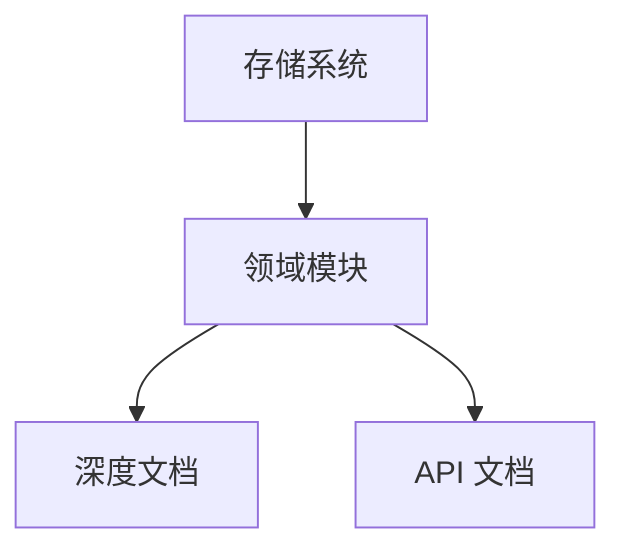

# 存储系统

## 领域概述

`存储系统` 领域收敛相关模块的职责边界、接口形态与集成路径，面向架构评审与跨模块协作场景。

## 领域模块清单

| 模块   | 文档                      | API                       | 说明                                                         |
| ------ | ------------------------- | ------------------------- | ------------------------------------------------------------ |
| `sync` | [@moryflow/sync](sync.md) | [API](../api/sync-api.md) | 跨端同步协议与同步引擎，负责变更收敛、冲突处理与状态持久化。 |

## 领域关系图

## 阅读路径

1. 先阅读本页定位模块边界。
2. 再阅读模块深度文档理解职责与结构。
3. 最后阅读 API 文档进行调用落地。

## Section sources

**Section sources**

- [CLAUDE.md](../../../CLAUDE.md)
- [pnpm-workspace.yaml](../../../pnpm-workspace.yaml)

## 最佳实践

- 领域内模块命名应体现职责，不混合业务与基础设施语义。
- 新增模块时同步更新领域索引、根索引与 doc-map。
- 统一维护模块深度文档与 API 文档的交叉链接。

## 性能优化

- 领域索引优先提供导航与聚合信息，避免重复长篇实现细节。
- 模块文档采用增量更新策略，降低全量重写成本。

## 错误处理与调试

| 问题       | 处理                              |
| ---------- | --------------------------------- |
| 链接失效   | 修复相对路径并回归点击校验        |
| 模块遗漏   | 以 `progress.json` 作为事实源补齐 |
| 域分类错误 | 调整模块映射并同步导航            |

## 相关文档

- [Wiki 首页](../index.md)
- [文档关系图](../doc-map.md)

---

_由 [Mini-Wiki v3.0.6](https://github.com/trsoliu/mini-wiki) 自动生成 | 2026-03-02_
