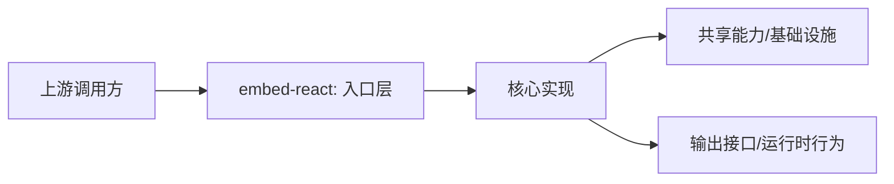

# @moryflow/embed-react

## 模块定位

`embed-react` 对应路径 `packages/embed-react`，React 场景嵌入组件库，提供 hooks 与组件级集成能力。
该文档用于快速建立模块边界、职责与调用入口认知，并作为后续评审与重构的索引入口。

## 规模与结构快照

| 指标             | 数值                   |
| ---------------- | ---------------------- |
| 模块目录         | `packages/embed-react` |
| 文件总数         | 14                     |
| 代码文件数       | 13                     |
| 代码行数（估算） | 432                    |

### 目录分布（Top）

| 目录   | 文件数 |
| ------ | ------ |
| `src`  | 9      |
| `root` | 4      |
| `test` | 1      |

## 架构关系图



**Diagram sources**

- [packages/embed-react/src/index.ts](../../../packages/embed-react/src/index.ts)
- [packages/embed-react/package.json](../../../packages/embed-react/package.json)
- [packages/embed-react/CLAUDE.md](../../../packages/embed-react/CLAUDE.md)
- [packages/embed-react/tsconfig.json](../../../packages/embed-react/tsconfig.json)

## 核心职责

1. 对外提供稳定入口与调用契约。
2. 对内收敛该模块的核心实现与约束。
3. 与上游业务模块保持边界清晰，避免跨层耦合。

## 公开入口与导出面

| 导出项                                                                                                 |
| ------------------------------------------------------------------------------------------------------ |
| `export type { EmbedType, ProviderName, EmbedTheme, EmbedData, EmbedOptions } from '@moryflow/embed';` |
| `export { EmbedError, detectProvider, isSupported } from '@moryflow/embed';`                           |
| `export {`                                                                                             |
| `export { useEmbed, type UseEmbedOptions, type UseEmbedResult, useEmbedContext } from './hooks';`      |
| `export { EmbedContext, type EmbedContextValue } from './context';`                                    |

```ts
import * as ModuleApi from '@moryflow/embed-react';

export function inspectModuleSurface() {
  return Object.keys(ModuleApi);
}
```

## 集成示例

```ts
import * as ModuleApi from '@moryflow/embed-react';

export async function runModuleDemo() {
  const keys = Object.keys(ModuleApi);
  return { module: 'embed-react', apiCount: keys.length };
}
```

## 开发与验证命令

```bash
pnpm --filter @moryflow/embed-react typecheck
pnpm --filter @moryflow/embed-react test:unit
```

## Section sources

**Section sources**

- [packages/embed-react/src/index.ts](../../../packages/embed-react/src/index.ts)
- [packages/embed-react/package.json](../../../packages/embed-react/package.json)
- [packages/embed-react/CLAUDE.md](../../../packages/embed-react/CLAUDE.md)
- [packages/embed-react/tsconfig.json](../../../packages/embed-react/tsconfig.json)
- [packages/embed-react/vitest.config.ts](../../../packages/embed-react/vitest.config.ts)
- [packages/embed-react/test/embed.test.tsx](../../../packages/embed-react/test/embed.test.tsx)
- [packages/embed-react/src/context.tsx](../../../packages/embed-react/src/context.tsx)
- [packages/embed-react/src/components/EmbedSkeleton.tsx](../../../packages/embed-react/src/components/EmbedSkeleton.tsx)

## 最佳实践

- 保持入口导出收敛，避免把内部实现细节暴露给上游。
- 变更对外类型或函数签名时，优先同步 API 文档与示例。
- 新增能力时优先在该模块内完成职责闭环，再向外暴露最小接口。

## 性能优化

- 将高频路径保持为纯函数或无副作用调用，减少跨层状态依赖。
- 对大体量数据处理路径优先做分页/分段处理，控制内存峰值。
- 对外部 IO 或网络访问路径增加超时与重试上限，避免级联阻塞。

## 错误处理与调试

| 问题       | 可能原因       | 排查入口                                |
| ---------- | -------------- | --------------------------------------- |
| 导入失败   | 入口导出未更新 | `src/index.ts` / `package.json#exports` |
| 运行时异常 | 参数契约不一致 | 入口函数签名与调用方对照                |
| 行为漂移   | 未同步约束文档 | 对照本页 sources 与 API 文档            |

## 相关文档

- [Wiki 首页](../index.md)
- [领域索引](_index.md)
- [API 参考](../api/embed-react-api.md)

---

_由 [Mini-Wiki v3.0.6](https://github.com/trsoliu/mini-wiki) 自动生成 | 2026-03-02_
