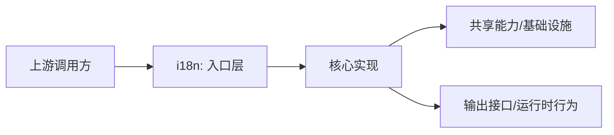

# @moryflow/i18n

## 模块定位

`i18n` 对应路径 `packages/i18n`，国际化资源与运行时封装，统一多端语言切换与消息加载。
该文档用于快速建立模块边界、职责与调用入口认知，并作为后续评审与重构的索引入口。

## 规模与结构快照

| 指标             | 数值            |
| ---------------- | --------------- |
| 模块目录         | `packages/i18n` |
| 文件总数         | 94              |
| 代码文件数       | 92              |
| 代码行数（估算） | 9520            |

### 目录分布（Top）

| 目录   | 文件数 |
| ------ | ------ |
| `src`  | 88     |
| `root` | 6      |

## 架构关系图



**Diagram sources**

- [packages/i18n/src/index.ts](file:///Users/zhangbaolin/code/me/moryflow/packages/i18n/src/index.ts)
- [packages/i18n/package.json](file:///Users/zhangbaolin/code/me/moryflow/packages/i18n/package.json)
- [packages/i18n/CLAUDE.md](file:///Users/zhangbaolin/code/me/moryflow/packages/i18n/CLAUDE.md)
- [packages/i18n/.eslintrc.js](file:///Users/zhangbaolin/code/me/moryflow/packages/i18n/.eslintrc.js)

## 核心职责

1. 对外提供稳定入口与调用契约。
2. 对内收敛该模块的核心实现与约束。
3. 与上游业务模块保持边界清晰，避免跨层耦合。

## 公开入口与导出面

| 导出项                                                                                         |
| ---------------------------------------------------------------------------------------------- |
| `export type {`                                                                                |
| `export type { HealthTranslationKeys } from './translations/health/types';`                    |
| `export {`                                                                                     |
| `export { initI18n, initI18nSync, getI18nInstance, isI18nInitialized } from './core/i18n';`    |
| `export { useTranslation } from './hooks/useTranslation';`                                     |
| `export { useLanguage } from './hooks/useLanguage';`                                           |
| `export { default as translations } from './translations';`                                    |
| `export { getDateLocale, getDateFormat, dateLocaleUtils } from './utils/date-locale';`         |
| `export { formatSmartRelativeTime, formatDate, formatHelpers } from './utils/format-helpers';` |

```ts
import * as ModuleApi from '@moryflow/i18n';

export function inspectModuleSurface() {
  return Object.keys(ModuleApi);
}
```

## 集成示例

```ts
import * as ModuleApi from '@moryflow/i18n';

export async function runModuleDemo() {
  const keys = Object.keys(ModuleApi);
  return { module: 'i18n', apiCount: keys.length };
}
```

## 开发与验证命令

```bash
pnpm --filter @moryflow/i18n build
pnpm --filter @moryflow/i18n dev
pnpm --filter @moryflow/i18n clean
```

## Section sources

- [packages/i18n/src/index.ts](file:///Users/zhangbaolin/code/me/moryflow/packages/i18n/src/index.ts)
- [packages/i18n/package.json](file:///Users/zhangbaolin/code/me/moryflow/packages/i18n/package.json)
- [packages/i18n/CLAUDE.md](file:///Users/zhangbaolin/code/me/moryflow/packages/i18n/CLAUDE.md)
- [packages/i18n/.eslintrc.js](file:///Users/zhangbaolin/code/me/moryflow/packages/i18n/.eslintrc.js)
- [packages/i18n/tsconfig.json](file:///Users/zhangbaolin/code/me/moryflow/packages/i18n/tsconfig.json)
- [packages/i18n/tsc-multi.json](file:///Users/zhangbaolin/code/me/moryflow/packages/i18n/tsc-multi.json)
- [packages/i18n/src/core/i18n.ts](file:///Users/zhangbaolin/code/me/moryflow/packages/i18n/src/core/i18n.ts)
- [packages/i18n/src/core/types.ts](file:///Users/zhangbaolin/code/me/moryflow/packages/i18n/src/core/types.ts)

## 最佳实践

- 保持入口导出收敛，避免把内部实现细节暴露给上游。
- 变更对外类型或函数签名时，优先同步 API 文档与示例。
- 新增能力时优先在该模块内完成职责闭环，再向外暴露最小接口。

## 性能优化

- 将高频路径保持为纯函数或无副作用调用，减少跨层状态依赖。
- 对大体量数据处理路径优先做分页/分段处理，控制内存峰值。
- 对外部 IO 或网络访问路径增加超时与重试上限，避免级联阻塞。

## 错误处理与调试

| 问题       | 可能原因       | 排查入口                                |
| ---------- | -------------- | --------------------------------------- |
| 导入失败   | 入口导出未更新 | `src/index.ts` / `package.json#exports` |
| 运行时异常 | 参数契约不一致 | 入口函数签名与调用方对照                |
| 行为漂移   | 未同步约束文档 | 对照本页 sources 与 API 文档            |

## 相关文档

- [Wiki 首页](../index.md)
- [领域索引](_index.md)
- [API 参考](../api/i18n-api.md)

---

_由 [Mini-Wiki v3.0.6](https://github.com/trsoliu/mini-wiki) 自动生成 | 2026-03-02_
