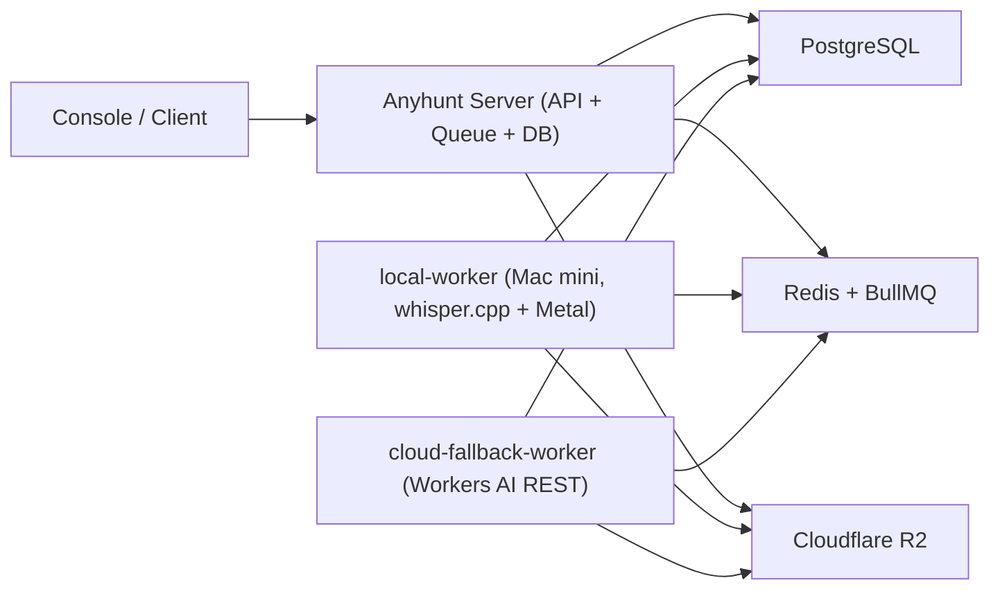
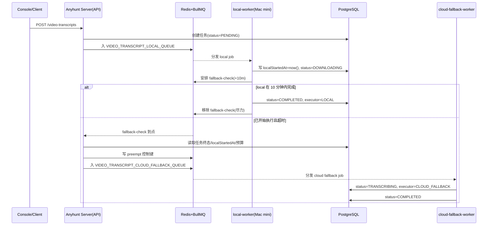

<!--
[INPUT]: 用户提交的视频链接（抖音/Bilibili/小红书/YouTube）
[OUTPUT]: 转写任务状态 + R2 视频/音频/字幕产物
[POS]: Anyhunt Dev 视频转写能力正式实施方案（双模式：local 主执行 + cloud API 兜底）

[PROTOCOL]: 本文件变更时需同步更新 `docs/index.md`、`docs/architecture/CLAUDE.md` 与根 `CLAUDE.md` 文档索引。
-->

# Anyhunt 视频转写方案（双模式定案）

## 0. 最近执行同步

- 2026-02-09：补充“17. 上线前执行清单（Checklist）”，覆盖 T-1 准备、T-0 部署、联调验收、回滚预案与 24h 观察项，作为生产上线前固定打勾清单。
- 2026-02-09：新增 Mac mini local-worker 一键部署脚本 `apps/anyhunt/server/scripts/video-transcript/setup-local-worker.sh`，统一依赖检查、`.env.local-worker` 写入、`launchd` 注册与启动；local 模式仅强制校验 DB/Redis/R2 变量，cloud fallback 变量改为告警提示。
- 2026-02-09：补充部署定案附录（公网简化版）：新增 `VPS1 API + VPS2 cloud fallback worker + Mac mini local worker` 三节点详细部署流程、角色环境变量矩阵、`launchd` 常驻步骤与联调验收清单。
- 2026-02-09：完成四轮可靠性修复：cloud 接管后的 workspace 初始化纳入失败兜底（避免 `DOWNLOADING` 卡住）；local 执行顺序改为“先写 `localStartedAt` 再调度 fallback-check”以严格对齐 10 分钟窗口起点；`duration probe` 解析增强为“从输出尾部提取有效数值”提高预估稳定性；补充 cloud fallback 回归测试覆盖接管后 workspace 失败分支。
- 2026-02-09：完成二轮可靠性修复：移除队列全局 5 分钟超时限制，新增 fallback 补偿扫描（30s）避免漏调度；local 启动时间与 timeout 判定统一改为 DB 时间裁决；补齐 local 启动竞态保护（终态不回写）；Admin 新增 today 指标（成功率/失败率/10 分钟达标率/fallback 触发率/平均时长/预算闸门触发数）与 `VIDEO_TRANSCRIPT_LOCAL_ENABLED` 运行时开关 + 审计记录。
- 2026-02-09：完成三轮可靠性修复：timeout cloud pre-check 失败不再将任务误标 `FAILED`（仅接管后失败才写终态）；`scheduleFallbackCheck` 失败降级为告警并由 scanner 补偿；scanner 改为单角色启用（默认 API-only）；cloud 预算预估新增 `yt-dlp duration probe` 以提前 preempt。
- 2026-02-09：已完成 Step 1 ~ Step 6 的代码落地（server + console + admin），并补齐 video-transcript service 单元测试；Step 7（压测与上线演练）待执行。

## 1. 目标与范围（固定）

- 输入：用户提交单个视频链接。
- 平台范围（v1 固定）：抖音、Bilibili、小红书、YouTube。
- 输出范围（v1 固定）：
  - 原视频（R2）
  - 抽取音频（R2）
  - 转写文本（TXT / JSON / SRT，R2）
- 高可用目标：同一套系统同时支持 `local` 主执行与 `cloud fallback` 兜底。

## 2. 架构与命名（固定）

### 2.1 角色划分

- 控制面（云端）：`apps/anyhunt/server`
  - API、鉴权、任务状态、队列编排、预算闸门、审计。
- 执行面（双节点并存）：
  - `local-worker`：本地主机算力节点（Mac mini，主执行）。
  - `cloud-fallback-worker`：云端兜底执行节点（Workers AI）。

### 2.2 命名约定

- 不再使用 `mini` 命名。
- 统一使用：
  - `LOCAL`
  - `CLOUD_FALLBACK`

### 2.3 核心语义（固定）

- `10 分钟窗口` 的计时起点是：**任务被 `local-worker` 真正拉起并开始执行的时刻**。
- 排队等待时间不计入窗口。
- 因此：`local` 队列等待超过 10 分钟是正常行为，不触发 cloud fallback。

### 2.4 拓扑



### 2.5 控制面与 local 的交互协议（固定）

- 固定采用 `Queue Pull`：云端不主动 HTTP 调用本地主机。
- `local-worker` 不对公网暴露 API 端口，仅主动访问：
  - 云端 Redis（拉取/确认任务、接收 preempt 指令）
  - 云端 PostgreSQL（任务状态与执行元数据）
  - Cloudflare R2（产物上传）
- 状态回传固定走数据库写入（不新增 internal callback API）。
- 节点在线性固定走心跳键：
  - `video:worker:local:{nodeId}:heartbeat`（Redis，TTL 60s）
- `preempt` 固定走 Redis 控制键：
  - `video:task:{taskId}:preempt=true`（TTL 30min）
  - `local-worker` 在阶段边界与分段转写循环中检查并中断。

### 2.6 事件与裁决统一规则（固定）

- 实时事件来源：BullMQ `QueueEvents`（`active/completed/failed`），仅用于 Admin 看板实时展示与排障。
- 最终裁决来源：PostgreSQL 任务记录（`status`、`localStartedAt`、`executor`），用于超时判断与接管决策。
- `localStartedAt` 必须在 local 真正开始执行时写入，且推荐使用数据库时间（`now()`）避免主机时钟偏差。
- fallback 检查由延迟任务到点后主动查 DB 决策，不依赖是否收到 `active` 事件。
- 即使 `QueueEvents` 丢失，正确性不受影响；最多影响实时看板刷新。
- 固定启用 fallback 补偿扫描（30 秒周期）：对 `executor=LOCAL` 且超时未终态任务执行幂等 `cloud-run` 入队，避免“已开始执行但 fallback-check 丢失”的漏接管场景。

### 2.7 执行时序（固定）



## 3. Cloud Fallback 模型（固定）

- 模型固定：`@cf/openai/whisper-large-v3-turbo`
- 调用方式：Cloudflare Workers AI REST API

请求端点：

- `POST https://api.cloudflare.com/client/v4/accounts/{ACCOUNT_ID}/ai/run/@cf/openai/whisper-large-v3-turbo`
- Header：`Authorization: Bearer {CF_WORKERS_AI_API_TOKEN}`
- Body：`multipart/form-data`（音频文件）

参考：

- [Workers AI whisper-large-v3-turbo](https://developers.cloudflare.com/workers-ai/models/whisper-large-v3-turbo/)
- [Workers AI REST API](https://developers.cloudflare.com/workers-ai/get-started/rest-api/)

## 4. 队列与触发规则（固定）

### 4.1 队列命名

- `VIDEO_TRANSCRIPT_LOCAL_QUEUE`
- `VIDEO_TRANSCRIPT_CLOUD_FALLBACK_QUEUE`

### 4.2 提交阶段（创建任务）

- 创建任务时只入 `VIDEO_TRANSCRIPT_LOCAL_QUEUE`。
- **不会**在创建时直接入 cloud fallback 延迟任务。

### 4.3 local 开始执行事件（计时起点）

当 `local-worker` 拉到任务并开始执行时，必须原子完成：

1. 写入 `localStartedAt = now`（这是 10 分钟窗口起点）。
2. 将任务状态从 `PENDING` 推进到首个执行态（如 `DOWNLOADING`）。
3. 安排 cloud fallback 检查（延迟 10 分钟）。

### 4.4 cloud fallback 触发条件

cloud fallback 检查触发时，只有以下条件同时满足才允许接管：

- 任务仍处于进行中（非终态）；
- `localStartedAt` 已存在；
- 当前时间 >= `localStartedAt + 10 分钟`；
- 通过预算闸门（见第 5 节）。

否则直接 no-op 退出。

触发后执行顺序（固定）：

1. 先对 `local-worker` 发送中断/取消信号（preempt）。
2. 再由 `cloud-fallback-worker` 开始执行。
3. 语义上进入“cloud 独占执行阶段”。

### 4.5 兜底幂等与取消

- local 在窗口内完成后：
  - 标记任务 `COMPLETED`，`executor=LOCAL`；
  - 尝试移除 cloud fallback 检查任务（移除失败也可接受，依靠终态幂等 no-op）。
- cloud 接管前必须再次检查终态，防止重复执行。

冲突写入规则（固定）：

- 默认不会出现双执行成功（因为 fallback 前会先中断 local）。
- 若因中断失败出现竞态双成功，最终结果按 `LOCAL` 优先落库。

### 4.6 cloud fallback 重试策略（固定）

- `cloud-fallback-worker` 重试次数：`attempts=2`。
- 退避策略：指数退避（exponential backoff）。

## 5. 预算闸门（固定）

### 5.1 预算规则

- cloud fallback 每日预算上限：`20 USD / day`。
- 预算统计时区：`Asia/Shanghai`（固定）。
- 计费口径：仅 `cloud-fallback-worker` 调用 Workers AI 的成本计入预算。
- 核算方式：按“音频时长（秒） × 单价”估算（预算闸门使用估算值）。
- `local-worker` 本地推理不计费。

### 5.2 超限行为

- 超限后，阻断 cloud fallback API 调用；
- 任务保留失败信息：`Cloud fallback daily budget exceeded`；
- local 路径仍可继续执行（仅禁止 cloud 接管）。

## 6. 数据模型（固定）

### 6.1 字段决策

- `platform` 使用 `String`（服务层白名单校验）。
- URL 字段仅保留 `sourceUrl`（入库前规范化）。
- 不引入 `sourceUrlNormalized` / `sourceUrlHash`。
- 不引入 `language` / `progress` 独立列。
- 错误仅保留 `error` 单列。
- 新增执行来源字段 `executor`，取值：`LOCAL` / `CLOUD_FALLBACK`。
- 新增 `localStartedAt`，用于精确定义 fallback 计时起点。

### 6.2 Prisma 草案

```prisma
enum VideoTranscriptTaskStatus {
  PENDING
  DOWNLOADING
  EXTRACTING_AUDIO
  TRANSCRIBING
  UPLOADING
  COMPLETED
  FAILED
  CANCELLED
}

enum VideoTranscriptExecutor {
  LOCAL
  CLOUD_FALLBACK
}

model VideoTranscriptTask {
  id              String                    @id @default(cuid())
  userId          String
  platform        String
  sourceUrl       String
  status          VideoTranscriptTaskStatus @default(PENDING)

  executor        VideoTranscriptExecutor?

  // fallback 计时起点（仅 local 真正开始执行时写入）
  localStartedAt  DateTime?

  // { userId, vaultId, videoFileId, audioFileId, textFileId, srtFileId, jsonFileId }
  artifacts       Json?

  // { text, segments, durationSec, languageDetected }
  result          Json?

  error           String?

  startedAt       DateTime?
  completedAt     DateTime?
  createdAt       DateTime                  @default(now())
  updatedAt       DateTime                  @updatedAt

  user            User                      @relation(fields: [userId], references: [id], onDelete: Cascade)

  @@index([userId, createdAt])
  @@index([status, createdAt])
  @@index([executor, createdAt])
  @@index([localStartedAt])
  @@index([sourceUrl])
}
```

## 7. 接口契约（固定）

- `POST /api/v1/app/video-transcripts`
  - req: `{ "url": "https://..." }`
  - resp: `{ "taskId": "...", "status": "PENDING" }`

- `GET /api/v1/app/video-transcripts/:taskId`
  - resp: `{ id, status, platform, sourceUrl, executor, artifacts, result, error, createdAt, updatedAt }`

- `GET /api/v1/app/video-transcripts?page=1&limit=20`
  - resp: `{ items, pagination }`

- `POST /api/v1/app/video-transcripts/:taskId/cancel`
  - resp: `{ "ok": true }`

控制器固定：`@Controller({ path: 'app/video-transcripts', version: '1' })`。

## 8. 状态机（固定）

`PENDING -> DOWNLOADING -> EXTRACTING_AUDIO -> TRANSCRIBING -> UPLOADING -> COMPLETED`

终态：

- `FAILED`
- `CANCELLED`

## 9. Anyhunt Admin 可观测（固定）

### 9.1 队列监控

复用：

- `apps/anyhunt/server/src/admin/admin-queue.controller.ts`
- `apps/anyhunt/server/src/admin/admin-queue.service.ts`

新增监控队列：

- `VIDEO_TRANSCRIPT_LOCAL_QUEUE`
- `VIDEO_TRANSCRIPT_CLOUD_FALLBACK_QUEUE`

### 9.2 执行看板

展示指标：

- 今日任务总数、成功率、失败率
- `executor` 分布（LOCAL vs CLOUD_FALLBACK）
- local 启动后 10 分钟内完成率
- cloud fallback 触发率
- 平均处理时长
- cloud 当日已用额度 / 剩余额度
- 预算闸门触发次数

### 9.3 节点资源看板

新增 worker 心跳上报并展示：

- 节点在线状态
- 最近心跳
- CPU / 内存
- 当前执行任务数
- 队列积压

### 9.4 告警规则（固定）

- 预算告警：cloud 当日预算使用率 > `80%` 触发告警。
- 节点告警：`local-worker` 离线持续 > `3 分钟` 触发告警。

## 10. Console 测试页（固定）

- 路由：`/fetchx/video-transcript`
- 左侧：URL 提交表单（`react-hook-form + zod/v3`）
- 右侧：状态、执行来源（LOCAL/CLOUD_FALLBACK）、产物链接、文本预览、错误
- 调用客户端固定：`apiClient`（Session）

## 11. 部署与配置（固定）

### 11.1 云端

- 部署：`apps/anyhunt/server`
- 同机部署：`cloud-fallback-worker`
- 依赖：PostgreSQL / Redis / R2

### 11.2 云端（Dokploy）服务拆分（固定）

- VPS 上使用 Dokploy 至少拆分为两个服务：
  - `anyhunt-server-api`：HTTP API + 任务编排 + 预算闸门 + 管理接口
  - `anyhunt-video-cloud-fallback-worker`：消费 `VIDEO_TRANSCRIPT_CLOUD_FALLBACK_QUEUE`
- 两个服务共享同一套数据库与 Redis。
- 两个服务都必须加载相同的基础环境变量（DB/Redis/R2/Workers AI/预算）。
- API 服务必须可水平扩容；cloud fallback worker 默认单副本，按成本策略再扩容。

### 11.3 本地主机（Mac mini）

- 部署并常驻：`local-worker`
- 依赖：`yt-dlp`、`ffmpeg`、`whisper.cpp`
- 网络：Tailscale 访问云端 Redis / PostgreSQL

### 11.4 本地主机常驻方式（固定）

- `local-worker` 固定采用 `launchd` 常驻（开机自启 + 崩溃拉起）。
- 不通过 Dokploy 管理 Mac mini 上的 `local-worker`。
- 建议日志路径：
  - `~/Library/Logs/anyhunt/video-transcript-local-worker.log`
  - `~/Library/Logs/anyhunt/video-transcript-local-worker.error.log`
- 建议在 Mac mini 本机设置并加载 `.env.local-worker`，避免与其他进程混用。

### 11.5 Tailscale 网络边界（固定）

- Redis / PostgreSQL 仅监听内网或受控网卡，不对公网开放。
- 仅允许以下来源访问 DB/Redis：
  - VPS（Dokploy 所在主机）
  - Mac mini（`local-worker` 所在主机）
- 访问控制至少包含：
  - Tailscale ACL（基于设备/标签）
  - Redis 密码
  - PostgreSQL 独立业务账号（最小权限）

### 11.6 环境变量

- 基础：`DATABASE_URL`、`REDIS_URL`
- R2：`R2_ACCOUNT_ID`、`R2_ACCESS_KEY_ID`、`R2_SECRET_ACCESS_KEY`、`R2_BUCKET_NAME`、`R2_PUBLIC_URL`
- Workers AI：`CF_ACCOUNT_ID`、`CF_WORKERS_AI_API_TOKEN`
- 预算：
  - `VIDEO_TRANSCRIPT_CLOUD_DAILY_BUDGET_USD=20`
  - `VIDEO_TRANSCRIPT_CLOUD_BUDGET_TZ=Asia/Shanghai`
- 主路径开关：
  - `VIDEO_TRANSCRIPT_LOCAL_ENABLED=true`

### 11.7 应急切换策略（固定）

- 当 `VIDEO_TRANSCRIPT_LOCAL_ENABLED=false` 时：
  - 新任务不再进入 `VIDEO_TRANSCRIPT_LOCAL_QUEUE`；
  - 新任务直接进入 `VIDEO_TRANSCRIPT_CLOUD_FALLBACK_QUEUE`；
  - 仍受每日 `20 USD` 预算闸门约束。
- 该开关仅影响“新建任务”，不强制中断已在 local 执行中的任务。
- Admin 后台需提供该开关状态可视化与变更审计记录。

## 12. 分步执行计划（按顺序）

### Step 1：数据库与类型

- 新增 `VideoTranscriptTask`、`VideoTranscriptExecutor`、`localStartedAt`
- 完成 migration、DTO、类型导出

交付标准：

- migration 通过
- `pnpm typecheck` 通过

### Step 2：双队列与触发机制

- 新增 `VIDEO_TRANSCRIPT_LOCAL_QUEUE` / `VIDEO_TRANSCRIPT_CLOUD_FALLBACK_QUEUE`
- 创建任务只入 local 队列
- local 开始执行时写 `localStartedAt` 并安排 10 分钟 fallback 检查
- 落地预算闸门（按音频时长估算）

交付标准：

- 排队等待不触发 cloud fallback
- 仅“local 开始执行后超 10 分钟”才触发 cloud fallback 检查
- 预算超限可正确阻断 cloud 调用

### Step 3：local-worker（主路径）

- 打通 `yt-dlp -> ffmpeg -> whisper.cpp -> R2`
- local 成功后完成任务并清理 fallback 检查

交付标准：

- local 可稳定闭环
- executor 正确写入 `LOCAL`

### Step 4：cloud-fallback-worker（兜底路径）

- 接入 Workers AI REST（固定模型）
- 启动前执行终态幂等检查 + 预算闸门检查
- 按 `attempts=2 + exponential backoff` 配置重试

交付标准：

- 仅在符合触发条件时接管
- executor 正确写入 `CLOUD_FALLBACK`

### Step 5：Admin 可观测

- 两条视频队列接入 Admin
- 新增执行看板与资源看板
- 新增预算使用与闸门指标
- 新增告警规则（预算 >80%、local 离线 >3 分钟）

交付标准：

- Admin 可查看队列、执行来源分布、节点资源、预算

### Step 6：Console 测试页

- 新增 `/fetchx/video-transcript`
- 展示状态、执行来源、结果与错误

交付标准：

- 登录用户可提交并查看完整流程

### Step 7：压测与上线

- 验证 10+ 并发提交
- 验证 local 排队很长时不触发 cloud fallback
- 验证 local 开始后超 10 分钟可触发 cloud fallback
- 验证 `VIDEO_TRANSCRIPT_LOCAL_ENABLED=false` 时可直接切换到 cloud-only
- 完成发布回归

交付标准：

- failover 行为与语义完全一致
- `pnpm lint && pnpm typecheck && pnpm test:unit` 通过
- Dokploy 双服务 + Mac mini `launchd` 常驻通过生产演练

## 13. 执行行为准则（强制）

- 每完成一个 Step 或独立模块，必须更新“执行进度看板”。
- 每次更新必须包含：`状态`、`完成日期`、`变更摘要`、`阻塞项`。
- 未更新进度，不得进入下一 Step。
- 方案变更必须先更新本定案文档，再执行代码。
- 每次文档更新必须同步：
  - `docs/index.md`
  - `docs/architecture/CLAUDE.md`
  - `docs/CLAUDE.md`
  - `CLAUDE.md`

## 14. 执行进度看板

| Step | 模块                              | 状态        | 完成日期   | 变更摘要                                                                                                                                                                                                                                                                                        | 阻塞项                                    |
| ---- | --------------------------------- | ----------- | ---------- | ----------------------------------------------------------------------------------------------------------------------------------------------------------------------------------------------------------------------------------------------------------------------------------------------- | ----------------------------------------- |
| 1    | 数据库与类型                      | COMPLETED   | 2026-02-09 | `VideoTranscriptTask`/`VideoTranscriptExecutor` 已入 Prisma + migration；DTO/类型已落地                                                                                                                                                                                                         | -                                         |
| 2    | 双队列与触发机制                  | COMPLETED   | 2026-02-09 | 新增 LOCAL/CLOUD_FALLBACK 队列；创建任务默认入 local；`localStartedAt` 后才安排 10 分钟 fallback 检查；预算闸门已接入；新增 fallback 补偿扫描（30s）兜住漏调度；timeout 判定统一改为 DB 时间裁决；scanner 默认仅 API-only 角色启用；local 主流程改为先写 `localStartedAt` 再调度 fallback-check | -                                         |
| 3    | local-worker（主路径）            | COMPLETED   | 2026-02-09 | 已打通 `yt-dlp -> ffmpeg -> local whisper -> R2`；支持 preempt 检查；local 完成后清理 fallback 任务；补齐 local 启动竞态保护（终态任务不回写为执行态）；`scheduleFallbackCheck` 失败改为告警降级，不阻断主流程                                                                                  | 本机依赖安装与 launchd 发布由部署阶段处理 |
| 4    | cloud-fallback-worker（兜底路径） | COMPLETED   | 2026-02-09 | 已接入 Workers AI REST（`@cf/openai/whisper-large-v3-turbo`）；终态幂等 + 预算闸门 + `attempts=2` 重试已落地；timeout pre-check 失败不误写任务失败；新增 `yt-dlp duration probe` 预算预估以提前 preempt；cloud 接管后 workspace 初始化失败纳入失败终态兜底，避免执行态卡住                      | 线上 token 与配额策略由部署阶段注入       |
| 5    | Admin 可观测                      | COMPLETED   | 2026-02-09 | Admin API 新增 overview/resources/tasks/config；补齐 today 指标（成功率/失败率/10 分钟达标率/fallback 触发率/平均时长/预算闸门触发数）；Admin UI 新增 local 运行时开关与审计记录                                                                                                                | -                                         |
| 6    | Console 测试页                    | COMPLETED   | 2026-02-09 | Console 新增 `/fetchx/video-transcript`；支持提交 URL、轮询状态、取消任务、查看产物与文本预览                                                                                                                                                                                                   | -                                         |
| 7    | 压测与上线                        | NOT_STARTED | -          | 待执行 10+ 并发压测、failover 演练、Dokploy+Mac mini 生产部署                                                                                                                                                                                                                                   | 待你确认部署窗口与基础设施环境            |

## 15. 总体验收标准

- 四平台均可执行转写任务，且支持 cloud fallback。
- 排队等待不触发 fallback；仅 local 开始执行后超 10 分钟才触发 fallback。
- cloud fallback 受每日 `20 USD` 预算闸门控制。
- R2 产物完整（video/audio/txt/json/srt）。
- Admin 可见队列状态、执行分布、节点资源、预算数据。
- 10+ 并发提交下系统稳定且无丢任务。

## 16. 三节点部署详细流程（公网简化版）

> 本节按你的当前决策落地：`2 号 VPS 走公网`，优先降低部署复杂度。  
> 本节用于直接执行，覆盖 `VPS1(API)`、`VPS2(cloud fallback)`、`Mac mini(local)` 三者部署。
> 若与第 11 节网络边界存在冲突，以本节（公网简化版）为准。
> 约束补充（固定）：`VPS1` 与 `VPS2` 都通过 **Dokploy** 部署（同仓库、同 Dockerfile、不同角色环境变量）。

### 16.1 角色划分（最终）

- `VPS1 / Dokploy`
  - 服务：`anyhunt-server-api`
  - 职责：对外 API、任务创建、fallback 判定、scanner、Admin/Console 接口
- `VPS2 / Dokploy（公网机器）`
  - 服务：`anyhunt-video-cloud-fallback-worker`
  - 职责：仅消费 `VIDEO_TRANSCRIPT_CLOUD_FALLBACK_QUEUE`
- `Mac mini / launchd`
  - 服务：`local-worker`
  - 职责：仅消费 `VIDEO_TRANSCRIPT_LOCAL_QUEUE`，执行本地 whisper

### 16.2 角色开关矩阵（必须显式配置）

| 变量                                            | VPS1 API | VPS2 Cloud Worker | Mac mini Local |
| ----------------------------------------------- | -------- | ----------------- | -------------- |
| `VIDEO_TRANSCRIPT_ENABLE_LOCAL_WORKER`          | `false`  | `false`           | `true`         |
| `VIDEO_TRANSCRIPT_ENABLE_CLOUD_FALLBACK_WORKER` | `false`  | `true`            | `false`        |
| `VIDEO_TRANSCRIPT_ENABLE_FALLBACK_SCANNER`      | `true`   | `false`           | `false`        |
| `VIDEO_TRANSCRIPT_LOCAL_ENABLED`                | `true`   | `true`            | `true`         |

说明：

- `scanner` 只在 API-only 角色启用（VPS1），避免重复扫描。
- `VIDEO_TRANSCRIPT_LOCAL_ENABLED` 是“新任务路由开关”，建议三端保持一致值，由 Admin 运行时开关统一覆盖。

### 16.3 公网简化模式安全基线（必须满足）

- DB/Redis 可以走公网地址，但必须同时满足：
  - 强密码（独立账号）
  - 传输加密（优先 TLS）
  - 安全组/IP 白名单仅放行：
    - VPS1 出口 IP
    - VPS2 出口 IP
    - Mac mini 出口 IP（如家庭宽带 IP 不稳定，建议 Mac mini 继续走 Tailscale）
- `cloud-fallback-worker` 不绑定公网域名，不提供外部 HTTP 路由。

### 16.4 部署前准备（一次性）

1. 确认代码已合并到部署分支（Dokploy 拉取的分支）。
2. 确认主库/向量库 migration 已包含 `VideoTranscriptTask`（本次已生成 migration）。
3. 准备统一基础变量（3 端都要有）：
   - `DATABASE_URL`
   - `REDIS_URL`
   - `R2_ACCOUNT_ID` `R2_ACCESS_KEY_ID` `R2_SECRET_ACCESS_KEY` `R2_BUCKET_NAME` `R2_PUBLIC_URL`
   - `CF_ACCOUNT_ID` `CF_WORKERS_AI_API_TOKEN`
   - `VIDEO_TRANSCRIPT_CLOUD_DAILY_BUDGET_USD=20`
   - `VIDEO_TRANSCRIPT_CLOUD_BUDGET_TZ=Asia/Shanghai`

### 16.5 VPS1（API）部署步骤

1. Dokploy 新建/更新服务：`anyhunt-server-api`（VPS1）
   - Dockerfile：`apps/anyhunt/server/Dockerfile`
   - 域名路由：`server.anyhunt.app`
2. 配置环境变量：

```env
VIDEO_TRANSCRIPT_ENABLE_LOCAL_WORKER=false
VIDEO_TRANSCRIPT_ENABLE_CLOUD_FALLBACK_WORKER=false
VIDEO_TRANSCRIPT_ENABLE_FALLBACK_SCANNER=true
VIDEO_TRANSCRIPT_LOCAL_ENABLED=true
```

3. 部署启动（容器入口会执行 `prisma migrate deploy`）。
4. 验证：
   - `GET /health/live` 正常
   - Admin `video-transcripts/resources` 可访问
   - 队列中可看到 `VIDEO_TRANSCRIPT_LOCAL_QUEUE` / `VIDEO_TRANSCRIPT_CLOUD_FALLBACK_QUEUE`

### 16.6 VPS2（Cloud Fallback Worker）部署步骤

1. Dokploy 新建服务：`anyhunt-video-cloud-fallback-worker`（VPS2）
   - Dockerfile：`apps/anyhunt/server/Dockerfile`
   - 不绑定域名（不对公网暴露业务入口）
2. 配置环境变量：

```env
VIDEO_TRANSCRIPT_ENABLE_LOCAL_WORKER=false
VIDEO_TRANSCRIPT_ENABLE_CLOUD_FALLBACK_WORKER=true
VIDEO_TRANSCRIPT_ENABLE_FALLBACK_SCANNER=false
VIDEO_TRANSCRIPT_LOCAL_ENABLED=true
```

3. 副本建议：先 `1` 副本。
4. 验证：
   - 日志出现 `VideoTranscriptCloudFallbackProcessor` 消费记录
   - 预算相关日志正常（超 80% 触发告警）

### 16.7 Mac mini（Local Worker）部署步骤

1. 在 Mac mini 拉取最新代码后，执行一键部署脚本（已封装）：

```bash
cd /path/to/moryflow
bash apps/anyhunt/server/scripts/video-transcript/setup-local-worker.sh \
  --model-path /ABSOLUTE/PATH/TO/ggml-model.bin \
  --node-id macmini-01
```

2. 脚本会自动完成：
   - 检查/安装依赖（`yt-dlp`、`ffmpeg`、`whisper-cpp`）
   - 生成/更新 `apps/anyhunt/server/.env.local-worker`
   - 写入 local 角色变量（LOCAL 开关、命令路径、模型路径、nodeId）
   - 强制校验 local 必需变量（DB/Redis/R2）；cloud fallback 变量缺失仅告警不阻塞
   - 生成启动脚本与 `launchd plist`
   - 加载并启动 `com.anyhunt.video-transcript-local-worker`
3. 脚本默认日志路径：
   - `~/Library/Logs/anyhunt/video-transcript-local-worker.log`
   - `~/Library/Logs/anyhunt/video-transcript-local-worker.error.log`
4. 可选参数：
   - `--repo-root` 指定仓库根目录
   - `--env-file` 指定环境文件路径
   - `--skip-dep-install` 跳过依赖安装
   - `--skip-build` 跳过构建
   - `--no-start` 仅生成文件，不启动服务
5. 验证：
   - Admin `video-transcripts/resources` 出现本机 `nodeId`
   - `activeTasks` 随任务变化

### 16.8 三端联调验收顺序（上线前必跑）

1. Console 提交 1 个短视频任务：应由 `LOCAL` 完成。
2. 提交 10+ 并发任务：允许 local 排队，不应因排队触发 fallback。
3. 制造 local 超时任务：应在“开始执行后超过 10 分钟”触发 `CLOUD_FALLBACK`。
4. 在 Admin 将 `VIDEO_TRANSCRIPT_LOCAL_ENABLED=false`：
   - 新任务应直接走 cloud fallback。
5. 将开关恢复 `true`，确认 local 恢复主路径。

### 16.9 生产切换建议（按风险递进）

1. 先上线 VPS1 API + Admin/Console（不切流）。
2. 再上线 VPS2 cloud worker（观察预算与失败率）。
3. 最后上线 Mac mini local-worker 并小流量验证。
4. 全量后持续观察：
   - today 成功率/失败率
   - fallback 触发率
   - local 10 分钟达标率
   - 预算闸门触发次数

## 17. 上线前执行清单（Checklist）

### 17.1 T-1（上线前一天）

- [ ] 确认部署分支冻结，仅允许修复阻断问题。
- [ ] 确认 migration 已包含 `20260209001000_add_video_transcript_task` 且可在目标环境执行。
- [ ] 确认三端环境变量齐全（DB/Redis/R2、Workers AI、预算配置）。
- [ ] 确认三端角色开关矩阵与 16.2 完全一致。
- [ ] 确认预算配置固定为：
  - `VIDEO_TRANSCRIPT_CLOUD_DAILY_BUDGET_USD=20`
  - `VIDEO_TRANSCRIPT_CLOUD_BUDGET_TZ=Asia/Shanghai`
- [ ] 确认 DB/Redis 网络白名单仅放行 VPS1、VPS2、Mac mini（并启用 TLS）。

### 17.2 T-0（部署执行）

- [ ] Dokploy 部署 `anyhunt-server-api`（VPS1，绑定 `server.anyhunt.app`）。
- [ ] Dokploy 部署 `anyhunt-video-cloud-fallback-worker`（VPS2，不绑定域名）。
- [ ] Mac mini 执行 local 一键部署脚本并启动 `launchd`：

```bash
cd /path/to/moryflow
bash apps/anyhunt/server/scripts/video-transcript/setup-local-worker.sh \
  --model-path /ABSOLUTE/PATH/TO/ggml-model.bin \
  --node-id macmini-01
```

- [ ] 检查 local 日志：
  - `~/Library/Logs/anyhunt/video-transcript-local-worker.log`
  - `~/Library/Logs/anyhunt/video-transcript-local-worker.error.log`

### 17.3 联调验收（必须全通过）

- [ ] 提交 1 个短视频任务，结果为 `COMPLETED + executor=LOCAL`。
- [ ] 提交 10+ 并发任务，允许排队，不因排队触发 fallback。
- [ ] 制造 local 超时样本，确认“开始执行后超过 10 分钟”才触发 `CLOUD_FALLBACK`。
- [ ] Admin 切 `VIDEO_TRANSCRIPT_LOCAL_ENABLED=false` 后，新任务直接走 cloud。
- [ ] Admin 切回 `VIDEO_TRANSCRIPT_LOCAL_ENABLED=true` 后，新任务恢复 local 优先。
- [ ] Admin `video-transcripts/resources` 可见节点、队列、预算与今日指标，并持续刷新。

### 17.4 回滚预案（上线前先演练一次）

- [ ] 软回滚：将 `VIDEO_TRANSCRIPT_LOCAL_ENABLED=false`，所有新任务走 cloud。
- [ ] local 故障回滚：停止 Mac mini local-worker，确认 cloud 兜底可承接。
- [ ] 预算异常回滚：暂停 VPS2 cloud worker 副本，避免持续超额。
- [ ] 极端回滚：Dokploy 回滚 VPS1 到上一稳定镜像版本。

### 17.5 上线后 24 小时观察

- [ ] 成功率、失败率、fallback 触发率稳定在可接受区间。
- [ ] local 10 分钟达标率符合预期。
- [ ] 预算闸门触发行为与预期一致（无误触发/漏触发）。
- [ ] 队列无持续堆积、无卡死任务、无重试风暴。
