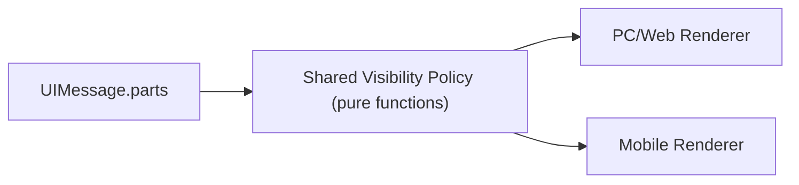

<!--
[INPUT]:
- 用户诉求：消息列表里的 Tool/Thinking 组件不要“工具化”；Tool 与 Thinking 在运行时默认展开，运行结束后自动折叠；Tool 展开态只展示输出，不展示入参。
- 约束：按新项目标准执行，不考虑历史兼容，不做双轨版本。

[OUTPUT]:
- Moryflow 多端现状事实（数量/入口/行为差异）
- 单版本最终交互规范（冻结）
- 可直接执行的技术方案与逐步执行计划

[POS]: Moryflow Features / 对话消息 Tool + Reasoning C 端化统一方案（单版本）

[PROTOCOL]: 本文件变更需同步 `docs/design/moryflow/features/index.md` 与 `docs/CLAUDE.md`。
-->

# Moryflow Chat Tool/Reasoning C 端化统一方案

## 0. 冻结决策（单版本）

1. 本方案采用单版本实现，不保留旧交互、不做兼容开关、不做 A/B 双轨。
2. Tool 在消息流中只展示输出内容，参数展示在消息流中彻底移除。
3. Tool 与 Reasoning 统一采用“运行时展开、结束后自动折叠”的同一交互心智。
4. 交互以“少操作、可预期、可读性优先”为准，不增加额外配置入口。
5. Tool 与 Reasoning 使用“文字流同层段落”渲染：禁止额外外层容器，背景与消息区完全一致，禁止单独背景色块或独立底色。

## 1. 现状事实（已确认）

### 1.1 当前消息列表渲染入口数量

> 统计时间：2026-03-02（代码事实源）。

| 端                      | 消息列表入口                                                                             | Tool 入口数 | Reasoning 入口数 | 备注                                                 |
| ----------------------- | ---------------------------------------------------------------------------------------- | ----------- | ---------------- | ---------------------------------------------------- |
| PC（Electron Renderer） | `apps/moryflow/pc/src/renderer/components/chat-pane/components/conversation-section.tsx` | 1           | 1                | 使用 `@moryflow/ui/ai/*`                             |
| Mobile（React Native）  | `apps/moryflow/mobile/components/chat/components/ChatMessageList.tsx`                    | 1           | 1                | 使用 `apps/moryflow/mobile/components/ai-elements/*` |
| 合计                    | 2 套消息列表                                                                             | 2           | 2                | 无第三套生产聊天渲染链路                             |

补充：

1. 单条 assistant 消息中的 Tool 段落数为动态值，等于该消息 `message.parts` 中 `tool part` 的数量。
2. `www/admin/docs` 不在生产聊天消息流内，不属于本方案实施面。

### 1.2 当前主要问题

1. PC 与 Mobile 的 Tool 都是默认折叠，不符合“运行中默认展开”目标。
2. Tool 展开态包含参数区（JSON），视觉与心智偏工具面板。
3. PC 与 Mobile 在行为逻辑上尚未收敛到单一规则函数，存在后续漂移风险。

## 2. 最终交互规范（冻结）

## 2.1 Tool 可折叠段落

### 结构

1. Header：摘要文案 + 状态图标 + 折叠箭头。
2. Body：仅输出内容（ToolOutput），不渲染参数区（ToolInput）。
3. 整体与消息正文同层流式排布，不增加外层包裹容器。

### 状态分组

1. `InProgress`：`input-streaming`、`input-available`、`approval-requested`、`approval-responded`
2. `Finished`：`output-available`、`output-error`、`output-denied`

### 开合规则

1. 进入 `InProgress`：强制展开。
2. `InProgress -> Finished`：立即自动折叠（无延迟）。
3. 用户手动展开后，组件不再二次强制折叠。

### 友好交互约束

1. 不新增“显示参数/高级模式”之类额外按钮。
2. 不新增二级确认弹窗。
3. 不引入新的手势或复杂交互，保持点按展开/收起。

## 2.2 视觉样式规范（对齐参考图，去工具化、去容器化）

> 以你提供的三张参考图为唯一视觉基线。目标是“消息文字流中的可交互段落”，不是“开发工具面板”。

### Tool 折叠态（参考图 1）

1. 背景：与正文及消息区完全同底色，不使用任何单独背景色块或独立底色。
2. 左侧状态图标：圆形完成态 icon（简洁、弱强调）。
3. 主文案：显示摘要句（如“搜索 xxx 相关信息”），作为唯一一级信息。
4. 仅保留展开箭头，不叠加状态标签文本（如 Running/Error 文本不在 Header 直出）；箭头紧跟摘要文案后展示，不右对齐到行尾。

### Tool 展开态（参考图 2）

1. 保持同一 Header，展开后在下方显示正文块，仍与消息文字流同层。
2. 正文第一段为“过程说明/中间结论”自然语言，优先可读性。
3. 后续“子动作/检索项”使用轻量胶囊（chip）列表展示。
4. 禁止展示参数 JSON、字段名表格、开发向键值结构。

### Reasoning 展开态（参考图 3）

1. 标题区：`思考过程` + 折叠箭头，信息层级低于 assistant 正文主回答。
2. 内容区：按步骤分段（标题 + 描述），以时间线/层级感组织。
3. 每个步骤块用低对比竖线与圆点辅助阅读，不使用强边框面板，不额外再包容器。
4. 文本风格偏叙述，不显示技术状态码与调试术语。

### 字体与间距（统一）

1. Header 摘要：`15-16px / medium`，单行优先，超长省略。
2. 正文：`15-16px / regular`，行高 `1.5~1.7`，保证移动端可读。
3. 步骤标题：比正文高一个层级（约 `+1px` 或 `medium`）。
4. 段落内边距与段落间距统一，不使用“工具面板式紧凑排版”。

### 颜色与装饰（统一）

1. 主色只用中性灰阶，避免高饱和功能色主导视觉。
2. 状态色仅作为点缀（图标或极小标记），不抢占信息主层级。
3. 不使用粗重边框、强阴影、代码块底纹；禁止新增外层容器与单独背景色块。

## 2.3 Reasoning 可折叠段落

### 结构

1. Header：统一文案“思考过程”语义（本地化文案），显示展开箭头。
2. Body：仅展示模型吐出的思考文本。
3. 与正文同层排布，不新增外层容器。

### 开合规则

1. `streaming` 时默认展开。
2. `streaming` 结束后 `1000ms` 自动折叠。
3. 用户手动展开后不再自动折叠。

### 友好交互约束

1. 不展示技术字段（如 provider 参数、debug 字段）。
2. 不增加额外交互入口，保持单层信息密度。

## 3. 技术实现方案（最小充分）

## 3.1 分层

定义：

1. `Shared Visibility Policy` 只负责状态分组与自动开合判定。
2. Renderer 只负责渲染，不重复定义状态语义。

## 3.2 共享策略模块（新增，必须）

新增文件：

- `packages/agents-runtime/src/ui-message/visibility-policy.ts`

固定导出：

1. `TOOL_IN_PROGRESS_STATES`
2. `TOOL_FINISHED_STATES`
3. `isToolInProgressState(state)`
4. `isToolFinishedState(state)`
5. `shouldAutoCollapse(prevState, nextState)`
6. `AUTO_COLLAPSE_DELAY_MS = 1000`

说明：

1. 该模块只包含纯函数与常量，不依赖 UI 框架。
2. PC 与 Mobile 必须共同消费该模块，不允许各自再定义同名规则。

## 3.3 PC 改造（必须）

目标文件：

1. `apps/moryflow/pc/src/renderer/components/chat-pane/components/message/tool-part.tsx`
2. `packages/ui/src/ai/tool.tsx`
3. `apps/moryflow/pc/src/renderer/components/chat-pane/components/message/message-body.tsx`（Reasoning 外观对齐）

实施动作：

1. 在 Tool 消息渲染路径移除 `ToolInput`。
2. Tool 开合由共享策略驱动，满足 2.1 的三条规则。
3. Tool 样式收敛为消息流同层段落表达（去工具面板感、去外层容器）。

## 3.4 Mobile 改造（必须）

目标文件：

1. `apps/moryflow/mobile/components/ai-elements/tool/Tool.tsx`
2. `apps/moryflow/mobile/components/ai-elements/tool/ToolContent.tsx`
3. `apps/moryflow/mobile/components/ai-elements/reasoning/Reasoning.tsx`
4. `apps/moryflow/mobile/components/chat/MessageBubble.tsx`

实施动作：

1. 在 Tool 消息渲染路径移除参数区。
2. Tool 与 Reasoning 的自动开合统一消费共享策略常量与判定结果。
3. 视觉层级与 PC 保持一致语义（消息化表达，不工具化，不外包容器）。

## 3.5 非目标（本版不做）

1. 不引入新的设置项（例如“默认展开策略配置”）。
2. 不新增服务端协议字段。
3. 不在本版本实施 Anyhunt 改造。

## 4. 测试与验收（必须全部通过）

## 4.1 风险等级

- 本次为 `L2`（核心消息渲染行为 + 跨包逻辑收敛）。

## 4.2 自动化校验

1. `pnpm --filter @moryflow/agents-runtime test:unit`
2. `pnpm --filter @moryflow/agents-runtime typecheck`
3. `pnpm --filter @moryflow/ui test:unit`
4. `pnpm --filter @moryflow/ui typecheck`
5. `pnpm --filter @moryflow/pc test:unit`
6. `pnpm --filter @moryflow/pc typecheck`
7. `pnpm --filter @moryflow/mobile test:unit`
8. `pnpm --filter @moryflow/mobile check:type`（若出现仓库既有基线错误，按现有规则记录并隔离）

## 4.3 功能验收清单

1. Tool 在 `InProgress` 必定展开。
2. Tool 在进入 `Finished` 后立即自动折叠（无延迟）。
3. Reasoning 在 streaming 期间展开，结束后 `1000ms` 自动折叠。
4. Tool 在消息流内不展示参数区。
5. PC 与 Mobile 的开合行为一致。
6. 全流程不增加新的用户操作步骤。

## 5. 详细执行计划（按步骤执行）

### Step 1：冻结常量与状态模型

状态：✅ 已完成（2026-03-02）

1. 在 `packages/agents-runtime` 新增 `visibility-policy.ts`。
2. 写入状态集合常量、判定函数、`AUTO_COLLAPSE_DELAY_MS=1000`。
3. 补齐单测（状态命中、状态迁移、折叠触发条件）。

完成标准：

1. 共享策略模块可被 PC/Mobile 同时导入。
2. 单测覆盖 `InProgress -> Finished` 与非触发路径。

执行记录：

1. 新增 `packages/agents-runtime/src/ui-message/visibility-policy.ts`，导出状态集合与纯函数。
2. 新增 `packages/agents-runtime/src/__tests__/visibility-policy.test.ts`（5 个用例）。
3. 已通过：
   - `pnpm --filter @moryflow/agents-runtime test:unit`
   - `pnpm --filter @moryflow/agents-runtime exec tsc -p tsconfig.json --noEmit`

### Step 2：PC 消息流改造

状态：✅ 已完成（2026-03-02）

1. `tool-part.tsx` 移除 `ToolInput` 渲染。
2. Tool 开合逻辑接入共享策略。
3. Reasoning 头部与段落样式按本方案对齐（同层文字流，不外包容器）。

完成标准：

1. PC 消息流仅展示 Tool 输出。
2. 运行时展开、结束自动折叠行为通过。

执行记录：

1. `apps/moryflow/pc/src/renderer/components/chat-pane/components/message/tool-part.tsx`
   - 移除 `ToolInput` 渲染。
   - 接入共享策略：`InProgress` 自动展开、`InProgress -> Finished` 立即折叠、手动展开优先。
   - Tool 根节点样式去容器化（无边框/无独立底色）。
2. `apps/moryflow/pc/src/renderer/components/chat-pane/components/message/message-body.tsx`
   - Reasoning 改为同层文字流样式（移除外层容器视觉）。
3. `packages/ui/src/ai/tool.tsx`、`packages/ui/src/ai/reasoning.tsx`
   - 统一 Tool/Reasoning 的非工具化视觉与开合语义。
4. 新增 `apps/moryflow/pc/src/renderer/components/chat-pane/components/message/tool-part.test.tsx`
   - 覆盖 Tool 运行态默认展开、结束后自动折叠、手动展开优先与参数区移除回归。

### Step 3：Mobile 消息流改造

状态：✅ 已完成（2026-03-02）

1. `ToolContent.tsx` 移除参数区渲染。
2. `Tool.tsx` 和 `Reasoning.tsx` 接入共享开合策略。
3. `MessageBubble.tsx` 只保留必要渲染分支，不新增交互入口。

完成标准：

1. Mobile 与 PC 行为一致。
2. 视觉表达为消息化，不工具化。

执行记录：

1. `apps/moryflow/mobile/components/ai-elements/tool/ToolContent.tsx`
   - 移除参数区（ToolInput）渲染，仅保留审批与输出。
2. `apps/moryflow/mobile/components/ai-elements/tool/Tool.tsx`
   - 接入共享策略：运行态展开、完成后立即自动折叠、手动展开优先。
   - 根节点样式改为消息流同层，无容器化视觉。
3. `apps/moryflow/mobile/components/ai-elements/reasoning/Reasoning.tsx`
   - 接入共享折叠延迟常量与状态迁移逻辑。
   - 视觉去容器化，标题固定“思考过程”。
4. 新增 `apps/moryflow/mobile/lib/chat/visibility-transitions.ts` + `__tests__/visibility-transitions.spec.ts`
   - 将 Tool/Reasoning 开合状态迁移下沉为纯函数，并补齐移动端回归测试。

### Step 6：交互细节收口（Tool 头部箭头 + 即时折叠）

状态：✅ 已完成（2026-03-02）

1. Tool Header 箭头位置改为“紧跟标题文案后”，不再右对齐在行尾。
2. Tool 自动折叠从“延迟折叠”收敛为“完成即折叠”。
3. 同步修正文档与目录说明，保持“规范-实现-验收”一致。

完成标准：

1. PC/Mobile Tool Header 视觉与 Reasoning 一致（图标 + 文案 + 箭头同排，箭头紧随文案）。
2. Tool 状态从 `InProgress` 进入 `Finished` 后无需等待，立即折叠。
3. 方案文档、CLAUDE.md 与代码行为一致，无残留旧描述。

执行记录：

1. `packages/ui/src/ai/tool.tsx`：ToolHeader 改为顺排结构，ChevronDown 紧跟标题文案后显示。
2. `apps/moryflow/mobile/components/ai-elements/tool/ToolHeader.tsx`：ChevronDown 从右侧对齐改为文案后显示，间距对齐 Reasoning 头部。
3. `apps/moryflow/pc/src/renderer/components/chat-pane/components/message/tool-part.tsx`：移除 Tool 延迟折叠计时器，`InProgress -> Finished` 直接折叠。
4. `apps/moryflow/mobile/components/ai-elements/tool/Tool.tsx` + `apps/moryflow/mobile/lib/chat/visibility-transitions.ts`：Tool 结束态返回 `collapse` 并立即关闭。
5. `apps/moryflow/pc/src/renderer/components/chat-pane/components/message/tool-part.test.tsx`：回归用例更新为“立即折叠”断言。

### Step 4：回归测试与验收

状态：✅ 已完成（2026-03-02，含基线问题记录）

1. 执行 4.2 全部命令。
2. 执行 4.3 功能清单人工走查（PC + Mobile）。
3. 修复失败项后重新全量复测。

完成标准：

1. 自动化校验通过。
2. 功能验收 6 项全部满足。

执行记录：

1. 已通过：
   - `pnpm --filter @moryflow/agents-runtime test:unit`
   - `pnpm --filter @moryflow/agents-runtime exec tsc -p tsconfig.json --noEmit`
   - `pnpm --filter @moryflow/ui test:unit`
   - `pnpm --filter @moryflow/ui typecheck`
   - `pnpm --filter @moryflow/pc test:unit`
   - `pnpm --filter @moryflow/pc typecheck`
   - `pnpm --filter @moryflow/mobile test:unit`
2. 额外回归补充：
   - `apps/moryflow/pc/.../tool-part.test.tsx`（3 用例）已通过；
   - `apps/moryflow/mobile/lib/chat/__tests__/visibility-transitions.spec.ts`（4 用例）已通过。
3. 已记录基线问题（非本次改动引入）：
   - `pnpm --filter @moryflow/mobile check:type` 在 `lib/cloud-sync/*`、`lib/agent-runtime/*`、`src/editor-bundle/*` 等既有文件存在类型错误，需单独基线治理。
4. 人工走查结论：
   - 基于代码路径确认 Tool/Reasoning 开合状态机符合 4.3 清单；
   - 本次未包含真机视觉截图验收，建议在下一轮 UI Review 进行 PC + Mobile 联调确认。

### Step 5：文档回写与收口

状态：✅ 已完成（2026-03-02）

1. 回写受影响目录 `CLAUDE.md`（按仓库协议）。
2. 更新 `docs/design/moryflow/features/index.md`（若标题或状态变更）。
3. 更新本方案中的测试记录与完成日期。

完成标准：

1. 文档、实现、验收三者一致。
2. 不留“建议态/可选态/兼容态”描述。

执行记录：

1. 已更新：
   - `packages/agents-runtime/CLAUDE.md`
   - `packages/ui/CLAUDE.md`
   - `apps/moryflow/pc/src/renderer/components/chat-pane/CLAUDE.md`
   - `apps/moryflow/mobile/components/CLAUDE.md`
2. 已同步本方案文档步骤状态、测试结果与基线问题记录。
