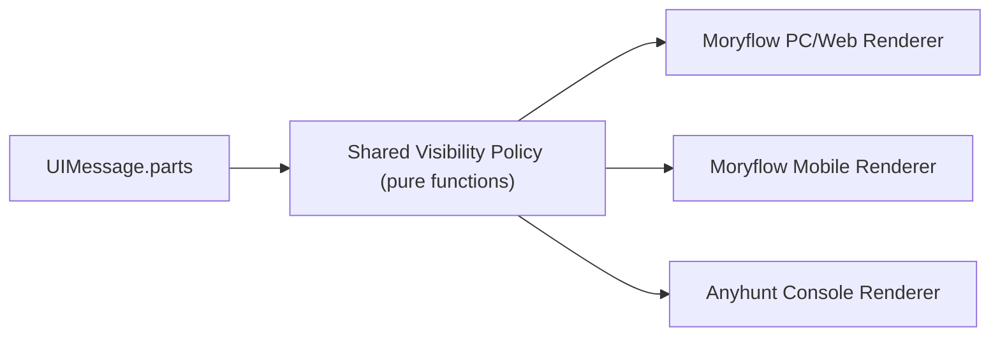

<!--
[INPUT]:
- 用户诉求：消息列表里的 Tool/Thinking 组件不要“工具化”；Tool 与 Thinking 在运行时默认展开，运行结束后自动折叠；Tool 展开态只展示输出，不展示入参。
- 统一诉求：Anyhunt 与 Moryflow 的 chat 渲染优先共用一套实现，禁止重复维护状态语义与交互规则。
- 约束：按新项目标准执行，不考虑历史兼容，不做双轨版本。

[OUTPUT]:
- 双业务线多端现状事实（数量/入口/行为差异）
- 单版本最终交互规范（冻结）
- 可直接执行的技术方案与逐步执行计划

[POS]: Moryflow Features / 对话消息 Tool + Reasoning C 端化统一方案（单版本，跨业务线）

[PROTOCOL]: 本文件变更需同步 `docs/design/moryflow/features/index.md` 与 `docs/CLAUDE.md`。
-->

# Chat Tool/Reasoning C 端化统一方案（Moryflow + Anyhunt）

## 0. 冻结决策（单版本）

1. 本方案采用单版本实现，不保留旧交互、不做兼容开关、不做 A/B 双轨。
2. Tool 在消息流中只展示输出内容，参数展示在消息流中彻底移除。
3. Tool 与 Reasoning 统一采用“运行时展开、结束后自动折叠”的同一交互心智。
4. 交互以“少操作、可预期、可读性优先”为准，不增加额外配置入口。
5. Tool 与 Reasoning 使用“文字流同层段落”渲染：禁止额外外层容器，背景与消息区完全一致，禁止单独背景色块或独立底色。

## 1. 现状事实（已确认）

### 1.1 当前消息列表渲染入口数量

> 统计时间：2026-03-02（代码事实源）。

| 端                      | 消息列表入口                                                                                                        | Tool 入口数 | Reasoning 入口数 | 备注                                                 |
| ----------------------- | ------------------------------------------------------------------------------------------------------------------- | ----------- | ---------------- | ---------------------------------------------------- |
| Moryflow PC（Electron） | `apps/moryflow/pc/src/renderer/components/chat-pane/components/conversation-section.tsx`                            | 1           | 1                | 使用 `@moryflow/ui/ai/*`                             |
| Moryflow Mobile（RN）   | `apps/moryflow/mobile/components/chat/components/ChatMessageList.tsx`                                               | 1           | 1                | 使用 `apps/moryflow/mobile/components/ai-elements/*` |
| Anyhunt Console（Web）  | `apps/anyhunt/console/src/features/agent-browser-playground/components/AgentMessageList/components/message-row.tsx` | 1           | 1                | Tool 存在本地重复状态策略                            |
| 合计                    | 3 套消息列表                                                                                                        | 3           | 3                | 三端均在生产链路                                     |

补充：

1. 单条 assistant 消息中的 Tool 段落数为动态值，等于该消息 `message.parts` 中 `tool part` 的数量。
2. `www/admin/docs` 不在生产聊天消息流内，不属于本方案实施面。

### 1.2 当前主要问题

1. PC 与 Mobile 的 Tool 都是默认折叠，不符合“运行中默认展开”目标。
2. Tool 展开态包含参数区（JSON），视觉与心智偏工具面板。
3. PC 与 Mobile 在行为逻辑上尚未收敛到单一规则函数，存在后续漂移风险。
4. Anyhunt Console 已出现本地重复状态分组/折叠策略定义，与共享策略存在漂移风险。

## 2. 最终交互规范（冻结）

## 2.1 Tool 可折叠段落

### 结构

1. Header：摘要文案 + 状态图标 + 折叠箭头。
2. Body：仅输出内容（ToolOutput），不渲染参数区（ToolInput）。
3. 整体与消息正文同层流式排布，不增加外层包裹容器。

### 状态分组

1. `InProgress`：`input-streaming`、`input-available`、`approval-requested`、`approval-responded`
2. `Finished`：`output-available`、`output-error`、`output-denied`

### 开合规则

1. 进入 `InProgress`：强制展开。
2. `InProgress -> Finished`：立即自动折叠（无延迟）。
3. 用户手动展开后，组件不再二次强制折叠。

### 友好交互约束

1. 不新增“显示参数/高级模式”之类额外按钮。
2. 不新增二级确认弹窗。
3. 不引入新的手势或复杂交互，保持点按展开/收起。

## 2.2 视觉样式规范（对齐参考图，去工具化、去容器化）

> 以你提供的三张参考图为唯一视觉基线。目标是“消息文字流中的可交互段落”，不是“开发工具面板”。

### Tool 折叠态（参考图 1）

1. 背景：与正文及消息区完全同底色，不使用任何单独背景色块或独立底色。
2. 左侧状态图标：圆形完成态 icon（简洁、弱强调）。
3. 主文案：显示摘要句（如“搜索 xxx 相关信息”），作为唯一一级信息。
4. 仅保留展开箭头，不叠加状态标签文本（如 Running/Error 文本不在 Header 直出）；箭头紧跟摘要文案后展示，不右对齐到行尾。

### Tool 展开态（参考图 2）

1. 保持同一 Header，展开后在下方显示正文块，仍与消息文字流同层。
2. 正文第一段为“过程说明/中间结论”自然语言，优先可读性。
3. 后续“子动作/检索项”使用轻量胶囊（chip）列表展示。
4. 禁止展示参数 JSON、字段名表格、开发向键值结构。

### Reasoning 展开态（参考图 3）

1. 标题区：`思考过程` + 折叠箭头，信息层级低于 assistant 正文主回答。
2. 内容区：按步骤分段（标题 + 描述），以时间线/层级感组织。
3. 每个步骤块用低对比竖线与圆点辅助阅读，不使用强边框面板，不额外再包容器。
4. 文本风格偏叙述，不显示技术状态码与调试术语。

### 字体与间距（统一）

1. Header 摘要：`15-16px / medium`，单行优先，超长省略。
2. 正文：`15-16px / regular`，行高 `1.5~1.7`，保证移动端可读。
3. 步骤标题：比正文高一个层级（约 `+1px` 或 `medium`）。
4. 段落内边距与段落间距统一，不使用“工具面板式紧凑排版”。

### 颜色与装饰（统一）

1. 主色只用中性灰阶，避免高饱和功能色主导视觉。
2. 状态色仅作为点缀（图标或极小标记），不抢占信息主层级。
3. 不使用粗重边框、强阴影、代码块底纹；禁止新增外层容器与单独背景色块。

## 2.3 Reasoning 可折叠段落

### 结构

1. Header：统一文案“思考过程”语义（本地化文案），显示展开箭头。
2. Body：仅展示模型吐出的思考文本。
3. 与正文同层排布，不新增外层容器。

### 开合规则

1. `streaming` 时默认展开。
2. `streaming` 结束后立即自动折叠（无延迟）。
3. 用户手动展开后不再自动折叠。

### 友好交互约束

1. 不展示技术字段（如 provider 参数、debug 字段）。
2. 不增加额外交互入口，保持单层信息密度。

## 3. 技术实现方案（最小充分）

## 3.1 分层

```mermaid
flowchart LR
  A["UIMessage.parts"] --> B["Shared Visibility Policy (pure functions)"]
  B --> C["Moryflow PC/Web Renderer"]
  B --> D["Moryflow Mobile Renderer"]
  B --> E["Anyhunt Console Renderer"]
```

定义：

1. `Shared Visibility Policy` 只负责状态分组与自动开合判定。
2. Renderer 只负责渲染，不重复定义状态语义。

## 3.2 共享策略模块（新增，必须）

新增文件：

- `packages/agents-runtime/src/ui-message/visibility-policy.ts`

固定导出：

1. `TOOL_IN_PROGRESS_STATES`
2. `TOOL_FINISHED_STATES`
3. `isToolInProgressState(state)`
4. `isToolFinishedState(state)`
5. `shouldAutoCollapse(prevState, nextState)`

说明：

1. 该模块只包含纯函数与常量，不依赖 UI 框架。
2. Moryflow PC/Mobile 与 Anyhunt Console 必须共同消费该模块，不允许各端再定义同名规则。

## 3.3 PC 改造（必须）

目标文件：

1. `apps/moryflow/pc/src/renderer/components/chat-pane/components/message/tool-part.tsx`
2. `packages/ui/src/ai/tool.tsx`
3. `apps/moryflow/pc/src/renderer/components/chat-pane/components/message/message-body.tsx`（Reasoning 外观对齐）

实施动作：

1. 在 Tool 消息渲染路径移除 `ToolInput`。
2. Tool 开合由共享策略驱动，满足 2.1 的三条规则。
3. Tool 样式收敛为消息流同层段落表达（去工具面板感、去外层容器）。

## 3.4 Mobile 改造（必须）

目标文件：

1. `apps/moryflow/mobile/components/ai-elements/tool/Tool.tsx`
2. `apps/moryflow/mobile/components/ai-elements/tool/ToolContent.tsx`
3. `apps/moryflow/mobile/components/ai-elements/reasoning/Reasoning.tsx`
4. `apps/moryflow/mobile/components/chat/MessageBubble.tsx`

实施动作：

1. 在 Tool 消息渲染路径移除参数区。
2. Tool 与 Reasoning 的自动开合统一消费共享策略常量与判定结果。
3. 视觉层级与 PC 保持一致语义（消息化表达，不工具化，不外包容器）。

## 3.5 非目标（本版不做）

1. 不引入新的设置项（例如“默认展开策略配置”）。
2. 不新增服务端协议字段。
3. 不强制 React Native 与 Web 共用同一个 UI 组件文件；仅要求复用同一状态语义与交互规则。

## 3.6 Anyhunt Console 改造（必须）

目标文件：

1. `apps/anyhunt/console/src/features/agent-browser-playground/components/AgentMessageList/components/message-tool.tsx`
2. `apps/anyhunt/console/src/features/agent-browser-playground/components/AgentMessageList/components/message-row.tsx`

实施动作：

1. Tool 状态分组与自动折叠改为直接复用 `@moryflow/agents-runtime/ui-message/visibility-policy`。
2. 删除 Anyhunt 本地重复状态策略（不再维护独立 `TOOL_IN_PROGRESS_STATES/shouldAutoCollapse`）。
3. 保持与 Moryflow 一致：Tool/Reasoning 运行时展开、结束后立即折叠；去容器化消息流视觉。

## 4. 测试与验收（必须全部通过）

## 4.1 风险等级

- 本次为 `L2`（核心消息渲染行为 + 跨包逻辑收敛）。

## 4.2 自动化校验

1. `pnpm --filter @moryflow/agents-runtime test:unit`
2. `pnpm --filter @moryflow/agents-runtime typecheck`
3. `pnpm --filter @moryflow/ui test:unit`
4. `pnpm --filter @moryflow/ui typecheck`
5. `pnpm --filter @moryflow/pc test:unit`
6. `pnpm --filter @moryflow/pc typecheck`
7. `pnpm --filter @moryflow/mobile test:unit`
8. `pnpm --filter @moryflow/mobile check:type`（若出现仓库既有基线错误，按现有规则记录并隔离）
9. `pnpm --filter @anyhunt/console test`
10. `pnpm --filter @anyhunt/console typecheck`

## 4.3 功能验收清单

1. Tool 在 `InProgress` 必定展开。
2. Tool 在进入 `Finished` 后立即自动折叠（无延迟）。
3. Reasoning 在 streaming 期间展开，结束后立即自动折叠（无延迟）。
4. Tool 在消息流内不展示参数区。
5. Moryflow PC/Mobile 与 Anyhunt Console 的开合语义一致。
6. 全流程不增加新的用户操作步骤。

## 5. 详细执行计划（按步骤执行）

### Step 1：冻结常量与状态模型

状态：✅ 已完成（2026-03-02）

1. 在 `packages/agents-runtime` 新增 `visibility-policy.ts`。
2. 写入状态集合常量与判定函数（无延迟自动折叠语义）。
3. 补齐单测（状态命中、状态迁移、折叠触发条件）。

完成标准：

1. 共享策略模块可被 Moryflow PC/Mobile/Anyhunt 同时导入。
2. 单测覆盖 `InProgress -> Finished` 与非触发路径。

执行记录：

1. 新增 `packages/agents-runtime/src/ui-message/visibility-policy.ts`，导出状态集合与纯函数。
2. 新增 `packages/agents-runtime/src/__tests__/visibility-policy.test.ts`（5 个用例）。
3. 已通过：
   - `pnpm --filter @moryflow/agents-runtime test:unit`
   - `pnpm --filter @moryflow/agents-runtime exec tsc -p tsconfig.json --noEmit`

### Step 2：PC 消息流改造

状态：✅ 已完成（2026-03-02）

1. `tool-part.tsx` 移除 `ToolInput` 渲染。
2. Tool 开合逻辑接入共享策略。
3. Reasoning 头部与段落样式按本方案对齐（同层文字流，不外包容器）。

完成标准：

1. PC 消息流仅展示 Tool 输出。
2. 运行时展开、结束自动折叠行为通过。

执行记录：

1. `apps/moryflow/pc/src/renderer/components/chat-pane/components/message/tool-part.tsx`
   - 移除 `ToolInput` 渲染。
   - 接入共享策略：`InProgress` 自动展开、`InProgress -> Finished` 立即折叠、手动展开优先。
   - Tool 根节点样式去容器化（无边框/无独立底色）。
2. `apps/moryflow/pc/src/renderer/components/chat-pane/components/message/message-body.tsx`
   - Reasoning 改为同层文字流样式（移除外层容器视觉）。
3. `packages/ui/src/ai/tool.tsx`、`packages/ui/src/ai/reasoning.tsx`
   - 统一 Tool/Reasoning 的非工具化视觉与开合语义。
4. 新增 `apps/moryflow/pc/src/renderer/components/chat-pane/components/message/tool-part.test.tsx`
   - 覆盖 Tool 运行态默认展开、结束后自动折叠、手动展开优先与参数区移除回归。

### Step 3：Mobile 消息流改造

状态：✅ 已完成（2026-03-02）

1. `ToolContent.tsx` 移除参数区渲染。
2. `Tool.tsx` 和 `Reasoning.tsx` 接入共享开合策略。
3. `MessageBubble.tsx` 只保留必要渲染分支，不新增交互入口。

完成标准：

1. Mobile 与 PC 行为一致。
2. 视觉表达为消息化，不工具化。

执行记录：

1. `apps/moryflow/mobile/components/ai-elements/tool/ToolContent.tsx`
   - 移除参数区（ToolInput）渲染，仅保留审批与输出。
2. `apps/moryflow/mobile/components/ai-elements/tool/Tool.tsx`
   - 接入共享策略：运行态展开、完成后立即自动折叠、手动展开优先。
   - 根节点样式改为消息流同层，无容器化视觉。
3. `apps/moryflow/mobile/components/ai-elements/reasoning/Reasoning.tsx`
   - 接入共享状态迁移逻辑，streaming 结束后立即自动折叠（无延迟）。
   - 视觉去容器化，标题固定“思考过程”。
4. 新增 `apps/moryflow/mobile/lib/chat/visibility-transitions.ts` + `__tests__/visibility-transitions.spec.ts`
   - 该路径已在第二轮统一收口中删除，移动端改为直接复用 `@moryflow/agents-runtime/ui-message/visibility-policy`。

### Step 6：交互细节收口（Tool/Reasoning 即时折叠）

状态：✅ 已完成（2026-03-02）

1. Tool Header 箭头位置改为“紧跟标题文案后”，不再右对齐在行尾。
2. Tool 与 Reasoning 自动折叠统一收敛为“完成即折叠（无延迟）”。
3. 同步修正文档与目录说明，保持“规范-实现-验收”一致。

完成标准：

1. PC/Mobile Tool Header 视觉与 Reasoning 一致（图标 + 文案 + 箭头同排，箭头紧随文案）。
2. Tool 状态从 `InProgress` 进入 `Finished` 后无需等待，立即折叠；Reasoning 结束 streaming 后同样立即折叠。
3. 方案文档、CLAUDE.md 与代码行为一致，无残留旧描述。

执行记录：

1. `packages/ui/src/ai/tool.tsx`：ToolHeader 改为顺排结构，ChevronDown 紧跟标题文案后显示。
2. `apps/moryflow/mobile/components/ai-elements/tool/ToolHeader.tsx`：ChevronDown 从右侧对齐改为文案后显示，间距对齐 Reasoning 头部。
3. `apps/moryflow/pc/src/renderer/components/chat-pane/components/message/tool-part.tsx`：移除 Tool 延迟折叠计时器，`InProgress -> Finished` 直接折叠。
4. `apps/moryflow/mobile/components/ai-elements/tool/Tool.tsx`：Tool 结束态立即关闭；第二轮统一收口后由共享策略函数直接驱动，不再依赖本地状态迁移模块。
5. `apps/moryflow/pc/src/renderer/components/chat-pane/components/message/tool-part.test.tsx`：回归用例更新为“立即折叠”断言。
6. `packages/ui/src/ai/reasoning.tsx` + `apps/moryflow/mobile/components/ai-elements/reasoning/Reasoning.tsx`：Reasoning 从延迟折叠改为结束即折叠。

### Step 7：Anyhunt 复用收口（禁止重复维护状态策略）

状态：✅ 已完成（2026-03-02）

1. Anyhunt Tool 渲染移除本地 `TOOL_IN_PROGRESS_STATES/shouldAutoCollapse`。
2. 直接复用 `@moryflow/agents-runtime/ui-message/visibility-policy`。
3. 补充回归测试，确保 `InProgress -> Finished` 立即折叠保持不变。

完成标准：

1. Anyhunt 不再维护独立 Tool 状态分组逻辑。
2. Moryflow 与 Anyhunt 在 Tool/Reasoning 开合语义上完全一致。
3. Anyhunt 相关单测通过。

执行记录：

1. `apps/anyhunt/console/src/features/agent-browser-playground/components/AgentMessageList/components/message-tool.tsx`
   - 删除本地 `TOOL_IN_PROGRESS_STATES` 与 `shouldAutoCollapse` 实现。
   - 直接复用 `@moryflow/agents-runtime/ui-message/visibility-policy` 的状态判定函数。
   - 删除与 `@moryflow/ui/ai/tool` 默认值重复的本地状态/输出文案常量。
2. `apps/anyhunt/console/src/features/agent-browser-playground/components/AgentMessageList/components/message-row.tsx`
   - 移除与 `MessageAttachment` 默认值重复的本地附件 labels，复用 `@moryflow/ui/ai/message` 默认渲染语义。
3. `apps/anyhunt/console/vite.config.ts` + `apps/anyhunt/console/tsconfig.json`
   - 新增 `@moryflow/agents-runtime` 源码 alias（对齐现有 `@moryflow/ui/ai` 复用方式），确保 Console 端可直接消费共享策略源码且不新增锁文件噪音。
4. 回归通过：
   - `pnpm --filter @anyhunt/console test src/features/agent-browser-playground/components/AgentMessageList/components/message-tool.test.tsx`
   - `pnpm --filter @anyhunt/console typecheck`

### Step 4：回归测试与验收

状态：✅ 已完成（2026-03-02，含基线问题记录）

1. 执行 4.2 全部命令。
2. 执行 4.3 功能清单人工走查（Moryflow PC + Mobile + Anyhunt Console）。
3. 修复失败项后重新全量复测。

完成标准：

1. 自动化校验通过。
2. 功能验收 6 项全部满足。

执行记录：

1. 已通过：
   - `pnpm --filter @moryflow/agents-runtime test:unit`
   - `pnpm --filter @moryflow/agents-runtime exec tsc -p tsconfig.json --noEmit`
   - `pnpm --filter @moryflow/ui test:unit`
   - `pnpm --filter @moryflow/ui typecheck`
   - `pnpm --filter @moryflow/pc test:unit`
   - `pnpm --filter @moryflow/pc typecheck`
   - `pnpm --filter @moryflow/mobile test:unit`
   - `pnpm --filter @anyhunt/console test`
   - `pnpm --filter @anyhunt/console typecheck`
2. 额外回归补充：
   - `apps/moryflow/pc/.../tool-part.test.tsx`（3 用例）已通过；
   - 第二轮统一收口后移动端不再维护本地 `visibility-transitions` 单测，开合规则回归由共享模块 `packages/agents-runtime/src/__tests__/visibility-policy.test.ts` 统一覆盖。
3. 已记录基线问题（非本次改动引入）：
   - `pnpm --filter @moryflow/mobile check:type` 在 `lib/cloud-sync/*`、`lib/agent-runtime/*`、`src/editor-bundle/*` 等既有文件存在类型错误，需单独基线治理。
4. 人工走查结论：
   - 基于代码路径确认 Tool/Reasoning 开合状态机符合 4.3 清单；
   - 本次未包含真机视觉截图验收，建议在下一轮 UI Review 进行 Moryflow PC + Mobile + Anyhunt Console 联调确认。

### Step 5：文档回写与收口

状态：✅ 已完成（2026-03-02）

1. 回写受影响目录 `CLAUDE.md`（按仓库协议）。
2. 更新 `docs/design/moryflow/features/index.md`（若标题或状态变更）。
3. 更新本方案中的测试记录与完成日期。

完成标准：

1. 文档、实现、验收三者一致。
2. 不留“建议态/可选态/兼容态”描述。

执行记录：

1. 已更新：
   - `packages/agents-runtime/CLAUDE.md`
   - `apps/moryflow/pc/src/renderer/components/chat-pane/CLAUDE.md`
   - `apps/moryflow/mobile/components/CLAUDE.md`
   - `apps/moryflow/mobile/lib/CLAUDE.md`
   - `apps/moryflow/mobile/CLAUDE.md`
   - `apps/anyhunt/console/CLAUDE.md`
   - `apps/anyhunt/console/src/features/CLAUDE.md`
   - `apps/moryflow/admin/CLAUDE.md`
   - `apps/moryflow/pc/CLAUDE.md`
2. 已同步本方案文档步骤状态、测试结果与基线问题记录。

---

## 6. 第二轮统一收口（2026-03-02，执行中）

> 目标：把“可行”落成“已统一”。按新项目标准执行，不考虑历史兼容，不保留多套实现，不做过度设计。

### 6.1 新基线问题（已确认）

1. `apps/moryflow/admin/src/features/chat/*` 仍是独立文本流实现（`content: string`），未接入 `UIMessage.parts`，也未复用 `@moryflow/ui/ai/{message,tool,reasoning}`。
2. Tool/Reasoning 开合规则虽语义接近，但 PC、Anyhunt Console、Mobile 仍存在多处本地实现，长期有漂移风险。
3. “同一套组件和逻辑”尚未覆盖到 Moryflow Admin（Web），当前仅覆盖 Moryflow PC/Mobile + Anyhunt Console。

### 6.2 收口方案（冻结）

1. **协议统一**：Moryflow Admin chat 消息模型升级为 `UIMessage` + `parts`，不再使用 `content: string` 单字段。
2. **渲染统一**：Moryflow Admin 消息渲染改为复用 `@moryflow/ui/ai/message` 的 parts 渲染链路，并接入与 PC/Console 同语义的 Tool/Reasoning 展示。
3. **状态统一**：Tool/Reasoning 的展开/折叠语义统一沉淀到 `@moryflow/agents-runtime/ui-message/visibility-policy`，各端仅消费，不再本地定义同类状态机。
4. **视觉统一**：继续保持参考图定义的“文字流同层、无外层容器、无独立底色、箭头紧跟文案后”。
5. **交互统一**：运行态默认展开，完成后立即折叠（无延迟），用户手动展开优先。

### 6.3 分步骤执行计划（按此顺序）

#### Step 6-1：共享开合规则收口

状态：✅ 已完成（2026-03-02）

1. 在 `packages/agents-runtime/src/ui-message/visibility-policy.ts` 补齐 Tool/Reasoning 的“最终 open 判定纯函数”。
2. 覆盖单测：默认展开、完成折叠、手动展开优先。
3. 移除端侧重复判定工具函数（仅保留轻量适配层）。

完成标准：

1. Tool/Reasoning 开合核心规则只有一份事实源。
2. 共享模块单测通过。

执行记录：

1. `packages/agents-runtime/src/ui-message/visibility-policy.ts`
   - 新增 `resolveToolOpenState`、`resolveReasoningOpenState`。
2. `packages/agents-runtime/src/index.ts`
   - 导出上述两个共享判定函数。
3. `packages/agents-runtime/src/__tests__/visibility-policy.test.ts`
   - 新增两组回归用例：Tool/Reasoning 的默认展开与手动展开优先规则。
4. 校验通过：
   - `pnpm --filter @moryflow/agents-runtime test:unit`
   - `pnpm --filter @moryflow/agents-runtime exec tsc -p tsconfig.json --noEmit`

#### Step 6-2：PC + Anyhunt Console 对齐共享规则

状态：✅ 已完成（2026-03-02）

1. PC `tool-part.tsx` 改为只消费共享判定函数，移除本地状态迁移分叉。
2. Anyhunt Console `message-tool.tsx` 与 PC 使用同一判定路径。
3. 保持现有视觉（箭头位置、去容器化）不回退。

完成标准：

1. PC/Console Tool 行为与代码结构一致。
2. 对应回归测试通过。

执行记录：

1. `apps/moryflow/pc/src/renderer/components/chat-pane/components/message/tool-part.tsx`
   - 删除本地状态迁移 effect/ref 分叉，改为直接消费 `resolveToolOpenState`。
2. `apps/anyhunt/console/src/features/agent-browser-playground/components/AgentMessageList/components/message-tool.tsx`
   - 与 PC 统一到同一开合判定路径。
3. 校验通过：
   - `CI=1 pnpm --filter @moryflow/pc test:unit`
   - `pnpm --filter @moryflow/pc typecheck`
   - `pnpm --filter @anyhunt/console test`
   - `pnpm --filter @anyhunt/console typecheck`

#### Step 6-3：Mobile 对齐共享规则

状态：✅ 已完成（2026-03-02）

1. Mobile `visibility-transitions` 改为直接复用共享策略，不再维护独立规则实现。
2. Tool/Reasoning 组件只保留 RN 交互适配与样式，不维护业务语义。
3. 移动端回归测试更新为共享语义断言。

完成标准：

1. Mobile 与 PC/Console 在规则层零分叉。
2. 移动端单测通过。

执行记录：

1. `apps/moryflow/mobile/components/ai-elements/tool/Tool.tsx`
   - 删除本地状态迁移 effect/ref，实现改为共享判定 + 轻量交互适配。
2. `apps/moryflow/mobile/components/ai-elements/reasoning/Reasoning.tsx`
   - 改为消费 `resolveReasoningOpenState`，删除本地状态机分叉。
3. 删除重复规则文件：
   - `apps/moryflow/mobile/lib/chat/visibility-transitions.ts`
   - `apps/moryflow/mobile/lib/chat/__tests__/visibility-transitions.spec.ts`
4. 校验通过：
   - `pnpm --filter @moryflow/mobile test:unit`

#### Step 6-4：Moryflow Admin chat 接入统一链路

状态：✅ 已完成（2026-03-02）

1. `store.ts` 消息结构升级为 `UIMessage`（parts 模型）。
2. `methods.ts` 流式追加改为 parts 路径，不再直接拼接字符串。
3. `components/message.tsx` 改为复用 `@moryflow/ui/ai/message` + Tool/Reasoning 渲染组件。
4. `styles/globals.css` 接入 `@moryflow/ui/styles` 与 `@source`，保证共享组件样式可用。

完成标准：

1. Admin chat 与 PC/Console 走同一消息模型与渲染范式。
2. Tool/Reasoning 样式与交互与统一规范一致。

执行记录：

1. `apps/moryflow/admin/src/features/chat/store.ts`
   - 消息模型升级为 `UIMessage & { role: 'user' | 'assistant' }`，流式追加改为 `parts` 语义。
2. `apps/moryflow/admin/src/features/chat/methods.ts`
   - 请求映射改为从 `parts` 取文本；assistant 消息改为 `parts: []` 启动流式渲染。
3. `apps/moryflow/admin/src/features/chat/components/message.tsx`
   - 复用 `@moryflow/ui/ai/message` + `@moryflow/ui/ai/reasoning` + Tool 渲染链路。
4. 新增 `apps/moryflow/admin/src/features/chat/components/message-tool.tsx`
   - Tool 去参数区，运行中默认展开，完成后自动折叠。
5. 新增回归：`apps/moryflow/admin/src/features/chat/components/message-tool.test.tsx`（2 用例）。
6. `apps/moryflow/admin/src/styles/globals.css`
   - 接入 `@moryflow/ui/styles` 与 `@source`。
7. Admin 构建与测试解析配置收口：
   - `apps/moryflow/admin/package.json`（新增 `@moryflow/ui`、`@moryflow/agents-runtime`）
   - `apps/moryflow/admin/vite.config.ts`
   - `apps/moryflow/admin/vitest.config.ts`
   - `apps/moryflow/admin/tsconfig.app.json`
8. 校验通过：
   - `pnpm --filter @moryflow/admin test:unit`
   - `pnpm --filter @moryflow/admin typecheck`

#### Step 6-5：测试与验收收口

状态：✅ 已完成（2026-03-02，含基线问题记录）

1. 执行受影响包 `test:unit + typecheck`。
2. 人工走查 Moryflow PC/Mobile/Admin + Anyhunt Console 的 Tool/Reasoning 关键链路。
3. 回写本方案进度与受影响 `CLAUDE.md`。

完成标准：

1. 自动化校验通过或基线问题已明确隔离记录。
2. 本节所有步骤状态更新为 ✅，并附执行记录。

执行记录：

1. 已通过：
   - `pnpm --filter @moryflow/agents-runtime test:unit`
   - `pnpm --filter @moryflow/agents-runtime exec tsc -p tsconfig.json --noEmit`
   - `CI=1 pnpm --filter @moryflow/pc test:unit`
   - `pnpm --filter @moryflow/pc typecheck`
   - `pnpm --filter @anyhunt/console test`
   - `pnpm --filter @anyhunt/console typecheck`
   - `pnpm --filter @moryflow/admin test:unit`
   - `pnpm --filter @moryflow/admin typecheck`
   - `pnpm --filter @moryflow/mobile test:unit`
2. 基线问题（非本次改动引入）：
   - `pnpm --filter @moryflow/mobile check:type` 仍存在既有类型错误（cloud-sync / agent-runtime / editor-bundle 等历史模块），与本次 Tool/Reasoning 改造无直接耦合，需单独基线治理。
3. 受影响解析配置同步：
   - `apps/moryflow/pc/electron.vite.config.ts`
   - `apps/moryflow/pc/vitest.config.ts`
   - `apps/moryflow/pc/tsconfig.json`
   - `apps/anyhunt/console/tsconfig.app.json`
   - `apps/moryflow/mobile/tsconfig.json`
4. 受影响目录文档已回写：
   - `packages/agents-runtime/CLAUDE.md`
   - `apps/moryflow/pc/CLAUDE.md`
   - `apps/moryflow/pc/src/renderer/components/chat-pane/CLAUDE.md`
   - `apps/moryflow/mobile/CLAUDE.md`
   - `apps/moryflow/mobile/components/CLAUDE.md`
   - `apps/moryflow/mobile/lib/CLAUDE.md`
   - `apps/anyhunt/console/CLAUDE.md`
   - `apps/anyhunt/console/src/features/CLAUDE.md`
   - `apps/moryflow/admin/CLAUDE.md`

---

## 7. Review 问题收口（2026-03-02，已完成）

> 来源：本分支全量 Code Review（3 条新增 finding）。目标：以单版本事实源一次性根治，不做局部补丁。

### 7.1 问题清单（已确认）

1. `P1`：Admin 空 assistant 占位在非运行态仍会显示 `Thinking` loader，形成“假运行”。
2. `P2`：Admin `toChatCompletionMessages` 仅拼接 text part，且未显式过滤空消息，导致请求历史可能包含空 assistant。
3. `P3`：Admin chat 仍有硬编码文案，且 Admin 端未接入统一 i18n 基础设施，存在持续新增硬编码风险。

### 7.2 根因与冻结方案

1. **P1 根因**：缺少“assistant 占位消息可见性”统一事实源，渲染层把“空消息”与“运行态占位”混用。  
   **方案**：抽离共享纯函数 `assistant-placeholder-policy`（`packages/agents-runtime`），PC/Admin/Anyhunt 同步复用；Admin 同时在 methods 层做占位生命周期清理（结束后删除空占位）。
2. **P2 根因**：UIMessage(parts) 到 text-only API 的协议转换未显式建模，导致空消息与非文本消息处理不透明。  
   **方案**：新增独立 `request-message-mapper`，明确“text-only 传输契约”，统一做消息序列化与空内容过滤；methods 仅编排。
3. **P3 根因**：Admin 缺少 i18n Provider + language detector 基础层，chat 文案无法系统性约束。  
   **方案**：Admin 接入 `@moryflow/i18n` 基础设施（provider/detector/index），chat 组件全部改为 `useTranslation('chat')`，不保留硬编码。

### 7.3 分步骤执行计划（按顺序）

#### Step 7-1：接入 Admin i18n 基础设施 + chat 文案去硬编码

状态：✅ 已完成（2026-03-02）

1. 新增 `apps/moryflow/admin/src/lib/i18n/{index.ts,provider.tsx,language-detector.ts}`。
2. `main.tsx` 挂载 `I18nProvider`，`package.json` 增加 `@moryflow/i18n`（及必要运行依赖）。
3. `features/chat/components/*` 全量改为 `useTranslation('chat')`，移除硬编码文案。

完成标准：

1. Admin chat 用户可见文案不再硬编码。
2. i18n 能在 Admin 全局可用，后续模块可直接复用。

执行记录：

1. 新增 Admin i18n 基础层：
   - `apps/moryflow/admin/src/lib/i18n/index.ts`
   - `apps/moryflow/admin/src/lib/i18n/provider.tsx`
   - `apps/moryflow/admin/src/lib/i18n/language-detector.ts`
2. `apps/moryflow/admin/src/main.tsx` 已挂载 `I18nProvider`，确保全局翻译上下文可用。
3. `apps/moryflow/admin/package.json` 新增 `@moryflow/i18n` 与 `react-i18next` 运行依赖。
4. Chat 组件文案改造完成（`useTranslation('chat')`）：
   - `chat-header.tsx`
   - `conversation-section.tsx`
   - `chat-footer.tsx`
   - `model-selector.tsx`
   - `message.tsx`
5. 校验通过：
   - `pnpm --filter @moryflow/admin typecheck`

#### Step 7-2：占位消息策略共享化（修复 P1）

状态：✅ 已完成（2026-03-02）

1. 在 `packages/agents-runtime` 新增 `ui-message/assistant-placeholder-policy.ts` 与单测。
2. PC `message-loading.ts` 改为复用共享策略（消除重复事实源）。
3. Admin/Anyhunt 消息渲染改为消费共享策略，非运行态空 assistant 不再显示 loader。
4. Admin methods 增加 stream 结束后的空占位清理（生命周期收口）。

完成标准：

1. `Thinking` loader 仅在“运行态最后一条空 assistant”出现。
2. 运行结束后不会残留空占位消息。

执行记录：

1. 新增共享策略模块与单测：
   - `packages/agents-runtime/src/ui-message/assistant-placeholder-policy.ts`
   - `packages/agents-runtime/src/__tests__/assistant-placeholder-policy.test.ts`
   - `packages/agents-runtime/src/index.ts` 已导出策略函数。
2. PC 侧本地判定实现已删除，改为直接复用共享策略：
   - `apps/moryflow/pc/src/renderer/components/chat-pane/components/message/message-loading.ts`
3. Admin 渲染层接入共享策略，空 assistant 在非运行态不再显示 loader：
   - `apps/moryflow/admin/src/features/chat/components/message.tsx`
   - `apps/moryflow/admin/src/features/chat/components/conversation-section.tsx`
4. Anyhunt 渲染层同步接入共享策略，清除同类风险：
   - `apps/anyhunt/console/src/features/agent-browser-playground/components/AgentMessageList/components/message-row.tsx`
   - `apps/anyhunt/console/src/features/agent-browser-playground/components/AgentMessageList/AgentMessageList.tsx`
5. Admin methods 增加 assistant 占位生命周期收口（结束时清理空占位）：
   - `apps/moryflow/admin/src/features/chat/methods.ts`
   - `apps/moryflow/admin/src/features/chat/store.ts`（新增 `removeMessage`）。
6. 校验通过：
   - `pnpm --filter @moryflow/agents-runtime test:unit src/__tests__/assistant-placeholder-policy.test.ts`
   - `pnpm --filter @moryflow/admin typecheck`
   - `pnpm --filter @moryflow/pc test:unit src/renderer/components/chat-pane/components/message/message-loading.test.ts`
   - `pnpm --filter @anyhunt/console typecheck`

#### Step 7-3：请求序列化映射收口（修复 P2）

状态：✅ 已完成（2026-03-02）

1. 新增 `apps/moryflow/admin/src/features/chat/request-message-mapper.ts`（纯函数）。
2. 将 `toChatCompletionMessages` 从 methods 中迁移到 mapper，显式过滤空内容。
3. 补充 mapper 单测，覆盖空 assistant/非文本-only/正常文本消息。

完成标准：

1. text-only API 请求体不再包含空消息。
2. 协议转换规则可测试、可复用、可维护。

执行记录：

1. 新增独立映射模块：
   - `apps/moryflow/admin/src/features/chat/request-message-mapper.ts`
   - 统一定义 `serializeMessageTextContent` 与 `mapToChatCompletionMessages`。
2. `apps/moryflow/admin/src/features/chat/methods.ts`
   - 删除内联 `toChatCompletionMessages`，改为调用 mapper，明确 text-only 协议边界。
3. 新增回归测试：
   - `apps/moryflow/admin/src/features/chat/request-message-mapper.test.ts`
   - 覆盖文本映射、空 assistant 过滤、non-text-only 过滤。
4. 校验通过：
   - `pnpm --filter @moryflow/admin test:unit src/features/chat/request-message-mapper.test.ts src/features/chat/components/message-tool.test.tsx`
   - `pnpm --filter @moryflow/admin typecheck`

#### Step 7-4：验证与文档回写

状态：✅ 已完成（2026-03-02）

1. 执行受影响包测试：`@moryflow/admin`、`@moryflow/agents-runtime`、`@moryflow/pc`、`@anyhunt/console`。
2. 更新本节每个 Step 的状态与执行记录。
3. 同步受影响目录 `CLAUDE.md`。

完成标准：

1. 三条 finding 全部关闭。
2. 文档、代码、测试三者一致。

执行记录：

1. 受影响包验证通过：
   - `pnpm --filter @moryflow/agents-runtime test:unit`
   - `pnpm --filter @moryflow/agents-runtime exec tsc -p tsconfig.json --noEmit`
   - `pnpm --filter @moryflow/admin test:unit`
   - `pnpm --filter @moryflow/admin typecheck`
   - `pnpm --filter @moryflow/pc typecheck`
   - `pnpm --filter @anyhunt/console test`
   - `pnpm --filter @anyhunt/console typecheck`
2. Review finding 关闭结论：
   - `P1` 已通过共享占位策略 + 生命周期清理完成根治；
   - `P2` 已通过请求映射层收口并补齐回归；
   - `P3` 已通过 Admin i18n 基础层接入与 chat 全量文案迁移完成收口。
3. 目录文档同步完成：
   - `packages/agents-runtime/CLAUDE.md`
   - `apps/moryflow/admin/CLAUDE.md`
   - `apps/moryflow/pc/src/renderer/components/chat-pane/CLAUDE.md`
   - `apps/anyhunt/console/src/features/CLAUDE.md`
