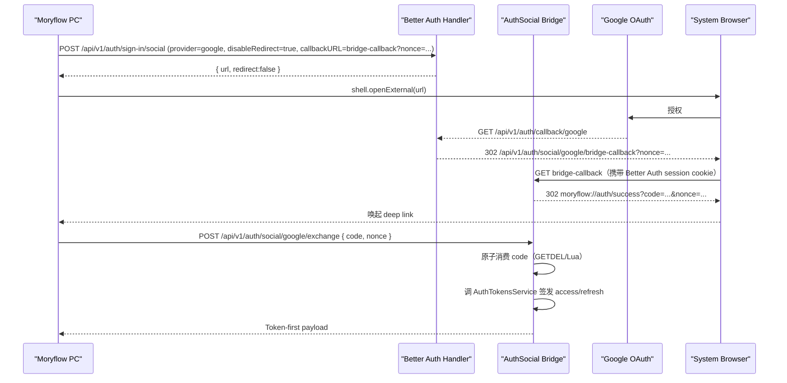

<!--
[INPUT]:
- 目标：为 Moryflow PC（Electron）与 Moryflow Server 接入 Google 登录。
- 约束：遵循现有 Token-first（access+refresh）体系；允许重构；不做历史兼容包袱；可复用但不过度设计。
- 现状：PC 端 Google 按钮为 Coming Soon，Server 侧 Better Auth 当前仅 email/password + OTP。

[OUTPUT]:
- 一套可执行、模块化、单一职责的技术方案：包含架构、接口契约、模块拆分、安全边界、测试与分步实施计划。

[POS]:
- Moryflow Google 登录接入的单一事实源（方案阶段）。

[PROTOCOL]:
- 本方案进入实施时，需同步更新：
  - `docs/design/moryflow/features/index.md`
  - `docs/index.md`
  - `docs/CLAUDE.md`
-->

# Moryflow PC + Server Google 登录接入方案

## 1. 目标与边界

### 1.1 目标

1. Moryflow PC 用户可使用 Google 登录，并进入现有 Token-first 会话（access + refresh）。
2. Server 认证链路保持单一事实源：Auth 仍以 Better Auth + AuthTokensService 为核心。
3. 全链路符合 OAuth for Native Apps 最佳实践：系统浏览器 + Deep Link 回传，不使用内嵌 WebView。
4. 在可复用与不过度设计之间取平衡：仅抽取稳定协议常量/类型，平台编排逻辑留在 app 内。

### 1.2 非目标

1. 本轮不接入 Apple 登录。
2. 本轮不改造 Web 端登录体验。
3. 本轮不改动 membership/计费业务语义。

## 2. 现状与根因

1. PC 登录 UI 已有 Google 按钮但为禁用状态（Coming Soon）。
2. Server `better-auth.ts` 未启用 `socialProviders.google`。
3. 当前 `/api/v1/auth/* -> /api/auth/*` 路径映射是邮箱/OTP 历史收口方案；OAuth 回调若继续依赖映射，路径语义不清晰且实施风险高。
4. PC 是 Token-first + keytar 安全存储；若只完成浏览器 Cookie 会话，PC 无法建立业务会话。

结论：需要新增“OAuth 浏览器会话 -> PC Token-first 会话”的桥接层，并把 OAuth 路由语义显式化。

## 3. 方案选型

### 方案 A（不推荐）

Electron 内嵌登录窗口完成 OAuth。

问题：不符合 Native App OAuth 最佳实践，且存在合规与安全风险。

### 方案 B（推荐）

系统浏览器 OAuth + 服务端桥接回调 + 一次性交换码 + PC 交换 token。

优势：

1. client secret 全程仅在服务端。
2. Deep Link 不传递 access/refresh token，只传短期一次性交换码。
3. 与现有 PC Deep Link 主流程一致，便于模块化接入。

## 4. 目标架构与职责分层



### 4.1 职责归属（单一职责）

1. `AuthController`：Better Auth 兜底 handler，仅处理 Better Auth 原生路由。
2. `AuthSocialController`：Google 桥接回调与 exchange 协议入口。
3. `AuthSocialService`：一次性交换码生命周期管理（生成、存储、原子消费、过期）。
4. `AuthTokensService`：唯一 token 签发与轮换入口。
5. `PC auth-methods`：登录编排（启动 OAuth、等待 deep link、exchange、写本地会话）。
6. `PC main/preload`：Deep Link 解析与事件桥接，不承担认证业务逻辑。

## 5. 服务端设计（apps/moryflow/server）

### 5.1 Better Auth 配置

在 `better-auth.ts` 增加：

1. `socialProviders.google`：
   - `clientId: GOOGLE_CLIENT_ID`
   - `clientSecret: GOOGLE_CLIENT_SECRET`
   - `prompt: "select_account"`
2. 显式 `basePath: "/api/v1/auth"`，避免 OAuth 路径再次依赖映射补丁。
3. scopes 最小化：`openid email profile`。

### 5.2 新增模块

建议新增：

1. `auth-social.controller.ts`
2. `auth-social.service.ts`
3. `auth-social.constants.ts`
4. `dto/auth-social.dto.ts`

### 5.3 路由契约

#### `GET /api/v1/auth/social/google/bridge-callback`

输入：

1. Better Auth 已建立的浏览器 session（Cookie）。
2. query `nonce`。

行为：

1. `AuthService.getSessionFromRequest` 校验当前 session。
2. 生成 `exchangeCode`（高熵随机，建议 32 bytes base64url）。
3. 存储最小票据（不存 token）：`{ userId, nonce, provider:'google', issuedAt }`，TTL 60~120 秒。
4. 302 到 `moryflow://auth/success?code=...&nonce=...`。

#### `POST /api/v1/auth/social/google/exchange`

输入：

1. `code: string`
2. `nonce: string`

行为：

1. 原子消费 `code`（`GETDEL` 或 Lua），保证单次有效。
2. 校验 `nonce` 与票据一致。
3. 调 `AuthTokensService.createAccessToken + issueRefreshToken` 签发 token。
4. 返回 Token-first payload。

输出：

1. `accessToken`
2. `accessTokenExpiresAt`
3. `refreshToken`
4. `refreshTokenExpiresAt`
5. `user`

### 5.4 路由注册顺序（强制）

`AuthSocialController` 必须先于 `AuthController(@All('*path'))` 注册，避免 `/api/v1/auth/social/*` 被兜底路由抢占。

## 6. PC 端设计（apps/moryflow/pc）

### 6.1 Renderer 编排

`auth-methods.ts` 新增 `loginWithGoogle()`：

1. 生成本地 `nonce`，写入 pending 状态。
2. 调 `POST /api/v1/auth/sign-in/social`（`provider=google`、`disableRedirect=true`、`callbackURL=<bridge-callback?nonce=...>`）。
3. 通过 main 进程打开系统浏览器。
4. 监听 deep link 回调事件，获取 `code + nonce`。
5. 调 `POST /api/v1/auth/social/google/exchange`。
6. 使用现有 `syncAuthSessionFromPayload` 写入 keytar + store，并执行 `refresh()`。

### 6.2 Main/Preload 边界

1. Main：仅负责解析 `moryflow://auth/success` 并广播事件。
2. Preload：仅暴露 `onOAuthCallback` 与通用 `openExternal`。
3. 认证状态更新仍由 renderer `auth-methods` 负责，避免主进程侵入业务状态。

### 6.3 UI 改动

`login-panel-auth-fields.tsx`：启用 Google 按钮并接入 `onGoogleSignIn`，Apple 继续保持未实现态。

## 7. 可复用策略（避免过度设计）

### 7.1 留在 app 内

1. Deep Link 事件链路。
2. OAuth pending 状态编排。
3. bridge callback 页面行为。

### 7.2 抽到 packages/api（最小共享）

1. `AUTH_API.SOCIAL_GOOGLE_EXCHANGE`
2. `AUTH_API.SOCIAL_GOOGLE_BRIDGE_CALLBACK`（仅常量）
3. `AuthSocialExchangeResponse` 类型（可选）

## 8. 安全与可靠性基线

1. 禁止在 Deep Link 或日志中出现 access/refresh token 明文。
2. `exchangeCode` 仅可使用一次，且必须短 TTL。
3. 原子消费失败或重复消费统一返回 401/400（不可重试成功）。
4. callback/exchange 响应头统一 `Cache-Control: no-store`。
5. 错误页与错误响应不暴露内部栈与敏感上下文。
6. 仅允许 `https://server.moryflow.com` + 本地开发白名单源参与回调与 origin 校验。

## 9. 配置与部署矩阵

### 9.1 Server 环境变量（新增）

1. `GOOGLE_CLIENT_ID`
2. `GOOGLE_CLIENT_SECRET`
3. `AUTH_SOCIAL_EXCHANGE_TTL_SECONDS`（默认 120）
4. `MORYFLOW_DEEP_LINK_SCHEME`（默认 `moryflow`）

### 9.2 `.env.example` 需同步补充

在 `apps/moryflow/server/.env.example` 增加上述变量示例，避免部署遗漏。

### 9.3 Google Console Redirect URI（必须精确配置）

1. 生产：`https://server.moryflow.com/api/v1/auth/callback/google`
2. 开发：`http://localhost:3000/api/v1/auth/callback/google`

注：bridge callback 不是 Google redirect URI，它是 Better Auth 登录完成后的应用回跳地址。

## 10. 测试策略（L2）

### 10.1 服务端

1. `better-auth` 配置测试：Google provider 与 `basePath` 生效。
2. `auth-social.controller.spec.ts`：
   - bridge callback 成功返回 deep link。
   - bridge callback 无 session 时失败。
   - exchange 成功返回 token。
   - exchange 重放失败。
3. 路由优先级测试：`/api/v1/auth/social/*` 不被 `AuthController` 兜底吞掉。

### 10.2 PC

1. `auth-api.spec.ts`：`sign-in/social` 请求参数与 callbackURL 拼接正确。
2. `auth-methods.spec.ts`：
   - Google 登录成功建立会话。
   - nonce 不匹配失败。
   - exchange 失败正确清理 pending 状态。
3. main deep-link 单测：`moryflow://auth/success` 事件派发正确。

### 10.3 验证命令

```bash
pnpm lint
pnpm typecheck
pnpm test:unit
```

## 11. 实施步骤

### Step 1：服务端基础改造

1. `better-auth.ts` 启用 Google provider + `basePath=/api/v1/auth`。
2. 明确保留/收敛 `AuthController` 路径映射策略，确保 OAuth 路径语义唯一。

#### Step 1 执行记录（2026-03-03）

- 已完成：`apps/moryflow/server/src/auth/better-auth.ts`
  - 显式设置 `basePath='/api/v1/auth'`（不再依赖 `/api/auth` 映射补丁）
  - 新增 Google provider 配置读取（`GOOGLE_CLIENT_ID` + `GOOGLE_CLIENT_SECRET`，`prompt='select_account'`）
- 已完成：`apps/moryflow/server/src/auth/auth.controller.ts`
  - `AuthController` 透传 `req.originalUrl` 到 Better Auth handler，移除 `/api/v1/auth -> /api/auth` 路径改写逻辑
- 同步校准：`apps/moryflow/server/src/auth/auth.rate-limit.spec.ts`
  - basePath 与请求路径统一到 `/api/v1/auth`
- 新增/更新测试（先红后绿）：
  - `apps/moryflow/server/src/auth/better-auth.spec.ts`
  - `apps/moryflow/server/src/auth/__tests__/auth.controller.spec.ts`
  - `apps/moryflow/server/src/auth/auth.rate-limit.spec.ts`
- 验证命令：
  - `pnpm --filter @moryflow/server test -- src/auth/__tests__/auth.controller.spec.ts src/auth/better-auth.spec.ts src/auth/auth.rate-limit.spec.ts`（通过）

### Step 2：桥接模块落地

1. 新增 `auth-social.*` 模块与 DTO。
2. 实现 bridge callback + exchange。
3. 实现交换码原子消费与 TTL 策略。

#### Step 2 执行记录（2026-03-03）

- 已完成：新增服务端 Auth Social 模块
  - `apps/moryflow/server/src/auth/auth-social.controller.ts`
  - `apps/moryflow/server/src/auth/auth-social.service.ts`
  - `apps/moryflow/server/src/auth/auth-social.constants.ts`
  - `apps/moryflow/server/src/auth/dto/auth-social.dto.ts`
- 已完成：模块注册与路由优先级
  - `apps/moryflow/server/src/auth/auth.module.ts` 中 `AuthSocialController` 已注册在 `AuthController` 之前
- 已完成：exchange 原子消费
  - `AuthSocialService` 使用 Redis Lua 脚本执行 `GET + DEL` 原子消费，防止重放
- 已完成：Token-first 桥接输出
  - `exchange` 端点消费一次性交换码后调用 `AuthTokensService` 签发 `access/refresh`
  - `AuthTokensService` 已开放 `getUserSnapshot(userId)` 供桥接流程复用用户快照
- 新增/更新测试（先红后绿）：
  - `apps/moryflow/server/src/auth/__tests__/auth.social.service.spec.ts`
  - `apps/moryflow/server/src/auth/__tests__/auth.social.controller.spec.ts`
  - `apps/moryflow/server/src/auth/__tests__/auth.module.spec.ts`
- 验证命令：
  - `pnpm --filter @moryflow/server test -- src/auth/__tests__/auth.social.service.spec.ts src/auth/__tests__/auth.social.controller.spec.ts src/auth/__tests__/auth.module.spec.ts`（通过）

### Step 3：PC 编排接入

1. main/preload 增加 OAuth deep link 事件。
2. `auth-api`/`auth-methods` 增加 Google 登录流程。
3. UI 启用 Google 按钮。

#### Step 3 执行记录（2026-03-03）

- 已完成：main deep link 回流
  - 新增 `apps/moryflow/pc/src/main/auth-oauth.ts`，收敛 OAuth callback deep link 解析
  - `apps/moryflow/pc/src/main/index.ts` 接入 `membership:oauth-callback` 广播（`code + nonce`）
- 已完成：preload + IPC 类型契约扩展
  - `apps/moryflow/pc/src/preload/index.ts` 新增 `membership.openExternal` 与 `membership.onOAuthCallback`
  - `apps/moryflow/pc/src/shared/ipc/desktop-api.ts` 同步扩展对应类型
- 已完成：renderer 认证编排
  - `apps/moryflow/pc/src/renderer/lib/server/auth-api.ts` 新增 `startGoogleSignIn`、`exchangeGoogleCode`
  - `apps/moryflow/pc/src/renderer/lib/server/auth-methods.ts` 新增 `loginWithGoogle`（nonce 绑定、回流监听、exchange、会话建立校验、失败清理）
  - `apps/moryflow/pc/src/renderer/lib/server/auth-hooks.ts` 暴露 `loginWithGoogle`
- 已完成：登录 UI 接入
  - `apps/moryflow/pc/src/renderer/components/settings-dialog/components/account/login-panel-auth-fields.tsx` 启用 Google 按钮
  - `apps/moryflow/pc/src/renderer/components/settings-dialog/components/account/login-panel.tsx` 接入 `loginWithGoogle` 流程
- 新增/更新测试（先红后绿）：
  - `apps/moryflow/pc/src/renderer/lib/server/__tests__/auth-api.spec.ts`
  - `apps/moryflow/pc/src/renderer/lib/server/__tests__/auth-methods.google.spec.ts`
  - `apps/moryflow/pc/src/main/auth-oauth.test.ts`
- 验证命令：
  - `pnpm --filter @moryflow/pc exec vitest run src/renderer/lib/server/__tests__/auth-api.spec.ts src/renderer/lib/server/__tests__/auth-methods.google.spec.ts src/main/auth-oauth.test.ts`（通过）

### Step 4：测试与回归

1. 增补 server/pc 单测。
2. 执行 L2 命令并记录结果。

#### Step 4 执行记录（2026-03-03）

- 已完成：测试代码规范收口（不改业务行为）
  - `apps/moryflow/server/src/auth/__tests__/auth.module.spec.ts`：移除 `Function[]`，改为显式控制器构造器类型。
  - `apps/moryflow/server/src/auth/__tests__/auth.social.controller.spec.ts`：改为独立 mock 句柄断言，消除 `unbound-method`。
  - `apps/moryflow/server/src/auth/better-auth.spec.ts`：统一 `noopSendOtp`，移除无意义 `async` 回调。
  - `apps/moryflow/pc/src/renderer/lib/server/__tests__/auth-methods.google.spec.ts`：nonce mock 改为合法 UUID 字面量，满足 `crypto.randomUUID()` 类型约束。
- L2 验证命令：
  - `pnpm lint`（通过）
  - `pnpm typecheck`（首次在 `@moryflow/pc` 因 nonce 字面量类型失败；修复后复跑通过）
  - `pnpm test:unit`（通过）
- review 闭环补充（2026-03-03）：
  - `auth-methods.loginWithGoogle` 改为可清理回调等待器，`openExternal` 失败路径会立即释放 OAuth listener + timeout，避免未处理 Promise 与监听残留。
  - `auth-oauth.ts` + `main/index.ts` 统一使用 `MORYFLOW_DEEP_LINK_SCHEME`，消除 server/main deep link scheme 漂移风险。
  - `login-panel-auth-fields.tsx` 恢复 Apple 为禁用占位态（Google 保持可用），与本轮非目标一致。
  - `auth-api.ts` 删除 runtime 兼容 fallback，统一以 `@moryflow/api` 常量作为单一事实源。
  - `main/index.ts` 新增 single-instance + `second-instance/argv` deep link 回流，补齐 Windows/Linux OAuth 回调链路；并新增 pending deep link 队列，避免首启无窗口时回调丢失。
  - `main/index.ts` deep link 日志新增脱敏（`code/nonce -> [REDACTED]`），避免短期凭证明文落日志。
  - `preload/index.ts` 与 `main/app/ipc-handlers.ts` 收敛 `openExternal` 失败语义：main 返回布尔结果，preload 在 `false` 时抛错，renderer 可立即 fail-fast，避免无效等待超时。
  - `server/auth-social.constants.ts` 将 `MORYFLOW_DEEP_LINK_SCHEME` 统一规范化为 `trim().toLowerCase()`，与 PC 协议注册口径一致。
- 结论：Step 1 ~ Step 4 全部完成，方案状态更新为 `completed`。

### Step 5：`state_mismatch` 根因治理（系统浏览器同上下文启动）

1. 新增服务端启动入口 `GET /api/v1/auth/social/google/start?nonce=...`，由系统浏览器直接访问。
2. 启动入口在服务端内部调用 Better Auth `POST /api/v1/auth/sign-in/social` 生成授权 URL，并把 `Set-Cookie` 原样回写给系统浏览器，再 302 跳转 Google。
3. PC renderer 不再发起 `sign-in/social` fetch 请求，不再在应用浏览器上下文内生成 OAuth state。
4. PC renderer 改为仅拼接启动 URL 并 `openExternal(startUrl)`，确保 state cookie 与 OAuth 授权链路在同一系统浏览器上下文内闭环。
5. 补充回归测试：
   - server `auth.social.controller.spec.ts`：验证 start 路由会透传 cookie 且 302 到 provider URL。
   - pc `auth-api.spec.ts`：验证 `startGoogleSignIn` 不发请求，仅返回 start URL。

#### Step 5 执行记录（2026-03-04）

- 状态：`completed`
- 触发问题：生产登录授权后回到 `https://server.moryflow.com/?error=state_mismatch`，未回流 `moryflow://auth/success`。
- 根因判定：
  - 现状流程是 PC renderer 先调用 `POST /api/v1/auth/sign-in/social` 拿授权 URL，再交由系统浏览器打开。
  - Better Auth 在 `sign-in/social` 阶段写入 OAuth state cookie（用于 callback 校验），该 cookie 写在 renderer 浏览器上下文，而非系统浏览器上下文。
  - Google 回调发生在系统浏览器上下文，读取不到同一份 state cookie，触发 `state_mismatch`。
- 已完成改造：
  - server：`auth-social.controller.ts` 新增 `GET /api/v1/auth/social/google/start`，内部调用 Better Auth `sign-in/social`，透传 `Set-Cookie` 并 302 到 provider。
  - server：`auth-social.controller.ts` 的 callbackURL 组装改为固定基于 `BETTER_AUTH_URL`（`getAuthBaseUrl`），不再信任请求 `Host/Proto`，消除回调地址污染风险。
  - server：`auth.handler.utils.ts` 新增 `appendAuthSetCookies` 与 `buildAuthRequest` headers 覆盖能力；`google/start` 内部转发改为白名单头（cookie/user-agent/accept-language/x-forwarded-\*）并关闭原请求头全量复制，消除 `GET -> POST` 时 `content-length/transfer-encoding` 冲突风险。
  - pc：`auth-api.ts` 的 `startGoogleSignIn` 改为直接返回 `social/google/start` URL，不再发起 `sign-in/social` 请求。
  - shared：`packages/api/src/paths.ts` 新增 `AUTH_API.SOCIAL_GOOGLE_START` 常量。
  - tests：新增/更新 `apps/moryflow/server/src/auth/__tests__/auth.social.controller.spec.ts` 与 `apps/moryflow/pc/src/renderer/lib/server/__tests__/auth-api.spec.ts` 回归用例。
- 验证结果：
  - 定向回归通过：
    - `pnpm --filter @moryflow/server test -- src/auth/__tests__/auth.social.controller.spec.ts`
    - `pnpm --filter @moryflow/server test -- src/auth/__tests__/auth.module.spec.ts`
    - `pnpm --filter @moryflow/pc exec vitest run src/renderer/lib/server/__tests__/auth-api.spec.ts`
    - `pnpm --filter @moryflow/pc exec vitest run src/renderer/lib/server/__tests__/auth-methods.google.spec.ts`
  - L2 命令执行：
    - `pnpm lint`：通过
    - `pnpm typecheck`：通过
    - `pnpm test:unit`：未全绿（当前仓库存在与本需求无关的既有失败：`apps/anyhunt/admin/www` 多个 auth 相关测试报 `storage.setItem is not a function`）
- 结论：Step 1 ~ Step 5 全部完成，`state_mismatch` 根因已在协议边界处收口。

## 12. 验收标准

1. PC 可通过 Google 完成登录并进入稳定已登录态。
2. Deep Link 不包含 access/refresh token。
3. 交换码重放无效，且并发场景下不出现重复签发。
4. `/api/v1/auth/social/*` 路径命中预期 controller。
5. L2 校验命令已执行；若仓库其余模块存在既有失败，应与本需求变更隔离评估。

## 13. 回滚策略

1. 通过环境变量关闭 Google provider（邮箱/OTP 保持可用）。
2. UI 回退为禁用按钮，不删除桥接模块（便于灰度重开）。
3. exchange/bridge 路由可保留但通过 feature flag 关闭入口。

## 14. 最佳实践依据

1. Better Auth Basic Usage（`signIn.social` / `callbackURL` / `disableRedirect`）
   https://www.better-auth.com/docs/basic-usage
2. Better Auth Google Provider
   https://www.better-auth.com/docs/authentication/google
3. OAuth 2.0 for Native Apps（RFC 8252）
   https://datatracker.ietf.org/doc/html/rfc8252
4. Google OAuth policies（嵌入式 user-agent 限制）
   https://developers.google.com/identity/protocols/oauth2/policies

## 15. 线上问题与修复方案补充（2026-03-04）

### 15.1 问题现象

1. 用户完成 Google 授权后，跳到 `https://server.moryflow.com/?error=state_mismatch`。
2. 服务端返回 `404 NOT_FOUND`（`Cannot GET /?error=state_mismatch`），PC 未收到 deep link 回调。

### 15.2 根因（事实源）

1. Better Auth OAuth state 校验依赖 `sign-in/social` 阶段下发的 state cookie。
2. 该请求当前由 PC renderer 发起，cookie 写入的是应用内浏览器上下文。
3. OAuth callback 发生在系统浏览器上下文，cookie 不一致，导致 state 校验失败。

### 15.3 修复方案（根因治理）

1. 新增 server start 路由，把 OAuth 启动迁到系统浏览器上下文。
2. PC 仅负责生成 nonce 和打开 start 路由，不再请求 `sign-in/social`。
3. callbackURL 固定基于 `BETTER_AUTH_URL` 生成，不接受请求头注入的 host/proto。
4. start 内部转发仅放行必要请求头，禁止透传 `content-length/transfer-encoding/connection` 等冲突头。
5. 保留现有 bridge callback + exchange token-first 协议，不新增兼容分支。

### 15.4 是否需要单独 Web 页面承接

不需要额外独立前端页面。最佳实践是由服务端 start 路由直接完成“启动 OAuth + 下发 cookie + 302 跳转 provider”，职责更单一，链路更短，错误面更小。
