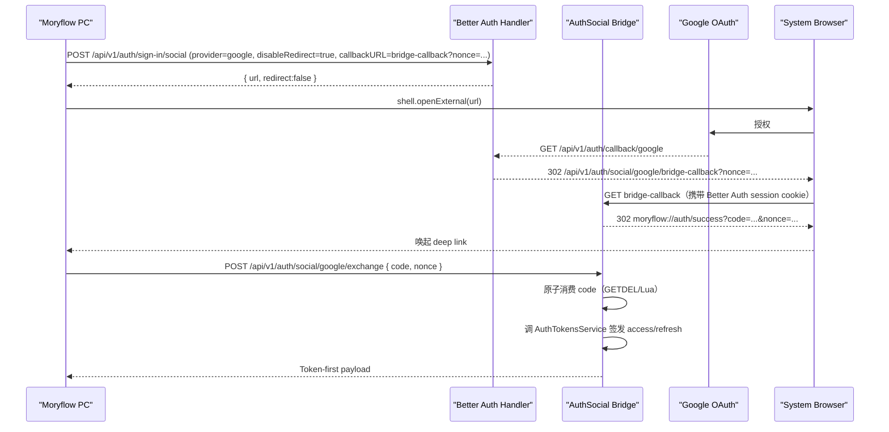

<!--
[INPUT]:
- 目标：为 Moryflow PC（Electron）与 Moryflow Server 建立系统浏览器登录 + Token-first 会话的单一认证架构。
- 约束：遵循现有 access/refresh 体系；允许重构；不做历史兼容包袱；同时明确 browser auth 与 device token auth 的边界。
- 现状：Google 登录、邮箱/OTP、refresh/logout 都已经交付，需要把最终边界收口为稳定事实源。

[OUTPUT]:
- 当前完成态的认证架构事实：Google bridge、系统浏览器、deep link、token-first 会话，以及 browser auth / device token-first auth 的上下文分层。

[POS]:
- Moryflow PC + Server 认证架构的单一事实源。

[PROTOCOL]: 仅在相关索引、跨文档事实引用或全局协作边界失真时，才同步更新对应文档。
-->

# Moryflow PC + Server 认证架构

## 1. 目标与边界

### 1.1 目标

1. Moryflow PC 用户可使用 Google 登录，并进入现有 Token-first 会话（access + refresh）。
2. Server 认证链路保持单一事实源：Auth 仍以 Better Auth + AuthTokensService 为核心。
3. 全链路符合 OAuth for Native Apps 最佳实践：系统浏览器 + Deep Link 回传，不使用内嵌 WebView。
4. 在可复用与不过度设计之间取平衡：仅抽取稳定协议常量/类型，平台编排逻辑留在 app 内。

### 1.2 非目标

1. 本轮不接入 Apple 登录。
2. 本轮不改造 Web 端登录体验。
3. 本轮不改动 membership/计费业务语义。

## 2. 现状与根因

1. PC 登录 UI 已有 Google 按钮但为禁用状态（Coming Soon）。
2. Server `better-auth.ts` 未启用 `socialProviders.google`。
3. 当前 `/api/v1/auth/* -> /api/auth/*` 路径映射是邮箱/OTP 历史收口方案；OAuth 回调若继续依赖映射，路径语义不清晰且实施风险高。
4. PC 是 Token-first + 本地 membership token store；若只完成浏览器 Cookie 会话，PC 无法建立业务会话。

结论：需要新增“OAuth 浏览器会话 -> PC Token-first 会话”的桥接层，并把 OAuth 路由语义显式化。

## 3. 方案选型

### 方案 A（不推荐）

Electron 内嵌登录窗口完成 OAuth。

问题：不符合 Native App OAuth 最佳实践，且存在合规与安全风险。

### 方案 B（推荐）

系统浏览器 OAuth + 服务端桥接回调 + 一次性交换码 + PC 交换 token。

优势：

1. client secret 全程仅在服务端。
2. Deep Link 不传递 access/refresh token，只传短期一次性交换码。
3. 与现有 PC Deep Link 主流程一致，便于模块化接入。

## 4. 目标架构与职责分层



### 4.1 职责归属（单一职责）

1. `AuthController`：Better Auth 兜底 handler，仅处理 Better Auth 原生路由。
2. `AuthSocialController`：Google 桥接回调与 exchange 协议入口。
3. `AuthSocialService`：一次性交换码生命周期管理（生成、存储、原子消费、过期）。
4. `AuthTokensService`：唯一 token 签发与轮换入口。
5. `PC auth-methods`：登录编排（启动 OAuth、等待 deep link、exchange、写本地会话）。
6. `PC main/preload`：Deep Link 解析与事件桥接，不承担认证业务逻辑。

## 5. 服务端设计（apps/moryflow/server）

### 5.1 Better Auth 配置

在 `better-auth.ts` 增加：

1. `socialProviders.google`：
   - `clientId: GOOGLE_CLIENT_ID`
   - `clientSecret: GOOGLE_CLIENT_SECRET`
   - `prompt: "select_account"`
2. 显式 `basePath: "/api/v1/auth"`，避免 OAuth 路径再次依赖映射补丁。
3. scopes 最小化：`openid email profile`。

### 5.2 新增模块

建议新增：

1. `auth-social.controller.ts`
2. `auth-social.service.ts`
3. `auth-social.constants.ts`
4. `dto/auth-social.dto.ts`

### 5.3 路由契约

#### `GET /api/v1/auth/social/google/bridge-callback`

输入：

1. Better Auth 已建立的浏览器 session（Cookie）。
2. query `nonce`。

行为：

1. `AuthService.getSessionFromRequest` 校验当前 session。
2. 生成 `exchangeCode`（高熵随机，建议 32 bytes base64url）。
3. 存储最小票据（不存 token）：`{ userId, nonce, provider:'google', issuedAt }`，TTL 60~120 秒。
4. 302 到 `moryflow://auth/success?code=...&nonce=...`。

#### `POST /api/v1/auth/social/google/exchange`

输入：

1. `code: string`
2. `nonce: string`

行为：

1. 原子消费 `code`（`GETDEL` 或 Lua），保证单次有效。
2. 校验 `nonce` 与票据一致。
3. 调 `AuthTokensService.createAccessToken + issueRefreshToken` 签发 token。
4. 返回 Token-first payload。

输出：

1. `accessToken`
2. `accessTokenExpiresAt`
3. `refreshToken`
4. `refreshTokenExpiresAt`
5. `user`

### 5.4 路由注册顺序（强制）

`AuthSocialController` 必须先于 `AuthController(@All('*path'))` 注册，避免 `/api/v1/auth/social/*` 被兜底路由抢占。

## 6. PC 端设计（apps/moryflow/pc）

### 6.1 Renderer 编排

`auth-methods.ts` 新增 `loginWithGoogle()`：

1. 生成本地 `nonce`，写入 pending 状态。
2. 调 `POST /api/v1/auth/sign-in/social`（`provider=google`、`disableRedirect=true`、`callbackURL=<bridge-callback?nonce=...>`）。
3. 通过 main 进程打开系统浏览器。
4. 监听 deep link 回调事件，获取 `code + nonce`。
5. 调 `POST /api/v1/auth/social/google/exchange`。
6. 使用现有 `syncAuthSessionFromPayload` 写入本地 membership token store + store，并执行 `refresh()`。

### 6.2 Main/Preload 边界

1. Main：仅负责解析 `moryflow://auth/success` 并广播事件。
2. Preload：仅暴露 `onOAuthCallback` 与通用 `openExternal`。
3. 认证状态更新仍由 renderer `auth-methods` 负责，避免主进程侵入业务状态。

### 6.3 UI 改动

`login-panel-auth-fields.tsx`：启用 Google 按钮并接入 `onGoogleSignIn`，Apple 继续保持未实现态。

## 7. 可复用策略（避免过度设计）

### 7.1 留在 app 内

1. Deep Link 事件链路。
2. OAuth pending 状态编排。
3. bridge callback 页面行为。

### 7.2 抽到 packages/api（最小共享）

1. `AUTH_API.SOCIAL_GOOGLE_EXCHANGE`
2. `AUTH_API.SOCIAL_GOOGLE_BRIDGE_CALLBACK`（仅常量）
3. `AuthSocialExchangeResponse` 类型（可选）

## 8. 安全与可靠性基线

1. 禁止在 Deep Link 或日志中出现 access/refresh token 明文。
2. `exchangeCode` 仅可使用一次，且必须短 TTL。
3. 原子消费失败或重复消费统一返回 401/400（不可重试成功）。
4. callback/exchange 响应头统一 `Cache-Control: no-store`。
5. 错误页与错误响应不暴露内部栈与敏感上下文。
6. 仅允许 `https://server.moryflow.com` + 本地开发白名单源参与回调与 origin 校验。

## 9. 配置与部署矩阵

### 9.1 Server 环境变量（新增）

1. `GOOGLE_CLIENT_ID`
2. `GOOGLE_CLIENT_SECRET`
3. `AUTH_SOCIAL_EXCHANGE_TTL_SECONDS`（默认 120）
4. `MORYFLOW_DEEP_LINK_SCHEME`（默认 `moryflow`）

### 9.2 `.env.example` 需同步补充

在 `apps/moryflow/server/.env.example` 增加上述变量示例，避免部署遗漏。

### 9.3 Google Console Redirect URI（必须精确配置）

1. 生产：`https://server.moryflow.com/api/v1/auth/callback/google`
2. 开发：`http://localhost:3000/api/v1/auth/callback/google`

注：bridge callback 不是 Google redirect URI，它是 Better Auth 登录完成后的应用回跳地址。

## 10. 测试策略（L2）

### 10.1 服务端

1. `better-auth` 配置测试：Google provider 与 `basePath` 生效。
2. `auth-social.controller.spec.ts`：
   - bridge callback 成功返回 deep link。
   - bridge callback 无 session 时失败。
   - exchange 成功返回 token。
   - exchange 重放失败。
3. 路由优先级测试：`/api/v1/auth/social/*` 不被 `AuthController` 兜底吞掉。

### 10.2 PC

1. `auth-api.spec.ts`：`sign-in/social` 请求参数与 callbackURL 拼接正确。
2. `auth-methods.spec.ts`：
   - Google 登录成功建立会话。
   - nonce 不匹配失败。
   - exchange 失败正确清理 pending 状态。
3. main deep-link 单测：`moryflow://auth/success` 事件派发正确。

### 10.3 验证命令

```bash
pnpm lint
pnpm typecheck
pnpm test:unit
```

## 11. 当前实现收口

1. Server 已固定 OAuth 启动链路为 `GET /api/v1/auth/social/google/start` + `GET /api/v1/auth/social/google/start/check`；启动与预检都由服务端掌控，PC 不再直接调用 `sign-in/social`。
2. callbackURL 固定基于 `BETTER_AUTH_URL` 生成，启动路由内部转发只放行白名单头，避免 Host/Proto 污染与 `content-length/transfer-encoding` 冲突。
3. PC Renderer 只生成 nonce、执行预检并打开 system browser start URL；`openExternal` 失败会 fail-fast，Windows/Linux 的 `second-instance/argv` 回流与 pending deep link queue 已收口。
4. Deep link、exchange 与 token-first 协议保持单一事实源：不在 URL 中传 access/refresh token，交换码一次性消费，bridge/exchange 不再引入兼容分支。
5. 认证请求上下文已经显式分层：
   - browser / renderer 交互式认证继续使用真实浏览器 `Origin`
   - desktop / mobile / CLI 的 token-first auth 只使用 `X-App-Platform`，不得再伪造 `Origin/Referer`
6. `AuthRequestContext` 现在是认证分流事实源；device token-first 路由在进入 Better Auth 转发与 CORS 前，统一剥离 `Origin/Referer`，避免把设备请求错误拖入 browser trusted-origin 语义。
7. 本方案已经是完成态；逐步实施与阶段性闭环日志已删除，后续只在上述链路事实失真时更新。

## 12. 验收标准

1. PC 可通过 Google 完成登录并进入稳定已登录态。
2. Deep Link 不包含 access/refresh token。
3. 交换码重放无效，且并发场景下不出现重复签发。
4. `/api/v1/auth/social/*` 路径命中预期 controller。
5. L2 校验命令已执行；若仓库其余模块存在既有失败，应与本需求变更隔离评估。

## 13. 回滚策略

1. 通过环境变量关闭 Google provider（邮箱/OTP 保持可用）。
2. UI 回退为禁用按钮，不删除桥接模块（便于灰度重开）。
3. exchange/bridge 路由可保留但通过 feature flag 关闭入口。

## 14. 最佳实践依据

1. Better Auth Basic Usage（`signIn.social` / `callbackURL` / `disableRedirect`）
   https://www.better-auth.com/docs/basic-usage
2. Better Auth Google Provider
   https://www.better-auth.com/docs/authentication/google
3. OAuth 2.0 for Native Apps（RFC 8252）
   https://datatracker.ietf.org/doc/html/rfc8252
4. Google OAuth policies（嵌入式 user-agent 限制）
   https://developers.google.com/identity/protocols/oauth2/policies

## 15. 线上问题案例与收口结论

1. `state_mismatch` 的根因不是 callback 自身，而是 OAuth start 发生在 PC renderer 上下文、callback 发生在系统浏览器上下文，导致 state cookie 不一致。
2. 根治方式是把 start 路由迁到服务端，由系统浏览器在同一上下文内完成 cookie 建立与 provider 跳转，而不是增加额外中转页面。
3. 启动失败可观测性通过 `google/start/check` 预检解决；用户无需再被动等待 deep link 超时才发现配置问题。
4. `Origin missing` 与 `Origin 导致 refresh 500` 不是同一个问题：
   - browser auth 需要真实 `Origin`
   - device token-first auth 不应伪造 `Origin`
5. 长期正确做法不是在 PC main 合成浏览器头，而是把认证链路显式拆成：
   - renderer/browser 交互式登录
   - main/device token-first 维护链路
6. 服务器端必须同时配合收口：device token-first auth 即使意外收到 `Origin`，也不应因 trusted-origin 语义被打成 `500`。
