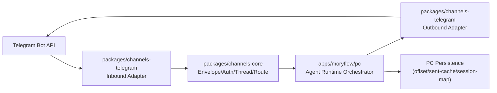

# Moryflow PC Telegram 接入与共享包抽离一体化方案（OpenClaw 对标）

## 1. 目标与约束

### 1.1 目标

1. 在 `apps/moryflow/pc` 完成 Telegram 渠道接入，支持稳定收发消息。
2. 从一开始就按“共享包优先”设计，避免把协议/业务逻辑固化在 PC 进程内。
3. 一次性交付完整架构，不走“先凑合后重构”的多期路线。

### 1.2 约束

1. 必须根因治理：不做补丁式修复，不叠兼容层。
2. **仅支持 Telegram Bot API**（与 OpenClaw 对齐），本方案范围内不引入 MTProto 用户号接入。
3. 端能力矩阵与共享边界必须在方案阶段明确。
4. **Bot Token 仅允许存在于受信进程**（`apps/moryflow/pc` 主进程或后端服务）；渲染层/Web/Mobile 禁止直持 token、禁止直连 Telegram Bot API。
5. **DM pairing 持久化为首版必做能力**，不得以内存态临时实现替代。

## 2. 调研事实（OpenClaw）

调研仓库：`https://github.com/openclaw/openclaw`  
基线提交：`4ffe15c6b2227254e48b7724053d3c5079c9be6f`

### 2.1 接入形态

1. 以 `grammY` + `@grammyjs/runner` 为核心客户端栈。
2. 采用 Channel Plugin 架构：Telegram 作为独立插件注册到统一网关。
3. 启动时自动选择 `polling` 或 `webhook`（有 `webhookUrl` 则 webhook，否则 polling）。

关键参考：

- `extensions/telegram/src/channel.ts`
- `src/telegram/monitor.ts`
- `src/telegram/webhook.ts`

### 2.2 核心设计点

1. **入站统一化**：`message`/`channel_post`/`callback_query`/`message_reaction` 都归一进入同一处理链。
2. **权限前置**：DM 与群组策略分层校验（`dmPolicy`、`groupPolicy`、`allowFrom`、`groupAllowFrom`）。
3. **线程语义统一**：群 topic 与 DM topic 均进入统一 thread/session key 规则。
4. **发送可靠性**：HTML 解析失败回退纯文本；`message_thread_id` 失败可降级重试；可恢复网络错误重试。
5. **运行稳定性**：polling 具备 offset 持久化、409 冲突恢复、退避重启、网络异常兜底。
6. **配置强约束**：`webhookUrl` 必须配 `webhookSecret`；`dmPolicy=open/allowlist` 对应 `allowFrom` 有强校验。

## 3. 现状根因（为什么必须一次性做对）

如果仅在 PC 内“快速接 TG”，常见根因问题有：

1. 渠道协议（Telegram update/send）与业务编排（会话、权限、路由）耦合，后续无法抽包。
2. 线程/会话键缺乏单一事实源，topic、callback、reaction 易出现跨线程串话。
3. 发送与重试逻辑分散，错误分类不一致，导致“偶发失败不可复现”。
4. 鉴权策略散落在 UI/主进程/消息处理器中，行为不可预测。
5. 后续扩展（Discord/Slack/Server 复用）时只能复制代码，无法共享。

## 4. 可选架构（2-3 选 1）

## 4.1 方案 A：PC 内聚实现（不抽包）

优点：

1. 初期开发路径最短。

缺点：

1. 违反“共享优先”目标，未来复用成本最高。
2. 逻辑难以解耦，后续重构风险大。

结论：不推荐。

## 4.2 方案 B：共享包先行 + PC 装配（推荐）

设计：

1. 渠道协议、事件归一、权限策略、线程路由、发送可靠性全部放共享包。
2. `apps/moryflow/pc` 只负责运行时装配（生命周期、密钥管理、持久化实现、UI/IPC 桥接）。

优点：

1. 一次性把边界做对，后续 server/mobile 复用成本最低。
2. 便于单元测试和回归测试，风险可控。

代价：

1. 首次接入工程量较大，但总成本最低。

结论：推荐。

## 4.3 方案 C：外置网关进程（PC 仅调用）

优点：

1. 理论上隔离性更强。

缺点：

1. 部署与运维复杂度明显上升。
2. 对 PC 离线/本地工作流不友好。

结论：当前不推荐。

## 5. 推荐方案（B）的一次性目标架构



### 5.1 拟新增共享包

1. `packages/channels-core`
2. `packages/channels-telegram`

### 5.2 责任边界

`packages/channels-core`：

1. 统一 `InboundEnvelope/OutboundEnvelope` 协议。
2. 策略引擎：`dmPolicy/groupPolicy/allowFrom/groupAllowFrom`。
3. 线程与会话键规范：群 topic / DM topic / callback / reaction 的一致映射。
4. 重试与错误分类接口（可恢复/不可恢复）。

`packages/channels-telegram`：

1. grammY 客户端与 update 解析。
2. Telegram target 解析（chatId、username、`topic` 后缀）。
3. send/edit/delete/react/sticker 等 Telegram 适配。
4. polling/webhook 双模式与 offset 协议接入点。

`apps/moryflow/pc`：

1. Token 安全存储与注入（系统 keychain + 配置）。
2. 生命周期管理（start/stop/reload）。
3. 持久化实现（offset、sent-message cache、会话映射）。
4. 与现有 Agent Runtime 的编排与 IPC 对接。

## 6. 端能力矩阵（强制）

| 能力              | PC             | Web                             | Mobile                          | 抽离策略                            |
| ----------------- | -------------- | ------------------------------- | ------------------------------- | ----------------------------------- |
| Telegram 入站解析 | 支持           | 不直接运行                      | 不直接运行                      | 共享到 `packages/channels-telegram` |
| Telegram 出站发送 | 支持           | 仅复用协议/类型（不直持 token） | 仅复用协议/类型（不直持 token） | 共享到 `packages/channels-telegram` |
| 渠道权限策略      | 支持           | 可复用                          | 可复用                          | 共享到 `packages/channels-core`     |
| 线程/会话路由     | 支持           | 可复用                          | 可复用                          | 共享到 `packages/channels-core`     |
| Token 安全存储    | 支持（主进程） | N/A                             | N/A                             | 保留在端侧，不抽离                  |
| 生命周期/守护     | 支持           | N/A                             | N/A                             | 保留在端侧，不抽离                  |

## 7. 配置与数据模型（单一事实源）

### 7.1 配置模型（建议）

```json5
{
  channels: {
    telegram: {
      enabled: true,
      defaultAccount: 'default',
      accounts: {
        default: {
          botToken: 'secret-ref-or-env',
          mode: 'polling', // polling | webhook
          webhookUrl: 'https://...',
          webhookSecret: 'secret-ref',
          dmPolicy: 'pairing', // pairing | allowlist | open | disabled
          allowFrom: ['123456789'],
          groupPolicy: 'allowlist', // allowlist | open | disabled
          groupAllowFrom: ['123456789'],
          groups: {
            '-1001234567890': {
              requireMention: true,
              topics: {
                '42': { requireMention: false },
              },
            },
          },
        },
      },
    },
  },
}
```

### 7.2 本地持久化（PC）

1. `telegram_update_offsets(account_id, last_update_id, updated_at)`
2. `telegram_sent_messages(account_id, chat_id, message_id, sent_at)`
3. `channel_sessions(channel, peer_key, thread_key, session_key, updated_at)`
4. `channel_pairing_requests(channel, account_id, sender_id, code, meta_json, created_at, last_seen_at, expires_at)`
5. `channel_pairing_allow_from(channel, account_id, sender_id, approved_at)`

其中 `telegram_update_offsets` 必须采用“安全水位”口径（`safe_watermark_update_id`），禁止仅以“收到的最大 update_id”直接落盘。

## 8. 一次性交付清单（不分期）

1. Telegram polling 全链路接入（收/发/回调/reaction）。
2. webhook 模式代码完整可用（默认关闭，可配置打开）。
3. 统一权限策略与线程路由。
4. 统一发送层（HTML fallback、thread fallback、retry、错误分类）。
5. offset 安全水位持久化与重启恢复（并发处理不丢消息）。
6. 配置 schema 强校验与启动时诊断。
7. pairing 请求/审批持久化（含过期与多账号隔离）。
8. 单元测试 + 集成测试 + PC 端关键流程 E2E（至少 mock TG API）。

## 9. 风险与硬约束

1. 禁止在业务层直接调用 `bot.api.*`，必须走 `channels-telegram` 适配层。
2. 禁止在多个位置重复实现 allowlist/policy 逻辑，必须统一在 `channels-core`。
3. 禁止 thread/session key 多套规则并存，必须单一算法。
4. webhook secret 不得以明文落盘，必须走 secret 输入机制。
5. 群组授权禁止回落到 DM pairing 审批记录；group 鉴权仅认 `groupAllowFrom/groups/topics`。
6. 发送 fallback 必须白名单触发：`thread not found` 才允许 threadless retry，`chat not found` 禁止被 fallback 掩盖。
7. Bot Token 禁止进入 renderer 进程、日志明文与持久化明文字段。

## 10. 最终决策（2026-03-03 已确认）

1. `已确认`：首版仅支持 **Telegram Bot API**，不做 MTProto 用户号接入。
2. `已确认`：默认 DM 策略采用 `pairing`，`allowlist/open` 仅作为显式配置。
3. `已确认`：PC 默认启用 polling，webhook 仅作为显式 opt-in 能力。
4. `已确认`：底层首版即支持多账号（`accounts.*`），UI 允许单账号优先流程。
5. `已确认`：Bot Token 仅在受信进程托管，Web/Mobile/Renderer 禁止直持 token。
6. `已确认`：pairing 持久化首版必做，不接受内存态临时方案。
7. `已确认`：Pairing 审批入口采用 **PC 内置审批中心**，不依赖 CLI 命令。
8. `已确认`：首版采用“单账号 UI + 多账号底层模型”展示策略。
9. `已确认`：群聊默认 `requireMention = true`。

## 11. OpenClaw 对应解法与建议

### 11.1 决策点 2：默认 DM 策略

OpenClaw 对应解法：

1. 文档默认 `pairing`：`docs/channels/telegram.md` 明确 `pairing` 是默认 DM 策略。
2. Schema 默认值同样是 `pairing`：`src/config/zod-schema.providers-core.ts`。
3. 并且对 `allowlist/open` 做了强校验，防止空 allowFrom 或误开放。

建议：

1. Moryflow PC 默认采用 `pairing`。
2. `allowlist`/`open` 仅作为显式配置项，不作为默认。
3. 原因：个人桌面端场景下，`pairing` 在安全与可用性之间更稳，且与 OpenClaw 一致。

### 11.2 决策点 3：polling 与 webhook 默认策略

OpenClaw 对应解法：

1. 文档层明确默认 long polling，webhook 可选。
2. 启动代码以 `webhookUrl` 为显式开关：有则 webhook，无则 polling。

建议：

1. PC 默认仅启用 polling。
2. webhook 保留为“显式 opt-in”能力（必须配 `webhookUrl + webhookSecret`）。
3. 原因：PC 本地运行天然适配 polling；webhook 在公网入口、反代、证书和安全边界上运维成本更高。

### 11.3 决策点 4：是否首版支持多账号

OpenClaw 对应解法：

1. 完整支持 `accounts.* + defaultAccount`。
2. 同时为多账号补了大量防护：默认账号回退告警、重复 token 拦截、跨账号 group 继承隔离等。

建议：

1. **内核首版就支持多账号**（`accountId` 贯穿配置、存储、路由、发送 API）。
2. UI 可以默认展示“单账号优先流程”，但底层必须是多账号模型，避免后续破坏性重构。
3. 原因：你要求一次性把架构做对；若底层先做单账号，后续迁移会牵涉会话键、存储主键、路由与鉴权模型，代价高且风险大。

### 11.4 最终组合（已拍板）

1. `已定`：Bot API only。
2. `已定`：DM 默认 `pairing`。
3. `已定`：默认 polling，webhook 显式开启。
4. `已定`：底层多账号模型一次到位（UI 可先单账号优先）。

## 12. 一次性执行蓝图（实施口径）

### 12.1 代码落位

1. 新建 `packages/channels-core`：放置 envelope 协议、策略引擎、线程路由与重试抽象。
2. 新建 `packages/channels-telegram`：放置 grammY 适配、update 归一、send 适配与 mode 启动器。
3. 在 `apps/moryflow/pc` 新建 `src/main/channels/telegram` 装配层：仅负责配置读取、secret 注入、生命周期与持久化适配。

### 12.2 协议与边界

1. `channels-core` 对外暴露 `normalizeInbound/updatePolicy/resolveThreadKey/dispatchOutbound` 四类纯函数接口。
2. `channels-telegram` 禁止直接依赖 PC 存储实现；通过 `OffsetRepository`、`SessionRepository`、`MessageRepository` 接口注入。
3. `channels-telegram` 额外通过 `PairingRepository` 注入 pairing 请求/审批存储，禁止在消息处理器内直接写本地文件。
4. offset 持久化接口必须以安全水位语义暴露（`getSafeWatermark/setSafeWatermark`），禁止裸 `lastUpdateId` 覆盖写。
5. PC 主进程禁止直接调用 Telegram SDK；统一通过 `channels-telegram` 的 `TelegramChannelRuntime` 调用。

### 12.3 启动与运行时序

1. 启动前：加载配置并执行 schema 强校验（`mode=webhook` 强制校验 `webhookUrl + webhookSecret`）。
2. 启动时：按 `defaultAccount + accounts.*` 构建 runtime，逐账号拉取 offset 并启动 monitor。
3. 运行中：所有 update 先归一成 `InboundEnvelope`，再统一执行策略判定与线程路由。
4. 发送时：统一走 Outbound API，内置 HTML fallback、thread fallback、可恢复错误重试。
5. 停止时：安全停机并落盘 safe watermark，确保重启后无重复消费且不跳过待处理 update。

### 12.4 一次性交付验收

1. 单元测试：`channels-core` 覆盖策略、线程键、错误分类；`channels-telegram` 覆盖 update 归一和 target 解析。
2. 集成测试：mock Telegram Bot API，验证 polling 收发、callback、reaction、fallback、retry。
3. PC E2E：验证账号配置、启动/停止、重启 offset 恢复、多账号隔离。
4. 架构守护：新增 lint 规则或 code review 清单，禁止业务层直调 Telegram SDK。

## 13. 不开 Webhook 的影响评估（结论）

1. **不开 webhook 不影响核心功能**：Bot API 的入站消息、回调、reaction、出站发送都可以通过 long polling 完成。
2. 对 `moryflow pc` 而言，默认 polling 是更稳妥的首选：无需公网入口、无需反代与证书、部署复杂度更低。
3. webhook 主要在以下场景有价值：需要公网被动接收、统一入口治理、或与服务端基础设施做集中流量编排。
4. 因此本方案保持：默认 polling；webhook 作为显式 opt-in 高级能力。

## 14. 复用性评估（未来接入其他渠道）

1. 本方案是可复用架构：`channels-core` 承载跨渠道稳定语义（envelope、策略、thread/session、重试分类），`channels-telegram` 仅承载 Telegram 特有协议适配。
2. 未来新增渠道（如 Discord/Slack/WhatsApp）时，只需新增 `packages/channels-<provider>` 适配包并实现同一组 runtime ports，不需要改动 PC 业务编排层。
3. `apps/moryflow/pc` 保持“装配层”职责：生命周期、secret 注入、持久化实现、IPC；该层不绑定 Telegram 细节，因此天然支持多渠道并存。
4. 结论：本方案满足“先做对边界，再扩渠道”的一次性架构目标。

## 15. UI 交互方案（Notion 风格，少交互、直觉化）

### 15.1 核心交互原则

1. 单主路径：默认只暴露“连接 Telegram Bot”主流程，减少分支决策。
2. 渐进披露：高级项（webhook、多账号、高级重试）默认折叠，不干扰首配。
3. 就地反馈：每一步均即时显示状态（Token 可用性、连通性、当前 mode、最近收发状态），避免跳页排障。
4. 失败可恢复：错误提示给出可执行下一步（例如“请先向 bot 发送 /start”），而不是仅报错码。

### 15.2 推荐信息架构（PC）

1. `Channels` 主页面：仅展示渠道卡片状态（Connected/Disconnected、last event、account 数）。
2. Telegram 详情页分三块：
   - `Connection`：Token、启动开关、mode（默认 polling）
   - `Access`：DM policy（默认 pairing）、group policy、allowlist
   - `Advanced`（折叠）：webhook、多账号、重试/网络参数
3. Pairing 审批中心：集中展示待审批请求（sender、time、code），支持一键 approve/deny，避免用户切换命令行。

### 15.3 首版最小交互流（建议）

1. 用户输入 Bot Token -> 点击 `Test & Save`。
2. 系统自动探测并提示“请在 Telegram 里给 bot 发一条消息完成绑定”。
3. 收到首条 DM 后自动进入 pairing 请求队列，用户在同页点击 `Approve` 即可。
4. 默认即可开始使用；高级配置保持折叠，不强迫首次填写。

## 16. 开工前确认项（2026-03-03 已确认）

1. `已确认`：Pairing 审批入口采用 **PC 内置审批中心**，不依赖 CLI 命令。
2. `已确认`：首版采用“单账号 UI + 多账号底层模型”展示策略。
3. `已确认`：群聊默认 `requireMention = true`。

## 17. 执行进度同步（按顺序）

### Step 1（已完成）：共享包落地 `channels-core` + `channels-telegram`

完成内容：

1. 新建 `packages/channels-core`，并落地以下单一事实源能力：
   - `Inbound/Outbound Envelope` 类型协议
   - `DM/Group/mention` 统一策略判定 `evaluateInboundPolicy`
   - `thread/session` 统一键算法 `resolveThreadKey`
   - 发送错误分类与退避 `classifyDeliveryFailure` / `computeRetryDelayMs`
   - 持久化端口抽象：`SafeWatermarkRepository` / `SessionRepository` / `SentMessageRepository` / `PairingRepository`
2. 新建 `packages/channels-telegram`，并落地以下 Telegram 适配能力：
   - 账户配置 schema 强校验（`mode=webhook` 强制 `webhook.url + webhook.secret`）
   - Update 归一化（`message/channel_post/callback_query/message_reaction`）
   - target 解析（`chatId#threadId`）
   - runtime 核心：polling/webhook 启停、safe watermark offset、策略前置、pairing 请求触发、发送 fallback/retry
3. 新包已接入构建链路：
   - `tsc-multi.stage1.json` 新增 `packages/channels-core/tsconfig.json`
   - `tsc-multi.stage2.json` 新增 `packages/channels-telegram/tsconfig.json`
   - `tsc-multi.json` 同步新增两包
4. 单元测试已补齐并通过：
   - `@moryflow/channels-core`：5 个测试通过
   - `@moryflow/channels-telegram`：4 个测试通过

### Step 2（已完成）：PC 主进程 runtime 装配

完成内容：

1. 新增 `apps/moryflow/pc/src/main/channels/telegram/service.ts`，实现主进程装配职责：
   - 多账号 runtime 生命周期（init/sync/start/stop）
   - 配置 -> runtime schema 构建
   - inbound dispatch -> Agent Runtime 编排 -> outbound 回发
2. inbound 处理采用线程键驱动：
   - `thread.sessionKey` 直接作为 Agent Session key
   - 同步屏蔽 bot 自身消息，防止自回环
3. 发送层复用 `channels-telegram`，并增加长回复拆分（Telegram 长度上限保护）。

### Step 3（已完成）：持久化层（safe watermark + pairing + session/sent）

完成内容：

1. 新增 `apps/moryflow/pc/src/main/channels/telegram/sqlite-store.ts`：
   - `telegram_update_offsets`（safe watermark）
   - `channel_sessions`
   - `telegram_sent_messages`
   - `channel_pairing_requests`
   - `channel_pairing_allow_from`
2. `pairing` 行为已首版落地：
   - DM 未授权触发 pairing request 持久化
   - 支持 pending 请求复用更新（防止同 sender 重复堆积）
   - pending 请求按 `expires_at` 自动过期为 `expired`（查询与按 ID 读取前先收敛）
   - 审批后写入 allow_from 并更新 request 状态
3. 敏感信息存储已落地：
   - 新增 `secret-store.ts`，Bot Token/Webhook Secret 仅通过 keytar 存取，不写入配置明文。

### Step 4（已完成）：IPC + preload 扩展

完成内容：

1. 新增 Telegram IPC handlers：
   - `telegram:isSecureStorageAvailable`
   - `telegram:getSettings`
   - `telegram:updateSettings`
   - `telegram:getStatus`
   - `telegram:listPairingRequests`
   - `telegram:approvePairingRequest`
   - `telegram:denyPairingRequest`
2. preload 已暴露 `desktopAPI.telegram.*` 完整能力与 `telegram:status-changed` 订阅。
3. shared IPC 类型已新增 `telegram.ts` 并接入 `DesktopApi`。

### Step 5（已完成）：Settings UI（单账号主路径 + 高级折叠）

完成内容：

1. `Settings` 新增 `Telegram` 分区（导航 + 内容渲染链路已接入）。
2. 新增 `telegram-section.tsx`：
   - 主路径：`Enable + Bot Token + Mode + Save`
   - 高级折叠：Webhook、DM/Group policy、allowlist、polling/retry/TTL 参数
   - 状态反馈：运行态/错误态/secure storage 可用性
3. Pairing 审批中心已接入同页：
   - pending 请求列表
   - 一键 `Approve / Deny`
   - 刷新动作与即时状态更新
4. i18n 已补齐导航键：`telegram` / `telegramDescription`（en/zh-CN/ja/de/ar）。

### Step 6（已完成）：全量验证 + 暂存 + 收口评审

完成内容：

1. 全量校验已跑通：`pnpm lint`、`pnpm typecheck`、`pnpm test:unit` 全部通过（含并发场景下 `@moryflow/agents-tools` 超时稳定性修复）。
2. Telegram 关键链路补强已完成并通过受影响范围验证：
   - runtime 启动异常状态回滚（防止假运行态）
   - pairing `pending` 到期自动收敛为 `expired`
   - 删除账号后运行态残留清理
   - polling update 处理失败统一进入退避路径：失败前先落已处理 safe watermark，再抛到外层退避分支，修复同一失败 update 的快速重试循环；并新增回归测试覆盖该行为
3. 本次改动已进入暂存区，进入最终 code review 闭环。

## 18. Review Finding 闭环记录（已完成）

### Finding #1：polling 下 update 失败快速重试循环（P2）

问题描述（来自 code review）：

1. `packages/channels-telegram/src/telegram-runtime.ts` 在 polling 批处理中，`processUpdate` 失败后仅中断当前批次，未统一进入外层异常退避。
2. 失败 update 的 offset 未按“已处理成功项”及时落盘时，会导致相同失败 update 被快速重复拉取，带来日志风暴与资源抖动风险。

修复方案（执行前记录）：

1. 在批处理循环内将 update 处理失败升级为领域异常（携带 `updateId`），禁止仅 `break`。
2. 抛错前先落盘“本批已成功处理到的 safe watermark”，确保进度单调推进且不越过失败项。
3. 统一交由外层 `catch` 进入退避路径（`idleDelay + backoff`），收敛重复拉取频率。
4. 补充回归测试：
   - 验证失败 update 不会快速重试；
   - 验证“前序成功、后续失败”场景下 safe watermark 落盘语义正确。

执行结果（已完成）：

1. `packages/channels-telegram/src/telegram-runtime.ts` 已按方案收口：
   - 批内 update 失败改为抛出 `TelegramUpdateProcessingError`，不再仅 `break`；
   - 抛错前先落盘本批已成功处理到的 safe watermark；
   - 外层统一退避并补充 `accountId + updateId` 错误日志上下文，收敛定位成本。
2. 回归测试已补齐并通过：
   - `polling 中单条 update 处理失败会退避，避免快速重试循环`
   - `polling 批内后续 update 失败时会先推进已成功项 watermark`
3. 验证命令通过：
   - `pnpm --filter @moryflow/channels-telegram test:unit`
   - `pnpm --filter @moryflow/channels-telegram exec tsc -p tsconfig.json --noEmit`

## 19. 剩余三项收口进度（已完成）

### 19.1 Webhook“可选但不可用”收口（已完成）

1. 新增 `apps/moryflow/pc/src/main/channels/telegram/webhook-ingress.ts`：
   - 本地 HTTP ingress 接收 Telegram webhook update；
   - 强制校验 path / method / `X-Telegram-Bot-Api-Secret-Token`；
   - 合法请求转发至 runtime `handleWebhookUpdate`。
2. `service.ts` 已接入 ingress 生命周期：
   - 账号启动时（`mode=webhook`）启动 ingress 并绑定 runtime 分发；
   - 账号重载/停机时统一关闭 ingress，防止端口泄漏。
3. 新增回归测试 `webhook-ingress.test.ts`，覆盖 path/secret/method 与 update 分发链路。

### 19.2 keytar“写失败假成功”收口（已完成）

1. `secret-store.ts` 写路径从“fallback 吞错”改为“显式抛错”：
   - keytar 不可用：抛 `Secure credential storage is unavailable.`
   - keytar 写入失败：抛 `Secure credential storage failed: ...`
2. `telegram-section.tsx` 保存失败提示改为透传主进程错误信息，避免误报“保存成功”。
3. 新增 `secret-store.test.ts` 覆盖 keytar 不可用/写失败两类场景。

### 19.3 全量校验闭环（已完成）

1. 已完成受影响验证：
   - `pnpm --filter @moryflow/channels-telegram test:unit`
   - `pnpm --filter @moryflow/channels-telegram exec tsc -p tsconfig.json --noEmit`
   - `pnpm --filter @moryflow/pc test:unit`
   - `pnpm --filter @moryflow/pc typecheck`
2. 全仓全量校验已执行并通过（2026-03-03）：
   - `pnpm lint`
   - `pnpm typecheck`
   - `pnpm test:unit`
3. 结论：本轮 Telegram 三项收口全部完成（webhook 入站链路可用、keytar 写失败不再假成功、全量校验闭环通过），当前方案可作为后续渠道接入的复用基线。

## 20. 第二轮 Review Findings 闭环计划（执行前）

本轮输入（新增 6 条 finding）聚焦三个方向：

1. **架构分层不足**：`service.ts` 过载，职责边界不清（P3）。
2. **Webhook 入口边界不稳**：公网 URL 与本地监听耦合、默认 `0.0.0.0` 暴露、异常返回码粗糙（P1/P2）。
3. **设置页交互不完整**：审批操作缺少失败态与防重复提交、Webhook 条件校验后置到提交时（P2）。

### 20.1 根因判定

1. `service.ts` 在一次性交付阶段承载了“runtime 生命周期 + LLM reply 编排 + settings 应用 + pairing 管理 + 状态广播”，违反单一职责，测试边界难以稳定定义。
2. webhook ingress 直接从 `webhookUrl` 解析本地监听端口，导致 https 默认端口 443 误用于本地监听；同时监听地址固定 `0.0.0.0`，未做最小暴露收敛。
3. webhook request body 错误没有类型化，导致“超限/超时/流中断”统一落入 500，放大 Telegram 无效重试。
4. Telegram Settings UI 对审批操作和 webhook 条件约束缺少前置交互语义，错误提示延后且反馈不完整。

### 20.2 修复方案（本轮一次性收口）

1. **服务分层重构（P3）**：
   - 新增 `runtime-orchestrator.ts`：仅负责 runtime + webhook ingress 生命周期与状态总线；
   - 新增 `inbound-reply-service.ts`：仅负责 inbound -> agent reply -> outbound 编排；
   - 新增 `settings-application-service.ts`：仅负责 settings + secrets 应用与快照构建；
   - 新增 `pairing-admin-service.ts`：仅负责 pairing list/approve/deny。
2. **Webhook 边界治理（P1/P2）**：
   - ingress 入参改为“public webhook URL 与本地监听参数解耦”；
   - 默认本地监听 `127.0.0.1:8787`，不再隐式绑定 443 与 `0.0.0.0`；
   - request body 引入错误类型化：`413`（超限）/`408`（超时）/`400`（非法或中断）/`500`（处理异常）。
3. **UI 交互修复（P2）**：
   - Pairing Approve/Deny 增加失败分支、按钮级 pending 防重复点击与错误 toast；
   - webhook 模式增加前端条件校验（URL 必填且合法，secret 在无已存凭据时必填）；
   - 补充本地监听 host/port 高级配置项（默认值直出，减少用户心智负担）。

### 20.3 验收标准

1. `service.ts` 仅保留装配层职责，不再承载 reply/settings/pairing 细节实现。
2. webhook 在未显式配置监听端口时默认使用 `127.0.0.1:8787`，不会因 https URL 默认 443 启动失败。
3. webhook body 异常返回码按错误类型区分，不再“非 SyntaxError 全部 500”。
4. Settings UI 在提交前即可阻断 webhook 条件不满足场景；审批按钮具备失败反馈与 pending 态。
5. 全量验证通过：`pnpm lint`、`pnpm typecheck`、`pnpm test:unit`。

### 20.4 执行结果（已完成）

1. **服务分层（P3）已收口**：
   - `service.ts` 收敛为 facade 装配层；
   - 新增 `runtime-orchestrator.ts`、`inbound-reply-service.ts`、`settings-application-service.ts`、`pairing-admin-service.ts`，分别承载 runtime 生命周期、inbound reply 编排、settings+secret 应用、pairing 审批。
2. **Webhook 边界（P1/P2）已收口**：
   - ingress 从“由 `webhookUrl` 推导监听端口”改为显式 `webhookPath + listenHost + listenPort`；
   - 默认监听改为 `127.0.0.1:8787`，不再默认 `0.0.0.0`/443；
   - body 错误码细分完成：`400 invalid_json/bad_request_body`、`408 request_timeout`、`413 payload_too_large`、`500 internal_error`。
3. **Settings 交互（P2）已收口**：
   - Approve/Deny 增加 `try/catch/finally`、按钮级 pending 防重复提交、失败 toast；
   - `telegramFormSchema` 增加 `superRefine` 条件校验：`enabled` 时 token 必填（无已存 token）；`mode=webhook` 时 URL 必填且合法，secret 在无已存 secret 时必填；
   - 前端补充 `webhookListenHost/webhookListenPort` 配置项并通过 IPC 同步到主进程。
4. **回归测试已补齐并通过**：
   - `webhook-ingress.test.ts` 新增超限 payload 返回 `413` 用例；
   - `telegram-section.validation.test.ts` 新增 webhook/token/secret 条件校验用例；
   - `secret-store.test.ts` 与既有 Telegram runtime 回归测试保持通过；
   - 新增 4 个服务分层单测并通过：
     - `settings-application-service.test.ts`
     - `pairing-admin-service.test.ts`
     - `inbound-reply-service.test.ts`
     - `runtime-orchestrator.test.ts`
5. **全量校验（L2）已闭环**：
   - 2026-03-03 执行 `pnpm lint`（通过）；
   - 2026-03-03 执行 `pnpm typecheck`（通过）；
   - 2026-03-03 执行 `pnpm test:unit`（通过，含 `@moryflow/pc` 的 98 files / 341 tests）。

## 21. PR #136 评论收敛与第三轮修复方案（已完成）

### 21.1 事实收敛（2026-03-03）

PR：`https://github.com/dvlin-dev/moryflow/pull/136`

已收敛事实：

1. **Review threads（未解决）** 共 3 条：
   - `apps/moryflow/pc/src/main/channels/telegram/webhook-ingress.ts`：超大 payload 时未主动 `request.destroy()`
   - `packages/channels-telegram/src/telegram-runtime.ts`：fallback resend 复用了 retry 次数预算
   - `packages/channels-telegram/src/telegram-runtime.ts`：polling 的 non-retryable 错误仍持续重试
2. **CI 检查**：当前可见 `GitGuardian Security Checks = SUCCESS`。
3. **PR 合并状态**：`mergeable = CONFLICTING`、`mergeStateStatus = DIRTY`（需与 `main` 同步后再合并）。

### 21.2 有效性判定（逐条）

1. `webhook-ingress` 超大 payload 未 destroy：**成立**。
   - 当前 `readBody` 超限分支仅 reject 413，不会主动断开底层连接。
   - 后果：客户端持续发送期间，连接会保持到超时或发送结束，存在不必要资源占用窗口。
2. `telegram-runtime.send` fallback 消耗 retry 次数：**成立**。
   - `fallback_plaintext` / `fallback_threadless` 使用 `continue` 落在同一 `for attempt` 循环。
   - 后果：`maxSendRetries=1` 时，首个可恢复失败不会真正执行 fallback resend。
3. `runPolling` non-retryable 仍重试：**部分成立（需分层处理）**。
   - 对 Telegram API 永久性错误（401/403）应 fail-fast 停机，避免无效重试风暴。
   - 但对 `processUpdate` 业务处理错误不应直接全局停机，否则单条坏消息会导致渠道雪崩。

补充判定：

4. 早先 `service.ts` P3 职责过载：**当前已不成立**。
   - `service.ts` 已收敛为 facade；`runtime/reply/settings/pairing` 已拆分并有单测覆盖。

### 21.3 修复方案（根因治理，不打补丁）

1. **Webhook ingress 流控收敛（根因：超限后连接未终止）**
   - 将 `readBody` 保持为“错误类型化抛出”，在 catch 边界统一走 `respondAndTerminateRequest`：先返回 `413/408` 再强制终止请求流，确保每条错误路径都主动释放连接。
   - 新增回归测试：慢速超大 body 场景下请求会被快速中断（不等待 body timeout）。

2. **发送语义重构：fallback 与 retry 预算解耦（根因：状态机混叠）**
   - 将 `send` 从“单层 for 循环”重构为“`fallback` 状态机 + `retry` 状态机”双层模型：
     - `fallback`（html -> plaintext；threaded -> threadless）不消耗 retry attempt；
     - `retry` 仅对 `retryable` 错误递增 attempt 并指数退避。
   - 结果语义：`maxSendRetries` 只表达“瞬时失败重试次数”，不混入协议降级次数。
   - 新增回归测试：
     - `maxSendRetries=1` 时 `fallback_plaintext` 可成功送达；
     - `maxSendRetries=1` 时 `fallback_threadless` 可成功送达；
     - fallback 后遇到 retryable 仍按 retry 预算执行。

3. **Polling 非重试错误分层停机（根因：错误域未区分）**
   - 在 `runPolling` catch 中按错误域分流：
     - **Transport/API non-retryable**（如 401/403）-> 标记终态，停止 polling 循环，`running=false`；
     - **Update processing error**（`TelegramUpdateProcessingError`）-> 维持运行，但进入受控退避与结构化告警。
   - 保持已实现的 safe watermark 语义，避免重复消费快速循环。
   - 新增回归测试：
     - `getUpdates` 401 时 runtime 停止并上报 terminal error；
     - `processUpdate` 抛错时 runtime 不停机，仅退避重试。

4. **合并前基线同步（工程闸门）**
   - 先 rebase `main` 解决 `CONFLICTING`，再执行修复，确保 review 行号与代码事实一致。
   - L2 校验：`pnpm lint && pnpm typecheck && pnpm test:unit` 全通过后再回贴 review threads。

### 21.4 验收标准（第三轮）

1. webhook 超限路径立即释放连接，无 30s 被动等待窗口。
2. `maxSendRetries=1` 下 fallback resend 可执行且可达成功。
3. polling 对 API 永久性错误进入终态停机；对单条业务处理失败保持服务可用并退避。
4. 新增回归测试覆盖上述 3 条行为边界，且全量 L2 校验通过。

### 21.5 执行结果（2026-03-03，已完成）

1. **Webhook ingress 超限/超时路径已收口**：
   - `readBody` 在 `payload_too_large` / `request_timeout` 上不再“先 destroy 再抛错”，改为抛出类型化错误；
   - catch 分支统一走 `respondAndTerminateRequest`：先返回明确状态码（`413` / `408`）再强制终止请求流，避免 500 与长时间连接占用并存。
2. **Webhook 回归测试已闭环**：
   - `webhook-ingress.test.ts` 保留 `413` 行为断言；
   - “快速断连”测试补充响应流消费，避免 paused socket 模式导致 close 事件观测失真，验证“服务端能快速关闭超限连接”的真实语义。
3. **`send` fallback/retry 预算语义已收口**：
   - `fallback_plaintext` / `fallback_threadless` 与 retry attempt 解耦，不再消耗 `maxSendRetries`；
   - 回归测试覆盖 `maxSendRetries=1` 仍可执行 fallback resend（plaintext / threadless）。
4. **Polling 非重试错误分层停机已生效**：
   - `transport non-retryable`（如 401）进入终态并停止轮询；
   - `TelegramUpdateProcessingError` 仍走退避，避免单条坏消息触发全局停机。
5. **验证结果**：
   - 受影响验证通过：
     - `pnpm --filter @moryflow/pc exec vitest run src/main/channels/telegram/webhook-ingress.test.ts`
     - `pnpm --filter @moryflow/channels-telegram test:unit`
     - `pnpm --filter @moryflow/channels-telegram exec tsc -p tsconfig.json --noEmit`
     - `pnpm --filter @moryflow/pc typecheck`
   - 全量 L2 闭环通过：
     - `pnpm lint`
     - `pnpm typecheck`
     - `pnpm test:unit`

### 21.6 追加评论（settings-store secret 落盘）收口（2026-03-03，已完成）

1. **新增评论事实**：
   - PR #136 在 `apps/moryflow/pc/src/main/channels/telegram/settings-store.ts` 新增 1 条未解决线程，指出 `botToken/webhookSecret` 可能被带入 `electron-store` 明文落盘。
2. **有效性判定：成立**。
   - `ipc-handlers.ts` 的 `telegram:updateSettings` 透传 `account`；
   - `settings-application-service.ts` 调用 `updateTelegramSettingsStore(payload)`；
   - 旧实现 `normalizeAccount` 使用 `{ ...current, ...patch }`，运行时不会剔除扩展字段，导致 secret 字段可随 patch 进入 store。
3. **根因修复（持久化边界白名单）**：
   - 在 `settings-store.ts` 新增 `sanitizeAccountPatch`，仅白名单拷贝 `TelegramAccountSettings` 的非敏感配置字段；
   - `normalizeAccount` 改为合并 `safePatch`，不再直接 spread 原始 patch，统一阻断 `botToken`/`webhookSecret` 及其他未声明字段落盘。
4. **回归测试（TDD）**：
   - 新增 `apps/moryflow/pc/src/main/channels/telegram/settings-store.test.ts`：
     - 先复现失败（`botToken` 出现在 store）；
     - 修复后验证通过（`botToken/webhookSecret` 均为 `undefined`）。
5. **受影响验证通过**：
   - `pnpm --filter @moryflow/channels-telegram test:unit`
   - `pnpm --filter @moryflow/pc exec vitest run src/main/channels/telegram/webhook-ingress.test.ts src/renderer/components/settings-dialog/components/telegram-section.validation.test.ts src/main/channels/telegram/settings-store.test.ts`

### 21.7 追加评论（二次收口：pairing/status + partial update + polling 409）闭环（2026-03-03，已完成）

1. **新增评论事实（未解决线程 3 条）**：
   - `apps/moryflow/pc/src/main/channels/telegram/pairing-admin-service.ts`：审批未校验 `pending` 状态。
   - `apps/moryflow/pc/src/main/channels/telegram/settings-store.ts`：partial update 可能用 `undefined` 覆盖已有字段。
   - `packages/channels-telegram/src/telegram-runtime.ts`：polling `GrammyError 409` 处理后缺少 `continue`，且错误分类未识别 `error_code`。
2. **有效性判定：均成立**。
   - pairing 过期/非 pending 请求在审批链路缺少状态门禁；
   - `sanitizeAccountPatch` 旧实现为“全字段赋值”，会把“未提供字段”写成 `undefined` 并覆盖历史配置；
   - `classifyDeliveryFailure` 未解析顶层 `error_code`，409 冲突会误判为 non-retryable，触发 polling 终态停机。
3. **根因修复（一次性收口）**：
   - `pairing-admin-service.ts` 新增 `ensurePendingPairingRequest`，`approve/deny` 统一强制 `status === 'pending'`；
   - `settings-store.ts` 重写 `sanitizeAccountPatch` 为“仅拷贝 defined 字段”，partial update 不再清空旧值；
   - `packages/channels-core/src/retry.ts` 扩展 `ErrorLike.error_code` 解析；
   - `packages/channels-telegram/src/telegram-runtime.ts` 在 409 分支完成 `deleteWebhook` 后执行 `sleep + backoff + continue`，避免误落入 non-retryable 停机路径。
4. **回归测试（TDD）**：
   - `apps/moryflow/pc/src/main/channels/telegram/pairing-admin-service.test.ts`：新增“非 pending 审批拒绝”；
   - `apps/moryflow/pc/src/main/channels/telegram/settings-store.test.ts`：新增“partial update 保留既有字段”；
   - `packages/channels-core/test/core.test.ts`：新增 `error_code: 409` 分类为 `retryable`；
   - `packages/channels-telegram/test/telegram.test.ts`：新增“polling 409 -> reset webhook 并继续轮询”。
5. **验证结果**：
   - 受影响验证通过：
     - `pnpm --filter @moryflow/pc exec vitest run src/main/channels/telegram/pairing-admin-service.test.ts src/main/channels/telegram/settings-store.test.ts`
     - `pnpm --filter @moryflow/channels-core test:unit`
     - `pnpm --filter @moryflow/channels-telegram test:unit`
   - 全量 L2 校验已完成并通过（2026-03-03）：
     - `pnpm lint`
     - `pnpm typecheck`
     - `pnpm test:unit`

### 21.8 追加评论（三次收口：webhook 去重 + init 回滚）闭环（2026-03-03，已完成）

1. **新增评论事实（未解决线程 2 条）**：
   - `packages/channels-telegram/src/telegram-runtime.ts`：webhook 模式未按 `update_id` 与 safe watermark 去重，重复投递会重复处理。
   - `apps/moryflow/pc/src/main/channels/telegram/service.ts`：`init()` 在启动前提前写入 `initialized=true`，启动失败后无法重试。
2. **有效性判定：均成立**。
   - webhook 链路原实现 `handleWebhookUpdate -> processUpdate` 无去重/水位门禁，重试投递会重复触发入站与 side effects；
   - `service.init()` 失败路径未回滚初始化态，后续 `init()` 直接短路返回，导致会话内不可恢复。
3. **根因修复（一次性收口）**：
   - `telegram-runtime.ts`：
     - webhook 入站新增 `safe_watermark` 门禁：`update_id <= watermark` 直接跳过；
     - 新增 `processingWebhookUpdateIds` 并发去重，阻断同一 `update_id` 的并发重复处理；
     - 成功处理后按 `max(currentWatermark, updateId)` 推进水位，保证水位单调不回退。
   - `service.ts`：
     - 初始化改为 `initPromise` 复用 + “成功后置位”；
     - 失败路径显式回滚 `initialized=false`；
     - `shutdown()` 在有 `initPromise` 时先等待（忽略失败）后再清理状态，确保可重入恢复。
4. **回归测试（TDD）**：
   - `packages/channels-telegram/test/telegram.test.ts`：新增“webhook 模式重复 `update_id` 只处理一次并推进 watermark”；
   - `apps/moryflow/pc/src/main/channels/telegram/service.test.ts`（新增）：覆盖“init 失败后可重试”“init 成功后幂等”。
5. **验证结果**：
   - 受影响验证通过：
     - `pnpm --filter @moryflow/channels-telegram test:unit`
     - `pnpm --filter @moryflow/pc exec vitest run src/main/channels/telegram/service.test.ts`
   - 全量 L2 校验已完成并通过（2026-03-03）：
     - `pnpm lint`
     - `pnpm typecheck`
     - `pnpm test:unit`
