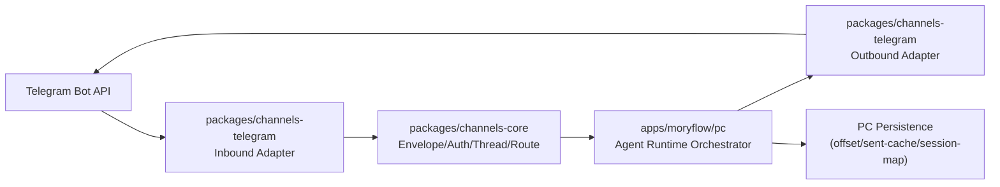

# Moryflow PC Telegram 接入与共享包抽离一体化方案（OpenClaw 对标）

## 1. 目标与约束

### 1.1 目标

1. 在 `apps/moryflow/pc` 完成 Telegram 渠道接入，支持稳定收发消息。
2. 从一开始就按“共享包优先”设计，避免把协议/业务逻辑固化在 PC 进程内。
3. 一次性交付完整架构，不走“先凑合后重构”的多期路线。

### 1.2 约束

1. 必须根因治理：不做补丁式修复，不叠兼容层。
2. **仅支持 Telegram Bot API**（与 OpenClaw 对齐），本方案范围内不引入 MTProto 用户号接入。
3. 端能力矩阵与共享边界必须在方案阶段明确。
4. **Bot Token 仅允许存在于受信进程**（`apps/moryflow/pc` 主进程或后端服务）；渲染层/Web/Mobile 禁止直持 token、禁止直连 Telegram Bot API。
5. **DM pairing 持久化为首版必做能力**，不得以内存态临时实现替代。

## 2. 调研事实（OpenClaw）

调研仓库：`https://github.com/openclaw/openclaw`  
基线提交：`4ffe15c6b2227254e48b7724053d3c5079c9be6f`

### 2.1 接入形态

1. 以 `grammY` + `@grammyjs/runner` 为核心客户端栈。
2. 采用 Channel Plugin 架构：Telegram 作为独立插件注册到统一网关。
3. 启动时自动选择 `polling` 或 `webhook`（有 `webhookUrl` 则 webhook，否则 polling）。

关键参考：

- `extensions/telegram/src/channel.ts`
- `src/telegram/monitor.ts`
- `src/telegram/webhook.ts`

### 2.2 核心设计点

1. **入站统一化**：`message`/`channel_post`/`callback_query`/`message_reaction` 都归一进入同一处理链。
2. **权限前置**：DM 与群组策略分层校验（`dmPolicy`、`groupPolicy`、`allowFrom`、`groupAllowFrom`）。
3. **线程语义统一**：群 topic 与 DM topic 均进入统一 thread/session key 规则。
4. **发送可靠性**：HTML 解析失败回退纯文本；`message_thread_id` 失败可降级重试；可恢复网络错误重试。
5. **运行稳定性**：polling 具备 offset 持久化、409 冲突恢复、退避重启、网络异常兜底。
6. **配置强约束**：`webhookUrl` 必须配 `webhookSecret`；`dmPolicy=open/allowlist` 对应 `allowFrom` 有强校验。

## 3. 现状根因（为什么必须一次性做对）

如果仅在 PC 内“快速接 TG”，常见根因问题有：

1. 渠道协议（Telegram update/send）与业务编排（会话、权限、路由）耦合，后续无法抽包。
2. 线程/会话键缺乏单一事实源，topic、callback、reaction 易出现跨线程串话。
3. 发送与重试逻辑分散，错误分类不一致，导致“偶发失败不可复现”。
4. 鉴权策略散落在 UI/主进程/消息处理器中，行为不可预测。
5. 后续扩展（Discord/Slack/Server 复用）时只能复制代码，无法共享。

## 4. 可选架构（2-3 选 1）

## 4.1 方案 A：PC 内聚实现（不抽包）

优点：

1. 初期开发路径最短。

缺点：

1. 违反“共享优先”目标，未来复用成本最高。
2. 逻辑难以解耦，后续重构风险大。

结论：不推荐。

## 4.2 方案 B：共享包先行 + PC 装配（推荐）

设计：

1. 渠道协议、事件归一、权限策略、线程路由、发送可靠性全部放共享包。
2. `apps/moryflow/pc` 只负责运行时装配（生命周期、密钥管理、持久化实现、UI/IPC 桥接）。

优点：

1. 一次性把边界做对，后续 server/mobile 复用成本最低。
2. 便于单元测试和回归测试，风险可控。

代价：

1. 首次接入工程量较大，但总成本最低。

结论：推荐。

## 4.3 方案 C：外置网关进程（PC 仅调用）

优点：

1. 理论上隔离性更强。

缺点：

1. 部署与运维复杂度明显上升。
2. 对 PC 离线/本地工作流不友好。

结论：当前不推荐。

## 5. 推荐方案（B）的一次性目标架构



### 5.1 拟新增共享包

1. `packages/channels-core`
2. `packages/channels-telegram`

### 5.2 责任边界

`packages/channels-core`：

1. 统一 `InboundEnvelope/OutboundEnvelope` 协议。
2. 策略引擎：`dmPolicy/groupPolicy/allowFrom/groupAllowFrom`。
3. 线程与会话键规范：群 topic / DM topic / callback / reaction 的一致映射。
4. 重试与错误分类接口（可恢复/不可恢复）。

`packages/channels-telegram`：

1. grammY 客户端与 update 解析。
2. Telegram target 解析（chatId、username、`topic` 后缀）。
3. send/edit/delete/react/sticker 等 Telegram 适配。
4. polling/webhook 双模式与 offset 协议接入点。

`apps/moryflow/pc`：

1. Token 安全存储与注入（系统 keychain + 配置）。
2. 生命周期管理（start/stop/reload）。
3. 持久化实现（offset、sent-message cache、会话映射）。
4. 与现有 Agent Runtime 的编排与 IPC 对接。

## 6. 端能力矩阵（强制）

| 能力              | PC             | Web                             | Mobile                          | 抽离策略                            |
| ----------------- | -------------- | ------------------------------- | ------------------------------- | ----------------------------------- |
| Telegram 入站解析 | 支持           | 不直接运行                      | 不直接运行                      | 共享到 `packages/channels-telegram` |
| Telegram 出站发送 | 支持           | 仅复用协议/类型（不直持 token） | 仅复用协议/类型（不直持 token） | 共享到 `packages/channels-telegram` |
| 渠道权限策略      | 支持           | 可复用                          | 可复用                          | 共享到 `packages/channels-core`     |
| 线程/会话路由     | 支持           | 可复用                          | 可复用                          | 共享到 `packages/channels-core`     |
| Token 安全存储    | 支持（主进程） | N/A                             | N/A                             | 保留在端侧，不抽离                  |
| 生命周期/守护     | 支持           | N/A                             | N/A                             | 保留在端侧，不抽离                  |

## 7. 配置与数据模型（单一事实源）

### 7.1 配置模型（建议）

```json5
{
  channels: {
    telegram: {
      enabled: true,
      defaultAccount: 'default',
      accounts: {
        default: {
          botToken: 'secret-ref-or-env',
          mode: 'polling', // polling | webhook
          webhookUrl: 'https://...',
          webhookSecret: 'secret-ref',
          dmPolicy: 'pairing', // pairing | allowlist | open | disabled
          allowFrom: ['123456789'],
          groupPolicy: 'allowlist', // allowlist | open | disabled
          groupAllowFrom: ['123456789'],
          groups: {
            '-1001234567890': {
              requireMention: true,
              topics: {
                '42': { requireMention: false },
              },
            },
          },
        },
      },
    },
  },
}
```

### 7.2 本地持久化（PC）

1. `telegram_update_offsets(account_id, last_update_id, updated_at)`
2. `telegram_sent_messages(account_id, chat_id, message_id, sent_at)`
3. `channel_conversation_bindings(channel, account_id, peer_key, thread_key, conversation_id, updated_at)`
4. `channel_pairing_requests(channel, account_id, sender_id, code, meta_json, created_at, last_seen_at, expires_at)`
5. `channel_pairing_allow_from(channel, account_id, sender_id, approved_at)`

其中 `telegram_update_offsets` 必须采用“安全水位”口径（`safe_watermark_update_id`），禁止仅以“收到的最大 update_id”直接落盘。

## 8. 一次性交付清单（不分期）

1. Telegram polling 全链路接入（收/发/回调/reaction）。
2. webhook 模式代码完整可用（默认关闭，可配置打开）。
3. 统一权限策略与线程路由。
4. 统一发送层（HTML fallback、thread fallback、retry、错误分类）。
5. offset 安全水位持久化与重启恢复（并发处理不丢消息）。
6. 配置 schema 强校验与启动时诊断。
7. pairing 请求/审批持久化（含过期与多账号隔离）。
8. 单元测试 + 集成测试 + PC 端关键流程 E2E（至少 mock TG API）。

## 9. 风险与硬约束

1. 禁止在业务层直接调用 `bot.api.*`，必须走 `channels-telegram` 适配层。
2. 禁止在多个位置重复实现 allowlist/policy 逻辑，必须统一在 `channels-core`。
3. 禁止 thread/session key 多套规则并存，必须单一算法。
4. webhook secret 不得以明文落盘，必须走 secret 输入机制。
5. 群组授权禁止回落到 DM pairing 审批记录；group 鉴权仅认 `groupAllowFrom/groups/topics`。
6. 发送 fallback 必须白名单触发：`thread not found` 才允许 threadless retry，`chat not found` 禁止被 fallback 掩盖。
7. Bot Token 禁止进入 renderer 进程、日志明文与持久化明文字段。

## 10. 最终决策（2026-03-03 已确认）

1. `已确认`：首版仅支持 **Telegram Bot API**，不做 MTProto 用户号接入。
2. `已确认`：默认 DM 策略采用 `pairing`，`allowlist/open` 仅作为显式配置。
3. `已确认`：PC 默认启用 polling，webhook 仅作为显式 opt-in 能力。
4. `已确认`：底层首版即支持多账号（`accounts.*`），UI 允许单账号优先流程。
5. `已确认`：Bot Token 仅在受信进程托管，Web/Mobile/Renderer 禁止直持 token。
6. `已确认`：pairing 持久化首版必做，不接受内存态临时方案。
7. `已确认`：Pairing 审批入口采用 **PC 内置审批中心**，不依赖 CLI 命令。
8. `已确认`：首版采用“单账号 UI + 多账号底层模型”展示策略。
9. `已确认`：群聊默认 `requireMention = true`。

## 12. 2026-03-04 C+ 会话路由重构落地（已执行）

### 12.1 根因与收敛策略

1. 根因：渠道层 `thread.sessionKey` 被直接复用为 Agent `chatId`，当本地不存在对应会话时会触发“未找到对应的对话”。
2. 收敛：共享包只保留线程定位（`peerKey/threadKey`），PC 主进程在调用 Agent 前必须先解析真实 `conversationId`。

### 12.2 新的职责边界

1. `packages/channels-core`：删除 `ThreadResolution.sessionKey`，不再承载会话语义。
2. `packages/channels-telegram`：新增 `parseTelegramCommand`，统一解析 `/start`、`/new`、`/cmd@bot`。
3. `apps/moryflow/pc`：
   - 新增 `conversation-service`，负责 `ensureConversationId/createNewConversationId`。
   - `sqlite-store` 持久化事实源改为 `channel_conversation_bindings`。
   - `inbound-reply-service` 仅在拿到 `conversationId` 后执行 `runChatTurn`。

### 12.3 命令语义（private chat）

1. `/start`：幂等确保当前线程有会话绑定；若无则自动创建；返回确认消息，不触发模型执行。
2. `/new`：强制创建新会话并覆盖线程绑定；返回确认消息，不触发模型执行。
3. 普通文本：先解析/自愈会话绑定，再执行模型回复。

## 11. OpenClaw 对应解法与建议

### 11.1 决策点 2：默认 DM 策略

OpenClaw 对应解法：

1. 文档默认 `pairing`：`docs/channels/telegram.md` 明确 `pairing` 是默认 DM 策略。
2. Schema 默认值同样是 `pairing`：`src/config/zod-schema.providers-core.ts`。
3. 并且对 `allowlist/open` 做了强校验，防止空 allowFrom 或误开放。

建议：

1. Moryflow PC 默认采用 `pairing`。
2. `allowlist`/`open` 仅作为显式配置项，不作为默认。
3. 原因：个人桌面端场景下，`pairing` 在安全与可用性之间更稳，且与 OpenClaw 一致。

### 11.2 决策点 3：polling 与 webhook 默认策略

OpenClaw 对应解法：

1. 文档层明确默认 long polling，webhook 可选。
2. 启动代码以 `webhookUrl` 为显式开关：有则 webhook，无则 polling。

建议：

1. PC 默认仅启用 polling。
2. webhook 保留为“显式 opt-in”能力（必须配 `webhookUrl + webhookSecret`）。
3. 原因：PC 本地运行天然适配 polling；webhook 在公网入口、反代、证书和安全边界上运维成本更高。

### 11.3 决策点 4：是否首版支持多账号

OpenClaw 对应解法：

1. 完整支持 `accounts.* + defaultAccount`。
2. 同时为多账号补了大量防护：默认账号回退告警、重复 token 拦截、跨账号 group 继承隔离等。

建议：

1. **内核首版就支持多账号**（`accountId` 贯穿配置、存储、路由、发送 API）。
2. UI 可以默认展示“单账号优先流程”，但底层必须是多账号模型，避免后续破坏性重构。
3. 原因：你要求一次性把架构做对；若底层先做单账号，后续迁移会牵涉会话键、存储主键、路由与鉴权模型，代价高且风险大。

### 11.4 最终组合（已拍板）

1. `已定`：Bot API only。
2. `已定`：DM 默认 `pairing`。
3. `已定`：默认 polling，webhook 显式开启。
4. `已定`：底层多账号模型一次到位（UI 可先单账号优先）。

## 12. 一次性执行蓝图（实施口径）

### 12.1 代码落位

1. 新建 `packages/channels-core`：放置 envelope 协议、策略引擎、线程路由与重试抽象。
2. 新建 `packages/channels-telegram`：放置 grammY 适配、update 归一、send 适配与 mode 启动器。
3. 在 `apps/moryflow/pc` 新建 `src/main/channels/telegram` 装配层：仅负责配置读取、secret 注入、生命周期与持久化适配。

### 12.2 协议与边界

1. `channels-core` 对外暴露 `normalizeInbound/updatePolicy/resolveThreadKey/dispatchOutbound` 四类纯函数接口。
2. `channels-telegram` 禁止直接依赖 PC 存储实现；通过 `SafeWatermarkRepository`、`SentMessageRepository`、`PairingRepository` 接口注入。
3. `channels-telegram` 额外通过 `PairingRepository` 注入 pairing 请求/审批存储，禁止在消息处理器内直接写本地文件。
4. offset 持久化接口必须以安全水位语义暴露（`getSafeWatermark/setSafeWatermark`），禁止裸 `lastUpdateId` 覆盖写。
5. PC 主进程禁止直接调用 Telegram SDK；统一通过 `channels-telegram` 的 `TelegramChannelRuntime` 调用。

### 12.3 启动与运行时序

1. 启动前：加载配置并执行 schema 强校验（`mode=webhook` 强制校验 `webhookUrl + webhookSecret`）。
2. 启动时：按 `defaultAccount + accounts.*` 构建 runtime，逐账号拉取 offset 并启动 monitor。
3. 运行中：所有 update 先归一成 `InboundEnvelope`，再统一执行策略判定与线程路由。
4. 发送时：统一走 Outbound API，内置 HTML fallback、thread fallback、可恢复错误重试。
5. 停止时：安全停机并落盘 safe watermark，确保重启后无重复消费且不跳过待处理 update。

### 12.4 一次性交付验收

1. 单元测试：`channels-core` 覆盖策略、线程键、错误分类；`channels-telegram` 覆盖 update 归一和 target 解析。
2. 集成测试：mock Telegram Bot API，验证 polling 收发、callback、reaction、fallback、retry。
3. PC E2E：验证账号配置、启动/停止、重启 offset 恢复、多账号隔离。
4. 架构守护：新增 lint 规则或 code review 清单，禁止业务层直调 Telegram SDK。

## 13. 不开 Webhook 的影响评估（结论）

1. **不开 webhook 不影响核心功能**：Bot API 的入站消息、回调、reaction、出站发送都可以通过 long polling 完成。
2. 对 `moryflow pc` 而言，默认 polling 是更稳妥的首选：无需公网入口、无需反代与证书、部署复杂度更低。
3. webhook 主要在以下场景有价值：需要公网被动接收、统一入口治理、或与服务端基础设施做集中流量编排。
4. 因此本方案保持：默认 polling；webhook 作为显式 opt-in 高级能力。

## 14. 复用性评估（未来接入其他渠道）

1. 本方案是可复用架构：`channels-core` 承载跨渠道稳定语义（envelope、策略、thread/session、重试分类），`channels-telegram` 仅承载 Telegram 特有协议适配。
2. 未来新增渠道（如 Discord/Slack/WhatsApp）时，只需新增 `packages/channels-<provider>` 适配包并实现同一组 runtime ports，不需要改动 PC 业务编排层。
3. `apps/moryflow/pc` 保持“装配层”职责：生命周期、secret 注入、持久化实现、IPC；该层不绑定 Telegram 细节，因此天然支持多渠道并存。
4. 结论：本方案满足“先做对边界，再扩渠道”的一次性架构目标。

## 15. UI 交互方案（Notion 风格，少交互、直觉化）

### 15.1 核心交互原则

1. 单主路径：默认只暴露“连接 Telegram Bot”主流程，减少分支决策。
2. 渐进披露：高级项（webhook、多账号、高级重试）默认折叠，不干扰首配。
3. 就地反馈：每一步均即时显示状态（Token 可用性、连通性、当前 mode、最近收发状态），避免跳页排障。
4. 失败可恢复：错误提示给出可执行下一步（例如“请先向 bot 发送 /start”），而不是仅报错码。

### 15.2 推荐信息架构（PC）

1. `Channels` 主页面：仅展示渠道卡片状态（Connected/Disconnected、last event、account 数）。
2. Telegram 详情页分三块：
   - `Connection`：Token、启动开关、mode（默认 polling）
   - `Access`：DM policy（默认 pairing）、group policy、allowlist
   - `Advanced`（折叠）：webhook、多账号、重试/网络参数
3. Pairing 审批中心：集中展示待审批请求（sender、time、code），支持一键 approve/deny，避免用户切换命令行。

### 15.3 首版最小交互流（建议）

1. 用户输入 Bot Token -> 点击 `Test & Save`。
2. 系统自动探测并提示“请在 Telegram 里给 bot 发一条消息完成绑定”。
3. 收到首条 DM 后自动进入 pairing 请求队列，用户在同页点击 `Approve` 即可。
4. 默认即可开始使用；高级配置保持折叠，不强迫首次填写。

## 16. 开工前确认项（2026-03-03 已确认）

1. `已确认`：Pairing 审批入口采用 **PC 内置审批中心**，不依赖 CLI 命令。
2. `已确认`：首版采用“单账号 UI + 多账号底层模型”展示策略。
3. `已确认`：群聊默认 `requireMention = true`。

## 17. 执行进度同步（按顺序）

### Step 1（已完成）：共享包落地 `channels-core` + `channels-telegram`

完成内容：

1. 新建 `packages/channels-core`，并落地以下单一事实源能力：
   - `Inbound/Outbound Envelope` 类型协议
   - `DM/Group/mention` 统一策略判定 `evaluateInboundPolicy`
   - `thread` 统一键算法 `resolveThreadKey`
   - 发送错误分类与退避 `classifyDeliveryFailure` / `computeRetryDelayMs`
   - 持久化端口抽象：`SafeWatermarkRepository` / `SentMessageRepository` / `PairingRepository`
2. 新建 `packages/channels-telegram`，并落地以下 Telegram 适配能力：
   - 账户配置 schema 强校验（`mode=webhook` 强制 `webhook.url + webhook.secret`）
   - Update 归一化（`message/channel_post/callback_query/message_reaction`）
   - target 解析（`chatId#threadId`）
   - runtime 核心：polling/webhook 启停、safe watermark offset、策略前置、pairing 请求触发、发送 fallback/retry
3. 新包已接入构建链路：
   - `tsc-multi.stage1.json` 新增 `packages/channels-core/tsconfig.json`
   - `tsc-multi.stage2.json` 新增 `packages/channels-telegram/tsconfig.json`
   - `tsc-multi.json` 同步新增两包
4. 单元测试已补齐并通过：
   - `@moryflow/channels-core`：5 个测试通过
   - `@moryflow/channels-telegram`：4 个测试通过

### Step 2（已完成）：PC 主进程 runtime 装配

完成内容：

1. 新增 `apps/moryflow/pc/src/main/channels/telegram/service.ts`，实现主进程装配职责：
   - 多账号 runtime 生命周期（init/sync/start/stop）
   - 配置 -> runtime schema 构建
   - inbound dispatch -> Agent Runtime 编排 -> outbound 回发
2. inbound 处理采用“线程键 + 会话绑定”分层：
   - 线程层仅保留 `peerKey/threadKey`；
   - 业务层通过 `conversation-service` 解析/创建真实 `conversationId` 后再调用 Agent Runtime；
   - 同步屏蔽 bot 自身消息，防止自回环。
3. 发送层复用 `channels-telegram`，并增加长回复拆分（Telegram 长度上限保护）。

### Step 3（已完成）：持久化层（safe watermark + pairing + conversation-binding/sent）

完成内容：

1. 新增 `apps/moryflow/pc/src/main/channels/telegram/sqlite-store.ts`：
   - `telegram_update_offsets`（safe watermark）
   - `channel_conversation_bindings`
   - `telegram_sent_messages`
   - `channel_pairing_requests`
   - `channel_pairing_allow_from`
2. `pairing` 行为已首版落地：
   - DM 未授权触发 pairing request 持久化
   - 支持 pending 请求复用更新（防止同 sender 重复堆积）
   - pending 请求按 `expires_at` 自动过期为 `expired`（查询与按 ID 读取前先收敛）
   - 审批后写入 allow_from 并更新 request 状态
3. 敏感信息存储已落地：
   - 新增 `secret-store.ts`，Bot Token/Webhook Secret 仅通过 keytar 存取，不写入配置明文。

### Step 4（已完成）：IPC + preload 扩展

完成内容：

1. 新增 Telegram IPC handlers：
   - `telegram:isSecureStorageAvailable`
   - `telegram:getSettings`
   - `telegram:updateSettings`
   - `telegram:getStatus`
   - `telegram:listPairingRequests`
   - `telegram:approvePairingRequest`
   - `telegram:denyPairingRequest`
2. preload 已暴露 `desktopAPI.telegram.*` 完整能力与 `telegram:status-changed` 订阅。
3. shared IPC 类型已新增 `telegram.ts` 并接入 `DesktopApi`。

### Step 5（已完成）：Settings UI（单账号主路径 + 高级折叠）

完成内容：

1. `Settings` 新增 `Telegram` 分区（导航 + 内容渲染链路已接入）。
2. 新增 `telegram-section.tsx`：
   - 主路径：`Enable + Bot Token + Mode + Save`
   - 高级折叠：Webhook、DM/Group policy、allowlist、polling/retry/TTL 参数
   - 状态反馈：运行态/错误态/secure storage 可用性
3. Pairing 审批中心已接入同页：
   - pending 请求列表
   - 一键 `Approve / Deny`
   - 刷新动作与即时状态更新
4. i18n 已补齐导航键：`telegram` / `telegramDescription`（en/zh-CN/ja/de/ar）。

### Step 6（已完成）：全量验证 + 暂存 + 收口评审

完成内容：

1. 全量校验已跑通：`pnpm lint`、`pnpm typecheck`、`pnpm test:unit` 全部通过（含并发场景下 `@moryflow/agents-tools` 超时稳定性修复）。
2. Telegram 关键链路补强已完成并通过受影响范围验证：
   - runtime 启动异常状态回滚（防止假运行态）
   - pairing `pending` 到期自动收敛为 `expired`
   - 删除账号后运行态残留清理
   - polling update 处理失败统一进入退避路径：失败前先落已处理 safe watermark，再抛到外层退避分支，修复同一失败 update 的快速重试循环；并新增回归测试覆盖该行为
3. 本次改动已进入暂存区，进入最终 code review 闭环。

## 18. Review Finding 闭环记录（已完成）

### Finding #1：polling 下 update 失败快速重试循环（P2）

问题描述（来自 code review）：

1. `packages/channels-telegram/src/telegram-runtime.ts` 在 polling 批处理中，`processUpdate` 失败后仅中断当前批次，未统一进入外层异常退避。
2. 失败 update 的 offset 未按“已处理成功项”及时落盘时，会导致相同失败 update 被快速重复拉取，带来日志风暴与资源抖动风险。

修复方案（执行前记录）：

1. 在批处理循环内将 update 处理失败升级为领域异常（携带 `updateId`），禁止仅 `break`。
2. 抛错前先落盘“本批已成功处理到的 safe watermark”，确保进度单调推进且不越过失败项。
3. 统一交由外层 `catch` 进入退避路径（`idleDelay + backoff`），收敛重复拉取频率。
4. 补充回归测试：
   - 验证失败 update 不会快速重试；
   - 验证“前序成功、后续失败”场景下 safe watermark 落盘语义正确。

执行结果（已完成）：

1. `packages/channels-telegram/src/telegram-runtime.ts` 已按方案收口：
   - 批内 update 失败改为抛出 `TelegramUpdateProcessingError`，不再仅 `break`；
   - 抛错前先落盘本批已成功处理到的 safe watermark；
   - 外层统一退避并补充 `accountId + updateId` 错误日志上下文，收敛定位成本。
2. 回归测试已补齐并通过：
   - `polling 中单条 update 处理失败会退避，避免快速重试循环`
   - `polling 批内后续 update 失败时会先推进已成功项 watermark`
3. 验证命令通过：
   - `pnpm --filter @moryflow/channels-telegram test:unit`
   - `pnpm --filter @moryflow/channels-telegram exec tsc -p tsconfig.json --noEmit`

## 19. 剩余三项收口进度（已完成）

### 19.1 Webhook“可选但不可用”收口（已完成）

1. 新增 `apps/moryflow/pc/src/main/channels/telegram/webhook-ingress.ts`：
   - 本地 HTTP ingress 接收 Telegram webhook update；
   - 强制校验 path / method / `X-Telegram-Bot-Api-Secret-Token`；
   - 合法请求转发至 runtime `handleWebhookUpdate`。
2. `service.ts` 已接入 ingress 生命周期：
   - 账号启动时（`mode=webhook`）启动 ingress 并绑定 runtime 分发；
   - 账号重载/停机时统一关闭 ingress，防止端口泄漏。
3. 新增回归测试 `webhook-ingress.test.ts`，覆盖 path/secret/method 与 update 分发链路。

### 19.2 keytar“写失败假成功”收口（已完成）

1. `secret-store.ts` 写路径从“fallback 吞错”改为“显式抛错”：
   - keytar 不可用：抛 `Secure credential storage is unavailable.`
   - keytar 写入失败：抛 `Secure credential storage failed: ...`
2. `telegram-section.tsx` 保存失败提示改为透传主进程错误信息，避免误报“保存成功”。
3. 新增 `secret-store.test.ts` 覆盖 keytar 不可用/写失败两类场景。

### 19.3 全量校验闭环（已完成）

1. 已完成受影响验证：
   - `pnpm --filter @moryflow/channels-telegram test:unit`
   - `pnpm --filter @moryflow/channels-telegram exec tsc -p tsconfig.json --noEmit`
   - `pnpm --filter @moryflow/pc test:unit`
   - `pnpm --filter @moryflow/pc typecheck`
2. 全仓全量校验已执行并通过（2026-03-03）：
   - `pnpm lint`
   - `pnpm typecheck`
   - `pnpm test:unit`
3. 结论：本轮 Telegram 三项收口全部完成（webhook 入站链路可用、keytar 写失败不再假成功、全量校验闭环通过），当前方案可作为后续渠道接入的复用基线。

## 20. 第二轮 Review Findings 闭环计划（执行前）

本轮输入（新增 6 条 finding）聚焦三个方向：

1. **架构分层不足**：`service.ts` 过载，职责边界不清（P3）。
2. **Webhook 入口边界不稳**：公网 URL 与本地监听耦合、默认 `0.0.0.0` 暴露、异常返回码粗糙（P1/P2）。
3. **设置页交互不完整**：审批操作缺少失败态与防重复提交、Webhook 条件校验后置到提交时（P2）。

### 20.1 根因判定

1. `service.ts` 在一次性交付阶段承载了“runtime 生命周期 + LLM reply 编排 + settings 应用 + pairing 管理 + 状态广播”，违反单一职责，测试边界难以稳定定义。
2. webhook ingress 直接从 `webhookUrl` 解析本地监听端口，导致 https 默认端口 443 误用于本地监听；同时监听地址固定 `0.0.0.0`，未做最小暴露收敛。
3. webhook request body 错误没有类型化，导致“超限/超时/流中断”统一落入 500，放大 Telegram 无效重试。
4. Telegram Settings UI 对审批操作和 webhook 条件约束缺少前置交互语义，错误提示延后且反馈不完整。

### 20.2 修复方案（本轮一次性收口）

1. **服务分层重构（P3）**：
   - 新增 `runtime-orchestrator.ts`：仅负责 runtime + webhook ingress 生命周期与状态总线；
   - 新增 `inbound-reply-service.ts`：仅负责 inbound -> agent reply -> outbound 编排；
   - 新增 `settings-application-service.ts`：仅负责 settings + secrets 应用与快照构建；
   - 新增 `pairing-admin-service.ts`：仅负责 pairing list/approve/deny。
2. **Webhook 边界治理（P1/P2）**：
   - ingress 入参改为“public webhook URL 与本地监听参数解耦”；
   - 默认本地监听 `127.0.0.1:8787`，不再隐式绑定 443 与 `0.0.0.0`；
   - request body 引入错误类型化：`413`（超限）/`408`（超时）/`400`（非法或中断）/`500`（处理异常）。
3. **UI 交互修复（P2）**：
   - Pairing Approve/Deny 增加失败分支、按钮级 pending 防重复点击与错误 toast；
   - webhook 模式增加前端条件校验（URL 必填且合法，secret 在无已存凭据时必填）；
   - 补充本地监听 host/port 高级配置项（默认值直出，减少用户心智负担）。

### 20.3 验收标准

1. `service.ts` 仅保留装配层职责，不再承载 reply/settings/pairing 细节实现。
2. webhook 在未显式配置监听端口时默认使用 `127.0.0.1:8787`，不会因 https URL 默认 443 启动失败。
3. webhook body 异常返回码按错误类型区分，不再“非 SyntaxError 全部 500”。
4. Settings UI 在提交前即可阻断 webhook 条件不满足场景；审批按钮具备失败反馈与 pending 态。
5. 全量验证通过：`pnpm lint`、`pnpm typecheck`、`pnpm test:unit`。

### 20.4 执行结果（已完成）

1. **服务分层（P3）已收口**：
   - `service.ts` 收敛为 facade 装配层；
   - 新增 `runtime-orchestrator.ts`、`inbound-reply-service.ts`、`settings-application-service.ts`、`pairing-admin-service.ts`，分别承载 runtime 生命周期、inbound reply 编排、settings+secret 应用、pairing 审批。
2. **Webhook 边界（P1/P2）已收口**：
   - ingress 从“由 `webhookUrl` 推导监听端口”改为显式 `webhookPath + listenHost + listenPort`；
   - 默认监听改为 `127.0.0.1:8787`，不再默认 `0.0.0.0`/443；
   - body 错误码细分完成：`400 invalid_json/bad_request_body`、`408 request_timeout`、`413 payload_too_large`、`500 internal_error`。
3. **Settings 交互（P2）已收口**：
   - Approve/Deny 增加 `try/catch/finally`、按钮级 pending 防重复提交、失败 toast；
   - `telegramFormSchema` 增加 `superRefine` 条件校验：`enabled` 时 token 必填（无已存 token）；`mode=webhook` 时 URL 必填且合法，secret 在无已存 secret 时必填；
   - 前端补充 `webhookListenHost/webhookListenPort` 配置项并通过 IPC 同步到主进程。
4. **回归测试已补齐并通过**：
   - `webhook-ingress.test.ts` 新增超限 payload 返回 `413` 用例；
   - `telegram-section.validation.test.ts` 新增 webhook/token/secret 条件校验用例；
   - `secret-store.test.ts` 与既有 Telegram runtime 回归测试保持通过；
   - 新增 4 个服务分层单测并通过：
     - `settings-application-service.test.ts`
     - `pairing-admin-service.test.ts`
     - `inbound-reply-service.test.ts`
     - `runtime-orchestrator.test.ts`
5. **全量校验（L2）已闭环**：
   - 2026-03-03 执行 `pnpm lint`（通过）；
   - 2026-03-03 执行 `pnpm typecheck`（通过）；
   - 2026-03-03 执行 `pnpm test:unit`（通过，含 `@moryflow/pc` 的 98 files / 341 tests）。

## 21. PR #136 评论收敛与第三轮修复方案（已完成）

### 21.1 事实收敛（2026-03-03）

PR：`https://github.com/dvlin-dev/moryflow/pull/136`

已收敛事实：

1. **Review threads（未解决）** 共 3 条：
   - `apps/moryflow/pc/src/main/channels/telegram/webhook-ingress.ts`：超大 payload 时未主动 `request.destroy()`
   - `packages/channels-telegram/src/telegram-runtime.ts`：fallback resend 复用了 retry 次数预算
   - `packages/channels-telegram/src/telegram-runtime.ts`：polling 的 non-retryable 错误仍持续重试
2. **CI 检查**：当前可见 `GitGuardian Security Checks = SUCCESS`。
3. **PR 合并状态**：`mergeable = CONFLICTING`、`mergeStateStatus = DIRTY`（需与 `main` 同步后再合并）。

### 21.2 有效性判定（逐条）

1. `webhook-ingress` 超大 payload 未 destroy：**成立**。
   - 当前 `readBody` 超限分支仅 reject 413，不会主动断开底层连接。
   - 后果：客户端持续发送期间，连接会保持到超时或发送结束，存在不必要资源占用窗口。
2. `telegram-runtime.send` fallback 消耗 retry 次数：**成立**。
   - `fallback_plaintext` / `fallback_threadless` 使用 `continue` 落在同一 `for attempt` 循环。
   - 后果：`maxSendRetries=1` 时，首个可恢复失败不会真正执行 fallback resend。
3. `runPolling` non-retryable 仍重试：**部分成立（需分层处理）**。
   - 对 Telegram API 永久性错误（401/403）应 fail-fast 停机，避免无效重试风暴。
   - 但对 `processUpdate` 业务处理错误不应直接全局停机，否则单条坏消息会导致渠道雪崩。

补充判定：

4. 早先 `service.ts` P3 职责过载：**当前已不成立**。
   - `service.ts` 已收敛为 facade；`runtime/reply/settings/pairing` 已拆分并有单测覆盖。

### 21.3 修复方案（根因治理，不打补丁）

1. **Webhook ingress 流控收敛（根因：超限后连接未终止）**
   - 将 `readBody` 保持为“错误类型化抛出”，在 catch 边界统一走 `respondAndTerminateRequest`：先返回 `413/408` 再强制终止请求流，确保每条错误路径都主动释放连接。
   - 新增回归测试：慢速超大 body 场景下请求会被快速中断（不等待 body timeout）。

2. **发送语义重构：fallback 与 retry 预算解耦（根因：状态机混叠）**
   - 将 `send` 从“单层 for 循环”重构为“`fallback` 状态机 + `retry` 状态机”双层模型：
     - `fallback`（html -> plaintext；threaded -> threadless）不消耗 retry attempt；
     - `retry` 仅对 `retryable` 错误递增 attempt 并指数退避。
   - 结果语义：`maxSendRetries` 只表达“瞬时失败重试次数”，不混入协议降级次数。
   - 新增回归测试：
     - `maxSendRetries=1` 时 `fallback_plaintext` 可成功送达；
     - `maxSendRetries=1` 时 `fallback_threadless` 可成功送达；
     - fallback 后遇到 retryable 仍按 retry 预算执行。

3. **Polling 非重试错误分层停机（根因：错误域未区分）**
   - 在 `runPolling` catch 中按错误域分流：
     - **Transport/API non-retryable**（如 401/403）-> 标记终态，停止 polling 循环，`running=false`；
     - **Update processing error**（`TelegramUpdateProcessingError`）-> 维持运行，但进入受控退避与结构化告警。
   - 保持已实现的 safe watermark 语义，避免重复消费快速循环。
   - 新增回归测试：
     - `getUpdates` 401 时 runtime 停止并上报 terminal error；
     - `processUpdate` 抛错时 runtime 不停机，仅退避重试。

4. **合并前基线同步（工程闸门）**
   - 先 rebase `main` 解决 `CONFLICTING`，再执行修复，确保 review 行号与代码事实一致。
   - L2 校验：`pnpm lint && pnpm typecheck && pnpm test:unit` 全通过后再回贴 review threads。

### 21.4 验收标准（第三轮）

1. webhook 超限路径立即释放连接，无 30s 被动等待窗口。
2. `maxSendRetries=1` 下 fallback resend 可执行且可达成功。
3. polling 对 API 永久性错误进入终态停机；对单条业务处理失败保持服务可用并退避。
4. 新增回归测试覆盖上述 3 条行为边界，且全量 L2 校验通过。

### 21.5 执行结果（2026-03-03，已完成）

1. **Webhook ingress 超限/超时路径已收口**：
   - `readBody` 在 `payload_too_large` / `request_timeout` 上不再“先 destroy 再抛错”，改为抛出类型化错误；
   - catch 分支统一走 `respondAndTerminateRequest`：先返回明确状态码（`413` / `408`）再强制终止请求流，避免 500 与长时间连接占用并存。
2. **Webhook 回归测试已闭环**：
   - `webhook-ingress.test.ts` 保留 `413` 行为断言；
   - “快速断连”测试补充响应流消费，避免 paused socket 模式导致 close 事件观测失真，验证“服务端能快速关闭超限连接”的真实语义。
3. **`send` fallback/retry 预算语义已收口**：
   - `fallback_plaintext` / `fallback_threadless` 与 retry attempt 解耦，不再消耗 `maxSendRetries`；
   - 回归测试覆盖 `maxSendRetries=1` 仍可执行 fallback resend（plaintext / threadless）。
4. **Polling 非重试错误分层停机已生效**：
   - `transport non-retryable`（如 401）进入终态并停止轮询；
   - `TelegramUpdateProcessingError` 仍走退避，避免单条坏消息触发全局停机。
5. **验证结果**：
   - 受影响验证通过：
     - `pnpm --filter @moryflow/pc exec vitest run src/main/channels/telegram/webhook-ingress.test.ts`
     - `pnpm --filter @moryflow/channels-telegram test:unit`
     - `pnpm --filter @moryflow/channels-telegram exec tsc -p tsconfig.json --noEmit`
     - `pnpm --filter @moryflow/pc typecheck`
   - 全量 L2 闭环通过：
     - `pnpm lint`
     - `pnpm typecheck`
     - `pnpm test:unit`

### 21.6 追加评论（settings-store secret 落盘）收口（2026-03-03，已完成）

1. **新增评论事实**：
   - PR #136 在 `apps/moryflow/pc/src/main/channels/telegram/settings-store.ts` 新增 1 条未解决线程，指出 `botToken/webhookSecret` 可能被带入 `electron-store` 明文落盘。
2. **有效性判定：成立**。
   - `ipc-handlers.ts` 的 `telegram:updateSettings` 透传 `account`；
   - `settings-application-service.ts` 调用 `updateTelegramSettingsStore(payload)`；
   - 旧实现 `normalizeAccount` 使用 `{ ...current, ...patch }`，运行时不会剔除扩展字段，导致 secret 字段可随 patch 进入 store。
3. **根因修复（持久化边界白名单）**：
   - 在 `settings-store.ts` 新增 `sanitizeAccountPatch`，仅白名单拷贝 `TelegramAccountSettings` 的非敏感配置字段；
   - `normalizeAccount` 改为合并 `safePatch`，不再直接 spread 原始 patch，统一阻断 `botToken`/`webhookSecret` 及其他未声明字段落盘。
4. **回归测试（TDD）**：
   - 新增 `apps/moryflow/pc/src/main/channels/telegram/settings-store.test.ts`：
     - 先复现失败（`botToken` 出现在 store）；
     - 修复后验证通过（`botToken/webhookSecret` 均为 `undefined`）。
5. **受影响验证通过**：
   - `pnpm --filter @moryflow/channels-telegram test:unit`
   - `pnpm --filter @moryflow/pc exec vitest run src/main/channels/telegram/webhook-ingress.test.ts src/renderer/components/settings-dialog/components/telegram-section.validation.test.ts src/main/channels/telegram/settings-store.test.ts`

### 21.7 追加评论（二次收口：pairing/status + partial update + polling 409）闭环（2026-03-03，已完成）

1. **新增评论事实（未解决线程 3 条）**：
   - `apps/moryflow/pc/src/main/channels/telegram/pairing-admin-service.ts`：审批未校验 `pending` 状态。
   - `apps/moryflow/pc/src/main/channels/telegram/settings-store.ts`：partial update 可能用 `undefined` 覆盖已有字段。
   - `packages/channels-telegram/src/telegram-runtime.ts`：polling `GrammyError 409` 处理后缺少 `continue`，且错误分类未识别 `error_code`。
2. **有效性判定：均成立**。
   - pairing 过期/非 pending 请求在审批链路缺少状态门禁；
   - `sanitizeAccountPatch` 旧实现为“全字段赋值”，会把“未提供字段”写成 `undefined` 并覆盖历史配置；
   - `classifyDeliveryFailure` 未解析顶层 `error_code`，409 冲突会误判为 non-retryable，触发 polling 终态停机。
3. **根因修复（一次性收口）**：
   - `pairing-admin-service.ts` 新增 `ensurePendingPairingRequest`，`approve/deny` 统一强制 `status === 'pending'`；
   - `settings-store.ts` 重写 `sanitizeAccountPatch` 为“仅拷贝 defined 字段”，partial update 不再清空旧值；
   - `packages/channels-core/src/retry.ts` 扩展 `ErrorLike.error_code` 解析；
   - `packages/channels-telegram/src/telegram-runtime.ts` 在 409 分支完成 `deleteWebhook` 后执行 `sleep + backoff + continue`，避免误落入 non-retryable 停机路径。
4. **回归测试（TDD）**：
   - `apps/moryflow/pc/src/main/channels/telegram/pairing-admin-service.test.ts`：新增“非 pending 审批拒绝”；
   - `apps/moryflow/pc/src/main/channels/telegram/settings-store.test.ts`：新增“partial update 保留既有字段”；
   - `packages/channels-core/test/core.test.ts`：新增 `error_code: 409` 分类为 `retryable`；
   - `packages/channels-telegram/test/telegram.test.ts`：新增“polling 409 -> reset webhook 并继续轮询”。
5. **验证结果**：
   - 受影响验证通过：
     - `pnpm --filter @moryflow/pc exec vitest run src/main/channels/telegram/pairing-admin-service.test.ts src/main/channels/telegram/settings-store.test.ts`
     - `pnpm --filter @moryflow/channels-core test:unit`
     - `pnpm --filter @moryflow/channels-telegram test:unit`
   - 全量 L2 校验已完成并通过（2026-03-03）：
     - `pnpm lint`
     - `pnpm typecheck`
     - `pnpm test:unit`

### 21.8 追加评论（三次收口：webhook 去重 + init 回滚）闭环（2026-03-03，已完成）

1. **新增评论事实（未解决线程 2 条）**：
   - `packages/channels-telegram/src/telegram-runtime.ts`：webhook 模式未按 `update_id` 与 safe watermark 去重，重复投递会重复处理。
   - `apps/moryflow/pc/src/main/channels/telegram/service.ts`：`init()` 在启动前提前写入 `initialized=true`，启动失败后无法重试。
2. **有效性判定：均成立**。
   - webhook 链路原实现 `handleWebhookUpdate -> processUpdate` 无去重/水位门禁，重试投递会重复触发入站与 side effects；
   - `service.init()` 失败路径未回滚初始化态，后续 `init()` 直接短路返回，导致会话内不可恢复。
3. **根因修复（一次性收口）**：
   - `telegram-runtime.ts`：
     - webhook 入站新增 `safe_watermark` 门禁：`update_id <= watermark` 直接跳过；
     - 新增 `processingWebhookUpdateIds` 并发去重，阻断同一 `update_id` 的并发重复处理；
     - 成功处理后按 `max(currentWatermark, updateId)` 推进水位，保证水位单调不回退。
   - `service.ts`：
     - 初始化改为 `initPromise` 复用 + “成功后置位”；
     - 失败路径显式回滚 `initialized=false`；
     - `shutdown()` 在有 `initPromise` 时先等待（忽略失败）后再清理状态，确保可重入恢复。
4. **回归测试（TDD）**：
   - `packages/channels-telegram/test/telegram.test.ts`：新增“webhook 模式重复 `update_id` 只处理一次并推进 watermark”；
   - `apps/moryflow/pc/src/main/channels/telegram/service.test.ts`（新增）：覆盖“init 失败后可重试”“init 成功后幂等”。
5. **验证结果**：
   - 受影响验证通过：
     - `pnpm --filter @moryflow/channels-telegram test:unit`
     - `pnpm --filter @moryflow/pc exec vitest run src/main/channels/telegram/service.test.ts`
   - 全量 L2 校验已完成并通过（2026-03-03）：
     - `pnpm lint`
     - `pnpm typecheck`
     - `pnpm test:unit`

### 21.9 追加评论（四次收口：启动窗口 mention 校验）闭环（2026-03-03，已完成）

1. **新增评论事实（未解决线程 1 条）**：
   - `packages/channels-telegram/src/normalize-update.ts`：`botUsername` 缺失时，`hasMention` 会把任意 `@mention` 视为命中。
2. **有效性判定：成立**。
   - 旧实现在 `!botUsername` 分支直接返回 `true`，会放宽 `requireMention` 约束；
   - `runtime-orchestrator` 中 webhook ingress 先于 `runtime.start()` 启动，启动握手窗口存在 `botUsername` 未就绪场景，容易触发误判。
3. **根因修复（一次性收口）**：
   - `normalize-update.ts`：`hasMention` 在 `botUsername` 缺失时不再放行任意 mention；
   - `telegram-runtime.ts`：`handleWebhookUpdate` 处理前强制 `ensureIdentity()`，并新增 `botIdentityLoading` 复用并发 `getMe` 请求，确保启动窗口 mention 依赖真实 bot identity 判定。
4. **回归测试（TDD）**：
   - `packages/channels-telegram/test/telegram.test.ts`：
     - 新增“`botUsername` 缺失时 mention 不命中”；
     - 新增“webhook 启动握手期收到有效 mention 会等待 identity 后处理”。
5. **验证结果**：
   - 受影响验证通过：
     - `pnpm --filter @moryflow/channels-telegram test:unit`
     - `pnpm --filter @moryflow/channels-telegram exec tsc -p tsconfig.json --noEmit`

### 21.10 追加评论（五次收口：导航/启动/水位/轮询/状态竞态）闭环（2026-03-04，已完成）

1. **新增评论事实（未解决线程 5 条）**：
   - `desktop-workspace-shell.tsx`：无 workspace 时，`skills/sites` 未回落到 `agent+home`。
   - `telegram-runtime.ts`（webhook）：`Math.max` 推进 watermark 可能在乱序完成时超前提交，导致后续重投被误丢弃。
   - `telegram-runtime.ts`（polling）：单个 update 持续失败会永久卡住批次头部，后续 update 无法前进。
   - `main/index.ts`：`telegramChannelService.init()` 失败会阻断主窗口创建。
   - `runtime-orchestrator.ts`：`runtime.start()` 后手动写 `running=true` 会覆盖 runtime 已上报的失败状态。
2. **有效性判定：均成立**。
3. **根因修复（一次性收口）**：
   - 导航语义收口到 `navigation/state.ts`：
     - 新增 `normalizeNoVaultNavigation`，无 workspace 时仅豁免 `agent-module`，其余 destination 统一回落 `agent+home`；
     - `DesktopWorkspaceShell` 复用该纯函数，避免页面层条件漂移。
   - Telegram 启动容错：
     - 新增 `channels/telegram/startup.ts` 的 `initTelegramChannelForAppStartup`；
     - `main/index.ts` 启动链路改为“失败记录日志并继续”，确保 Telegram 可选模块不阻断主窗口。
   - Webhook watermark 连续推进：
     - `telegram-runtime.ts` 移除 `Math.max` 推进，改为“仅在连续 update_id 时推进水位”；
     - 新增 out-of-order 缓冲集合，只有补齐缺口后才一次性推进连续区间，避免超前提交。
   - Polling 失败限次跳过：
     - `telegram-runtime.ts` 新增 update 级失败计数，超过上限后跳过毒性 update 并推进水位，避免整队列长期阻塞。
   - Orchestrator 状态竞态修复：
     - `runtime-orchestrator.ts` 删除 `runtime.start()` 后的手动 `running=true` 覆写，状态统一以 runtime `onStatusChange` 为事实源。
4. **回归测试（TDD）**：
   - `workspace/navigation/state.test.ts`：新增无 workspace 导航收敛测试（`agent-module` 豁免，`skills/sites` 回落）。
   - `channels/telegram/startup.test.ts`（新增）：覆盖 init 成功与失败不阻断启动。
   - `runtime-orchestrator.test.ts`：新增“runtime 已上报停止状态不被后置写回覆盖”。
   - `packages/channels-telegram/test/telegram.test.ts`：
     - 新增“polling 单条失败达到上限后跳过并继续后续 update”；
     - 新增“webhook 仅连续推进 watermark，避免乱序超前提交”。
5. **验证结果**：
   - 受影响验证通过：
     - `pnpm --filter @moryflow/channels-telegram test:unit`
     - `pnpm --filter @moryflow/channels-telegram exec tsc -p tsconfig.json --noEmit`
     - `pnpm --filter @moryflow/pc typecheck`
     - `pnpm --filter @moryflow/pc test:unit -- src/main/channels/telegram/runtime-orchestrator.test.ts src/main/channels/telegram/startup.test.ts src/renderer/workspace/navigation/state.test.ts`

### 21.11 追加评论（六次收口：webhook bootstrap 水位 + ingress 复用）闭环（2026-03-04，已完成）

1. **新增评论事实（未解决线程 2 条）**：
   - `packages/channels-telegram/src/telegram-runtime.ts`：`safeWatermark === null` 的启动窗口里，先处理较大 `update_id` 会被立即落盘，后续更小 `update_id` 可能被 `<= watermark` 误丢弃。
   - `apps/moryflow/pc/src/main/channels/telegram/runtime-orchestrator.ts`：多 webhook 账号默认都监听 `127.0.0.1:8787`，旧实现“每账号一个 ingress server”会触发端口冲突（`EADDRINUSE`）。
2. **有效性判定：均成立**。
3. **根因修复（一次性收口）**：
   - webhook bootstrap 水位语义修复（`packages/channels-telegram/src/telegram-runtime.ts`）：
     - `safeWatermark` 缺失（`null`）时不再提前持久化水位，改为内存去重集合（带上限）；
     - 仅当存在持久水位时才走连续区间 watermark 推进，避免“未知下界”场景超前提交导致消息丢失。
   - ingress 监听复用重构（`apps/moryflow/pc/src/main/channels/telegram`）：
     - `webhook-ingress.ts` 改为“单监听多路由”模型：同一 host/port 下按 `path + secret` 路由到对应账号处理器；
     - `runtime-orchestrator.ts` 按 `listenHost:listenPort` 分组聚合 routes，一组只启动一个 ingress，彻底消除默认多账号端口冲突；
     - ingress 启动失败时，回收该组已启动 runtime 并回写错误状态，避免半可用状态漂移。
4. **回归测试（TDD）**：
   - `packages/channels-telegram/test/telegram.test.ts`：
     - 新增“`safeWatermark` 缺失时乱序 `12 -> 11` 不丢消息”；
     - 更新 webhook 去重用例，覆盖 bootstrap 阶段“仅内存去重、不提前落盘”语义。
   - `apps/moryflow/pc/src/main/channels/telegram/webhook-ingress.test.ts`：
     - 新增“同一监听端口多 path 路由到不同账号处理器”。
   - `apps/moryflow/pc/src/main/channels/telegram/runtime-orchestrator.test.ts`：
     - 新增“同 host/port 多账号复用单 ingress”；
     - 新增“共享 ingress 启动失败时回收 runtime 并写入错误状态”；
     - 同步调整“runtime start 失败”用例语义（失败前不创建 ingress）。
5. **验证结果**：
   - 受影响验证通过：
     - `pnpm --filter @moryflow/channels-telegram test:unit -- telegram.test.ts -t "webhook 在初始 watermark 缺失时不应因乱序而丢弃更小 update_id"`
     - `pnpm --filter @moryflow/pc test:unit -- src/main/channels/telegram/runtime-orchestrator.test.ts -t "同 host/port 的多 webhook 账号应复用单一 ingress 并按路径路由|共享 ingress 启动失败时会回收对应 runtime 并写入错误状态"`
     - `pnpm --filter @moryflow/pc test:unit -- src/main/channels/telegram/webhook-ingress.test.ts`

### 21.12 追加评论（七次收口：sender_chat 映射 + accountId 归一化写入）闭环（2026-03-04，已完成）

1. **新增评论事实（未解决线程 2 条）**：
   - `packages/channels-telegram/src/normalize-update.ts`：`channel_post`/匿名消息缺少 `from` 但存在 `sender_chat`，旧实现未映射 sender，导致策略层落入 `sender_missing` 拒绝。
   - `apps/moryflow/pc/src/main/channels/telegram/settings-application-service.ts`：secret 写入使用原始 `payload.account.accountId`，与后续 store 内部 trim 后 accountId 可能不一致，产生 orphan secret 与“missing token”表现。
2. **有效性判定：均成立**。
3. **根因修复（一次性收口）**：
   - `normalize-update.ts`：
     - `mapMessageEnvelope` 新增 sender 回退链路：`from` 优先，缺失时回退 `sender_chat`；
     - channel_post/匿名消息可稳定进入策略判定与后续处理，不再因 sender 缺失被静默丢弃。
   - `settings-application-service.ts`：
     - `updateSettings` 开始处先 `trim + validate accountId`；
     - 生成 `normalizedPayload`，secret 写入与 `updateTelegramSettingsStore` 统一复用同一归一化 accountId；
     - 空白 accountId 在任何 secret 写入前直接失败。
4. **回归测试（TDD）**：
   - `packages/channels-telegram/test/telegram.test.ts`：
     - 新增“channel_post 在缺失 from 时回退 sender_chat 为 sender”。
   - `apps/moryflow/pc/src/main/channels/telegram/settings-application-service.test.ts`：
     - 新增“secret 写入使用归一化 accountId”；
     - 新增“空白 accountId 在 secret 写入前失败”。
5. **验证结果**：
   - 受影响验证通过：
     - `pnpm --filter @moryflow/channels-telegram test:unit -- telegram.test.ts -t "channel_post 在缺失 from 时应回退 sender_chat 作为 sender"`
     - `pnpm --filter @moryflow/pc test:unit -- src/main/channels/telegram/settings-application-service.test.ts -t "updateSettings 应使用归一化 accountId 写入 secrets|accountId 为空白时应在写入 secrets 前失败"`

### 21.13 追加评论（八次收口：webhook buffered gap 限次跳过）闭环（2026-03-04，已完成）

1. **新增评论事实（未解决线程 1 条）**：
   - `packages/channels-telegram/src/telegram-runtime.ts`：当 `safeWatermark` 已存在且缺口 update 长期失败时，后续成功 update 会持续进入 `bufferedWebhookUpdateIds`；若缺口始终不补齐，缓冲集合无法释放，存在常驻内存增长风险。
2. **有效性判定：成立**。
3. **根因修复（一次性收口）**：
   - 在 `telegram-runtime.ts` 为 webhook 更新处理新增失败计数（`webhookUpdateFailureCounts`）与重试预算（`MAX_WEBHOOK_UPDATE_PROCESSING_RETRIES = 3`）；
   - 当同一 `update_id` 达到失败上限时，执行“跳过并提交水位”：调用 `markWebhookUpdateProcessed(updateId)` 推进连续区间并释放 `bufferedWebhookUpdateIds`；
   - 正常成功路径会清理该 `update_id` 的失败计数，避免计数残留干扰后续重试。
4. **回归测试（TDD）**：
   - `packages/channels-telegram/test/telegram.test.ts` 新增：
     - `webhook 缺口 update 连续失败达到上限后会跳过并释放缓冲队列`。
5. **验证结果**：
   - 受影响验证通过：
     - `pnpm --filter @moryflow/channels-telegram test:unit -- telegram.test.ts -t "webhook 缺口 update 连续失败达到上限后会跳过并释放缓冲队列"`
     - `pnpm --filter @moryflow/channels-telegram test:unit`

## 22. Telegram `sendMessageDraft` 流式消息适配方案（2026-03-04，待评审）

### 22.1 外部事实（Telegram 官方）

基于 Telegram Bot API 官方文档（`https://core.telegram.org/bots/api#sendmessagedraft`）：

1. `sendMessageDraft` 在 **2026-02-12（Bot API 9.3）** 引入（私有预览）。
2. `sendMessageDraft` 在 **2026-03-01（Bot API 9.5）** 放开到所有 bot。
3. 方法语义：发送临时草稿消息；同一 chat 中同 bot 的下一条消息会替换该草稿。
4. 关键约束：
   - 仅支持私聊（`chat_id` 为私聊 ID）。
   - `draft_id` 必填，且为非 0 的 32-bit 整数。
   - `text` 长度上限 4096（entities 解析后）。
   - 返回值为 `True`（不返回 message_id）。

### 22.2 当前实现与差距

现状（代码事实）：

1. `apps/moryflow/pc/src/main/channels/telegram/inbound-reply-service.ts` 会先完整聚合 LLM 输出，再一次性 `sendEnvelope`。
2. `packages/channels-telegram/src/telegram-runtime.ts` 发送链路仅走 `sendMessage`（含 HTML/thread fallback + retry），未接入草稿消息。
3. 因此 Telegram 私聊场景下无法“边生成边可见”，用户需等待最终整段回复完成。

### 22.3 方案对比（2-3 选 1）

#### 方案 A（推荐）：协议小扩展 + `channels-telegram` 承接草稿发送

做法：

1. 在 `OutboundEnvelope` 增加可选“草稿发送语义”（不破坏现有 final message 默认行为）。
2. `telegram-runtime.send` 内部识别 draft/final，draft 走 `sendMessageDraft`，final 继续走 `sendMessage`。
3. `inbound-reply-service` 在消费 model stream 时按节流策略连续发送 draft，结束后发送 final。

优点：

1. 保持“业务编排层不直调 Telegram SDK”的边界。
2. 复用现有 fallback/retry 分类能力，改造范围最小。
3. 与现有 `channels-core + channels-telegram + pc 装配` 架构一致。

缺点：

1. 需要扩展 `channels-core` 出站协议字段并补充回归测试。

#### 方案 B：在 PC 编排层直接调用 Telegram Bot API 草稿接口

优点：

1. 上手快。

缺点：

1. 破坏既有“Telegram SDK 仅在适配层”边界。
2. 重试/降级/可观测性与 runtime 双轨，后续维护成本高。

结论：不推荐。

#### 方案 C：继续 `sendMessage + editMessageText` 模拟流式

优点：

1. 不新增 Bot API 依赖面。

缺点：

1. 与 Telegram 官方新增草稿语义不一致。
2. edit 语义受 message_id 与编辑窗口约束，复杂度和失败面更高。

结论：不推荐。

### 22.4 推荐方案详细设计（A）

#### 22.4.1 协议层（`channels-core`）

1. 为 `OutboundMessage` 增加可选 `delivery` 字段：
   - `delivery.mode = 'final' | 'draft'`（默认 `final`）
   - `delivery.draftId?: number`（`mode='draft'` 必填）
2. 保持默认向后兼容：
   - 不传 `delivery` 等价于现有 final `sendMessage`。

#### 22.4.2 Telegram 适配层（`channels-telegram`）

1. `telegram-runtime.send` 增加 draft 分支：
   - 满足 `delivery.mode='draft'` 时优先尝试 `sendMessageDraft`。
   - 仅私聊目标启用草稿；群聊/频道/topic 直接回退 final 发送。
2. `sendMessageDraft` 调用参数：
   - `chat_id`、`draft_id`、`text`
   - 复用 `parse_mode`、`disable_web_page_preview`
3. 失败治理：
   - 对 `fallback_plaintext` 继续执行 HTML -> text 降级。
   - 对 retryable 错误沿用现有 retry/backoff。
   - 对“方法不可用/不支持草稿”错误打 capability 标记并禁用后续 draft 更新（避免将每个 delta 降级成真实消息）。
4. `sentMessages.rememberSentMessage` 仅 final 消息记录；draft 不入 sent cache。

#### 22.4.3 PC 编排层（`inbound-reply-service`）

1. 将“先聚合后发送”改为“流式聚合 + 节流草稿发送 + 最终提交”三段式：
   - 读取 model delta 时累积 `currentText`；
   - 每 `draftFlushIntervalMs`（建议默认 350ms）发送一次 draft；
   - stream 完成后发送 final。
2. `draft_id` 策略：
   - 每次入站回复生成唯一非 0 int32 `draftId`；
   - 同一轮流式更新复用同一个 `draftId`。
3. final 提交策略：
   - final 文本按现有 3800 分片发送（保留 Telegram 安全余量）。
   - 第一段 final 会自然替换草稿；剩余分段按常规 `sendMessage` 连发。
4. 非私聊保持原行为（不启用 draft stream），避免影响群聊/topic 语义。

#### 22.4.4 配置与 UI（PC Agent 模块）

新增账号级配置（默认值）：

1. `enableDraftStreaming: true`
2. `draftFlushIntervalMs: 350`（范围建议 `200~2000`）

落位：

1. 主进程 `types/settings-store/settings-application-service` 增补字段、校验与持久化。
2. IPC `src/shared/ipc/telegram.ts` 增补类型。
3. `renderer/workspace/components/agent-module/telegram-section.tsx` Advanced 区新增开关与间隔输入。

### 22.5 文件级改造蓝图（执行前）

1. `packages/channels-core/src/types.ts`
2. `packages/channels-core/test/core.test.ts`
3. `packages/channels-telegram/src/telegram-runtime.ts`
4. `packages/channels-telegram/src/types.ts`
5. `packages/channels-telegram/test/telegram.test.ts`
6. `apps/moryflow/pc/src/main/channels/telegram/inbound-reply-service.ts`
7. `apps/moryflow/pc/src/main/channels/telegram/inbound-reply-service.test.ts`
8. `apps/moryflow/pc/src/main/channels/telegram/types.ts`
9. `apps/moryflow/pc/src/main/channels/telegram/settings-store.ts`
10. `apps/moryflow/pc/src/main/channels/telegram/settings-store.test.ts`
11. `apps/moryflow/pc/src/main/channels/telegram/settings-application-service.ts`
12. `apps/moryflow/pc/src/main/channels/telegram/settings-application-service.test.ts`
13. `apps/moryflow/pc/src/shared/ipc/telegram.ts`
14. `apps/moryflow/pc/src/renderer/workspace/components/agent-module/telegram-section.tsx`
15. `apps/moryflow/pc/src/renderer/workspace/components/agent-module/telegram-section.validation.test.ts`

### 22.6 测试与验收计划

#### 单元测试

1. draft 模式参数构造正确（`chat_id/draft_id/text`）。
2. HTML 草稿失败时可回退纯文本草稿。
3. draft retry/backoff 生效；非 retryable 终止并抛错。
4. private chat 走 draft；group/supergroup/channel 不走 draft。
5. model stream 场景下按节流发送多次 draft，结束后发送 final。
6. final 分片策略仍保持（长文本 > 3800）。
7. 配置字段持久化/IPC 映射/UI 表单校验正确。

#### 回归验证

1. 现有 pairing、policy、webhook/polling 行为不回归。
2. `pnpm --filter @moryflow/channels-core test:unit`
3. `pnpm --filter @moryflow/channels-telegram test:unit`
4. `pnpm --filter @moryflow/pc test:unit`
5. `pnpm --filter @moryflow/pc typecheck`

### 22.7 风险与回退

1. **API 可用性风险**：不同 Bot API 网关版本可能暂不支持 `sendMessageDraft`。
   - 对策：首次失败后写入 account 级 capability 标记，后续 draft 更新直接跳过，仅保留 final 可达。
2. **速率风险**：草稿刷得过快可能触发 429。
   - 对策：节流发送 + 复用 retry/backoff + 下限间隔校验。
3. **并发覆盖风险**：同 chat 并发两轮回复可能互相替换草稿。
   - 对策：按 `sessionKey/chatId` 串行化单轮草稿流（执行时在编排层加互斥队列）。
4. **消息可见性风险**：草稿阶段不应写 sent cache，避免误当“已送达最终消息”。
   - 对策：仅 final 成功后落 sent cache。

### 22.8 验收标准（本轮）

1. 私聊中可见“边生成边更新”的草稿消息。
2. 结束后必有最终消息落地，且长文本分片策略不变。
3. 群聊/topic 行为保持现状，不引入草稿路径。
4. draft 不支持场景可自动降级，不影响最终回复可达。
   - 不支持时不会把 draft delta 转为真实消息，避免私聊刷屏。
5. 受影响测试全部通过。

### 22.9 已确认决策（2026-03-04）

1. 默认开启 `enableDraftStreaming=true`。
2. `draftFlushIntervalMs` 默认值采用 `350ms`。
3. 并发策略采用“同 chat 串行草稿流”。

## 23. `sendMessageDraft` 实施进度同步（已完成）

### Step 23.1（已完成）：出站协议扩展 + draft 路径红绿测试基线

已完成：

1. `packages/channels-core/src/types.ts` 新增 `OutboundMessage.delivery`：
   - `mode: 'final' | 'draft'`
   - `draftId?: number`
2. `packages/channels-telegram/test/telegram.test.ts` 新增草稿发送回归用例：
   - `private chat 的 draft delivery 应调用 sendMessageDraft`
3. `packages/channels-telegram/src/telegram-runtime.ts` 落地初版 draft 发送状态机：
   - private chat + `delivery.mode='draft'` 走 `sendMessageDraft`
   - `draftId` 非 0 int32 强校验
   - 复用 `fallback_plaintext` 与 retry/backoff
   - 检测 API 不可用时禁用后续 draft 更新

验证记录（RED -> GREEN）：

1. 红灯（预期失败）：
   - `pnpm --filter @moryflow/channels-telegram test:unit -- telegram.test.ts -t "private chat 的 draft delivery 应调用 sendMessageDraft"`
   - 失败点：`sendMessageDraft` 调用次数为 `0`
2. 绿灯（修复后通过）：
   - 同一命令复跑通过（`1` 文件、`19` 测试通过）
3. 协议包回归：
   - `pnpm --filter @moryflow/channels-core test:unit` 通过（`1` 文件、`5` 测试通过）

### Step 23.2（已完成）：`channels-telegram` draft 发送策略补齐

已完成：

1. `telegram-runtime.send` 完成 draft/final 双路径：
   - `delivery.mode='draft'` 且 private chat 时优先走 `sendMessageDraft`
   - 非 private chat 自动回退 `sendMessage`
2. draft 失败分层：
   - `fallback_plaintext`：HTML -> text
   - `retryable`：沿用统一重试退避
   - `sendMessageDraft` 方法不可用：标记 `draftApiUnavailable`，后续 draft 更新直接跳过
3. 新增回归测试（`packages/channels-telegram/test/telegram.test.ts`）：
   - `非 private chat 的 draft delivery 会回退到 sendMessage`
   - `draft API 不可用后会跳过 draft（不降级为 sendMessage）并缓存`
   - `draft 在 retryable 错误下不会降级发送 final message`

验证记录：

1. 受影响测试：
   - `pnpm --filter @moryflow/channels-telegram test:unit -- telegram.test.ts -t "非 private chat 的 draft delivery 会回退到 sendMessage|draft API 不可用后会跳过 draft（不降级为 sendMessage）并缓存"`
2. 包级回归：
   - `pnpm --filter @moryflow/channels-telegram test:unit` 通过（`1` 文件、`22` 测试通过）

### Step 23.5（已完成）：P1 回归修复（draft API 不可用时避免私聊刷屏）

已完成：

1. 根因确认：`sendMessageDraft` 不可用分支在 `telegram-runtime.send` 中 `break` 到 final 路径，导致 draft delta 被当作真实消息发送。
2. 代码修复（`packages/channels-telegram/src/telegram-runtime.ts`）：
   - private chat + `delivery.mode='draft'` 且 `draftApiUnavailable=true` 时直接 no-op 返回；
   - 首次识别 API 不可用后标记能力并立即 no-op 返回，不再回落 `sendMessage`。
3. 测试更新（`packages/channels-telegram/test/telegram.test.ts`）：
   - 将 `draft API 不可用后会降级并缓存为 sendMessage 路径` 调整为 `draft API 不可用后会跳过 draft（不降级为 sendMessage）并缓存`。

验证记录（RED -> GREEN）：

1. 红灯（预期失败）：
   - `pnpm --filter @moryflow/channels-telegram test:unit -- telegram.test.ts -t "draft API 不可用后会跳过 draft（不降级为 sendMessage）并缓存"`
2. 绿灯（修复后通过）：
   - 同一命令复跑通过。
3. 包级回归：
   - `pnpm --filter @moryflow/channels-telegram test:unit` 通过（`1` 文件、`22` 测试通过）。

### Step 23.3（已完成）：PC 入站回复改为“draft 流式 + final 提交”

已完成：

1. `apps/moryflow/pc/src/main/channels/telegram/inbound-reply-service.ts` 重构：
   - 从“先聚合后发送”改为“流式消费 delta + 节流发送 draft + 结束后发送 final”
   - 按 peer 维度串行化回复任务，避免同 chat 并发草稿互相覆盖
2. draft 编排规则：
   - 仅 `private` peer 且 `enableDraftStreaming=true` 时启用
   - 每轮回复生成单一 `draftId`，多次 draft 更新复用
   - final 消息仍沿用原有分片发送（3800 字安全阈值）
3. 回归测试：
   - `inbound-reply-service.test.ts` 新增 `private chat 开启 draft streaming 时会先发送 draft 再发送 final`

验证记录：

1. 红灯（预期失败）：
   - `pnpm --filter @moryflow/pc test:unit -- src/main/channels/telegram/inbound-reply-service.test.ts -t "private chat 开启 draft streaming 时会先发送 draft 再发送 final"`
2. 绿灯（修复后通过）：
   - `pnpm --filter @moryflow/pc exec vitest run src/main/channels/telegram/inbound-reply-service.test.ts`

### Step 23.4（已完成）：配置/UI/IPC 接入 draft streaming 开关

已完成：

1. 主进程配置模型扩展（`types.ts` / `settings-store.ts`）：
   - `enableDraftStreaming: boolean`（默认 `true`）
   - `draftFlushIntervalMs: number`（默认 `350`，归一化边界 `200~2000`）
2. orchestrator 装配扩展（`runtime-orchestrator.ts`）：
   - 将账户级 draft 配置注入 `createTelegramInboundReplyHandler`
3. IPC 契约扩展（`src/shared/ipc/telegram.ts`）：
   - snapshot 与 update input 新增 draft 配置字段
4. Renderer 表单扩展（`telegram-section.tsx`）：
   - Advanced 区新增开关与间隔输入
   - schema 新增边界校验与提交 payload 映射
5. 回归测试补齐：
   - `settings-store.test.ts` 新增 draft 配置归一化测试
   - `settings-application-service.test.ts` 新增 runtime 同步字段透传测试
   - `runtime-orchestrator.test.ts` 新增 handler 注入参数测试
   - `telegram-section.validation.test.ts` 新增 draft 间隔边界测试

验证记录：

1. 受影响单测（全部通过）：
   - `pnpm --filter @moryflow/pc exec vitest run src/main/channels/telegram/settings-store.test.ts`
   - `pnpm --filter @moryflow/pc exec vitest run src/main/channels/telegram/settings-application-service.test.ts`
   - `pnpm --filter @moryflow/pc exec vitest run src/main/channels/telegram/runtime-orchestrator.test.ts`
   - `pnpm --filter @moryflow/pc exec vitest run src/renderer/workspace/components/agent-module/telegram-section.validation.test.ts`
2. 受影响 typecheck（通过）：
   - `pnpm --filter @moryflow/channels-telegram exec tsc -p tsconfig.json --noEmit`
   - `pnpm --filter @moryflow/pc typecheck`

## 24. Telegram 流式链路根治重构方案（对标 OpenClaw，2026-03-04）

### 24.1 重构目标（根因导向）

当前问题不是“能不能发 draft”，而是“预览链路与最终投递链路职责混杂”，导致：

1. 预览异常时容易误入最终发送分支（历史上已出现刷屏回归）。
2. preview 生命周期缺乏显式状态机，竞态与回退语义分散在多层逻辑中。
3. 编排层与适配层边界不够稳定（编排层承担了太多发送细节）。

本次重构目标：

1. 在协议层将 `preview` 与 `final` 语义彻底分离。
2. 在 Telegram runtime 内落地单一事实源状态机（preview session state machine）。
3. 在 PC 编排层只做“事件编排”，不做传输细节决策。

### 24.2 目标架构（适配本项目）

#### 24.2.1 协议层（`channels-core`）

将 `OutboundMessage.delivery` 从“`draft/final` 标记”升级为“动作协议”：

1. `mode='preview'`：
   - `action='update' | 'commit' | 'clear'`
   - `streamId: string`（单轮回复会话标识）
   - `revision: number`（幂等与乱序保护）
   - `draftId?: number`（draft transport 使用）
   - `transport?: 'auto' | 'draft' | 'message'`
2. `mode='final'`：
   - 保留常规最终消息语义。

#### 24.2.2 Telegram 适配层（`channels-telegram`）

在 runtime 内引入 `preview session` 状态机（每 `chatId + streamId` 一条）：

1. 状态：
   - `transport = draft | message`
   - `lastRevision / lastText / previewMessageId / draftId`
2. `preview:update`：
   - 优先 draft transport（private chat + capability 可用）。
   - draft 不可用时仅切换到 message transport（`sendMessage + editMessageText`），不触发 final。
3. `preview:commit`：
   - message transport 且可编辑时：就地 `editMessageText` finalize（无重复最终消息）。
   - 其余场景：走 final sender（必要时分片），并清理 preview state。
4. `preview:clear`：
   - message transport 删除 preview message（best-effort），释放 session。
5. 所有 preview 行为禁止写 `sentMessages`；仅 final sender 成功后写入。

#### 24.2.3 PC 编排层（`inbound-reply-service`）

改为“状态机驱动编排”：

1. stream 过程中发送 `preview:update`（节流 + revision 递增）。
2. stream 结束发送单次 `preview:commit`。
3. 非 preview 场景保留 `final` 常规发送。
4. 继续保留 peer 级串行，避免同 chat 会话互相覆盖。

### 24.3 执行计划（按步落地）

1. **Step 24.1**：协议重构（`channels-core`）  
   状态：`completed`
2. **Step 24.2**：runtime 状态机重构（`channels-telegram`）  
   状态：`completed`
3. **Step 24.3**：PC 编排重构（`inbound-reply-service`）  
   状态：`completed`
4. **Step 24.4**：测试矩阵补齐（核心竞态/回退/finalize）  
   状态：`completed`
5. **Step 24.5**：全量验证 + 文档收敛（含 CLAUDE 同步）  
   状态：`completed`

### 24.4 每步完成后的文档回写规则（本轮强制）

每个 Step 完成后必须在本节追加：

1. `已完成改动`（文件级）
2. `验证记录`（命令 + 结果）
3. `风险与结论`（是否可进入下一步）

### 24.5 验收标准（重构版）

1. preview 与 final 在协议语义与实现路径上完全分离。
2. draft 不可用时回退到 message preview，不得误发多条 final。
3. preview commit 在可编辑场景优先“就地 finalize”，避免重复消息。
4. private/group 行为边界清晰，thread fallback 与 retry 行为可验证。
5. 相关单测、typecheck、全量质量门禁通过。

### 24.6 实施进度同步（已完成）

#### Step 24.1（已完成）：协议重构（`channels-core`）

已完成：

1. `packages/channels-core/src/types.ts` 将 `OutboundMessage.delivery` 升级为 preview action 协议：
   - `mode='preview'` + `action='update' | 'commit' | 'clear'`
   - `streamId/revision/draftId/transport` 字段
   - `mode='final'` 独立类型
2. `packages/channels-core/test/core.test.ts` 新增协议形态回归用例：
   - `outbound delivery 协议支持 preview/update/commit/clear`

验证记录：

1. `pnpm --filter @moryflow/channels-core test:unit` 通过（`1` 文件、`6` 测试通过）。
2. `pnpm --filter @moryflow/channels-core exec tsc -p tsconfig.json --noEmit` 通过。

风险与结论：

1. 协议层已切换到目标语义，`channels-telegram` 与 `pc` 调用方将在后续 Step 24.2/24.3 对齐实现。
2. 可进入下一步 runtime 状态机重构。

#### Step 24.2（已完成）：runtime 状态机重构（`channels-telegram`）

已完成：

1. `packages/channels-telegram/src/telegram-runtime.ts` 引入 preview session 状态机：
   - `chatId + streamId` 维度会话管理（`transport/draftId/previewMessageId/lastRevision/lastText`）
   - `delivery.mode='preview'` 三类动作：`update/commit/clear`
2. 预览传输策略落地：
   - private chat 默认 `draft`，不支持时自动切到 `message` 预览（`sendMessage + editMessageText`）
   - `revision` 乱序与重复保护
3. finalize 语义收敛：
   - message preview 可编辑时 `commit` 就地 finalize（不追加 final send）
   - 不可编辑或草稿路径下回退到 final sender（含分片与 sent cache）
4. 预览语义隔离：
   - preview 行为不写 `sentMessages`
   - `clear` 行为可回收 preview message 与 session
5. `packages/channels-telegram/test/telegram.test.ts` 重构并补齐用例（24 tests）：
   - private preview draft
   - group preview message transport
   - draft -> message fallback
   - commit 就地 finalize
   - clear cleanup
   - retryable draft error 抛错

验证记录：

1. `pnpm --filter @moryflow/channels-telegram test:unit` 通过（`1` 文件、`24` 测试通过）。
2. `pnpm --filter @moryflow/channels-telegram exec tsc -p tsconfig.json --noEmit` 通过。

风险与结论：

1. runtime 侧 preview/final 职责已分离，状态机与回退策略已收敛到单一入口。
2. 下一步需要让 PC 编排层从旧 `draft` 语义切换到 `preview update/commit` 协议。

#### Step 24.3（已完成）：PC 编排重构（`inbound-reply-service`）

已完成：

1. `apps/moryflow/pc/src/main/channels/telegram/inbound-reply-service.ts` 编排语义升级：
   - private stream 期间发送 `delivery.mode='preview' + action='update'`
   - stream 结束发送 `action='commit'`（由 runtime 决策就地 finalize 或 final sender）
   - 空回复且存在 preview 更新时发送 `action='clear'`
2. 保留 peer 级串行，避免同 chat 并发 stream 覆盖。
3. 非 preview 场景仍走原 final 分片发送。

回归与类型验证：

1. `apps/moryflow/pc/src/main/channels/telegram/inbound-reply-service.test.ts` 用例升级：
   - `private chat 开启 draft streaming 时会发送 preview update 并以 preview commit 收敛`
2. 修复 `draftId` 可选字段类型对齐（`number | undefined`）。

验证记录：

1. `pnpm --filter @moryflow/pc exec vitest run src/main/channels/telegram/inbound-reply-service.test.ts` 通过（`1` 文件、`5` 测试通过）。
2. `pnpm --filter @moryflow/pc typecheck` 通过。

风险与结论：

1. PC 编排层已完全切换到 preview action 协议，不再依赖旧 `draft/final` 二元语义。
2. 可进入收尾阶段：补齐跨包回归验证并更新完成态文档。

#### Step 24.4（已完成）：测试矩阵补齐（核心竞态/回退/finalize）

已完成：

1. 协议层回归：`packages/channels-core/test/core.test.ts` 已覆盖 `preview:update/commit/clear` 协议形态。
2. Telegram runtime 回归：`packages/channels-telegram/test/telegram.test.ts` 已覆盖 draft 优先、message fallback、commit finalize、clear cleanup、retryable 错误分支。
3. PC 编排回归：`apps/moryflow/pc/src/main/channels/telegram/inbound-reply-service.test.ts` 已覆盖 `preview update -> preview commit` 收敛流程。
4. 配置链路回归：
   - `runtime-orchestrator.test.ts` 覆盖 draft streaming 配置注入 inbound handler；
   - `settings-store.test.ts` 覆盖 flush interval 边界归一化；
   - `settings-application-service.test.ts` 覆盖 runtime 同步透传；
   - `telegram-section.validation.test.ts` 覆盖表单层区间校验。

验证记录：

1. `pnpm --filter @moryflow/channels-core test:unit` 通过。
2. `pnpm --filter @moryflow/channels-telegram test:unit` 通过。
3. `pnpm --filter @moryflow/pc exec vitest run src/main/channels/telegram/inbound-reply-service.test.ts` 通过。
4. 上述用例已包含在后续全量 `pnpm test:unit` 验证中二次通过。

风险与结论：

1. 协议、runtime、PC 编排与配置入口已形成闭环测试矩阵，覆盖本次重构主风险面。
2. 可进入最终质量门禁与文档收敛阶段。

#### Step 24.5（已完成）：全量验证 + 文档收敛（含 CLAUDE 同步）

已完成：

1. 全量质量门禁执行：
   - `pnpm lint` 通过
   - `pnpm typecheck` 通过
   - `pnpm test:unit` 通过（`turbo` 22/22 tasks successful）
2. 文档同步完成：
   - 本文档已回写 24.1~24.5 全部执行记录与状态；
   - `docs/index.md`、`docs/design/moryflow/features/index.md`、`docs/CLAUDE.md` 已同步更新引用与上下文。
3. 模块说明同步完成：
   - `apps/moryflow/pc/src/main/CLAUDE.md`
   - `apps/moryflow/pc/src/renderer/workspace/CLAUDE.md`
   - `apps/moryflow/pc/src/shared/ipc/CLAUDE.md`
4. Code review 根因修复（2026-03-04）：
   - `packages/channels-telegram/src/telegram-runtime.ts`：
     `isDraftApiUnsupportedError` 改为同时识别 `method` 字段（不仅依赖 description/message），避免网关返回通用 `method not found` 时漏判，确保稳定回退到 message preview transport。
   - `packages/channels-telegram/test/telegram.test.ts`：
     将 draft API 不可用用例改为通用错误文案（`Not Found: method not found`）验证降级路径。

验证记录：

1. `pnpm lint` -> pass。
2. `pnpm typecheck` -> pass。
3. `pnpm test:unit` -> pass（含 `@moryflow/channels-core`、`@moryflow/channels-telegram`、`@moryflow/pc`）。
4. `pnpm --filter @moryflow/channels-telegram test:unit`（复核）-> pass。
5. Code review 修复后复跑：`pnpm lint && pnpm typecheck && pnpm test:unit` -> pass。

风险与结论：

1. Telegram 流式链路已从旧 draft/final 二元语义重构为 preview action 协议，根因闭环完成。
2. 当前实现可作为后续增量能力（更细粒度冲突处理/可观测性）基线，无需再保留旧语义兼容层。

#### Step 24.7（已完成）：Code Review 追加问题闭环（用户体验优先）

背景：

1. 用户确认采用“用户友好优先、最佳实践、不过度设计”的修复策略。
2. 本轮修复参考 OpenClaw `v2026.3.2` 的降级与投递收口思路（`draft-stream.ts` / `lane-delivery.ts`）。

问题清单（待修复）：

1. `sendMessageDraft` 方法缺失时，当前实现可能直接抛错，中断 preview 链路，未稳定降级到 `message` transport。
2. preview `commit` 在编辑 preview 消息失败时，缺少稳定 fallback 到 final send，存在最终回复丢失风险。
3. PC 入站编排层中 preview update/commit 抛错会向上冒泡，可能触发 update 重试，放大重复回复风险。

解决方案（已落地）：

1. **runtime 降级收口**（`packages/channels-telegram/src/telegram-runtime.ts`）
   - 将“draft API 不可用”识别升级为“结构化 + 文案”双通道：
     - 方法缺失（`sendMessageDraft` 非函数）直接标记为 draft 不可用并切 `message` transport；
     - API 错误通过 method/description/message 综合判定不可用并降级。
2. **commit 失败回退**（`packages/channels-telegram/src/telegram-runtime.ts`）
   - `commit` 的 preview edit 失败不再终止流程，改为记录 warn 后回退 `sendFinalChunks`，确保最终消息可达。
3. **编排层容错**（`apps/moryflow/pc/src/main/channels/telegram/inbound-reply-service.ts`）
   - preview update/commit/clear 失败不再中断主流程；
   - 当 preview 路径失败时，自动回退到常规 final send，避免因 preview 增强能力影响最终投递。
4. **回归测试补齐**（`packages/channels-telegram/test/telegram.test.ts`、`apps/moryflow/pc/src/main/channels/telegram/inbound-reply-service.test.ts`）
   - 覆盖方法缺失降级、commit edit 失败 fallback、preview 异常不影响 final 发送。

已完成改动：

1. `packages/channels-telegram/src/telegram-runtime.ts`
   - `isDraftApiUnsupportedError` 新增 `unavailable` 判定，覆盖 `sendMessageDraft` 方法缺失场景；
   - `preview commit` 路径新增 edit 失败 fallback：记录 warn 后回退 `sendFinalChunks`；
   - 保持 preview session 清理与 superseded preview cleanup 语义不变。
2. `apps/moryflow/pc/src/main/channels/telegram/inbound-reply-service.ts`
   - 新增 `previewDeliveryFailed` 状态；
   - preview `update/commit/clear` 失败不再向上抛错；
   - preview 失败时自动回退 final 分片发送，保障最终回复可达。
3. 回归测试补齐：
   - `packages/channels-telegram/test/telegram.test.ts`
     - `sendMessageDraft 方法缺失时 preview update 应自动降级为 message transport`
     - `preview commit 编辑失败时应回退 final send，确保最终消息可达`
   - `apps/moryflow/pc/src/main/channels/telegram/inbound-reply-service.test.ts`
     - `preview update 失败时应回退到 final 发送，不中断主流程`
     - `preview commit 失败时应回退到 final 发送，不中断主流程`

验证记录：

1. Red 阶段：
   - `pnpm --filter @moryflow/channels-telegram exec vitest run test/telegram.test.ts` 失败（命中新增失败用例）；
   - `pnpm --filter @moryflow/pc exec vitest run src/main/channels/telegram/inbound-reply-service.test.ts` 失败（命中新增失败用例）。
2. Green 阶段：
   - `pnpm --filter @moryflow/channels-telegram exec vitest run test/telegram.test.ts` 通过（26/26）；
   - `pnpm --filter @moryflow/pc exec vitest run src/main/channels/telegram/inbound-reply-service.test.ts` 通过（7/7）。
3. 全量门禁（L2）：
   - `pnpm lint` 通过；
   - `pnpm typecheck` 通过；
   - `pnpm test:unit` 通过（Turbo `22 successful, 22 total`）；
   - 复验时间：`2026-03-04 11:05:44 CST`。

风险与结论：

1. preview 失败不再升级为整条入站失败，用户可稳定收到 final 消息，交互更符合直觉。
2. 方案保持单一职责与低复杂度：runtime 负责传输降级，PC 编排负责业务回退，不引入额外兼容层。
3. 与 OpenClaw 对照后，核心降级策略已对齐其“preview 增强能力不影响最终投递”的原则。

#### Step 24.8（已完成）：PR #139 review 评论闭环（draft 降级误判修复）

问题：

1. `isDraftApiUnsupportedError` 之前把包含 `not found` 的 `sendMessageDraft` 错误都判定为 API 不可用。
2. 对于 `Bad Request: chat not found` 这类聊天级业务错误，会被误判为“方法不存在”，导致 `draftApiUnavailable` 被全局置位，后续私聊 preview 永久降级为 message transport。

根因：

1. draft API 不可用判定把通用子串 `not found` 当作方法缺失信号，缺少“方法级错误”与“业务级错误”的边界收口。

修复：

1. `packages/channels-telegram/src/telegram-runtime.ts`
   - 收窄 `isDraftApiUnsupportedError`：
     - 仅在明确方法缺失/不支持语义（`unknown method`、`method not found`、`not supported`、`unsupported`、`unavailable`）时判定为 draft API 不可用；
     - 仅在 `errorCode=404` 且描述精确为 `Not Found` 时作为兜底方法缺失判定；
     - 移除通用 `not found` 子串触发，避免 `chat not found` 误判。
2. 回归测试：
   - `packages/channels-telegram/test/telegram.test.ts` 新增
     `chat not found 不应触发 draft API 全局降级`；
   - 断言第一条 preview 抛业务错误，第二条 preview 仍继续走 `sendMessageDraft`（未降级到 `sendMessage`）。

验证：

1. Red：`pnpm --filter @moryflow/channels-telegram exec vitest run test/telegram.test.ts -t \"chat not found 不应触发 draft API 全局降级\"` 失败（修复前误判降级）。
2. Green：同命令通过。
3. 回归：`pnpm --filter @moryflow/channels-telegram test:unit` 通过（27/27）。

#### Step 24.9（已完成）：PR #139 review 评论闭环（preview 失败后的陈旧消息清理）

问题：

1. 当 preview 已至少发送一次（message transport 下已经有 preview message）后，后续 preview `update` 失败会进入 final send fallback。
2. 旧实现在该分支会跳过 `commit/clear`，直接发送 final，导致旧 preview 仍留在聊天里，用户看到“旧 preview + 新 final”重复/陈旧输出。

根因：

1. PC 编排层只在“reply 为空且 preview 未失败”路径尝试 clear，未覆盖“preview 失败后改走 final fallback”路径。

修复：

1. `apps/moryflow/pc/src/main/channels/telegram/inbound-reply-service.ts`
   - 新增 `clearPreviewIfNeeded` 收口函数（幂等）；
   - 条件：`shouldPreview && streamId && hasPreviewUpdateSent`；
   - 在以下场景统一调用：
     - reply 为空（无论是否 preview 失败）；
     - preview 失败并进入 final send fallback 前。
2. 回归测试：
   - `apps/moryflow/pc/src/main/channels/telegram/inbound-reply-service.test.ts` 新增
     `preview 已发送后 update 失败时应先 clear，再回退 final 发送`；
   - 覆盖“首条 update 成功、次条 update 失败”并断言 clear 发送与 final fallback 共存。

验证：

1. `pnpm --filter @moryflow/pc exec vitest run src/main/channels/telegram/inbound-reply-service.test.ts` 通过（8/8）。

## 25. Telegram Proxy 显式配置与连通测试方案（执行前 + 执行后，2026-03-04）

### 25.1 背景与根因

1. 当前 Telegram runtime 运行在 Electron 主进程（Node 网络栈），`Save Telegram` 时会先调用 `getMe` 进行 bot 身份校验。
2. 在“浏览器可访问 Telegram、主进程不可访问 Telegram”的环境下，根因通常是主进程网络链路未按预期走代理（或 DNS/Fake-IP 与代理链路不一致），导致 `getMe` 报 `Network request ... failed`。
3. 现状缺口：
   - UI 无显式 Telegram 代理配置入口；
   - 无“一键测试代理连通”的诊断入口；
   - 代理凭据尚未纳入 Telegram 受信凭据托管边界。

### 25.2 目标与约束

1. 在 Telegram 配置页显式提供代理配置（首版单账号主路径，底层保持多账号模型）。
2. 代理敏感信息（可能包含用户名/密码）按最佳实践存入 keytar，不落盘明文设置。
3. 提供 `Test Proxy` 按钮，复用与 runtime 一致的代理链路进行连通验证，并返回可读错误。
4. 保持“请求与状态统一”边界：UI 只调 `desktopAPI.telegram.*`，主进程负责网络与凭据处理。

### 25.3 方案对比（2-3 选 1）

#### 方案 A：仅依赖系统/环境代理（不新增配置）

1. 优点：实现成本最低。
2. 缺点：
   - 可观测性差，用户无法确认主进程链路是否走代理；
   - 无法 per-account 配置；
   - 无法在 UI 内完成快速诊断。
3. 结论：不满足本轮“显式配置 + 可测试”的验收目标。

#### 方案 B（推荐）：账号级代理配置 + keytar 托管 + `Test Proxy`

1. 在账号配置中新增 `proxyEnabled`（明文）+ `proxyUrl`（keytar）。
2. runtime 装配时按账号读取代理配置并注入 Telegram API 客户端。
3. 新增主进程 `testProxyConnection` 能力，使用同代理配置访问 `https://api.telegram.org`（超时受控）并回传结构化结果。
4. 结论：满足安全性、可诊断性、可扩展性三者平衡。

#### 方案 C：独立代理守护进程 / 统一网关

1. 优点：可做更强统一治理。
2. 缺点：明显超出本轮范围，增加部署与维护复杂度。
3. 结论：YAGNI，本轮不采用。

### 25.4 推荐方案详细设计（B）

1. **配置模型**
   - `TelegramAccountSettings` 新增 `proxyEnabled: boolean`（明文 store）。
   - `proxyUrl` 进入 keytar（新增 `proxyUrl:<accountId>` secret key）。
   - `TelegramAccountSnapshot` 新增 `hasProxyUrl: boolean`，用于 UI “已保存”提示。
2. **主进程应用服务**
   - `updateSettings` 支持 `proxyUrl?: string | null`（写入/清理 keytar）。
   - 新增 `testProxyConnection(input)`：
     - 使用“当前输入优先，否则已存配置”解析有效代理 URL；
     - 执行超时受控连通测试并返回 `{ ok, message, statusCode? }`。
3. **IPC 契约**
   - `desktopAPI.telegram` 新增 `testProxyConnection`；
   - 共享 IPC 类型补齐 `TelegramProxyTestInput/Result`。
4. **Renderer UI**
   - Advanced 区新增 Proxy 配置块（Enable + Proxy URL）；
   - 在 Proxy 行旁新增 `Test` 按钮，点击触发测试并展示结果（toast + 行内状态）。
5. **runtime 对齐**
   - Telegram runtime 创建 Bot 客户端时支持注入代理配置，保证“保存后实际运行链路”与“测试链路”一致。

### 25.5 文件级改造蓝图（执行前）

1. 主进程：
   - `apps/moryflow/pc/src/main/channels/telegram/{types.ts,settings-store.ts,secret-store.ts,settings-application-service.ts,service.ts,runtime-orchestrator.ts}`
   - `apps/moryflow/pc/src/main/app/ipc-handlers.ts`
2. 共享 IPC：
   - `apps/moryflow/pc/src/shared/ipc/{telegram.ts,desktop-api.ts,index.ts}`
   - `apps/moryflow/pc/src/preload/index.ts`
3. 渲染层：
   - `apps/moryflow/pc/src/renderer/workspace/components/agent-module/telegram-section.tsx`
4. Telegram 适配层：
   - `packages/channels-telegram/src/{types.ts,config.ts,telegram-runtime.ts}`
5. 测试：
   - `apps/moryflow/pc/src/main/channels/telegram/*.test.ts`
   - `apps/moryflow/pc/src/renderer/workspace/components/agent-module/telegram-section.validation.test.ts`
   - `packages/channels-telegram/test/telegram.test.ts`

### 25.6 TDD 执行计划（强制）

1. 先补失败用例：代理字段校验、secret 托管、IPC 新接口、runtime 代理注入、UI schema 校验。
2. 再做最小实现使新增用例转绿。
3. 受影响验证至少包含：
   - `@moryflow/channels-telegram` 单测；
   - `@moryflow/pc` Telegram 主进程与 renderer 相关单测；
   - 视风险执行更高层门禁。

### 25.7 验收标准

1. UI 可显式配置 Telegram proxy，并可独立点击 `Test` 返回连通结果。
2. `proxyUrl` 不落盘明文（settings-store 无该字段），仅 keytar 持久化。
3. 保存后 runtime 使用代理链路启动，避免“测试走代理、实际运行不走代理”的偏差。
4. 异常提示能区分“代理未配置/无效”与“网络不可达/TLS 错误”等常见场景。

### 25.8 实施进度同步（已完成，2026-03-04）

#### 25.8.1 主进程与 IPC 合同收口

1. `apps/moryflow/pc/src/main/channels/telegram/types.ts` 与 `src/shared/ipc/telegram.ts` 新增代理相关字段：
   - `TelegramAccountSettings.proxyEnabled`
   - `TelegramAccountSnapshot.hasProxyUrl`
   - `TelegramSettingsUpdateInput.account.proxyUrl`
   - `TelegramProxyTestInput/TelegramProxyTestResult`
2. `apps/moryflow/pc/src/main/app/ipc-handlers.ts` 新增 `telegram:testProxyConnection` 通道。
3. `apps/moryflow/pc/src/preload/index.ts` 与 `src/shared/ipc/desktop-api.ts` 同步暴露
   `desktopAPI.telegram.testProxyConnection`。

#### 25.8.2 凭据存储与应用服务收口

1. `apps/moryflow/pc/src/main/channels/telegram/secret-store.ts` 新增 `proxyUrl:<accountId>` keytar 读写清理接口：
   - `getTelegramProxyUrl`
   - `setTelegramProxyUrl`
   - `clearTelegramProxyUrl`
2. `apps/moryflow/pc/src/main/channels/telegram/settings-store.ts` 仅持久化 `proxyEnabled`，不持久化 `proxyUrl` 明文。
3. `apps/moryflow/pc/src/main/channels/telegram/settings-application-service.ts` 新增 `testProxyConnection`：
   - 协议校验：仅允许 `http/https/socks5`
   - 连通测试：`ProxyAgent + fetch('https://api.telegram.org')`
   - 超时控制：`8s`
   - 结构化结果：`{ ok, message, statusCode?, elapsedMs }`

#### 25.8.3 Runtime 与共享包代理链路收口

1. `apps/moryflow/pc/src/main/channels/telegram/runtime-orchestrator.ts` 在 `proxyEnabled=true` 时读取 keytar `proxyUrl` 并注入 runtime 配置。
2. `packages/channels-telegram/src/types.ts` 新增 `TelegramProxyConfig`，账号配置新增 `proxy`。
3. `packages/channels-telegram/src/config.ts` 新增 proxy schema（启用时强制 URL + 协议限制）。
4. `packages/channels-telegram/src/telegram-runtime.ts` 接入 `undici.ProxyAgent`，并在 stop/失败路径统一关闭 agent。

#### 25.8.4 Renderer 配置体验收口

1. `apps/moryflow/pc/src/renderer/workspace/components/agent-module/telegram-section.tsx` 新增显式配置：
   - `Enable Proxy` 开关
   - `Proxy URL` 输入（密码样式）
   - `Test Proxy` 按钮 + 行内测试结果
2. 表单校验新增规则：
   - 启用 proxy 且无已存值时必须输入 URL
   - URL 协议必须是 `http/https/socks5`
3. 安全存储不可用提示扩展为 `token/webhook secret/proxy URL` 三项。

#### 25.8.5 测试与验证记录

1. TDD Red（先失败）：
   - `pnpm --filter @moryflow/pc exec vitest run src/renderer/workspace/components/agent-module/telegram-section.validation.test.ts src/main/channels/telegram/settings-store.test.ts src/main/channels/telegram/secret-store.test.ts src/main/channels/telegram/settings-application-service.test.ts src/main/channels/telegram/runtime-orchestrator.test.ts src/main/channels/telegram/service.test.ts`
   - `pnpm --filter @moryflow/channels-telegram exec vitest run test/telegram.test.ts`
   - 新增用例在实现前按预期失败。
2. TDD Green（实现后）：
   - 上述 `@moryflow/pc` 6 个测试文件通过（`37 passed`）。
   - `@moryflow/channels-telegram` 通过（`29 passed`）。
3. L2 全量门禁：
   - `pnpm lint` 通过
   - `pnpm typecheck` 通过
   - `pnpm test:unit` 通过（Turbo `22 successful`）

#### 25.8.6 验收结论

1. 显式 proxy 配置与连通测试能力已落地，满足“可配置 + 可诊断”目标。
2. `proxyUrl` 明文未进入 settings-store，满足“keytar 托管”安全约束。
3. 运行链路与测试链路统一使用 `ProxyAgent`，避免“测试成功但运行不走代理”偏差。
4. 当前阶段不要求 Telegram username 配置；“仅允许自己发消息”由 `dmPolicy + allowFrom` 控制。

## 26. Telegram Proxy 三协议支持修复（执行前，2026-03-04）

### 26.1 本轮 Review 问题

1. **协议支持声明与实现不一致（P1）**  
   当前文档/UI/schema 声明支持 `http/https/socks5`，但 runtime 使用 `undici.ProxyAgent`，其构造仅接受 `http/https`，`socks5://` 会在运行时失败。
2. **代理栈不一致（P1）**  
   `grammY` Node 侧默认走 `node-fetch`（`baseFetchConfig.agent` 语义），现实现向 `baseFetchConfig` 注入 `dispatcher`，与其实际请求栈不对齐，导致“配置成功但链路不可用/不确定”风险。
3. **连通测试错误语义不稳定（P2）**  
   `testProxyConnection` 在代理构造阶段异常时可能直接抛错，未统一收敛为结构化 `TelegramProxyTestResult`。
4. **测试覆盖缺口（P2）**  
   缺少针对 `socks5` 可用性与“代理构造失败结构化返回”的回归测试。

### 26.2 根因分析

1. 事实源未统一：运行链路依赖 `grammY(node-fetch)`，但代理适配按 `undici dispatcher` 设计，协议边界错位。
2. 协议支持由校验层先行放开为 `socks5`，但传输层未同步支持能力，导致“校验通过 -> 运行失败”。

### 26.3 修复方案（本轮执行）

1. 运行链路收口到 `proxy-agent`：
   - `packages/channels-telegram` 将 runtime 代理从 `undici.ProxyAgent` 切换为 `proxy-agent`；
   - 注入点改为 `grammY client.baseFetchConfig.agent`（对齐 node-fetch 语义）；
   - 统一支持 `http/https/socks5`。
2. 连通测试链路对齐：
   - `apps/moryflow/pc` 的 `testProxyConnection` 改为 `node-fetch + proxy-agent`；
   - 与 runtime 使用同一代理模型，避免“测试可用但运行不可用”。
3. 错误语义收口：
   - 代理构造与请求失败统一返回结构化 `{ ok: false, message, elapsedMs }`，避免异常上抛破坏调用契约。
4. TDD 执行：
   - 先新增失败用例（`socks5` runtime、proxy test 结构化失败）；
   - 再最小实现转绿；
   - 完成后回写执行结果与验证证据。

### 26.4 执行结果（执行后，2026-03-04）

1. `packages/channels-telegram` 已完成代理栈替换：
   - 移除 `undici.ProxyAgent`，改用 `proxy-agent`；
   - `grammY` 客户端注入从 `dispatcher` 改为 `client.baseFetchConfig.agent`；
   - runtime 与 stop 生命周期统一调用 `destroy?.()` 释放 agent。
2. `apps/moryflow/pc` 已完成测试链路对齐：
   - `testProxyConnection` 改为 `node-fetch + proxy-agent`；
   - 代理构造失败与网络请求失败均返回结构化 `TelegramProxyTestResult`，不再上抛异常。
3. 依赖收口完成：
   - `apps/moryflow/pc/package.json`：新增 `node-fetch`、`proxy-agent`，移除 `undici`；
   - `packages/channels-telegram/package.json`：新增 `proxy-agent`，移除 `undici`；
   - `pnpm-lock.yaml` 已同步更新。

### 26.5 验证证据（执行后，2026-03-04）

1. TDD Red：
   - `pnpm --filter @moryflow/channels-telegram exec vitest run test/telegram.test.ts -t "proxy"`（新增用例先失败）
   - `pnpm --filter @moryflow/pc exec vitest run src/main/channels/telegram/settings-application-service.test.ts -t "testProxyConnection"`（新增用例先失败）
2. TDD Green：
   - `pnpm --filter @moryflow/channels-telegram exec vitest run test/telegram.test.ts -t "proxy"` 通过
   - `pnpm --filter @moryflow/pc exec vitest run src/main/channels/telegram/settings-application-service.test.ts -t "testProxyConnection"` 通过
3. 受影响回归集：
   - `pnpm --filter @moryflow/channels-telegram exec vitest run test/telegram.test.ts`（`30 passed`）
   - `pnpm --filter @moryflow/pc exec vitest run src/main/channels/telegram/settings-store.test.ts src/main/channels/telegram/secret-store.test.ts src/main/channels/telegram/settings-application-service.test.ts src/main/channels/telegram/runtime-orchestrator.test.ts src/main/channels/telegram/service.test.ts src/renderer/workspace/components/agent-module/telegram-section.validation.test.ts`（`39 passed`）
4. L2 全量门禁：
   - `pnpm lint` 通过
   - `pnpm typecheck` 通过
   - `pnpm test:unit` 通过（Turbo：`22 successful, 22 total`）
5. 追加一致性修复（执行后补充）：
   - 修复“`proxyEnabled=false` 时前端放行非法 URL，但主进程保存阶段会报错”的校验不一致；
   - `telegramFormSchema` 改为“只要填写了 `proxyUrl` 就执行协议校验”，并新增回归测试覆盖该场景。

### 26.6 本轮验收结论

1. `http/https/socks5` 三协议已在“配置校验、连通测试、运行时发送”三条链路一致支持。
2. 代理测试与运行时已共用同一技术栈（`proxy-agent`），消除“测试可用但运行不可用”的协议/实现偏差。
3. 代理失败路径已统一为结构化响应，UI 可稳定展示失败原因，不再依赖异常上抛。

### 26.7 验收后追加修复（2026-03-04）

1. 交互可见性修复：Proxy 配置区从 `Advanced` 折叠中前移到主表单可见区，默认可直接看到 `Enable Proxy / Proxy URL / Test Proxy`，避免“入口隐藏导致误判未支持”。
2. 失败态输入保留修复：`Save Telegram` 后新增 runtime 状态复核；当出现“已启用 + 有 token + 未运行 + 有 lastError”时将保存判定为失败并保持表单输入，不再清空 `botToken` 输入框，便于用户立即修正重试。

### 26.8 代理默认值效率优化（2026-03-04）

1. 结合验收环境系统代理事实（Surge 全局代理 `127.0.0.1:6152`），`Proxy URL` 输入框在“无已存代理 URL”场景下默认预填 `http://127.0.0.1:6152`，减少重复手输成本。
2. 保存语义统一为“显式值即保存、空值即删除”：
   - `proxyUrl` 输入非空：保存到 keytar；
   - `proxyUrl` 输入清空：提交 `null` 并删除 keytar 中已有值。

## 27. Telegram 统一收口重构（执行前，2026-03-04）

### 27.1 问题事实源（当前）

1. 预览草稿发送偶发报错：`Cannot read properties of undefined (reading 'raw')`，堆栈指向 `grammy` 的 `sendMessageDraft`。
2. Telegram 客户端输入 `/` 时无命令菜单（slash commands 未注册）。
3. TG 入站会话虽可执行，但对话内容未稳定映射到 PC Chat 面板（缺少统一会话 UI 持久化广播闭环）。
4. 旧会话/工作区边界存在脏数据风险（相对路径或无效 workspace 可能导致运行上下文偏移）。

### 27.2 根因归纳

1. Draft API 调用边界错误：`sendMessageDraft` 从对象上解构后调用，丢失 `this` 绑定，触发 `this.raw` 访问异常。
2. Telegram 命令能力仅做“文本解析”，未执行 `setMyCommands`/`setChatMenuButton` 注册，因此客户端不展示菜单。
3. TG 入站链路走 `runChatTurn`，但未与 Chat UI 的 `updateSessionMeta + broadcastSessionEvent` 形成统一持久化出口。
4. TG 会话创建仅做“有路径”校验，缺乏“绝对路径 + 可访问 workspace”的强约束，无法从根本杜绝上下文漂移。

### 27.3 统一方案（最佳实践，允许重构）

1. **渠道运行时收口**：修复 draft API 调用语义，确保 preview draft 发送稳定。
2. **机器人命令体验收口**：runtime 启动时统一注册 `/start`、`/new` 与 command menu。
3. **会话持久化收口**：TG 入站结束后统一做会话 UI 消息回写与会话事件广播，保证 Chat 面板可见且一致。
4. **工作区边界收口**：会话创建前强制校验绝对路径与可访问 workspace，不满足时 fail-fast 返回明确错误。

### 27.4 执行计划（按步推进并持续回写）

1. `completed` Step 1：修复 `sendMessageDraft` 调用绑定问题，补回归测试（覆盖你提供的 `reading 'raw'` 场景）。
2. `completed` Step 2：补齐 Telegram slash command 注册（`setMyCommands` + `setChatMenuButton`）与测试。
3. `completed` Step 3：补齐 TG -> Chat 面板统一持久化广播链路，并补回归测试。
4. `completed` Step 4：收紧 TG 会话工作区校验（绝对路径 + 可访问性），并补回归测试。
5. `completed` Step 5：执行受影响验证 + L2 全量门禁，完成文档与目录 CLAUDE.md 同步回写。

### 27.5 执行进度回写

#### Step 1（已完成）

1. 修复点：`packages/channels-telegram/src/telegram-runtime.ts` 的 `sendPreviewDraft` 改为通过 `botApiWithDraft.sendMessageDraft(...)` 直接调用，避免函数解构导致 `this` 丢失。
2. 回归测试：`packages/channels-telegram/test/telegram.test.ts` 的 grammY mock 改为 `sendMessageDraft -> this.raw.sendMessageDraft` 语义，确保能稳定捕获绑定错误。
3. 验证证据：
   - Red：`pnpm --filter @moryflow/channels-telegram exec vitest run test/telegram.test.ts -t "preview update 默认使用 sendMessageDraft"` 失败，报错 `Cannot read properties of undefined (reading 'raw')`。
   - Green：同命令通过（`1 passed`）。

#### Step 2（已完成）

1. `packages/channels-telegram/src/telegram-runtime.ts` 新增 runtime 启动命令注册流程：
   - `bot.api.setMyCommands([{start},{new}])`
   - `setChatMenuButton({ menu_button: { type: 'commands' } })`
2. 命令注册失败不阻断主链路：记录 warning 后继续启动，避免因为 Telegram 菜单接口偶发失败导致整个 runtime 不可用。
3. 回归测试：
   - `packages/channels-telegram/test/telegram.test.ts` 新增 `runtime 启动时应注册 /start 与 /new 命令菜单`。
4. 验证证据：
   - Red：`pnpm --filter @moryflow/channels-telegram exec vitest run test/telegram.test.ts -t "runtime 启动时应注册 /start 与 /new 命令菜单"` 失败（`setMyCommands` 调用次数为 0）。
   - Green：同命令通过（`1 passed`）。

#### Step 3（已完成）

1. TG 入站编排新增可选能力：`syncConversationUiState(conversationId)`。
2. `apps/moryflow/pc/src/main/channels/telegram/runtime-orchestrator.ts` 将该回调收口到统一事实源：
   - 从 `chatSessionStore.getHistory` 构建 `uiMessages`
   - `sanitizePersistedUiMessages` 清洗
   - `chatSessionStore.updateSessionMeta` 回写
   - `broadcastSessionEvent({ type: 'updated' })` 广播到 Chat 面板
3. `inbound-reply-service` 在 `/start`、`/new`、普通文本回复完成后统一触发回调，保证 TG 会话状态进入 Chat 面板可见链路。
4. 回归测试：
   - `apps/moryflow/pc/src/main/channels/telegram/inbound-reply-service.test.ts` 补充同步回调断言；
   - `apps/moryflow/pc/src/main/channels/telegram/runtime-orchestrator.test.ts` 新增“同步回调回写 + 广播”用例。
5. 验证证据：
   - `pnpm --filter @moryflow/pc exec vitest run src/main/channels/telegram/inbound-reply-service.test.ts src/main/channels/telegram/runtime-orchestrator.test.ts` 通过（`22 passed`）。

#### Step 4（已完成）

1. `apps/moryflow/pc/src/main/channels/telegram/conversation-service.ts` 会话创建前新增工作区路径硬约束：
   - 空路径：`No workspace selected...`
   - 非绝对路径：`Workspace path is invalid. Please reselect your workspace.`
2. `apps/moryflow/pc/src/main/channels/telegram/runtime-orchestrator.ts` 在 `resolveVaultPath` 再次做绝对路径校验，防止历史脏数据透传。
3. 回归测试：
   - `conversation-service.test.ts` 新增“relative path fail-fast”用例。
4. 验证证据：
   - `pnpm --filter @moryflow/pc exec vitest run src/main/channels/telegram/conversation-service.test.ts src/main/channels/telegram/inbound-reply-service.test.ts src/main/channels/telegram/runtime-orchestrator.test.ts` 通过（`28 passed`）。

#### Step 5（已完成）

1. 受影响包验证：
   - `pnpm --filter @moryflow/channels-telegram exec vitest run test/telegram.test.ts` 通过（`31 passed`）。
   - `pnpm --filter @moryflow/pc exec vitest run src/main/channels/telegram/conversation-service.test.ts src/main/channels/telegram/inbound-reply-service.test.ts src/main/channels/telegram/runtime-orchestrator.test.ts` 通过（`28 passed`）。
2. L2 全量门禁：
   - `pnpm lint` 通过；
   - `pnpm typecheck` 通过；
   - `pnpm test:unit` 通过（Turbo `22 successful, 22 total`）。
3. 说明：
   - 全量测试日志中的 `better-sqlite3` rebuild warning、turbo outputs warning 与既有基线一致，不影响本次变更结论。
4. 文档同步：
   - 本节（27）已完成“执行前方案 -> 分步实施 -> 执行后证据”的完整回写。

## 28. TG 流式逐字慢输出收口（执行后，2026-03-04）

### 28.1 问题现象

1. PC Chat 面板模型输出正常，但 Telegram 侧呈现“一个字一个字慢速出现”。
2. 体感上 Telegram 流式速度明显慢于 PC 本地流式。

### 28.2 根因

1. `inbound-reply-service.ts` 中 `streamReplyText` 对每个 `delta` 都 `await onDeltaText`。
2. `onDeltaText` 在 preview update 时会触发真实网络发送（`sendEnvelope`），因此每次网络往返都反压主流消费。
3. 结果是模型流被串行阻塞，Telegram 侧出现“逐 token 慢速输出”。

### 28.3 修复策略

1. `streamReplyText` 改为对 `onDeltaText` 非阻塞触发（异步任务防 unhandled rejection，不阻塞主流迭代）。
2. preview update 改为“合并队列 + 单飞发送”：
   - 新增 `queuedDraftText`；
   - 在途任务期间仅覆盖最新文本，不为每个 token 新发请求；
   - 按 `draftFlushIntervalMs` 节流调度。
3. 在流结束前做收口：
   - 关闭 preview 调度（`previewStreamClosed`）；
   - 清理定时器；
   - 等待在途 preview update 完成后再进入 commit/fallback，避免尾部竞态。

### 28.4 回归测试与验证

1. 新增回归用例：`preview update 在网络慢时应合并后续增量，避免逐字阻塞`  
   文件：`apps/moryflow/pc/src/main/channels/telegram/inbound-reply-service.test.ts`
2. 受影响验证：
   - `pnpm --filter @moryflow/pc exec vitest run src/main/channels/telegram/inbound-reply-service.test.ts` 通过（`12 passed`）。
   - `pnpm --filter @moryflow/pc exec vitest run src/main/channels/telegram/conversation-service.test.ts src/main/channels/telegram/runtime-orchestrator.test.ts` 通过（`17 passed`）。
   - `pnpm --filter @moryflow/pc typecheck` 通过。

## 29. Chat 面板实时同步重构（C 方案，已完成，2026-03-04）

### 29.1 问题事实源

1. PC Chat 会话正文加载主要由 `activeSessionId` 切换触发，缺少“同会话正文变更”的独立事件订阅。
2. Main→Renderer 现有 `chat:session-event` 主要承载会话摘要（title/updatedAt 等），正文变更与摘要变更耦合在同一通道。
3. Telegram 入站链路在本轮结束后才统一 `syncConversationUiState`，导致用户消息与模型回复在 PC 端缺少逐步可见性。

### 29.2 重构目标（根因治理）

1. 建立“会话摘要事件”与“会话正文事件”双通道，拆分职责，避免 UI 刷新依赖会话切换副作用。
2. Renderer 端收口为“会话列表状态 + 会话正文状态”双状态源：
   - 会话列表继续消费 `chat:session-event`；
   - 正文消费新增 `chat:message-event`，当前会话即时更新。
3. Telegram 入站在执行过程中发送节流后的实时正文快照（含用户输入与助手草稿），结束后再以持久化快照收口，保证一致性。

### 29.3 执行计划（按步回写）

- [x] Step 1（文档与契约）：新增 `ChatMessageEvent` IPC 契约、`desktopAPI.chat.onMessageEvent` 订阅接口，并在文档中明确事件语义（snapshot/deleted，persisted 标识）。
- [x] Step 2（TDD Red）：新增失败测试，覆盖“Renderer 不切会话也能接收正文事件刷新”与“Telegram 入站实时正文预览事件”。
- [x] Step 3（Main 事件总线）：实现 `broadcastMessageEvent`，在 `chat-request`、`chat handlers`、`telegram runtime orchestrator` 的正文写路径统一广播。
- [x] Step 4（Telegram 实时预览）：`inbound-reply-service` 增加节流预览回调（非阻塞），推送用户输入与助手增量快照到 `chat:message-event`。
- [x] Step 5（Renderer 收口）：`useStoredMessages` 订阅正文事件并更新当前会话消息，不再依赖“切走再切回”触发刷新。
- [x] Step 6（回归与门禁）：执行受影响测试与类型检查，补齐 CLAUDE.md/文档进度回写并给出验收结论。

### 29.4 执行结果（完成）

1. **IPC 契约解耦完成**
   - `shared/ipc/chat.ts` 新增 `ChatMessageEvent`（`snapshot/deleted` + `persisted`）。
   - `desktop-api.ts` / `preload/index.ts` 新增 `desktopAPI.chat.onMessageEvent` 订阅桥接。

2. **Main 正文广播收口完成**
   - `main/chat/broadcast.ts` 新增 `broadcastMessageEvent`。
   - `main/chat/chat-request.ts` 在 `onFinish` 持久化后同步广播正文 snapshot。
   - `main/chat/handlers.ts` 在 create/delete/prepareCompaction/truncate/replace/fork 的正文变更路径统一广播正文事件。

3. **Telegram 实时预览广播完成**
   - `main/channels/telegram/inbound-reply-service.ts` 新增 `publishConversationPreview` 回调与节流调度（非阻塞，避免反压模型流）。
   - `main/channels/telegram/runtime-orchestrator.ts` 新增实时预览消息拼装（用户输入 + 助手草稿）并广播 `persisted=false` snapshot；回写持久化时广播 `persisted=true` snapshot。

4. **Renderer 实时刷新完成**
   - `renderer/components/chat-pane/hooks/use-stored-messages.ts` 新增 `chat:message-event` 订阅，当前会话收到正文事件后即时 `setMessages`，无需切换会话。

5. **TDD 与验证证据**
   - Red（预期失败）：
     - `pnpm --filter @moryflow/pc exec vitest run src/renderer/components/chat-pane/hooks/use-stored-messages.test.tsx`
     - `pnpm --filter @moryflow/pc exec vitest run src/main/channels/telegram/inbound-reply-service.test.ts -t "应推送 TG 入站实时正文预览快照"`
   - Green（实现后通过）：
     - `pnpm --filter @moryflow/pc exec vitest run src/main/channels/telegram/conversation-service.test.ts src/main/channels/telegram/inbound-reply-service.test.ts src/main/channels/telegram/runtime-orchestrator.test.ts src/renderer/components/chat-pane/hooks/use-stored-messages.test.tsx`（`31 passed`）
     - `pnpm --filter @moryflow/pc typecheck` 通过

### 29.5 验收结论

1. Telegram 发消息后，PC 当前会话无需切换即可看到用户消息与助手回复变化。
2. 会话列表与正文刷新路径解耦：列表走 `chat:session-event`，正文走 `chat:message-event`。
3. Telegram 流式阶段为“节流批次更新”，而非逐字阻塞；最终消息与持久化结果一致。

## 30. TG/PC 同一 Agent 协议收口（含 TG 强制 Full Access，已完成，2026-03-04）

### 30.1 新约束（已确认）

1. Telegram 入站执行必须强制 `mode='full_access'`（避免工具审批中断 TG 会话）。
2. PC 与 TG 必须尽量复用同一套 Agent 参数来源（至少模型与 thinking 选择一致）。
3. 会话正文同步不得再因为 TG 回写而抹掉已有 thinking 可视结构。

### 30.2 当前根因（事实源）

1. TG 入站 `runChatTurn` 未传 `preferredModelId/thinking/thinkingProfile`，而 PC 会传，导致协议分叉。
2. 会话摘要仅持久化 `preferredModelId`，未持久化 thinking，TG 无法复用会话级 thinking 事实源。
3. TG 同步路径使用 `history -> uiMessages` 重建，重建过程中 reasoning 结构被降级，出现“thinking 被刷掉”。

### 30.3 执行计划（按步回写）

- [x] Step 1（completed）：文档落盘与计划冻结（本节）。
- [x] Step 2（completed）：会话模型扩展为 `preferredModelId + thinking + thinkingProfile` 持久化事实源；PC 发消息后回写。
- [x] Step 3（completed）：TG 入站执行读取会话级 Agent 参数，并保持强制 `full_access`。
- [x] Step 4（completed）：`history -> uiMessages` 转换保留 reasoning part，修复 TG 同步后 thinking 消失。
- [x] Step 5（completed）：受影响测试 + typecheck + 文档进度闭环。

### 30.4 执行进度

#### Step 1（已完成）

1. 已新增第 30 节并冻结执行约束：TG 强制 `full_access`、TG/PC 统一 Agent 参数来源、thinking 结构保真。
2. 已明确 5 步执行路径与回写机制，后续每步完成后在本节更新状态与验证证据。

#### Step 2（已完成）

1. 会话事实源已扩展：`ChatSessionSummary` 新增 `thinking`、`thinkingProfile` 字段，并在会话存储层完成持久化读写。
2. PC 发送链路在 `chat-request` 收口回写会话元信息：`preferredModelId + thinking + thinkingProfile`。
3. 会话分叉（fork）路径已继承同一组 Agent 参数，避免会话切换导致参数丢失。

#### Step 3（已完成）

1. TG 入站执行路径新增会话级 Agent 参数解析，`runChatTurn` 复用会话里的 `preferredModelId/thinking/thinkingProfile`。
2. TG 保持强制执行模式：`mode='full_access'`，确保 Telegram 通道不会因本地授权拦截而中断。
3. 编排层（runtime orchestrator）统一从会话摘要读取参数后注入 inbound reply service，职责边界清晰。

#### Step 4（已完成）

1. `history -> uiMessages` 转换已修复：`reasoning_text` 映射为 UI `reasoning` part，不再降级为普通 text。
2. 新增回归测试覆盖 reasoning 映射保真，以及 TG 入站执行读取会话参数后的行为一致性。

#### Step 5（已完成）

1. 已完成 L2 全量门禁校验：
   - `pnpm lint`：通过。
   - `pnpm typecheck`：通过。
   - `pnpm test:unit`：通过（turbo `22 successful`；`@moryflow/pc` `118` 个测试文件、`461` 个测试全部通过）。
2. 已完成 Telegram 协议收口的补充回归：
   - `pnpm --filter @moryflow/pc exec vitest run src/main/channels/telegram/inbound-reply-service.test.ts src/main/channels/telegram/runtime-orchestrator.test.ts src/main/chat-session-store/ui-message.test.ts`：`3 files / 27 tests` 全通过。
3. 本节执行计划与进度已闭环回写，状态从“执行中”更新为“已完成”。

## 31. Agent 配置 C 端新手化重构（已完成，2026-03-04）

### 31.1 问题事实源

1. Agent 模块页面当前信息架构以“参数暴露”为中心，而非“任务完成”为中心；C 端用户难以判断首要操作路径。
2. Telegram 配置页将连接配置、访问控制、开发参数和审批运营混合在同一大表单，认知负担高。
3. 新手常用场景只需要少量字段（启用、Token、Proxy、谁可发送），但默认界面暴露了 webhook/polling/retry/draft 等大量工程参数。

### 31.2 目标（已确认）

1. 将配置流程改为任务导向：优先保证“60 秒内完成连接并可聊”。
2. 默认界面仅保留新手必需项：`Enable`、`Bot Token`、`Proxy`、`Who can message`。
3. 高级参数统一收敛到 `Developer Settings` 折叠区，默认不打扰。
4. `Pairing Requests` 独立为运营面板，不与连接配置混排。

### 31.3 信息架构与交互方案

1. 页面层级从“参数列表”改为“任务卡片”：
   - 连接卡（Connection）
   - 网络卡（Proxy）
   - 访问策略卡（Access）
   - 开发者设置（Developer Settings，可折叠）
   - 访问请求面板（Access Requests）
2. 状态卡保留运行状态与错误透出，但文案改为用户语义，减少术语噪音。
3. 保存入口保留单按钮（当前版本），但视觉与信息分组按任务重新组织。

### 31.4 执行计划（按步回写）

- [x] Step 1（completed）：方案写入文档并冻结执行边界（本节）。
- [x] Step 2（completed）：TDD Red，新增/调整 UI 行为测试（默认隐藏开发者参数、基础任务卡片可见）。
- [x] Step 3（completed）：重构 `telegram-section` 布局为任务卡片，保留现有数据契约与保存语义。
- [x] Step 4（completed）：将高级参数全部收口到 `Developer Settings`，`Pairing Requests` 独立呈现。
- [x] Step 5（completed）：补齐文档与目录 CLAUDE.md 回写。
- [x] Step 6（completed）：执行受影响测试与 typecheck，回写验证证据并标记完成。

### 31.5 执行进度

#### Step 1（已完成）

1. 已与需求方确认“默认仅保留 4 项必需配置，其他进入 Developer Settings”。
2. 已在文档落盘改造目标、信息架构、执行步骤与进度追踪机制，后续每步完成后回写。

#### Step 2（已完成）

1. 已在 `apps/moryflow/pc/src/renderer/workspace/components/agent-module/telegram-section.behavior.test.tsx` 新增/调整行为用例：
   - 默认隐藏开发参数，展开 `Developer Settings` 后才显示。
   - 默认展示任务化访问控制入口（`Who can message this bot?`）。
2. TDD Red 已验证：旧实现下上述新增断言失败（先暴露问题，再进入实现）。

#### Step 3（已完成）

1. `apps/moryflow/pc/src/renderer/workspace/components/agent-module/telegram-section.tsx` 已重构为任务导向布局：
   - `1. Connect your bot`
   - `2. Network proxy`
   - `3. Who can message this bot?`
2. 状态卡文案改为用户语义（`Telegram Assistant` + 3 步引导），保持运行状态与错误透出不变。
3. 现有保存协议与字段契约保持一致（不改变 IPC 合同与 secret 持久化语义）。

#### Step 4（已完成）

1. 高级工程参数（`Runtime Mode`、Webhook、Polling、Retry、Draft Streaming）统一迁入 `Developer Settings` 折叠区，默认不展开。
2. DM 访问策略改为主流程可见（含 allowlist 条件输入），降低新手理解成本。
3. 审批面板从 `Pairing Requests` 调整为 `Access Requests` 独立区块，连接配置与运营操作分离。

#### Step 5（已完成）

1. 已完成目录级协议回写：
   - `apps/moryflow/pc/src/renderer/workspace/CLAUDE.md`
   - `docs/CLAUDE.md`
   - `docs/index.md`
2. 已同步更新 `telegram-section.tsx` 文件头 `UPDATE` 注释，确保实现与说明同源。

#### Step 6（已完成）

1. 受影响测试通过：
   - `pnpm --filter @moryflow/pc exec vitest run src/renderer/workspace/components/agent-module/telegram-section.behavior.test.tsx src/renderer/workspace/components/agent-module/telegram-section.validation.test.ts`
   - 结果：`2 files / 17 tests` 全通过。
2. 受影响类型检查通过：
   - `pnpm --filter @moryflow/pc typecheck`
3. 本节执行状态已从 `执行中` 更新为 `已完成`，方案-实现-验证闭环完成。

## 32. Telegram 配置界面紧凑化布局二次优化（已完成，2026-03-05）

### 32.1 目标

1. 在 1440x900 常见笔记本分辨率下，默认首屏可见全部核心操作（状态、Bot Token、Proxy、访问策略、Save、Developer Settings 入口）。
2. 减少无效留白与冗余说明文案，降低认知负担。
3. Developer Settings 下移到 Access Requests 之后，作为页面底部折叠区。

### 32.2 布局变更

1. **标题行内联 Enable 开关**：`Telegram Bot API` + Status Badge + Enable Switch 在同一行，消除独立 Enable 卡片。
2. **Bot Token 独立紧凑卡片**：仅包含 Label + Password Input + 提示文案。
3. **Proxy 与 Access Control 双栏并排**：
   - 左栏：Enable Proxy + Proxy URL + Test Proxy。
   - 右栏：Who can message this bot? + DM/Group Policy 双列 Select + 条件 Allowlist（仅 `policy=allowlist` 时展开）+ Require @mention 开关。
4. **Save/Refresh 按钮行**：右对齐，紧凑。
5. **Access Requests**：独立区块（原 Pairing Requests 重命名）。
6. **Developer Settings（折叠）**：位于 Access Requests 下方，包含 Runtime Mode、Webhook、Polling、Retry、Draft Streaming 全部工程参数。

### 32.3 间距收敛

- 整体从 `space-y-4/p-4` 收敛到 `space-y-3/py-3`。
- 卡片内间距从 `gap-4` 收敛到 `gap-3` / `gap-2.5`。
- Access Requests 条目内间距从 `gap-3/p-3` 收敛到 `gap-2/p-2.5`。

### 32.4 验证结果

1. 行为测试（`telegram-section.behavior.test.tsx`）：9 tests 全通过。
2. 校验测试（`telegram-section.validation.test.ts`）：9 tests 全通过。
3. 类型检查（`pnpm --filter @moryflow/pc typecheck`）：通过。

## 33. Telegram 配置界面模块化重构 + 单栏设置页重设计（已完成，2026-03-05）

### 33.1 目标

1. 将 990 行 `telegram-section.tsx` 拆分为 7 个单一职责模块，提高可维护性。
2. 从"参数列表"设计转为"设置页"设计（单栏、渐进展开、Notion/Linear 风格）。
3. Enable 开关 + Group 设置下沉到 Developer Settings，主界面只保留 4 项核心配置。
4. DM Access 按策略条件渲染 Pending Approvals（pairing）或 Allowlist 输入（allowlist）。
5. Proxy 默认关闭（新账号），仅预填默认 URL；同时修复 Developer Settings 展开后滚动布局异常。

### 33.2 模块化拆分

| 文件                              | 职责                                                     |
| --------------------------------- | -------------------------------------------------------- |
| `telegram-form-schema.ts`         | Schema 单一事实源 + 类型派生 + 工具函数 + 常量           |
| `telegram-header.tsx`             | 标题 + 状态 Badge + 错误提示                             |
| `telegram-bot-token.tsx`          | Bot Token 密文输入（useFormContext）                     |
| `telegram-proxy.tsx`              | Proxy 开关 + 条件展开 URL/Test（useFormContext）         |
| `telegram-dm-access.tsx`          | DM 策略 + 条件渲染 Allowlist / Pending Approvals         |
| `telegram-developer-settings.tsx` | 折叠区：Enable、Group、Webhook、Polling、Draft Streaming |
| `telegram-section.tsx`            | 编排器：状态管理 + Form 上下文 + 子组件组合              |

### 33.3 设计变更

1. **Enable 开关移除主界面**：默认 `enabled=false`，开关下沉到 Developer Settings。
2. **Group 设置下沉**：Group Policy / Allowlist / @mention 全部移入 Developer Settings。
3. **DM Policy 文案用户化**：`pairing→Approval required`、`allowlist→Specific users`、`open→Anyone`、`disabled→Nobody`。
4. **Pending Approvals 条件渲染**：仅 DM = Approval required 时显示，带引导文案。
5. **Proxy 默认关闭但预填 URL**：新账号保持 `proxyEnabled=false`，仅在表单中预填 `http://127.0.0.1:6152`，避免误用本地代理导致连接失败。
6. **Bot Token 提示简化**：移除 "Loaded from keychain" 实现细节，placeholder 改为 "Paste token from @BotFather"。
7. **滚动修复**：`AgentModulePage` 增加 `isolate` CSS 隔离 + `max-w-2xl` 内容约束 + `overflow-y-auto`。

### 33.4 验证结果

1. 行为测试（`telegram-section.behavior.test.tsx`）：10 tests 全通过。
2. 校验测试（`telegram-section.validation.test.ts`）：9 tests 全通过。
3. 类型检查（`pnpm --filter @moryflow/pc typecheck`）：通过。

## 34. Agent 入口自动代理探测与智能预填（completed，2026-03-05）

### 34.1 背景与问题

1. C 端用户无法从 `Network request for 'getMe' failed!` 直接判断该如何处理网络问题。
2. 目前代理配置依赖手工输入，且不同客户端/端口差异大，用户容易卡在首次配置阶段。
3. 目标是“界面不变、底层增强”：用户进入 Agent 页面即自动探测，自动决定是否建议启用代理并预填可用 URL。

### 34.2 方案原则

1. **不改交互结构**：保留现有 Telegram 配置 UI，不新增软件选择器。
2. **自动但不越权**：自动探测仅修改内存表单，不自动持久化；仍需用户点击 `Save`。
3. **防误覆盖**：已有已保存代理或用户已手动编辑时，不执行自动覆盖。
4. **以实测为准**：探测结果必须通过现有 Telegram 连通测试能力验证后才应用。

### 34.3 技术方案

1. 新增主进程能力 `telegram:detectProxySuggestion`：
   - 优先使用 Electron `session.resolveProxy('https://api.telegram.org')` 获取系统生效代理候选；
   - 兼容读取环境变量候选（`HTTPS_PROXY` / `HTTP_PROXY`）；
   - 候选统一转换为 `http/https/socks5` URL 形式并去重。
2. 探测决策流程：
   - Step A：先做 Telegram 直连可达性测试（无代理）；
   - Step B：直连可达 → 建议 `proxyEnabled=false`；
   - Step C：直连不可达 → 逐个测试代理候选，选择首个可达候选并建议 `proxyEnabled=true + proxyUrl`；
   - Step D：均不可达 → 不强制改写表单，仅返回失败原因供 UI 提示。
3. Renderer 集成：
   - `TelegramSection` 在进入页面并完成 snapshot 加载后后台触发自动探测；
   - 仅在 `hasProxyUrl=false` 且表单未脏（用户未编辑）时应用建议；
   - 应用后仅更新 form，不触发 `updateSettings`。

### 34.4 执行计划

- [x] Step 1：扩展 IPC 合同（shared/preload/main handler）与 Telegram service 接口，新增 `detectProxySuggestion`。
- [x] Step 2：实现主进程自动探测服务（候选解析、直连测试、候选测试、决策输出）并补充单元测试。
- [x] Step 3：在 Renderer `TelegramSection` 接入“进入页面即自动探测”，加防覆盖条件并补行为回归测试。
- [x] Step 4：同步 `CLAUDE.md` 与本设计文档进度，执行 `@moryflow/pc` typecheck + test:unit 验证并回写结果。

### 34.5 执行进度

1. Step 1（已完成）：`shared/ipc + preload + main/ipc-handlers + telegram/service` 全链路新增 `detectProxySuggestion` 契约与通道。
2. Step 2（已完成）：`settings-application-service.ts` 新增自动探测实现（直连探测 -> 系统代理候选 -> 环境变量候选 -> 候选可达性决策），并补齐主进程回归测试：
   - `settings-application-service.test.ts` 新增 4 条用例（`direct_reachable` / `proxy_candidate_reachable` / `no_proxy_candidate` / `proxy_candidate_unreachable`）。
   - `service.test.ts` 新增 `detectProxySuggestion` 透传测试。
3. Step 3（已完成）：`telegram-section.tsx` 在页面加载快照后自动触发探测；仅在 `hasStoredProxyUrl=false` 且表单未 dirty 时应用建议，且不自动保存。`telegram-section.behavior.test.tsx` 新增行为回归通过。
4. Step 4（已完成）：验证结果：
   - `pnpm --filter @moryflow/pc typecheck` ✅
   - `pnpm --filter @moryflow/pc test:unit` ✅（119 files / 477 tests 通过）

### 34.6 PR #143 评论追加闭环（2026-03-05）

1. 评论 `P1`（`use-stored-messages`）：成立。已将 revision 守卫改为“按 session 隔离 + 当前会话 ref 双重保护”，修复切会话后旧事件污染新会话初始加载。
2. 评论 `P2`（`runtime-orchestrator`）：成立。会话同步从“history 全量重建覆盖”改为“重建结果 + 既有富文本 parts 合并保留”，避免 TG 同步导致 PC 侧 tool/attachment 细节丢失。
3. 评论 `P2`（`chat:sessions:getMessages`）：成立。`getMessages` 改为优先返回 `chat:message-event` 最新快照（含 preview 非持久化快照），保证消息内容与 revision 严格对齐。
4. 回归测试：
   - `src/renderer/components/chat-pane/hooks/use-stored-messages.test.tsx` 新增“session switch + late event”。
   - `src/main/channels/telegram/runtime-orchestrator.test.ts` 新增“保留富文本 parts”。
   - `src/main/chat/handlers.messages-snapshot.test.ts` 新增“getMessages 优先最新快照”。
5. 全量验证：
   - `pnpm --filter @moryflow/pc typecheck` ✅
   - `pnpm --filter @moryflow/pc test:unit` ✅（120 files / 481 tests 通过）
