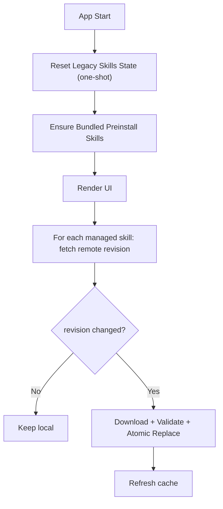

<!--
[INPUT]:
- 目标：Moryflow PC 内置更多 skills，并支持“本地打包基线 + 在线逐项检查 + 自动覆盖更新”。
- 用户要求：每次应用打开都检查在线版本；有更新则下载并覆盖旧版本；新增 `agent-browser` 为自动预装。
- 约束：不做历史兼容，不做旧状态迁移；按新架构直接落地。

[OUTPUT]:
- 给出可执行技术方案：技能清单、模块划分、启动流程、更新算法、安全边界、测试与实施步骤。

[POS]:
- Moryflow PC Skills 内置与在线更新的单一事实源（方案阶段）。

[PROTOCOL]:
- 若方案进入实施，必须同步更新 `apps/moryflow/pc/src/main/skills/*` Header 与 `apps/moryflow/pc/CLAUDE.md`。
-->

# Moryflow PC 内置 Skills 在线同步方案

## 1. 目标

本方案直接按新架构重建 Skills 机制，满足以下结果：

1. 指定 skills 全部内置到安装包（离线可用）。
2. 区分“自动预装”与“推荐不预装”。
3. **每次应用冷启动**，对当前列表内每个 skill 的在线源逐项请求检查。
4. 若在线 revision 变化，自动下载并原子覆盖本地版本。
5. 更新失败不影响主链路（聊天/主界面继续可用）。

## 2. 目标技能清单（去重后）

说明：你给的列表里 `xlsx` 重复出现两次，按一个 skill 去重；`blob` 链接按对应目录路径处理。

### 2.1 自动预装（13 个）

| skill                 | source URL                                                                  | preinstall |
| --------------------- | --------------------------------------------------------------------------- | ---------- |
| xlsx                  | https://github.com/anthropics/skills/tree/main/skills/xlsx                  | true       |
| algorithmic-art       | https://github.com/anthropics/skills/tree/main/skills/algorithmic-art       | true       |
| canvas-design         | https://github.com/anthropics/skills/tree/main/skills/canvas-design         | true       |
| docx                  | https://github.com/anthropics/skills/tree/main/skills/docx                  | true       |
| frontend-design       | https://github.com/anthropics/skills/tree/main/skills/frontend-design       | true       |
| internal-comms        | https://github.com/anthropics/skills/tree/main/skills/internal-comms        | true       |
| pdf                   | https://github.com/anthropics/skills/tree/main/skills/pdf                   | true       |
| pptx                  | https://github.com/anthropics/skills/tree/main/skills/pptx                  | true       |
| skill-creator         | https://github.com/anthropics/skills/tree/main/skills/skill-creator         | true       |
| theme-factory         | https://github.com/anthropics/skills/tree/main/skills/theme-factory         | true       |
| web-artifacts-builder | https://github.com/anthropics/skills/tree/main/skills/web-artifacts-builder | true       |
| find-skills           | https://github.com/vercel-labs/skills/tree/main/skills/find-skills          | true       |
| agent-browser         | https://github.com/vercel-labs/agent-browser/tree/main/skills/agent-browser | true       |

### 2.2 内置推荐但不自动预装（2 个）

| skill                     | source URL                                                                        | preinstall |
| ------------------------- | --------------------------------------------------------------------------------- | ---------- |
| remotion                  | https://github.com/remotion-dev/skills/tree/main/skills/remotion                  | false      |
| baoyu-article-illustrator | https://github.com/JimLiu/baoyu-skills/tree/main/skills/baoyu-article-illustrator | false      |

## 3. 设计原则（最佳实践，避免过度设计）

1. **单一职责**：Catalog、在线检查、下载覆盖、状态存储分模块实现。
2. **不引入额外中台**：不新增自建 manifest 服务，直接检查每个 skill 的官方源。
3. **默认可离线运行**：内置基线始终可用；在线更新是增强而非依赖。
4. **破坏式重建**：不做历史兼容，不做迁移逻辑，旧 skills 状态直接清空后重建。
5. **原子更新优先**：覆盖更新必须可回滚，不可半更新。

## 4. 架构

采用“四模块”最小架构：

1. `skills-catalog.ts`：声明受管 skills 列表（name/source/preinstall/recommended/ref/path）。
2. `skills-remote.ts`：逐 skill 在线检查最新 revision。
3. `skills-installer.ts`：下载、校验、原子覆盖、回滚。
4. `skills-registry.ts`：启动编排、内存缓存与 IPC 出口。



## 5. 启动流程（每次冷启动）

### 5.1 一次性清空旧状态（实施切换时）

本次重构按“无兼容”执行：

1. 删除 `~/.moryflow/skills/`
2. 删除 `~/.moryflow/skills-state.json`
3. 删除 `~/.moryflow/skills-update.lock`（若存在）

然后按新结构重建。

### 5.2 正常启动流程

1. 读取 `skills-catalog`。
2. 先确保 `preinstall=true` 项从 bundled 安装到本地（缺失即装）。
3. UI 可立即显示本地可用 skills。
4. 后台启动在线检查任务：
   - 对 catalog 中每个 skill **逐项请求**在线 revision。
   - 并发上限建议 3~4（防止瞬时请求过多）。
5. 比对本地 revision，发现变化就下载并原子覆盖。
6. 覆盖成功后刷新 registry cache，UI 自动感知。

## 6. 在线检查与更新算法

### 6.1 revision 检查（逐 skill 请求）

对每个 skill 请求 GitHub API：

- `GET /repos/{owner}/{repo}/commits?sha={ref}&path={skillPath}&per_page=1`

取返回首条 commit SHA 作为 remote revision。

说明：

1. 每个 skill 独立请求，满足“列表中都要检查”的要求。
2. 请求超时建议 5s；单项失败仅跳过该 skill，不中断全局。

### 6.2 下载与覆盖

remote revision != local revision 时执行：

1. 下载仓库 zip（固定 commit SHA）。
2. 解压并定位 skill 子目录。
3. 校验：
   - 存在 `SKILL.md`
   - 禁止符号链接逃逸
   - 文件数与总大小不超过上限
4. 原子替换：
   - `target -> backup`
   - `staging -> target`
   - 成功删除 backup
   - 失败回滚 `backup -> target`
5. 写入新 revision 到本地状态。

## 7. 本地状态（新结构，零迁移）

文件：`~/.moryflow/skills-state.json`

```json
{
  "disabled": ["remotion"],
  "managedSkills": {
    "agent-browser": {
      "sourceUrl": "https://github.com/vercel-labs/agent-browser/tree/main/skills/agent-browser",
      "revision": "<git-sha>",
      "checkedAt": 0,
      "updatedAt": 0
    }
  }
}
```

约束：

1. 不保留 `curatedPreinstalled`。
2. 不做历史字段迁移；不存在则按空状态初始化。
3. `disabled` 仅控制启用状态；更新不改这个字段。

## 8. 安全与稳定性边界

1. 远端 URL 必须 `https` + host 白名单：
   - API：`api.github.com`
   - 文件下载：`raw.githubusercontent.com`、`codeload.github.com`
2. 解压路径必须在临时目录内，禁止路径穿越。
3. 更新任务串行写入目标目录，避免并发覆盖。
4. 更新失败保留旧版本并记录日志，不阻塞主流程。

## 9. 实施步骤

### Step 1：重建 Catalog

- 新建 `skills-catalog.ts`，落地 15 个内置项（13 预装 + 2 推荐）。
- 新增 `agent-browser` 自动预装。

### Step 2：重建状态与存储

- 删除旧的 `curatedPreinstalled` 逻辑。
- 新状态仅保留 `disabled + managedSkills`。

### Step 3：实现逐项在线检查

- 新建 `skills-remote.ts`，按 skill 路径查询最新 commit SHA。
- 启动时对所有受管 skills 执行检查（并发受控）。

### Step 4：实现原子更新器

- 新建 `skills-installer.ts`，负责下载、校验、原子替换、回滚。

### Step 5：编排到 Registry

- `refresh()` 拆分为：
  - 前台：确保预装 + 立即可用
  - 后台：逐项检查并更新

### Step 6：测试与验收

- 单测：revision 判定、覆盖回滚、disabled 保留。
- 集成：mock GitHub API + mock zip 下载。
- 手测：离线启动、网络抖动、更新失败、重复启动。

## 10. 验收标准

1. 首次启动可见 13 个预装 skill。
2. 每次冷启动都会对列表内 skills 发起在线 revision 检查。
3. 任一 skill 在线 revision 变化后，下一次启动可自动更新并覆盖本地旧版。
4. 用户手动禁用 skill 后，自动更新不改变禁用状态。
5. 推荐区仅展示未安装的推荐项（当前为 `remotion`、`baoyu-article-illustrator`）。

## 11. 风险与执行备注

1. GitHub API 速率限制：建议支持 `GITHUB_TOKEN`（若存在则自动带上）。
2. 上游路径变动：若仓库重构导致路径失效，该项应记录错误并跳过，不影响其他项。
3. 同名 skill 来源冲突：`skill-creator` 以 catalog 声明 source 为准，禁止多源同名混装。

## 12. 执行进度（实施同步）

| Step | 内容                                                             | 状态 | 更新时间   |
| ---- | ---------------------------------------------------------------- | ---- | ---------- |
| 1    | 内置 baseline 目录扩展到目标 15 个 skills                        | DONE | 2026-03-03 |
| 2    | Skills 模块重构为 catalog/remote/installer/registry 单一职责结构 | DONE | 2026-03-03 |
| 3    | 启动逐项在线检查 + 自动原子覆盖更新                              | DONE | 2026-03-03 |
| 4    | 单元测试补齐（核心回归）                                         | DONE | 2026-03-03 |
| 5    | 文档与 CLAUDE 同步回写                                           | DONE | 2026-03-03 |
| 6    | 验证（typecheck/test）                                           | DONE | 2026-03-03 |

### 12.1 验证记录

- `pnpm --filter @moryflow/pc typecheck` ✅
- `pnpm --filter @moryflow/pc test:unit` ✅（新增 `src/main/skills/{catalog,state,remote}.test.ts` 均通过）
- `pnpm lint` ✅
- `pnpm typecheck` ✅
- `pnpm test:unit` ✅

### 12.2 Review 闭环（2026-03-03）

1. 已移除兼容导入链路：`refresh()` 不再扫描 `~/.agents/.claude/.codex/.clawdbot`。
2. 已收口远端下载安全边界：
   - `download_url` 强制 `https` + host 白名单（`raw.githubusercontent.com`/`codeload.github.com`）。
   - API 请求与文件下载分离鉴权头；下载请求不再携带 `Authorization`。
3. 已修复模板安全扫描误报风险：`agent-browser` 示例脚本移除疑似明文口令赋值写法，并将旧口令环境变量收敛为 `APP_LOGIN_SECRET`，仅保留“通过环境变量注入凭证”的指引文案。
