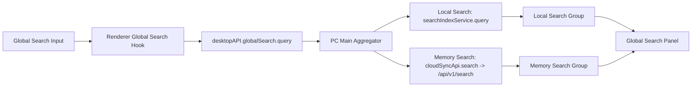

# Moryflow PC Global Search Local + Memory Integration Design

> 本文冻结首期全局搜索 `Local Search + Memory Search` 集成设计，只定义目标、边界、交互与数据流，不拆实现任务。

## 目标

- 保留当前 PC 全局搜索的单一输入框。
- 在同一搜索面板内同时提供两组结果：
  - `Local Search`
  - `Memory Search`
- `Local Search` 继续使用本地 SQLite FTS。
- `Memory Search` 复用当前已接通的 Moryflow Server + Anyhunt Memox 搜索链。
- 未登录或当前 workspace 未绑定云端 vault 时，只显示 `Local Search`。

## 当前事实

### 本地搜索现状

- 当前 PC 全局搜索仍然只走本地索引：
  - `apps/moryflow/pc/src/renderer/components/global-search/use-global-search.ts`
  - `apps/moryflow/pc/src/main/search-index/index.ts`
  - `apps/moryflow/pc/src/main/app/ipc-handlers.ts`
- 本地搜索的职责是：
  - 快速
  - 离线
  - 当前 workspace 内的确定性结果

### Memory 搜索现状

- Moryflow Server 已经固定接到 Anyhunt Memox 搜索链：
  - `apps/moryflow/server/src/search/search.service.ts`
  - `apps/moryflow/server/src/search/search-backend.service.ts`
  - `apps/moryflow/server/src/memox/memox-search-adapter.service.ts`
- PC main 已经有可调用的云同步搜索链：
  - `apps/moryflow/pc/src/main/cloud-sync/api/client.ts`
  - `apps/moryflow/pc/src/main/app/cloud-sync-ipc-handlers.ts`
- 当前主全局搜索 UI 还没有消费这条 Memory 搜索链。

### 当前阶段边界

- 首期只把 `Memory Search` 接入全局搜索面板。
- 首期不把 `Memory Search` 接入：
  - 对话检索
  - MCP 工具
  - Agent runtime
  - 额外设置开关

## 范围冻结

### 固定交互

- 全局搜索保持单输入框。
- 默认同时查询：
  - 本地搜索
  - Memory 搜索
- 结果固定分组展示，不混排：
  - `Local Search`
  - `Memory Search`

### 固定上下文

- `Memory Search` 只查询当前 workspace 对应的云端 vault。
- 不查询当前用户的全部远端内容。
- 不做跨 vault 搜索。

### 固定可见性

- 已登录且当前 workspace 已绑定云端 vault：显示 `Memory Search`
- 未登录、未绑定、当前 workspace 不可用：不显示 `Memory Search`
- 不新增设置开关
- 不新增教育性文案

### 固定点击行为

- `Local Search` 保持当前行为。
- `Memory Search`：
  - 有 `localPath`：按本地文件正常打开
  - 无 `localPath`：结果直接禁用

## 设计决策

### 方案选择

首期采用 **PC Main 聚合搜索**，不采用 renderer 双查，也不采用服务端聚合。

原因：

- 本地搜索真相源在 PC main，而不是服务端。
- 登录态、workspace、vault binding、降级逻辑都更适合在 main 统一收口。
- renderer 不应理解两套搜索协议和失败语义。
- 后续若增加缓存、埋点、超时控制、竞态取消，也应集中在 main。

### 聚合入口

新增一条全局搜索聚合入口，由 PC main 对外提供统一查询结果。

推荐形态：

- `desktopAPI.globalSearch.query(...)`

这条入口负责：

- 读取当前 workspace
- 判断当前登录态
- 判断当前 workspace 是否已绑定云端 vault
- 并发执行本地搜索与 Memory 搜索
- 对两组结果统一整形
- 统一收口 `loading / skipped / error`

### 不复用当前本地搜索 IPC 的原因

当前 `desktopAPI.search.query(...)` 的语义是“本地搜索”。  
首期不直接把它偷偷扩展成双查，否则会破坏现有边界，也会让调用方无法判断本地与远端结果来源。

首期应新增独立聚合 IPC，并让全局搜索面板切到新入口。

## 数据流

## 返回模型

首期返回模型采用分组状态模型，而不是单列表混排模型。

### Query Input

- `query`
- `limitPerGroup`

### Group Status

- `ready`
- `loading`
- `skipped`
- `error`

### Query Result

- `local`
  - `status`
  - `items`
  - `error?`
- `memory`
  - `status`
  - `items`
  - `error?`
- `tookMs`

### Memory Result 约束

Memory 结果沿用服务端返回顺序与主字段，但在 PC main 聚合层补一层 UI 所需的确定性字段：

- `disabled`
- `localPath`
- `score`
- `snippet`

其中：

- `disabled = true` 当且仅当该条结果没有可打开的本地路径

## 渲染规则

### Local Search

- 一直显示
- 继续沿用当前本地搜索排序与渲染方式

### Memory Search

- 仅当 `status !== skipped` 时显示
- `loading`：显示简单 `Loading...`
- `error`：显示 `Unavailable`
- `ready`：显示 `Memory Search` 结果列表

### 结果数量

- `Local Search` 与 `Memory Search` 各自独立使用 `limitPerGroup`
- 两组互不竞争名额

## 排序规则

- `Local Search`：保持当前本地排序
- `Memory Search`：严格按服务端返回顺序
- 两组之间不混排
- 首期不做统一重排序
- 首期不做跨组融合 ranking

## 加载与降级策略

### 加载策略

- 输入后先返回本地结果
- `Memory Search` 异步补齐
- `Memory Search` 不得阻塞整个全局搜索面板

### 降级策略

- 未登录：只显示 `Local Search`
- 当前 workspace 未绑定：只显示 `Local Search`
- `Memory Search` 请求失败：只影响 `Memory Search` 分组
- `Memory Search` 请求超时：视为该分组 `Unavailable`
- 任意远端失败都不能清空或阻塞 `Local Search`

### 首期不做

- 本地与远端统一缓存层
- 本地与远端统一排序
- 远端预取
- 设置开关
- 首次教育引导

## UI 文案冻结

- 分组标题：
  - `Local Search`
  - `Memory Search`
- Memory 分组状态文案：
  - `Loading...`
  - `Unavailable`

首期不增加额外解释文案。

## 首期影响范围

### PC Main

- `apps/moryflow/pc/src/main/app/ipc-handlers.ts`
- `apps/moryflow/pc/src/main/search-index/*`
- `apps/moryflow/pc/src/main/cloud-sync/api/client.ts`
- 新增一层 global-search 聚合 service

### Shared IPC

- `apps/moryflow/pc/src/shared/ipc/desktop-api.ts`
- `apps/moryflow/pc/src/shared/ipc/*`

### Renderer

- `apps/moryflow/pc/src/renderer/components/global-search/use-global-search.ts`
- `apps/moryflow/pc/src/renderer/components/global-search/*`

### 不改动区域

- Moryflow Server 搜索合同
- Anyhunt 检索合同
- 对话 / MCP / Agent runtime

## 验证基线

首期设计验收必须覆盖以下稳定场景：

1. 未登录时：
   - 只显示 `Local Search`
   - 不显示 `Memory Search`

2. 已登录但当前 workspace 未绑定时：
   - 只显示 `Local Search`
   - 不显示 `Memory Search`

3. 已登录且已绑定时：
   - `Local Search` 先返回
   - `Memory Search` 异步补齐

4. `Memory Search` 失败时：
   - `Local Search` 仍正常显示
   - `Memory Search` 分组显示 `Unavailable`

5. `Memory Search` 命中但无 `localPath` 时：
   - 结果显示
   - 结果不可点击

6. `Memory Search` 命中且有 `localPath` 时：
   - 结果可点击
   - 点击后按本地文件正常打开

## 结论

首期全局搜索集成的目标不是替换本地搜索，而是在现有全局搜索面板内稳定接入一组受控的 `Memory Search` 结果。

系统职责在首期保持清晰：

- `Local Search` 负责快、离线、确定性结果
- `Memory Search` 负责当前 workspace 对应云端 vault 的远端语义召回
- PC main 负责聚合、降级与状态收口
- renderer 只负责分组展示

这份文档冻结首期设计，不包含实现拆解与任务分配。
