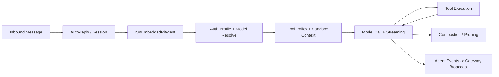
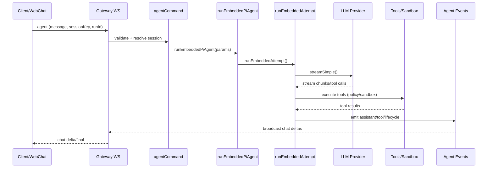
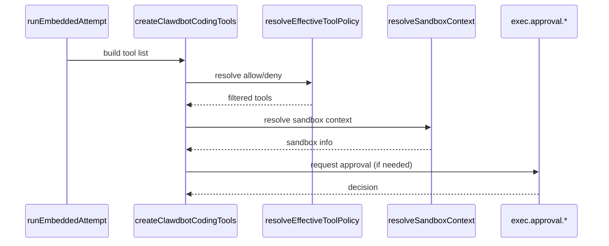
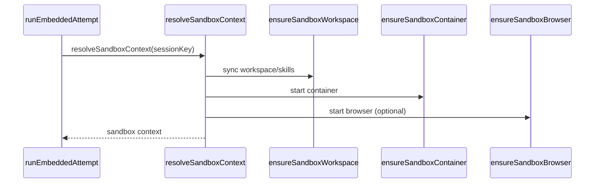
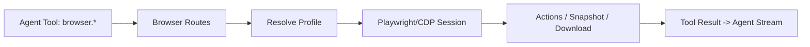
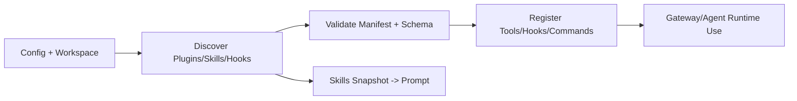

> 目标：梳理 Clawdbot 的整体架构与功能，并提炼对 Anyhunt/Moryflow 有价值的借鉴点，重点关注 AI 交互与运行时控制面。
>
> 参考来源：本地代码（`external-repos/clawdbot`）+ README + 官方 docs。

## 1. 本地研究流程（统一约定）

> 约定外部参考仓库统一放在根目录 `external-repos/`，并保持 `.gitignore` 忽略该目录。

1. 创建目录（若不存在）：

```bash
mkdir -p external-repos
```

2. 拉取仓库：

```bash
git clone https://github.com/clawdbot/clawdbot external-repos/clawdbot
```

3. 本地阅读重点：

- `README.md`
- `docs/`（尤其 `docs/concepts/` 与 `docs/gateway/`）
- `src/`（`gateway/`、`agents/`、`auto-reply/`、`channels/`、`routing/`、`sessions/`）

> 说明：已在 `external-repos/clawdbot` 完成代码核对（2026-01-27）。

## 2. 代码核对信息

- 核对日期：2026-01-27
- 核对范围：`src/`、`apps/`、`extensions/`、`ui/`、`skills/`、`docs/`
- 核对方式：以本地代码与目录结构为准，必要处对照 README/docs

## 3. 仓库结构速览

- `src/`：核心实现（Gateway、Agent、Channels、Tools、Memory、Browser、Hooks、Plugins 等）
- `apps/`：客户端与节点应用（`macos/`、`ios/`、`android/`、`shared/`）
- `extensions/`：渠道与能力扩展（含 Google Chat/Matrix/Zalo 等）
- `ui/`：控制台/控制面 UI（Vite 构建）
- `skills/`：技能目录（SKILL.md 驱动）
- `docs/`：官方文档与概念说明
- `scripts/`：构建/运维脚本（协议生成、打包、测试等）
- `assets/`、`vendor/`：资源与内置依赖

## 4. 架构概览（核心组件）

### 4.1 控制面与消息流

- **Gateway** 是统一控制面（`src/gateway/`），通过 WS/HTTP 接入渠道、客户端、节点与工具。
- WS 侧负责 **事件流、会话、通道、节点** 管理，HTTP 侧提供 **OpenAI 兼容接口** 与控制面资源。
- 入口消息流（代码级实现）：

```
Channels / WebChat / CLI / Apps
        ▼
Gateway WS/HTTP
        ▼
Auto-Reply + Routing + Sessions
        ▼
Agent Runtime (pi-agent-core)
        ▼
Tools / Browser / Nodes / Memory
        ▼
Channel 回复或 WebChat 输出
```

### 4.2 Agent Runtime（嵌入式 pi-agent）

- `src/agents/pi-embedded-runner/*` 负责运行、队列、终止、等待、上下文裁剪与 sandbox 信息构建。
- `src/agents/pi-tools.ts` 汇总工具定义与策略（allow/deny、provider 兼容、sandbox 约束）。
- `src/agents/model-*` 与 `auth-profiles` 负责模型选择、授权与 failover。

### 4.3 Nodes + Canvas

- `src/node-host/` 为节点连接与能力暴露的宿主侧运行器。
- `src/canvas-host/` 提供 A2UI/Canvas Host（WS/HTTP）接口。
- `apps/*` 提供 macOS/iOS/Android 设备端能力与控制面 UI。

### 4.4 Hooks / Plugins / Skills

- `src/hooks/` 支持 workspace hooks 与内置 hooks（含 Gmail watcher）。
- `src/plugins/` 提供插件发现、安装、挂载、工具暴露。
- `src/agents/skills` + `skills/` 维护技能目录与刷新逻辑。

## 5. 功能清单（模块级 + 子功能要点）

### 5.1 Gateway 控制面（`src/gateway/`）

- WS 控制面：`connect`、`chat`、`agent`、`sessions`、`channels`、`nodes`、`skills`、`logs`、`usage`
- HTTP 端点：`/v1/chat/completions`、`/v1/responses`、Control UI/WebChat 资源服务
- Runtime 管理：config reload、runtime state、health/presence、startup/maintenance
- 节点体系：Node registry、subscriptions、node events、mobile nodes
- 运维能力：exec approval、model catalog、cron、Tailscale exposure、discovery

### 5.2 Agent Runtime（`src/agents/`）

- 嵌入式运行：run/queue/abort/wait、lane concurrency、streaming 事件
- 上下文管理：history limit、compaction、context pruning、tool result guard
- 模型与授权：auth profiles、model selection、failover、provider 兼容修正
- 工具策略：全局/agent/group tool policy、schema 归一化、provider 参数兼容
- 子代理：subagent registry、spawn/announce、跨 agent session 继承策略

### 5.3 Auto-reply（`src/auto-reply/`、`src/web/auto-reply/`）

- 指令与命令：inline directives、命令注册/解析、模型指令与 thinking 控制
- 激活策略：group activation、mention gating、DM 管控、pairing 结合
- 回复编排：chunking、队列与节流、typing heartbeat、工具摘要
- 媒体处理：media note、inbound debounce、模板化回复

### 5.4 Channels 框架与实现（`src/channels/` + `src/*`）

- 通道框架：allowlist、mention/command gating、typing indicators、ack reactions
- 渠道配置：plugin config、onboarding、pairing/allowlist helpers
- 内置渠道：WhatsApp、Telegram、Slack、Discord、Signal、iMessage、LINE、Web channel
- 渠道动作工具：Discord/Slack/Telegram/WhatsApp actions

### 5.5 Extensions（`extensions/`）

- 渠道扩展：Google Chat、Matrix、MS Teams、Zalo/Zalo Personal、BlueBubbles、Nextcloud Talk、Mattermost、Twitch、Nostr、Tlon
- 认证/能力扩展：Google auth、Qwen portal auth、Copilot proxy、Voice call
- 内存扩展：memory-core、memory-lancedb
- 诊断扩展：diagnostics-otel

### 5.6 Agent Tools（`src/agents/tools/`）

- 核心工具：browser、canvas、nodes、cron、gateway、sessions、message、memory、image、tts
- Web 工具：web-fetch、web-search、readability 处理与 SSRF 保护
- 会话工具：sessions list/send/history/spawn、session status

### 5.7 Browser 自动化（`src/browser/`）

- Chrome/Chromium + CDP 控制，Playwright session 管理
- Profiles 与 extension relay（远程 tab/target 选择）
- Snapshot/screenshot/download/trace 相关工具链
- Server context 与 agent contract 适配

### 5.8 Nodes + Canvas（`src/node-host/`、`src/canvas-host/`、`apps/`）

- Node host：能力注册、连接、状态/权限、事件订阅
- Canvas host：A2UI bundle、canvas server
- 设备端：macOS/iOS/Android 应用与共享组件

### 5.9 Memory（`src/memory/`）

- Embeddings：OpenAI/Gemini 批处理
- sqlite-vec 存储与混合检索（hybrid search）
- Session 文件与 memory 文件同步

### 5.10 Media Pipeline（`src/media/`）

- 媒体抓取与存储：fetch/store/host
- 图片处理：image ops、尺寸与格式校验
- MIME 解析、音频标签与临时文件生命周期

### 5.11 Media Understanding（`src/media-understanding/`）

- 多模态解析：audio/vision/video runners
- providers 选择、并发控制、格式化输出

### 5.12 Web 控制台与 WebChat（`src/web/`、`ui/`）

- WebChat 登录/QR、session 管理、inbound/outbound
- web auto-reply（媒体处理、@mention gating、typing 控制）
- Control UI 构建与资源分发

### 5.13 Hooks 与自动化（`src/hooks/`、`src/cron/`）

- hooks loader、workspace hooks、internal hooks
- Gmail watcher/ops（Pub/Sub）
- Cron 调度与事件触发

### 5.14 Plugins 与 Skills（`src/plugins/`、`src/agents/skills/`、`skills/`）

- 插件发现/安装/更新/加载、manifest 与 schema 校验
- 插件 hooks 与 tools 暴露
- skills 目录、workspace skills、刷新与序列化

### 5.15 安全与审计（`src/security/`、`src/pairing/`、`src/gateway/exec-approval*`）

- 安全审计与修复（filesystem audit、external content 审计、Windows ACL）
- Pairing/allowlist 流程
- Exec approval 与运行时安全提示

### 5.16 配置/基础设施/日志（`src/config/`、`src/infra/`、`src/logging/`）

- 配置加载与迁移、plugin auto-enable、env normalization
- 更新检查、诊断、重启策略、技能远程缓存
- 结构化日志与 diagnostic heartbeat

### 5.17 CLI / TUI / Daemon（`src/cli/`、`src/commands/`、`src/tui/`、`src/daemon/`）

- CLI：onboard/config/agent/message/memory/browser/status/health/sessions 等
- TUI：终端交互界面与进度展示
- Daemon：launchd/systemd/schtasks 服务安装与维护

### 5.18 ACP（`src/acp/`）

- Agent Client Protocol 客户端与服务器桥接
- 会话映射与事件转换

## 6. AI 交互机制拆解（重点）

### 6.1 Agent Loop（运行时编排）

- `runEmbeddedPiAgent` + `queueEmbeddedPiMessage` 负责 run/queue/abort/wait（`src/agents/pi-embedded-runner/*`）。
- Streaming 由 `infra/agent-events` 聚合，区分 assistant/tool/lifecycle 事件流。
- lane concurrency 与 session key 绑定，保证同一会话的串行一致性。

### 6.2 会话与路由

- `src/routing/` 解析 agent bindings 与 session key 生成策略。
- `src/sessions/` 提供 send policy、model overrides、session label 与 transcript events。
- `dmScope`/group gating 由 auto-reply 与 channel 层共同控制。

### 6.3 Tool Policy + Sandbox

- `pi-tools.policy` + `sandbox/*` 将 tool allow/deny、workspace access、docker sandbox 统一分层。
- `exec-approval-manager` 在 Gateway 层做审批与状态透传。

### 6.4 Inline 指令与回复编排

- auto-reply 内置指令与模型选择（thinking/elevated/model 指令）。
- 回复过程支持 chunking/typing/queue，并可插入工具摘要与状态信息。

### 6.5 上下文治理

- `compaction` 与 `context-pruning` 在嵌入式 agent 层完成裁剪。
- `context-window-guard` + history limit 控制上下文规模与保真度。

## 7. 深挖模块（2/3/4/5/6）

### 7.1 模块 2：Agent Runtime（pi-embedded runner）

**功能要点**

- 嵌入式 run/queue/abort/wait 流水线，支持 session lane 与全局 lane 串行控制。
- auth profiles 轮转 + failover；模型与上下文窗口校验与拦截。
- 事件流统一进入 `infra/agent-events`，由 Gateway 转发到 WebChat/Nodes。
- compaction/context pruning 负责上下文治理，防止超窗或低效历史。

**关键文件映射**

- `external-repos/clawdbot/src/agents/pi-embedded-runner/run.ts`：run 主流程（auth profile、model resolve、context guard、failover）。
- `external-repos/clawdbot/src/agents/pi-embedded-runner/runs.ts`：run registry、queue/abort/wait 状态机。
- `external-repos/clawdbot/src/agents/compaction.ts`：摘要/分块策略与 token 估算。
- `external-repos/clawdbot/src/agents/pi-extensions/context-pruning/*`：上下文裁剪扩展。
- `external-repos/clawdbot/src/infra/agent-events.ts`：runId 级事件流与序号。
- `external-repos/clawdbot/src/gateway/server-chat.ts`：事件转为 chat delta/final 广播。

**简单流程图**



**调用链路（文件级）**

- `external-repos/clawdbot/src/gateway/server-methods/agent.ts` → `external-repos/clawdbot/src/commands/agent.ts`
- `external-repos/clawdbot/src/commands/agent.ts` → `external-repos/clawdbot/src/agents/pi-embedded-runner/run.ts`
- `external-repos/clawdbot/src/agents/pi-embedded-runner/run.ts` → `external-repos/clawdbot/src/agents/pi-embedded-runner/run/attempt.ts`
- `external-repos/clawdbot/src/agents/pi-embedded-runner/run/attempt.ts` → `external-repos/clawdbot/src/agents/pi-embedded-subscribe.ts`
- `external-repos/clawdbot/src/agents/pi-embedded-subscribe.ts` → `external-repos/clawdbot/src/infra/agent-events.ts` → `external-repos/clawdbot/src/gateway/server-chat.ts`
- `external-repos/clawdbot/src/gateway/server-methods/agent.ts (agent.wait)` → `external-repos/clawdbot/src/gateway/server-methods/agent-job.ts`

**风险点清单**

- auth profile 全部进入 cooldown 时会触发 failover/error，易影响长会话稳定性。
- 运行状态与 wait 缓存基于内存 Map，网关重启后 `agent.wait` 可能超时失效。
- compaction/summary 依赖模型结果，存在语义丢失与误总结风险。
- lane 队列模型在高并发时可能造成排队积压与响应延迟。
- streaming 事件依赖顺序一致性，若客户端丢包需要依赖 `seq` 补偿。

**关键流程时序图**



**交互约束**

- `agent` 请求必须包含 `idempotencyKey`，用于去重与重试防抖。
- `runId` 会被用于事件流与 `agent.wait` 对齐，客户端需保持一致。
- `agent.wait` 默认 `timeoutMs=30000`，并依赖内存缓存（重启会丢失）。
- `AgentEventPayload.seq` 按 runId 单调递增，客户端需按 seq 去重/补偿。
- `parseMessageWithAttachments` 限制单条附件总量（maxBytes 5MB）。

**错误码表（Agent Runtime 控制面）**

| 方法         | 错误码            | 触发场景                             | 来源                                                          |
| ------------ | ----------------- | ------------------------------------ | ------------------------------------------------------------- |
| `agent`      | `INVALID_REQUEST` | 参数校验失败/未知 agent/未知 channel | `external-repos/clawdbot/src/gateway/server-methods/agent.ts` |
| `agent`      | `UNAVAILABLE`     | 运行时异常、agentCommand 抛错        | `external-repos/clawdbot/src/gateway/server-methods/agent.ts` |
| `agent.wait` | `INVALID_REQUEST` | 参数校验失败                         | `external-repos/clawdbot/src/gateway/server-methods/agent.ts` |

**关键配置示例（Agent Runtime）**

```yaml
agents:
  defaults:
    model:
      primary: 'anthropic/claude-3-5-sonnet'
      fallbacks: ['openai/gpt-4.1']
    contextTokens: 200000
    thinkingDefault: 'high'
    verboseDefault: 'on'
    timeoutSeconds: 180
    maxConcurrent: 2
    heartbeat:
      every: '30m'
      includeReasoning: false
      prompt: 'Quick status check: summarize pending tasks.'
    compaction:
      mode: 'safeguard'
      reserveTokensFloor: 10000
      maxHistoryShare: 0.6
    contextPruning:
      mode: 'cache-ttl'
      ttl: '30d'
      keepLastAssistants: 6
      softTrimRatio: 0.6
      hardClearRatio: 0.9
    memorySearch:
      enabled: true
      sources: ['memory', 'sessions']
      provider: 'openai'
      fallback: 'local'
```

**文件级调用关系 + 接口对照表**

调用关系：

- `gateway/server-methods/agent.ts` → `commands/agent.ts` → `agents/pi-embedded-runner/run.ts`
- `agents/pi-embedded-runner/run.ts` → `agents/pi-embedded-runner/run/attempt.ts` → `agents/pi-embedded-subscribe.ts`
- `agents/pi-embedded-subscribe.ts` → `infra/agent-events.ts` → `gateway/server-chat.ts`
- `gateway/server-methods/agent.ts (agent.wait)` → `gateway/server-methods/agent-job.ts`

接口对照表：

| 接口/对象                                   | 文件                                                                  | 用途                   |
| ------------------------------------------- | --------------------------------------------------------------------- | ---------------------- |
| `agent` / `agent.wait` WS 方法              | `external-repos/clawdbot/src/gateway/server-methods/agent.ts`         | 运行与等待的控制面入口 |
| `AgentWaitParams` / 校验器                  | `external-repos/clawdbot/src/gateway/protocol/index.ts`               | 请求参数校验与错误体   |
| `AgentEventPayload`                         | `external-repos/clawdbot/src/infra/agent-events.ts`                   | 运行事件流载体         |
| `RunEmbeddedPiAgentParams`                  | `external-repos/clawdbot/src/agents/pi-embedded-runner/run/params.ts` | 嵌入式运行参数         |
| `EmbeddedPiRunResult` / `EmbeddedPiRunMeta` | `external-repos/clawdbot/src/agents/pi-embedded-runner/types.ts`      | 运行结果与元信息       |
| `AgentCommandOpts`                          | `external-repos/clawdbot/src/commands/agent/types.ts`                 | CLI/Gateway 入口参数   |

### 7.2 模块 3：Tool Policy + Sandbox

**功能要点**

- tool allow/deny 与 provider/tool group 归一化，支持 subagent 限制策略。
- sandbox 生命周期与 workspace access 分离（ro/rw + scope/容器）。
- exec approval 在 Gateway 层管理审批，防止高危命令直出。

**关键文件映射**

- `external-repos/clawdbot/src/agents/pi-tools.policy.ts`：工具策略解析（global/agent/group/subagent）。
- `external-repos/clawdbot/src/agents/tool-policy.ts`：tool group 展开与策略辅助。
- `external-repos/clawdbot/src/agents/sandbox/context.ts`：sandbox 运行时上下文与 workspace sync。
- `external-repos/clawdbot/src/agents/sandbox/tool-policy.ts`：sandbox tool policy 解析。
- `external-repos/clawdbot/src/gateway/exec-approval-manager.ts`：执行审批生命周期。
- `external-repos/clawdbot/src/agents/pi-tools.ts`：工具集合 + policy/sandbox 注入。

**简单流程图**

```mermaid
flowchart LR
  A[Session/Agent Context] --> B[Resolve Tool Policy]
  B --> C[Filter/Normalize Tools]
  C --> D[Resolve Sandbox Context]
  D --> E[Exec Approval (if needed)]
  E --> F[Tool Execution (Host/Sandbox)]
```

**调用链路（文件级）**

- `external-repos/clawdbot/src/agents/pi-embedded-runner/run/attempt.ts` → `external-repos/clawdbot/src/agents/pi-tools.ts`
- `external-repos/clawdbot/src/agents/pi-tools.ts` → `external-repos/clawdbot/src/agents/pi-tools.policy.ts` → `external-repos/clawdbot/src/agents/tool-policy.ts`
- `external-repos/clawdbot/src/agents/pi-embedded-runner/run/attempt.ts` → `external-repos/clawdbot/src/agents/sandbox/context.ts`
- `external-repos/clawdbot/src/agents/bash-tools.exec.ts` → `external-repos/clawdbot/src/gateway/server-methods/exec-approval.ts`

**风险点清单**

- allow/deny + profile + byProvider 多层叠加，策略优先级配置复杂，易造成误放行。
- `workspaceAccess=rw` 会绕过 sandbox workspace，落地时需严格权限控制。
- sandbox scope=shared 可能导致跨会话共享环境，存在数据串扰风险。
- exec approval 基于内存 pending，网关重启/超时会导致请求失效或重复审批。
- Docker/Browser sandbox 依赖外部镜像与启动时序，失败会影响工具可用性。

**关键流程时序图（Tool Policy）**



**交互约束（Tool Policy）**

- allow/deny 与 alsoAllow 不可同时设置（schema 强约束）。
- `byProvider` 支持 `provider` 或 `provider/model` 细分策略。
- subagent 具备默认 deny 列表，避免跨会话/系统级工具滥用。

**关键流程时序图（Sandbox）**



**交互约束（Sandbox）**

- `sandbox.mode` 仅允许 `off|non-main|all`。
- `sandbox.scope` 仅允许 `session|agent|shared`，shared 会共享环境。
- `workspaceAccess=rw` 时直接使用宿主 workspace（需权限审计）。

**错误码表（Tool Policy + Sandbox + Exec Approval）**

| 方法                          | 错误码            | 触发场景                      | 来源                                                                   |
| ----------------------------- | ----------------- | ----------------------------- | ---------------------------------------------------------------------- |
| `exec.approval.request`       | `INVALID_REQUEST` | 参数校验失败/重复 id          | `external-repos/clawdbot/src/gateway/server-methods/exec-approval.ts`  |
| `exec.approval.resolve`       | `INVALID_REQUEST` | 无效 decision/未知 approvalId | `external-repos/clawdbot/src/gateway/server-methods/exec-approval.ts`  |
| `exec.approvals.node.get/set` | `UNAVAILABLE`     | node invoke 失败              | `external-repos/clawdbot/src/gateway/server-methods/exec-approvals.ts` |

**关键配置示例（Tool Policy）**

```yaml
tools:
  profile: 'coding'
  allow: ['browser_*', 'web_search', 'memory_search', 'sessions_send']
  deny: ['exec']
  byProvider:
    openai:
      profile: 'minimal'
      allow: ['web_search', 'web_fetch']
  elevated:
    enabled: true
    allowFrom:
      openai: ['user_123', '+15551234567']
  exec:
    security: 'allowlist'
    ask: 'on-miss'
    safeBins: ['git', 'ls', 'rg']
    timeoutSec: 60
  sandbox:
    tools:
      allow: ['browser_*', 'web_*']
```

**关键配置示例（Sandbox）**

```yaml
agents:
  defaults:
    sandbox:
      mode: 'non-main'
      scope: 'session'
      workspaceAccess: 'ro'
      workspaceRoot: '~/.clawdbot/sandboxes'
      docker:
        image: 'ghcr.io/clawdbot/sandbox:latest'
        workdir: '/workspace'
        network: 'none'
      browser:
        enabled: true
        allowHostControl: false
      prune:
        idleHours: 12
        maxAgeDays: 7
```

**文件级调用关系 + 接口对照表**

调用关系：

- `agents/pi-embedded-runner/run/attempt.ts` → `agents/pi-tools.ts` → `agents/pi-tools.policy.ts`
- `agents/pi-embedded-runner/run/attempt.ts` → `agents/sandbox/context.ts` → `agents/sandbox/docker.ts`
- `agents/bash-tools.exec.ts` → `gateway/server-methods/exec-approval.ts` → `gateway/exec-approval-manager.ts`

接口对照表：

| 接口/对象                                         | 文件                                                                  | 用途                      |
| ------------------------------------------------- | --------------------------------------------------------------------- | ------------------------- |
| `ToolPolicyConfig` / `AgentToolsConfig`           | `external-repos/clawdbot/src/config/types.tools.ts`                   | 工具策略与 exec 配置      |
| `SandboxConfig` / `SandboxContext`                | `external-repos/clawdbot/src/agents/sandbox/types.ts`                 | sandbox 运行时契约        |
| `SandboxToolPolicy`                               | `external-repos/clawdbot/src/agents/sandbox/types.ts`                 | sandbox 级工具 allow/deny |
| `exec.approval.request` / `exec.approval.resolve` | `external-repos/clawdbot/src/gateway/server-methods/exec-approval.ts` | 审批通道与决策            |
| `AnyAgentTool`                                    | `external-repos/clawdbot/src/agents/pi-tools.types.ts`                | 工具定义统一类型          |

### 7.3 模块 4：Agent Browser

**功能要点**

- 本地 browser control server（Express）+ routes 分发。
- Profile 管理 + extension relay 支持（CDP/Playwright）。
- snapshots/actions/download/trace 等能力封装为 agent tools。

**关键文件映射**

- `external-repos/clawdbot/src/browser/server.ts`：浏览器控制服务与 profiles 初始化。
- `external-repos/clawdbot/src/browser/routes/*`：基础/Tab/Agent 路由。
- `external-repos/clawdbot/src/browser/pw-session.ts`：Playwright session 与 target 管理。
- `external-repos/clawdbot/src/browser/pw-tools-core.*`：交互、下载、截图、trace 工具链。
- `external-repos/clawdbot/src/agents/tools/browser-tool.ts`：对外 agent tool 封装。

**简单流程图**



**调用链路（文件级）**

- `external-repos/clawdbot/src/agents/tools/browser-tool.ts` → `external-repos/clawdbot/src/browser/client.ts`
- `external-repos/clawdbot/src/browser/client.ts` → `external-repos/clawdbot/src/browser/server.ts`
- `external-repos/clawdbot/src/browser/server.ts` → `external-repos/clawdbot/src/browser/routes/*`
- `external-repos/clawdbot/src/browser/routes/*` → `external-repos/clawdbot/src/browser/pw-session.ts` → `external-repos/clawdbot/src/browser/pw-tools-core.*`
- Node 模式：`external-repos/clawdbot/src/agents/tools/browser-tool.ts` → `external-repos/clawdbot/src/gateway/server-methods/nodes.ts (node.invoke)`

**风险点清单**

- host/节点/沙盒三种目标切换复杂，配置错误会导致实际落点偏差。
- 浏览器 session 与 profile 复用可能引入状态污染（cookies/storage）。
- 下载与截图输出路径需严格隔离，防止跨会话数据泄漏。
- browser proxy 依赖节点在线状态，多节点场景下需明确选择策略。

### 7.4 模块 5：Plugins + Skills + Hooks

**功能要点**

- 插件发现/加载/校验，支持 schema 验证与 hook/tool 注册。
- skills 目录多来源合并（bundled/managed/workspace/extra）。
- hooks 支持 workspace 目录与 legacy config 双路径加载。

**关键文件映射**

- `external-repos/clawdbot/src/plugins/loader.ts`：插件发现、manifest 校验与注册。
- `external-repos/clawdbot/src/plugins/registry.ts`：插件记录与运行时注册表。
- `external-repos/clawdbot/src/agents/skills/workspace.ts`：skills 加载与快照构建。
- `external-repos/clawdbot/src/hooks/loader.ts`：workspace hooks + legacy hooks 加载。
- `external-repos/clawdbot/src/hooks/internal-hooks.ts`：内置 hook 注册与事件分发。

**简单流程图**



**调用链路（文件级）**

- `external-repos/clawdbot/src/gateway/server-plugins.ts` → `external-repos/clawdbot/src/plugins/loader.ts`
- `external-repos/clawdbot/src/plugins/loader.ts` → `external-repos/clawdbot/src/plugins/registry.ts`
- `external-repos/clawdbot/src/plugins/loader.ts` → `external-repos/clawdbot/src/plugins/hook-runner-global.ts`
- `external-repos/clawdbot/src/agents/skills/workspace.ts` → `external-repos/clawdbot/src/agents/skills/refresh.ts`
- `external-repos/clawdbot/src/hooks/loader.ts` → `external-repos/clawdbot/src/hooks/internal-hooks.ts`

**风险点清单**

- 插件动态加载依赖 `jiti` 执行，若来源不可信存在执行风险。
- manifest/schema 校验失败会导致插件不可用，需要完善诊断信息。
- skills 合并优先级（extra < bundled < managed < workspace）可能导致覆盖冲突。
- hooks 允许动态执行任意逻辑，需明确事件范围与权限边界。

### 7.5 模块 6：Memory Pipeline

**功能要点**

- memory 与 session transcript 双来源索引。
- Embeddings 支持 OpenAI/Gemini + batch 任务。
- sqlite-vec + FTS + hybrid rank 融合检索。

**关键文件映射**

- `external-repos/clawdbot/src/memory/manager.ts`：索引管理与 watcher、batch embedding。
- `external-repos/clawdbot/src/memory/embeddings.ts`：provider 抽象与客户端选择。
- `external-repos/clawdbot/src/memory/sqlite-vec.ts`：sqlite-vec 扩展加载。
- `external-repos/clawdbot/src/memory/hybrid.ts`：vector + keyword 混合排序。
- `external-repos/clawdbot/src/agents/memory-search.ts`：memory 搜索配置与解析。

**简单流程图**


**调用链路（文件级）**

- `external-repos/clawdbot/src/agents/tools/memory-tool.ts` → `external-repos/clawdbot/src/memory/search-manager.ts`
- `external-repos/clawdbot/src/memory/search-manager.ts` → `external-repos/clawdbot/src/memory/manager.ts`
- `external-repos/clawdbot/src/memory/manager.ts` → `external-repos/clawdbot/src/memory/embeddings.ts`
- `external-repos/clawdbot/src/memory/manager.ts` → `external-repos/clawdbot/src/memory/sqlite-vec.ts` → `external-repos/clawdbot/src/memory/hybrid.ts`

**风险点清单**

- sqlite-vec 扩展加载失败会导致向量检索降级或不可用。
- embedding 批处理依赖外部 provider，超时/限流会触发 fallback 或失败。
- session transcript watch 量大时易造成索引滞后或 IO 压力。
- 多来源索引一致性需要定期重建与错误恢复策略。

## 8. 对照表（模块 → 对应子系统 → 差异/借鉴点）

| Clawdbot 模块            | Anyhunt/Moryflow 对应子系统   | 差异/借鉴点                                                                               |
| ------------------------ | ----------------------------- | ----------------------------------------------------------------------------------------- |
| Agent Runtime            | Moryflow Agent Runtime 控制面 | run/queue/abort/wait 显式语义适合映射到 Tasks/ChatId；lane concurrency 可作为队列治理基线 |
| Tool Policy + Sandbox    | Sandx + 权限/审批系统         | tool allow/deny 与 sandbox 分离；exec approval 统一入口值得复用                           |
| Agent Browser            | Anyhunt Agent Browser         | profile + extension relay 机制可用于多会话/多实例隔离                                     |
| Plugins + Skills + Hooks | Anyhunt 插件/Skills 平台      | manifest + schema 校验与 workspace 合并策略，适合做统一扩展协议                           |
| Memory Pipeline          | Memox + Fetchx                | sqlite-vec + hybrid search 的本地索引思路适合在轻量场景落地                               |

## 9. 可借鉴点（对 Anyhunt/Moryflow）

### 7.1 控制面协议化

- Gateway WS 方法清单 + schema 化模型 → 适合作为 Anyhunt Agent 控制面骨架。
- `connect/health/presence` 的状态版本化机制可复用为 UI 同步协议。

### 7.2 Agent 生命周期与并发模型

- `run/queue/abort/wait` 的显式语义，便于我们做任务队列与子代理协作。
- lane concurrency + session key 绑定可用于我们现有的 ChatId/Task 体系。

### 7.3 工具策略与沙盒分层

- tool policy 与 sandbox 分离，配合 exec approval，具备清晰的安全边界。
- 可直接映射到 Sandx 的 “allowlist + sandbox scope + workspace access” 设计。

### 7.4 多渠道编排与 auto-reply

- auto-reply 的指令解析/激活策略/typing 心跳值得复用到多渠道消息编排。
- channel plugins 的 onboarding + allowlist 策略可作为控制台配置模板。

### 7.5 插件/技能/Hook 体系

- 插件 manifest + hooks + tools 暴露，可作为 Anyhunt 扩展能力的统一入口。
- skills 的 workspace 级刷新与序列化方案适合与我们的 Agent Skills 对齐。

### 7.6 浏览器与多模态能力

- Browser 模块的 profile + extension relay 机制值得借鉴到 Agent Browser。
- Media-understanding 与 memory 的本地化实现，对 Memox/Fetchx 也有参考价值。

## 10. 差异与注意点

- Clawdbot 偏单机 local-first，Anyhunt/Moryflow 需要考虑多租户与云端隔离。
- 渠道与节点接入依赖广泛第三方组件，接入成本与长期维护需评估。
- `exec` 与 sandbox 的安全策略更偏本地设备模型，云端需要额外隔离层。

## 11. 落地差异清单与改造任务拆分（Anyhunt/Moryflow）

### 11.1 Agent Runtime

- 差异：Clawdbot run/queue/abort/wait 是 Gateway 原生方法，Anyhunt 需对齐到 Tasks/ChatId。
- 差异：lane 并发为进程内队列，Anyhunt 需考虑分布式队列与可恢复性。
- 任务：P0 定义统一 run/abort/wait 协议 + 事件流 schema，对齐前后端。
- 任务：P1 引入 lane concurrency 与超时/重试策略（含客户端补偿）。
- 任务：P2 compaction/context pruning 细化为可配置策略。
- 风险：跨进程状态一致性与重启恢复成本高。

### 11.2 Tool Policy

- 差异：Clawdbot 多层 policy 叠加（global/agent/group/subagent），Anyhunt 需要权限模型统一。
- 任务：P0 统一工具策略 DSL（allow/deny + profile + byProvider）。
- 任务：P1 接入 per-agent/per-channel tool policy 与审计。
- 任务：P2 引入 tool group 扩展与策略预览 UI。
- 风险：策略复杂度提升，误配置导致工具滥用或可用性下降。

### 11.3 Sandbox

- 差异：Clawdbot 以本地 Docker 为主，Anyhunt 需云端隔离与多租户边界。
- 任务：P0 明确 sandbox scope + workspaceAccess 对应的云端隔离策略。
- 任务：P1 将 exec approval 与 sandbox 生命周期解耦，支持远程审批。
- 任务：P2 加入 sandbox 资源配额与闲置回收策略。
- 风险：容器启动时延与资源成本可能影响交互体验。

## 12. 实施里程碑（负责人/风险项占位）

| 里程碑 | 范围                                        | 负责人 | 风险项             | 备注              |
| ------ | ------------------------------------------- | ------ | ------------------ | ----------------- |
| M1     | 定义 Agent Runtime 统一协议 + 事件流 schema | TBD    | 事件顺序一致性     | 对齐 Tasks/ChatId |
| M2     | Tool Policy DSL 落地 + 审计日志             | TBD    | 误配置造成工具滥用 | 需 UI 预览        |
| M3     | Sandbox scope/权限模型落地                  | TBD    | 多租户隔离复杂度   | 与 Sandx 对齐     |
| M4     | Exec Approval 通道接入控制台                | TBD    | 审批延迟影响体验   | 需超时策略        |

## 13. 更新记录

- 2026-01-27：补充交互约束/错误码表，并追加实施里程碑清单。
